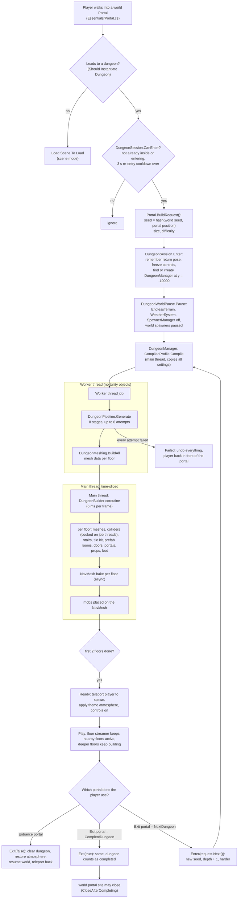
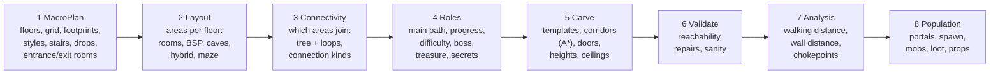
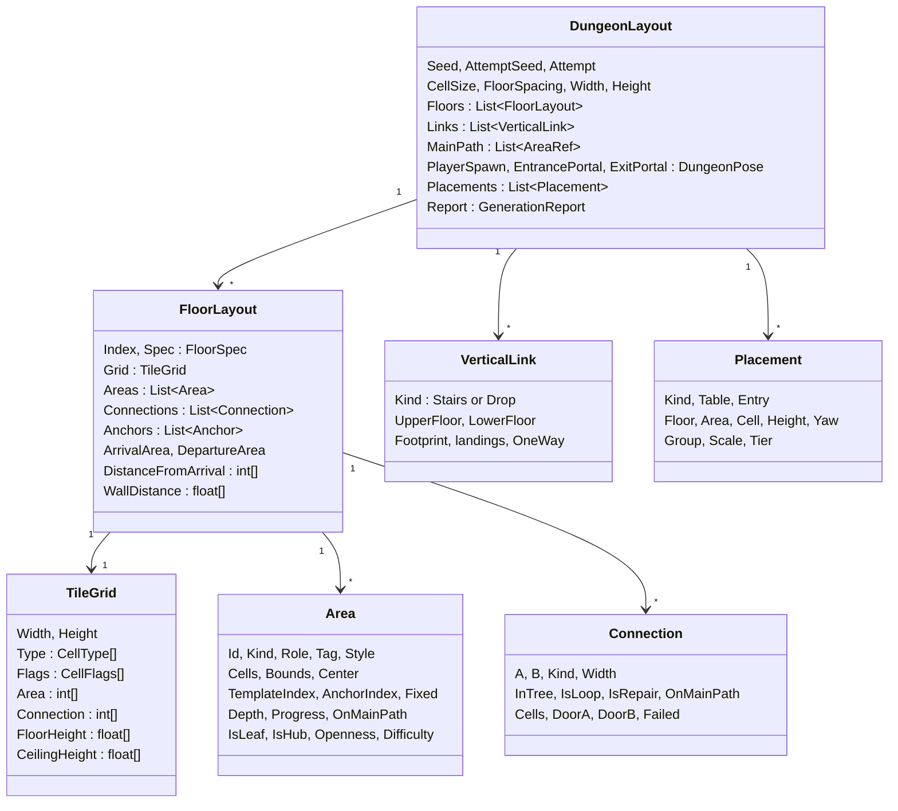
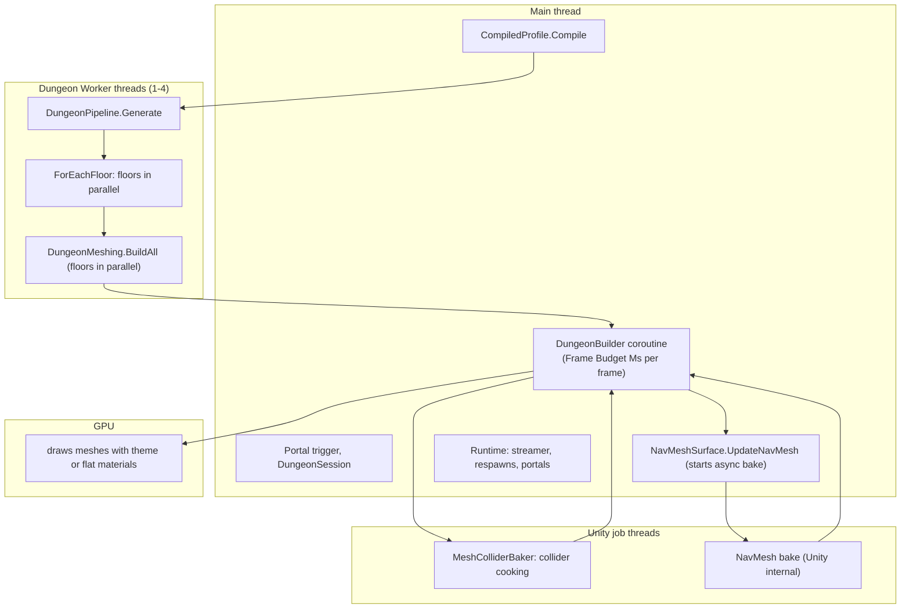
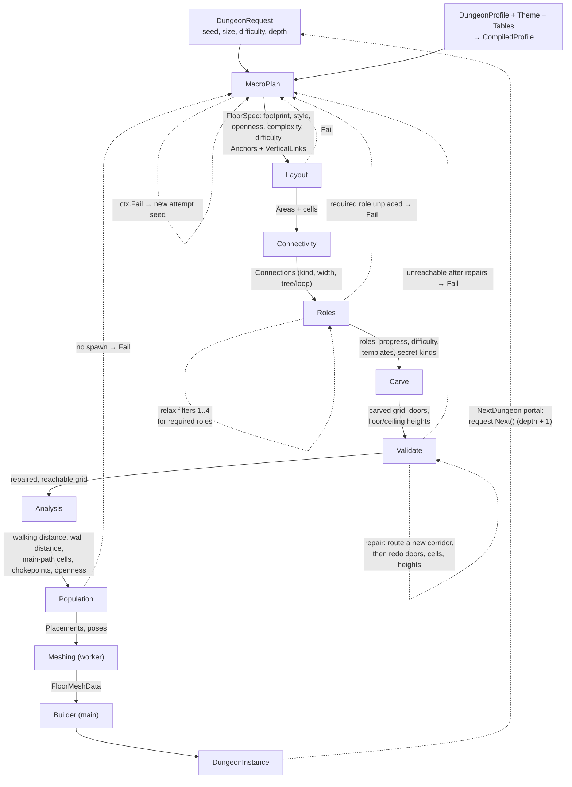
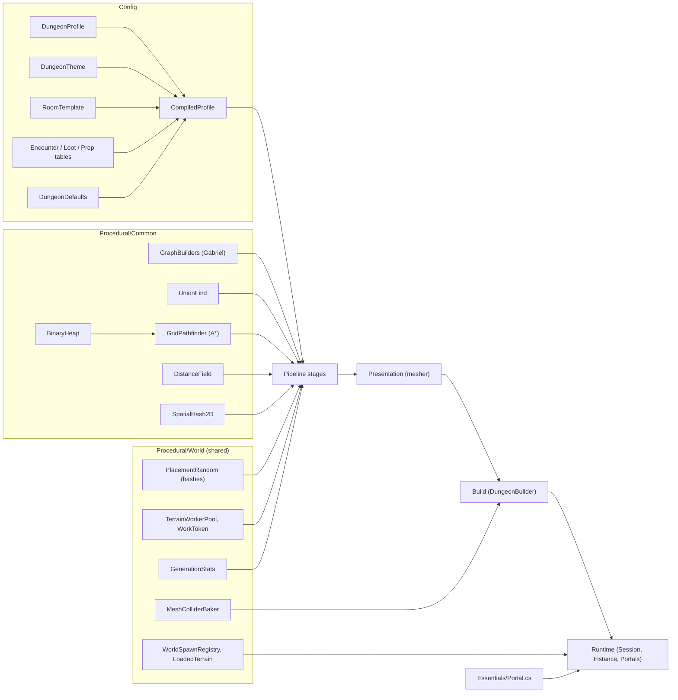

# Dungeon 01 — Architecture Overview

## 1. Concept

A dungeon is a **stack of floors**. Each floor is a 2.5D grid of square cells (1.5 m by default). Every cell is solid
rock or open ground, and every open cell stores its own floor height and ceiling height. Floors are joined by
**stairs** (two-way) and **drops** (one-way holes). Inside a floor, **areas** (rooms, halls, cave chambers, landings)
are joined by **connections** (doors, corridors, tunnels, openings, breaches, secret passages).

Generation is split into two halves that never mix:

| Half | Where it runs | What it does | Touches Unity objects? |
|---|---|---|---|
| **Generation** (stages + mesh data) | a background worker thread (`DungeonWorkers.Pool`) | decides everything as plain data: floors, rooms, corridors, heights, roles, mobs, loot, props, mesh vertices | **never** |
| **Build** | the main thread, a few ms per frame | turns that data into GameObjects: meshes, colliders, NavMesh, portals, props, mobs | yes |

So the expensive thinking never stalls the game. The same request and profile always give the same dungeon, whatever
thread or order the work runs in.

## 2. Macro flowchart — from a world portal to a playable dungeon and back

Two guarantees shape this flow:

- **Controls are never left disabled.** Success (`OnReady`), failure (`OnFailed`) and exit all end with `SetControls(true)`.
- **The world does not keep generating above the dungeon.** `EndlessTerrain` follows the player's x/z, so without the
  pause it would stream chunks around the dungeon's position.

## 3. The generation pipeline (inside the worker)

| Stage | Class | Per floor in parallel? | Can fail the attempt? |
|---|---|---|---|
| 1 MacroPlan | `MacroPlanStage` + `AnchorPlanner` | no (plans all floors together) | yes — no room for stairs or the entrance/exit room |
| 2 Layout | `LayoutStage` + one `ILayoutStrategy` per style | yes | yes — an anchor room was lost |
| 3 Connectivity | `ConnectivityStage` | yes | no |
| 4 Roles | `RolesStage` | no (needs the whole dungeon graph) | yes — a required role (Boss) found no room |
| 5 Carve | `CarveStage`, `CorridorRouter`, `HeightPass` | yes | no (unroutable connections are warnings) |
| 6 Validate | `ValidateStage` | yes | yes — an area stays unreachable, a landing is blocked… |
| 7 Analysis | `AnalysisStage` | yes | no |
| 8 Population | `PopulationStage` (`FloorPopulator`) | yes | yes — no player spawn |

A failing stage calls `ctx.Fail(reason)`, which throws `DungeonGenerationException`. The pipeline catches it and
**restarts the whole dungeon** with a derived seed (`Hash(seed, 0xA77E, attempt)`), up to *Max Attempts* (6). Each
attempt's failure reason is kept in the report.

**Custom stages:** a profile may list `DungeonStageAsset`s (ScriptableObjects implementing `IDungeonStage`). Each has
a `slot` (`AfterMacroPlan` … `AfterPopulation`), and the pipeline inserts it right after that built-in stage. Custom
stages follow the same contract: plain data only, no Unity objects.

## 4. Data model

**Cell types** (`CellType`): `Solid` (rock), `Floor`, `Door`, `Link` (stair well or drop shaft).

**Cell flags** (`CellFlags`, several per cell): `Organic` (cave), `Reserved` (keep solid), `NoCeiling` (under a
drop), `Corridor`, `Prefab`, `Secret`, `Chokepoint`, `MainPath`, `Landing`, `Pillar`, `Rubble`, `Occupied`, `Pit`.

**Grid coordinates:** index = `x + y · Width`. +x is east, +y is north (world +z). Cell centre = `(x + 0.5, y + 0.5) ×
CellSize`. Floor *f* sits at `BaseY = −f × FloorSpacing` under the dungeon root (floor 0 is the top floor). All floors
share the same grid size, so stairs line up across floors.

## 5. Determinism

| Source of randomness | How it is made deterministic |
|---|---|
| Dungeon seed | `request.seed`; a world portal derives it from the world seed and the portal's position (see [02](02-Request-Profile-Seed.md)) |
| Retry seeds | `Hash(seed, 0xA77E, attempt)` |
| Each stage / floor / area | its own stream: `DungeonRandom.Create(seed, Salt(purpose), a, b)` (SplitMix64). Changing one stage — say, loot — never moves the rooms |
| Parallel floors | each floor only writes its own data and uses its own stream, so thread timing cannot change the result |
| Searches (A*, Dijkstra, floods) | `BinaryHeap` returns equal priorities in push order |
| Mesh noise (rough cave walls) | position hashes `PlacementRandom.Value(seed, …, x, y)`, identical across mesh chunks and threads |

**Not deterministic by design:** a request with `seed = 0` picks a time-based seed. The respawn director uses
`System.Random`, because respawns are runtime gameplay.

## 6. Threads

`DungeonWorkers.Pool` is a `TerrainWorkerPool` with `clamp(cores − 1, 1, 4)` threads named "Dungeon Worker". It is
separate from the terrain's pool and is shut down when the application quits. Outside Play mode (editor preview,
tests) generation runs synchronously.

## 7. Master data flow and feedback loops

| Feedback loop | Trigger | Effect |
|---|---|---|
| **Attempt retry** | any `ctx.Fail` | whole dungeon regenerated with `Hash(seed, 0xA77E, attempt)`; after *Max Attempts* the manager raises `Failed` |
| **Role relaxation** | a required role (Boss) finds no matching area | filters dropped one by one: progress → placement → style → size |
| **Repair** | an area is unreachable after carving | `CorridorRouter.RouteToReached` carves a corridor from it to the reachable part (≤ 16 per floor), then openings, doors, cells and heights are recomputed |
| **Room shrinking** | room scatter fails 60 times | tries smaller rooms, gives up after 160 failures |
| **Build ordering** | NavMesh needs colliders; mobs need the NavMesh | colliders are assigned before the bake; mobs are spawned only after it finishes |
| **Deeper dungeons** | *Next Dungeon* exit portal | `request.Next()` → new seed, `depth + 1`; each depth adds +0.25 to the difficulty multiplier (`1 + 0.2·floor + 0.25·depth`) |
| **World portal closing** | player entered / completed | `WorldSpawnRegistry.ClosePortalSite` (terrain side) |
| **Respawn** | fewer living mobs than 75 % of the floor's original count | the respawn director reuses the generator's own mob placements |

## 8. Dependency graph

The dungeon **reuses** terrain infrastructure (`TerrainWorkerPool`, `PlacementRandom`, `MeshColliderBaker`,
`GenerationStats`) but never reads terrain *data*. The only world inputs are the world seed (via the portal) and the
portal's position. The dungeon is built far below the world (default origin y = −10 000), so the two never overlap.

## 9. Script map

| Folder | Scripts | Role |
|---|---|---|
| `Core/` | `DungeonEnums`, `DungeonElements` (Area, Connection, VerticalLink, Anchor, FloorSpec), `DungeonLayout` (FloorLayout, Placement, GenerationReport), `TileGrid`, `DungeonRandom`, `DungeonRequest` | the data model |
| `Config/` | `DungeonProfile`, `DungeonSettings` (all setting groups), `DungeonTheme`, `RoomTemplate`, `DungeonEncounterTable`, `DungeonLootTable`, `DungeonPropTable`, `DungeonDefaults`, `SpawnableMobImport`, `CompiledProfile` | authoring assets and their thread-safe compiled copy |
| `Pipeline/` | `DungeonPipeline` (IDungeonStage, DungeonContext, StageSlot), `DungeonStageAsset` | stage runner, retries, custom stages |
| `Stages/Planning/` | `MacroPlanStage` (+ AnchorPlanner) | stage 1 |
| `Stages/Layout/` | `LayoutStage` (+ AnchorAreas, LayoutUtil), `RoomScatterLayout`, `BspLayout`, `CaveLayout` (CaveField), `HybridLayout`, `GridMazeLayout` (+ TemplateStamper), `RoomShapes` | stage 2 |
| `Stages/Connect/` | `ConnectivityStage` | stage 3 |
| `Stages/Roles/` | `RolesStage` | stage 4 |
| `Stages/Carve/` | `CarveStage` (+ HeightPass), `CorridorRouter` | stage 5 |
| `Stages/Validate/` | `ValidateStage` | stage 6 |
| `Stages/Analysis/` | `AnalysisStage` | stage 7 |
| `Stages/Population/` | `PopulationStage` (FloorPopulator) | stage 8 |
| `Presentation/` | `DungeonMeshing`, `DungeonMesher`, `LinkMesher`, `MeshBuffers`, `TileKitPlanner` | mesh data (worker thread) |
| `Build/` | `DungeonBuilder`, `DungeonMaterials`, `DungeonObjectPool`, `DungeonPrimitives` | scene objects (main thread) |
| `Runtime/` | `DungeonManager` (+ DungeonWorkers), `DungeonSession` (+ DungeonWorldPause, DungeonAtmosphere), `DungeonInstance`, `DungeonPortal`, `DungeonFloorStreamer`, `DungeonRespawnDirector`, `DungeonHazard`, `DungeonSecretDoor`, `DungeonFlicker`, `DungeonSpawned` | play-time behaviour |
| `Editor/` | `DungeonPreviewWindow`, `DungeonPreviewTexture`, `DungeonInspectors`, `DungeonSetupMenu`, `PortalSetupMenu`, `PortalEditor`, `RangeDrawers`, `Tests/DungeonGenerationTests` | tools |
| `Procedural/Common/` | `BinaryHeap`, `DistanceField`, `GraphBuilders`, `GridPathfinder`, `SpatialHash2D`, `UnionFind` | shared algorithms |
| `Essentials/Portal.cs` | world portal | entry point from the open world |
| `RoomBehaviour.cs` | old room prefab script | kept for legacy room prefabs (used through a legacy `RoomTemplate`) |

## 10. Status legend

Used throughout, as in the Terrain docs: **Implemented** (works as described) · **Partially implemented** (works with
limits stated) · **Placeholder** (exists but does nothing meaningful yet) · **Not currently implemented** (a
suggestion, not in the code).
