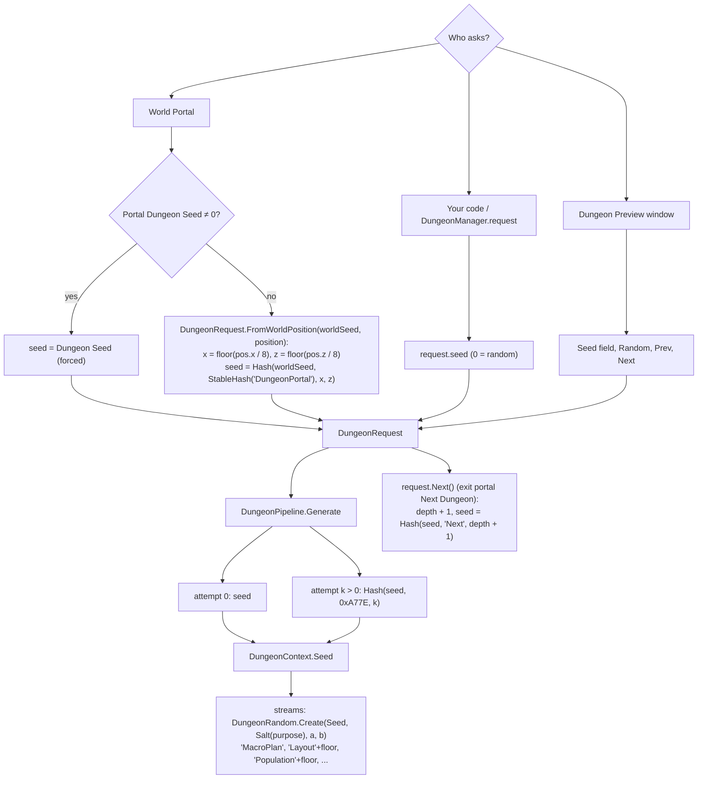
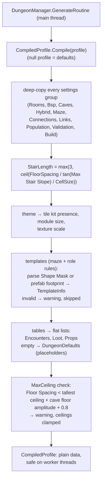

# Dungeon 02 — Request, Profile and Seeds

**Scripts:** `Core/DungeonRequest.cs`, `Core/DungeonRandom.cs`, `Config/DungeonProfile.cs`, `Config/DungeonSettings.cs`,
`Config/CompiledProfile.cs`, `Pipeline/DungeonPipeline.cs`, `Essentials/Portal.cs` (`BuildRequest`).

---

## 1. Concept

Two inputs describe a dungeon:

| Input | Type | Answers | Who sets it |
|---|---|---|---|
| **Request** | `DungeonRequest` (plain class) | *which* dungeon: seed, size, difficulty, depth | the portal (or your code, or the Dungeon Preview) |
| **Profile** | `DungeonProfile` (ScriptableObject) | *what kind* of dungeon: cell size, floor styles, room sizes, caves, corridors, roles, population, theme, build | a designer, once per dungeon type ("crypt", "cave"…) |

A profile is like a biome for dungeons, and the request picks one dungeon out of all the dungeons that profile can
make.

## 2. The request

| Field | Default | Meaning |
|---|---|---|
| `seed` | 0 | the dungeon's seed; **0 = pick a random one** (`Environment.TickCount ^ 0x5F3759DF`) |
| `size` | Medium | which of the profile's *Size Classes* to use (floor size in cells and floor count) |
| `difficulty` | 1 | scales mob budgets and loot tiers (0.5 easy, 2 very hard) |
| `floorCount` | 0 | fixed floor count; 0 = the size class / profile range |
| `overrideStyle`, `style` | off, Rooms | force every floor to one style |
| `depth` | 0 | position in a chain of dungeons (exit portal *Next Dungeon*); adds difficulty |
| `label` | "" | name in logs and the hierarchy |

### Size classes (profile defaults)

| Size | Floor cells | Metres at 1.5 m cells | Floors |
|---|---|---|---|
| Small | 46 × 46 | 69 × 69 | 1–2 |
| Medium | 64 × 64 | 96 × 96 | the profile's *Floor Count* (2–4) |
| Large | 86 × 86 | 129 × 129 | 3–5 |
| Huge | 112 × 112 | 168 × 168 | 4–7 |

A missing size falls back to the Medium entry.

## 3. Where seeds come from

- **World seed:** `TerrainGenerator.VoronoiSeed` (the terrain's seed). No terrain in the scene → 0.
- **Position quantisation (8 m cells):** a portal that moves a little (for example snapped onto the ground) still gives
  the same dungeon. Two portals within the same 8 × 8 m cell share a dungeon.
- **Stable hashes:** `PlacementRandom.StableHash` is a fixed string hash (not `string.GetHashCode`), so seeds are the
  same on every platform and run.

### Random streams

`DungeonRandom` is a SplitMix64 generator. Every stage creates its own stream from `(attempt seed, Salt(purpose), a,
b)`. For example `ctx.Random("Layout", floor)` or `ctx.Random("Population", floor)`. This gives three guarantees:

1. Parallel floors never share a generator, so thread timing cannot change results.
2. Adding a random call in one stage never changes another stage's numbers.
3. A custom stage gets reproducible randomness with `ctx.Random("MyStage")`.

Helpers: `Value()` in [0, 1), `Range(a, b)`, `Chance(p)`, `WeightedIndex(weights)`, `Shuffle(list)`.

## 4. Compiling the profile

Why compile? Worker threads must not touch `UnityEngine.Object`. The compiled profile is a snapshot: editing the
asset during generation cannot corrupt a running build. Fields holding prefabs and materials are only read by the
builder on the main thread. This is the same idea as the terrain's `PlacementPlan`.

**Derived values:**

| Value | Formula | Default |
|---|---|---|
| `StairLength` (cells) | `max(3, ceil(FloorSpacing / tan(maxStairSlope) / CellSize))` | 10 / tan 33° = 15.4 m → **11 cells** |
| `MaxCeiling` (m above floor base) | `max(2.5, FloorSpacing − caves.floorHeightAmplitude − 0.8)` | 10 − 1.1 − 0.8 = **8.1 m** |

## 5. The generation report

Each `DungeonLayout` carries a `GenerationReport`: per-stage milliseconds, warnings (profile warnings, unroutable
connections, templates that did not fit), failed attempts with their reasons, the attempt count and the total time.
Tick *Validation > Log Report* to print it with `DungeonLayout.Describe()` after each generation. The Dungeon Preview
window shows it too. Stage timings also go to **Generation Stats** as "Dungeon: <stage>", with a "Dungeons generated"
counter.

## 6. Example

A portal at world (1234.5, 40, −987.2), with world seed 42, size Large and difficulty 1.6:

1. Quantised cell: x = floor(1234.5 / 8) = 154, z = floor(−987.2 / 8) = −124.
2. `seed = Hash(42, StableHash("DungeonPortal"), 154, −124)`, a fixed 32-bit number.
3. Large → 86 × 86 cells, 3–5 floors (rolled by the "MacroPlan" stream).
4. Floor *f* difficulty = 1.6 × (1 + 0.2 f). Floor 0 = 1.6, floor 3 = 2.56.
5. Entering again later gives exactly the same dungeon. Its *Next Dungeon* exit gives depth 1: a new seed and
   +0.25 on the multiplier.

## 7. Performance

Compiling is a small main-thread cost: settings copies, template parsing and table flattening. The seed maths is
negligible.

## 8. Debugging

| Symptom | Cause | Fix |
|---|---|---|
| A portal gives a different dungeon each visit | the portal is at a different position each time (a respawned portal site elsewhere), the world seed changed, or code sends a request with `seed = 0` (random) | keep portal positions stable, set *Dungeon Seed*, or give the request a seed / use `FromWorldPosition` |
| Two portals lead to the same dungeon | they are in the same 8 m cell | move one, or set *Dungeon Seed* |
| "Floor spacing … is tight" warning | ceilings plus cave floor variation do not fit between floors | raise *Floor Spacing* or lower *Hall Ceiling* / *Ceiling Limits max* |
| Template warning in the report | Shape Mask invalid, or Prefab mode without a prefab | fix the template asset |
| Changing loot settings moved rooms | not possible by design (separate streams) — check that the seed or other settings did not change | compare with the Preview at the same seed |
