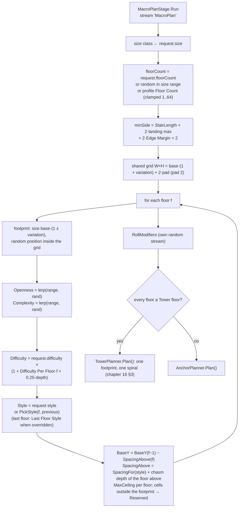
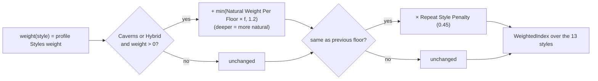
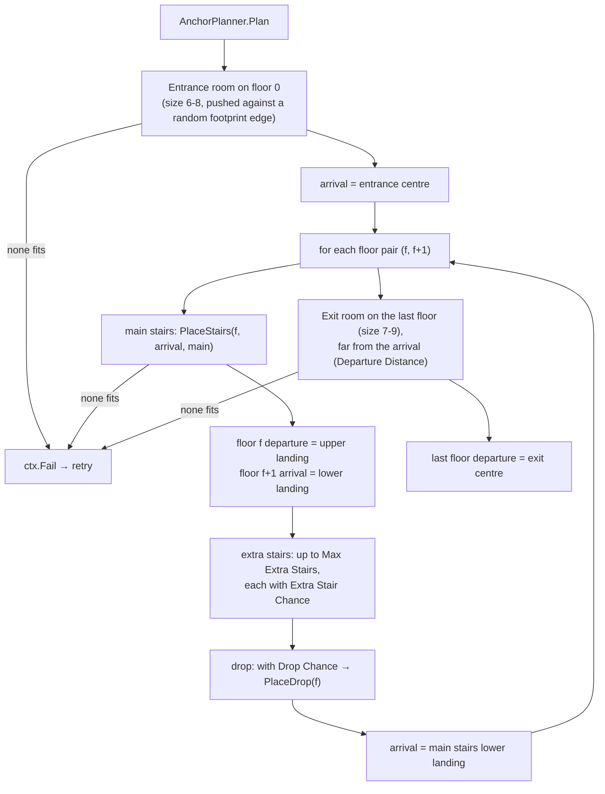
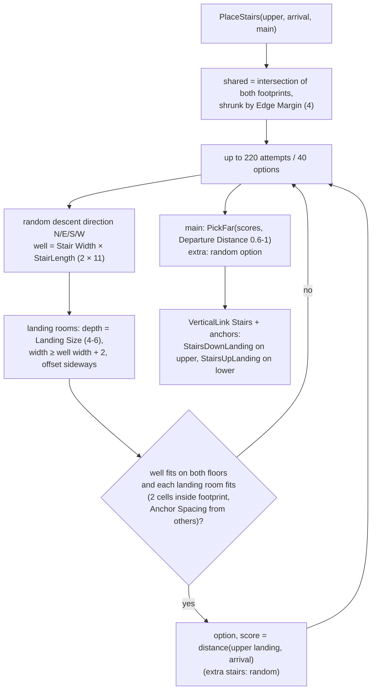
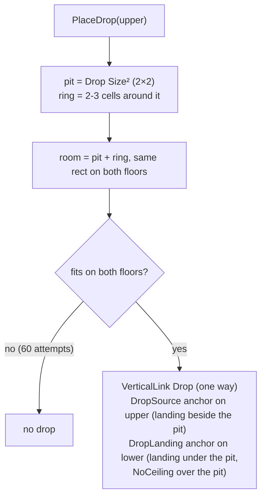

# Dungeon 03 — Macro Plan and Anchors

**Scripts:** `Stages/Planning/MacroPlanStage.cs` (`MacroPlanStage`, `AnchorPlanner`), `Core/DungeonElements.cs`
(`FloorSpec`, `Anchor`, `VerticalLink`).

---

## 1. Concept

Before any room exists, stage 1 fixes everything that **more than one floor** must agree on:

- how many floors there are, and each floor's size, position and character (style, openness, complexity, difficulty,
  floor modifier);
- the **anchors**: the entrance room, the exit room, the stair wells with a landing room at each end, and the drop
  shafts.

Because the anchors are fixed first, each floor can then be laid out **on its own, in parallel**, and still line up
with the floors above and below. A stair well occupies the same cells on both floors it joins.

## 2. Macro flowchart

### Style choice (micro)

Default weights: Rooms 1, BSP 0.6, Caverns 0.8, Hybrid 0.9, Grid Maze 0.15, Citadel 0.35, Catacombs 0.3, Tower 0.15,
Undercity 0.25, Hive 0.25, Islands 0.2, Den 0.12, Astral 0.1. On floor 3 the Caverns weight becomes 0.8 + 0.75 = 1.55,
so deeper floors lean towards caves. **Override Last Floor Style** forces the last floor's style (the Dragon's Den
type ends in a Den). The newer styles are described in [16](16-Towers-Cities-Hives-Chasms.md).

**Heights per floor.** Each style needs its own room above it: `CompiledProfile.SpacingFor(style)` is the style's
tallest ceiling plus cave floor variation and rock between floors. A floor sits `SpacingAbove` below the one above:
its style's spacing plus the chasm depth of the floor above (islands, astral). Each pair of floors gets stairs as long
as its own rise needs (`StairLengthFor(rise)`); `layout.FloorSpacing` is the largest gap.

## 3. Anchor planning

### Stairs (micro)

**PickFar** picks the option whose score is closest to a random share (60–100 %) of the best score. The way down is
usually far from the way in, but not always the single farthest spot, which would be predictable.

**Why the well is 15 cells long:** the stairs climb one *effective Floor Spacing* at most *Max Stair Slope* (33°).
The effective spacing is *Floor Spacing* (12) or, with *Heights › Auto Floor Spacing*, enough for the tallest ceiling:
with default heights the tallest is the boss hall (10 m + 2.5 m vault) + 1.1 cave relief + 0.8 rock = 14.4 → **14.5 m**.
14.5 / tan 33° = 22.3 m = 15 cells of 1.5 m. A character controller and a NavMesh agent can both climb that. Taller
presets give longer wells (Tall ≈ 19 m, Cathedral ≈ 26 m).

### Drops (micro)

### Floor modifiers (micro)

`RollModifiers` uses its own random stream (`"FloorModifiers"`), so changing the modifier settings never changes a
floor's layout. For each floor it rolls *Chance*, then picks Flooded / Molten / Overgrown / Darkness / Frozen by
weight; floors above *First Floor* stay plain. The result is `FloorSpec.Modifier`, read by population (props, extra
mobs, fewer lights), meshing (the water surface) and the builder (atmosphere). See
[15 §4](15-Types-Special-Rooms-Mechanics.md).

Drops are shortcuts **down** only. In the roles graph they cost 4 and are one-way (see [06](06-Roles-and-Templates.md)).
With *Links › Climb Chance* a drop becomes a **climb** instead (`LinkKind.Climb`, anchors ClimbTop / ClimbBottom): the
same shaft with a giant root and vines that players climb both ways; it costs 6 in the roles graph and works both ways
(see [16 §7](16-Towers-Cities-Hives-Chasms.md)).

## 4. What the stage produces

| Output | Used by |
|---|---|
| `layout.Width/Height` (shared grid) | every floor's `TileGrid` |
| `FloorSpec`: footprint, style, openness, complexity, difficulty, modifier, BaseY, SpacingAbove, MaxCeiling, IsFirst/IsLast, hybrid weights | layout, connectivity, roles, carving, population, build |
| `Anchor`s per floor: Entrance, Exit, StairsDownLanding, StairsUpLanding, DropSource, DropLanding, ClimbTop, ClimbBottom (room rect, landing cell, facing, shaft; a tower doorway also has `ExtraLinkId`: the way up and the way down share it) | Layout (turned into fixed areas) |
| `VerticalLink`s: stairs, drops, climbs and spiral flights (`Turns`, `StartAngle`, `Above`/`Below`), `OnMainPath` for the main stairs | roles graph, meshing (`LinkMesher`), NavMeshLinks |
| `ArrivalCell` / `DepartureCell` per floor | layout (arrival/departure areas), analysis (walking distance) |
| `Reserved` cells outside each footprint | every layout (never carved) |

## 5. Configuration

| Setting | Default | Effect |
|---|---|---|
| Floor Count | 2–4 | used by size classes with (0, 0) floor count (Medium) |
| Size Classes | see [02](02-Request-Profile-Seed.md) | floor cells and floor counts |
| Footprint Variation | 0.15 | floors differ in size and position, so they don't stack as identical squares |
| Openness / Complexity | 0.3–0.75 each | rolled per floor; drive almost every later stage |
| Styles, Natural Weight Per Floor, Repeat Style Penalty | 1/0.6/0.8/0.9/0.15/0.35/0.3/0.15/0.25/0.25/0.2/0.12/0.1, 0.25, 0.45 | style mix |
| Floor Modifiers › Chance, First Floor, weights | 0.3, 1, 1/0.6/0.8/0.7/0.5 | floor modifiers |
| Difficulty Per Floor | 0.2 | +20 % per floor |
| Links › Stair Width | 2 | well width (cells) |
| Links › Landing Size | 4–6 | landing room depth/width |
| Links › Departure Distance | 0.6–1 | how far the way down/exit is from the way in (share of the farthest option) |
| Links › Extra Stair Chance / Max Extra Stairs | 0.35 / 1 | alternative routes between floors |
| Links › Drop Chance / Drop Size | 0.3 / 2 | one-way shortcuts |
| Links › Climb Chance / Climb Size | 0.12 / 1 | share of drops that are climbable shafts instead |
| Override Last Floor Style / Last Floor Style | off / Den | force the last floor's style |
| Links › Edge Margin | 4 | shafts keep this far from the footprint edge |
| Links › Anchor Spacing | 3 | cells between anchor rooms |
| Links › Entrance Size / Exit Size | 6–8 / 7–9 | entrance and exit room sides |
| Cell Size, Floor Spacing (effective, per style), Max Stair Slope | 1.5, 12 (14.5 with default heights; more under tall styles and chasms), 33° | set each pair's stair length |

## 6. Example (Medium, defaults)

- `StairLength` = 15, landing max = 6, Edge Margin = 4 → `minSide` = 15 + 12 + 8 + 2 = **37 cells**.
- Base 64 × 64 → grid = ceil(64 × 1.15) + 4 = **78 × 78** (shared by all floors).
- Each floor: 64 × (1 ± 0.15) → 54–74 cells a side, placed randomly in the grid.
- 3 floors → 2 main stairs, 0–2 extra stairs, 0–2 drops, 1 entrance room (floor 0), 1 exit room (floor 2).

## 7. Performance

Tiny: a few hundred rectangle tests per floor pair. The stage is sequential (anchors of floor *f+1* depend on floor *f*).

## 8. Debugging

| Symptom | Cause | Fix |
|---|---|---|
| Report: "No room for stairs between floors …" (then a retry) | footprints overlap too little after the Edge Margin; very small size class; large Landing Size | lower Footprint Variation or Edge Margin; bigger size class |
| Report: "No room for the entrance / exit" | footprint too small for Entrance/Exit Size plus margins | smaller Entrance/Exit Size or larger floors |
| Always the same style | *Override Style* on the request, or other style weights 0 | check the request and Styles |
| Stairs land right next to the entrance | Departure Distance min too low | raise it (e.g. 0.8–1) |
