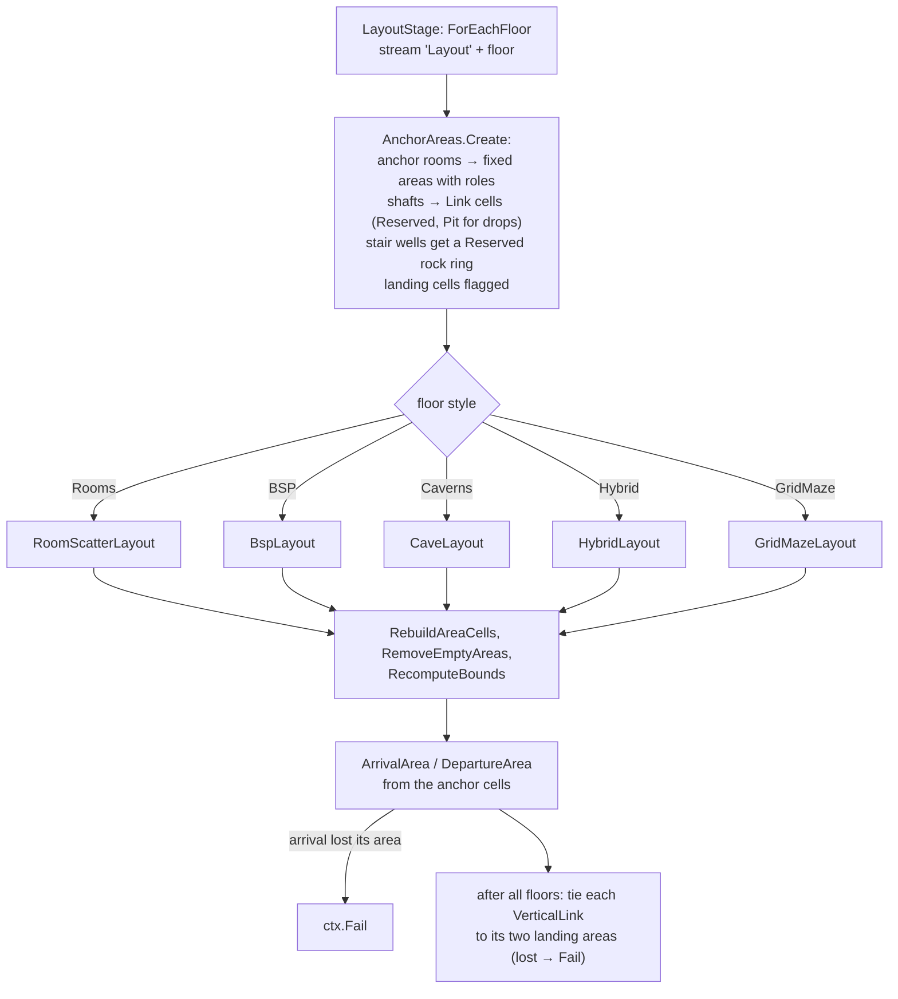
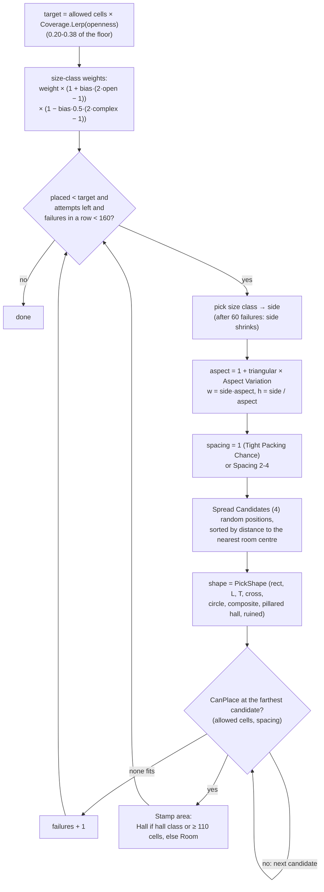
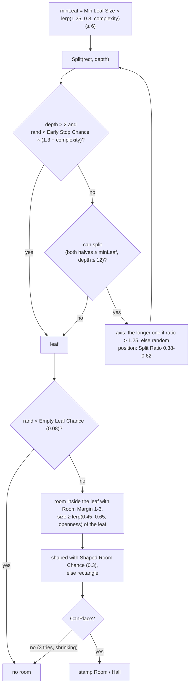
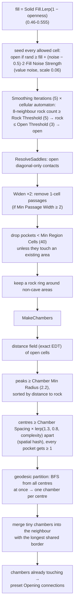
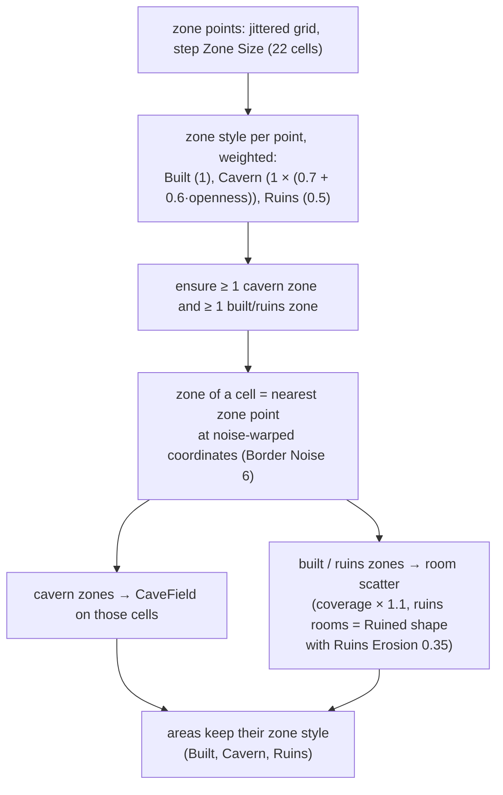
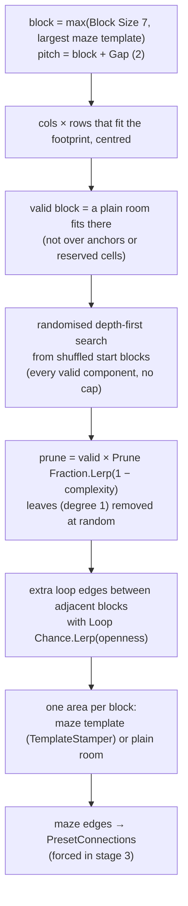

# Dungeon 04 — Layout Styles

**Scripts:** `Stages/Layout/LayoutStage.cs` (`LayoutStage`, `AnchorAreas`, `LayoutUtil`), `RoomScatterLayout.cs`,
`BspLayout.cs`, `CaveLayout.cs` (`CaveLayout`, `CaveField`), `HybridLayout.cs`, `GridMazeLayout.cs` (+
`TemplateStamper`), `RoomShapes.cs`.

---

## 1. Concept

Stage 2 fills each floor with **areas**: rooms, halls, cave chambers and the fixed anchor rooms. The areas are
stamped into the grid but **not yet connected**. That is stage 3's job.

Each floor has one **style**, and each style is an `ILayoutStrategy`:

| Style | Strategy | Looks like | Area kinds / zone style |
|---|---|---|---|
| **Rooms** | `RoomScatterLayout` | scattered rooms of many shapes and sizes, spread apart | Room / Hall, Built |
| **BSP** | `BspLayout` | a tidy building: space split recursively, one room per cell of the split | Room / Hall, Built |
| **Caverns** | `CaveLayout` (`CaveField`) | organic caves from a cellular automaton, split into chambers | Cavern, Cavern (Organic cells) |
| **Hybrid** | `HybridLayout` | a floor divided into zones: caves in cavern zones, rooms in built and ruins zones | mixed |
| **Grid Maze** | `GridMazeLayout` | rooms on a regular grid of blocks joined as a maze (the original dungeon's idea); supports room templates and legacy prefabs | Room, Built |

`LayoutStage.Strategies` is a public dictionary: replace an entry to plug in your own strategy.

## 2. Macro flowchart (per floor, all floors in parallel)

**Rules every strategy follows:**

- never carve `Reserved` cells: outside the footprint, around stair wells, or shafts;
- keep at least one rock cell between separate areas, so rooms never merge by accident (`LayoutUtil.CanPlace` checks
  a Chebyshev spacing);
- every room plan is 4-connected. Diagonal-only contacts never count as connected, in generation or in the mesh.

## 3. Rooms (scatter)

**Openness and complexity:** "Large" and "Hall" have a positive *openness bias*, so open floors get more big rooms.
"Closet" and "Small" have a negative bias, so closed floors get more small rooms. Complexity nudges the other way.

### Room shapes (`RoomShapes.Generate`)

| Shape | Default weight | Minimum side | Notes |
|---|---|---|---|
| Rectangle | 3 | 3 | — |
| L-shape | 1 | 5 | random rotation |
| T-shape | 0.6 | 5 | random rotation |
| Cross | 0.5 | 5 | — |
| Circle / ellipse | 0.6 | 5 | — |
| Composite | 1 | 5 | overlapping rectangles |
| Pillared hall | 0.5 | 8 | adds `Pillar` cells (solid pillars inside the room) |
| Ruined | 0 | 4 | eroded outline (Hybrid ruins zones use it with *Ruins Erosion*) |

A room too small for its shape falls back to a rectangle. After shaping, only the **largest 4-connected group** of
floor cells is kept.

## 4. BSP (binary space partition)

## 5. Caverns (cellular automaton + chambers)

**The cellular-automaton rule** turns random static into cave shapes. A cell surrounded by rock becomes rock, and a
cell surrounded by open space opens up. After five passes only smooth blobs and winding passages remain. Every cave
cell gets the `Organic` flag, which later selects noise-varied floor heights, domed ceilings and marching-squares walls.

## 6. Hybrid (zones)

Where a cave meets a built room, stage 3 creates a **Breach**: a rough passage with rubble. Props with placement
*Transition* go there.

## 7. Grid Maze

Maze templates can be **legacy RoomBehaviour prefabs** (`RoomTemplate` with *Legacy Room Behaviour* ticked, 7 × 7
cells, a door in the middle of each side). The old dungeon's rooms therefore still work inside the new generator.

## 8. Configuration summary

| Group | Key settings (defaults) |
|---|---|
| Rooms | Coverage 0.2–0.38 · Sizes (Closet 3–4 w0.45, Small 4–6 w1, Medium 6–9 w1.2, Large 9–13 w0.55, Hall 13–18 w0.2) · Shapes (above) · Aspect Variation 0.35 · Spacing 2–4 · Tight Packing Chance 0.15 · Placement Attempts 700 · Spread Candidates 4 · Room/Hall/Corridor ceiling 4 / 6.5 / 3.2 m |
| BSP | Min Leaf Size 11 · Split Ratio 0.38–0.62 · Room Margin 1–3 · Empty Leaf Chance 0.08 · Early Stop Chance 0.12 · Shaped Room Chance 0.3 |
| Caves | Solid Fill 0.46–0.555 · Fill Noise Strength 0.2 · Smoothing Iterations 5 · Rock/Open Threshold 5/3 · Min Region Cells 40 · Min Passage Width 2 · Chamber Min Radius 2.2 · Chamber Spacing 8 |
| Hybrid | Zone Size 22 · Border Noise 6 · Built/Cavern/Ruins weights 1/1/0.5 · Ruins Erosion 0.35 |
| Maze | Block Size 7 · Gap 2 · Prune Fraction 0–0.35 · Templates |

Full ranges and effects: [12 Configuration Reference](12-Configuration-Reference.md).

## 9. Example

A Medium floor (≈ 64 × 64 cells, openness 0.6, style Rooms):

- target coverage = 0.2 + 0.18 × 0.6 ≈ 0.31 → about 0.31 × 4 000 allowed cells ≈ 1 240 room cells;
- with Medium rooms averaging ~56 cells, that is roughly 15–25 rooms, plus 3–6 anchor rooms (entrance or arrival
  landing, departure landing, drop rooms).

## 10. Performance

All plain C# on the worker, floors in parallel. The cellular automaton costs O(cells × iterations). The distance
field is linear (Felzenszwalb–Huttenlocher). Room scatter costs O(attempts × room area).

## 11. Debugging

Use the Dungeon Preview window ([11](11-Editor-Tools-and-Testing.md)) with **Styles** / **Zones** view.

| Symptom | Cause | Fix |
|---|---|---|
| Few, huge caves | low Solid Fill, few Smoothing Iterations | raise Solid Fill or Rock Threshold |
| Caves full of specks | high Fill Noise Strength, low Min Region Cells | lower noise / raise Min Region Cells |
| Rooms clumped | Spread Candidates 1, Tight Packing Chance high | raise Spread Candidates, lower Tight Packing |
| Floors half empty | Coverage low, large rooms that don't fit | raise Coverage, lower Large/Hall weights |
| Maze with few rooms | high Prune Fraction, low complexity | lower Prune Fraction |
| "Floor N: the arrival cell lost its area" (retry) | a custom strategy overwrote anchor cells | never write over `Fixed` areas or `Reserved` cells |
