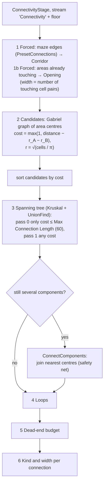
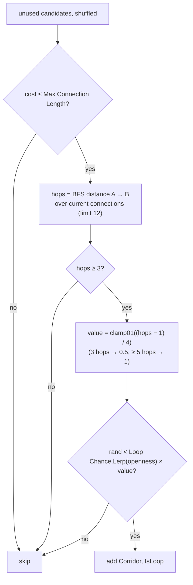
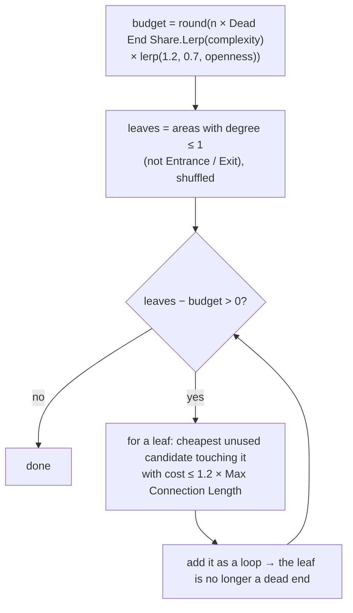
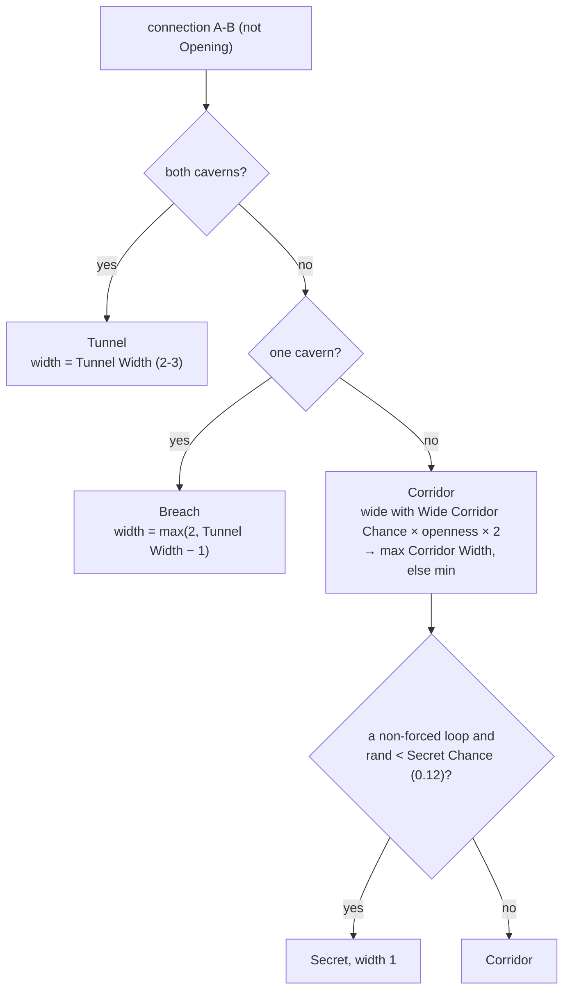
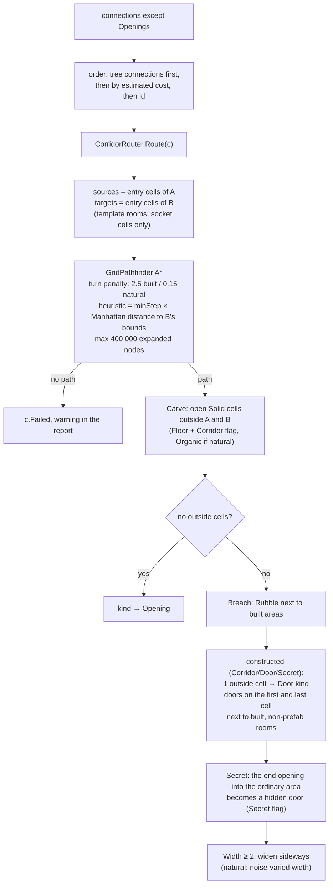
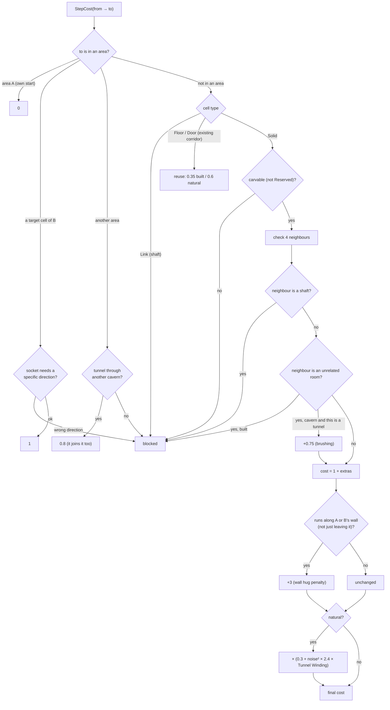

# Dungeon 05 — Connectivity and Corridors

**Scripts:** `Stages/Connect/ConnectivityStage.cs` (stage 3: *which* areas connect),
`Stages/Carve/CorridorRouter.cs` (stage 5: *how* each connection is carved), `Common/GraphBuilders.cs`,
`Common/UnionFind.cs`, `Common/GridPathfinder.cs`, `Common/BinaryHeap.cs`.

---

## 1. Concept

Connecting rooms happens in two steps, several stages apart:

1. **Decide the graph** (stage 3): which pairs of areas are joined, of which kind and width. Nothing is carved yet.
   Stage 4 (roles) needs this graph to find the main path and the dead ends.
2. **Carve** (stage 5): each connection is routed through the rock with A* and becomes corridor or tunnel cells,
   with doors at the ends.

A good dungeon graph is **connected** (every room reachable), mostly **tree-like** (so there are dead ends worth
exploring), and has some **loops** (so there is more than one way around). The stage builds exactly that.

## 2. Macro flowchart — deciding the graph (per floor)

### Gabriel graph (micro)

Two area centres A and B are linked when **no third centre lies inside the circle whose diameter is AB**. The Gabriel
graph always contains the minimum spanning tree, so it is connected. It never has long skinny edges that pass right
by another room, so every candidate is a "sensible neighbour". `GraphBuilders.Gabriel` checks the O(n²) pairs against
a spatial hash.

### Loops (micro)

A loop is only worth adding if it **shortcuts a long walk**. Joining two rooms already one or two doors apart adds
nothing, so those are never picked.

### Dead-end budget (micro)

Complex floors keep more dead ends, and open floors fewer.

### Kinds and widths (micro)

| Kind | Meaning | Carved as |
|---|---|---|
| **Door** | rooms one wall apart | a corridor of exactly one cell becomes a door straight through the wall |
| **Corridor** | constructed passage | straight-ish, doors at both built ends |
| **Tunnel** | natural passage between caverns | winding, variable width, no doors |
| **Opening** | areas already touching | nothing to carve |
| **Breach** | rough passage between a cave and built structure | winding, rubble where it meets built walls |
| **Secret** | a loop corridor behind a secret door | width 1, the ordinary end is a hidden door |

Stage 4 can also turn corridors into **Secret** when they lead into a role area with *Secret Entrance* (the Secret
room). See [06](06-Roles-and-Templates.md).

## 3. Carving — the corridor router

### Macro flowchart (per floor, inside the Carve stage)

### Step cost (micro)

The A* cost of stepping into a cell decides the corridor's character:

What each rule achieves:

| Rule | Effect |
|---|---|
| Turn penalty 2.5 (built) | straight corridors with few bends; tunnels (0.15) wander freely |
| Reuse cost 0.35 | corridors merge into existing ones, giving junctions and fewer parallel passages |
| Unrelated rooms blocked | a corridor opens **only** into the two areas it joins — no accidental doors |
| Shafts blocked (and their neighbours) | stair wells and drop shafts stay sealed except at their landings |
| Wall hug +3 | corridors don't scrape along a room's wall before entering it |
| Template sockets | template rooms are entered only through their door sockets, straight on |
| Noise-weighted cost | tunnels meander around "hard rock" patches (noise at scale 0.14) |
| 400 000-node cap | a hopeless search stops instead of freezing the worker |

### Incidental openings

A tunnel may brush past a chamber it doesn't join. That is a real way through, so after routing,
`RecordIncidentalOpenings` adds an **Opening** connection for each such contact. The area graph (dead ends, hubs,
paths) then matches the carved floor.

## 4. Configuration

| Setting | Default | Effect | Performance |
|---|---|---|---|
| Loop Chance | 0.08–0.4 (lerped by openness) | more loops = more alternative routes | more corridors to route |
| Dead End Share | 0.15–0.4 (lerped by complexity) | share of areas allowed to be dead ends | — |
| Corridor Width | 1–2 | min = normal width, max = "wide" | wider = more cells |
| Wide Corridor Chance | 0.4 | × openness × 2 | — |
| Turn Penalty | 2.5 | higher = straighter corridors | higher can expand more A* nodes |
| Reuse Cost | 0.35 (0.05–1) | lower = more merging into existing corridors | — |
| Max Connection Length | 60 | longest candidate used first for the tree and loops | — |
| Secret Chance | 0.12 | loops turned into secret passages | — |
| Caves › Tunnel Width / Tunnel Winding | 2–3 / 0.9 | tunnel width and wander | winding expands more nodes |

## 5. Example

Three rooms in a row, A–B–C, and a fourth room D above B. Gabriel candidates: A-B, B-C, B-D, A-D, C-D.

1. Tree (cheapest first): A-B, B-C, B-D. Everything is connected.
2. Loops: A-D has hops = 2 (A-B-D), fewer than 3, so it is skipped. The same goes for C-D.
3. Dead ends: A, C and D are leaves. With n = 4, complexity 0.5 and openness 0.5, budget = round(4 × 0.275 × 0.95) = 1,
   so 2 leaves get an extra link: A-D and C-D are added as loops.
4. Kinds: all built, so Corridor. Each loop has a 12 % chance to become Secret.

## 6. Performance

Graph building is tiny (tens of areas per floor). Routing costs one A* per connection over the floor grid. The
pathfinder reuses its buffers through a generation stamp, so there are no per-search allocations of grid-sized arrays.
Floors route in parallel.

## 7. Debugging

| Symptom | Cause | Fix |
|---|---|---|
| Report: "could not route …" | the target is walled in by reserved cells or other rooms; the socket side is blocked | usually harmless (validation repairs reachability); check templates' socket sides |
| Long parallel corridors | Reuse Cost high | lower it |
| Corridors zig-zag | Turn Penalty low | raise it |
| No loops at all | Loop Chance low; small floors (few candidates with ≥ 3 hops) | raise Loop Chance / openness |
| Too many dead ends / too few | Dead End Share | adjust it |
| Secret doors in odd places | the hidden end is the one facing the ordinary area | expected; lower Secret Chance to reduce them |
