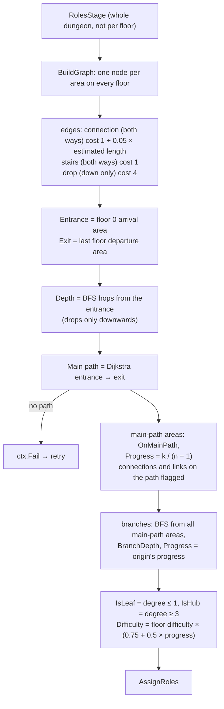
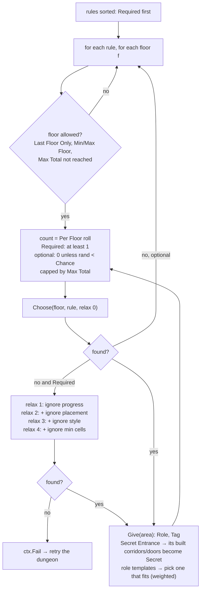
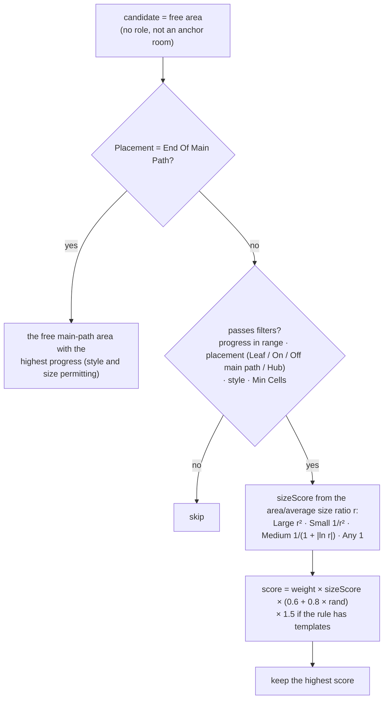
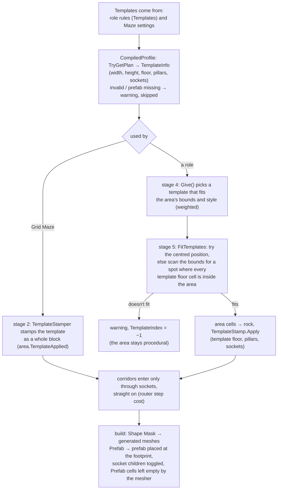

# Dungeon 06 — Roles, Main Path and Room Templates

**Scripts:** `Stages/Roles/RolesStage.cs`, `Config/DungeonSettings.cs` (`RoleRule`), `Config/DungeonProfile.cs`
(`DefaultRoles`), `Config/RoomTemplate.cs`, `Stages/Layout/GridMazeLayout.cs` (`TemplateStamper` / `TemplateStamp`),
`Stages/Carve/CarveStage.cs` (`FitTemplates`).

---

## 1. Concept

After stage 3 the dungeon is a graph of anonymous areas. Stage 4 gives it **meaning**:

- **Main path:** the cheapest walk from the entrance (floor 0) to the exit (last floor), through stairs and drops.
- **Progress** (0 → 1): how far along that walk an area is. Areas on side branches inherit the progress of the
  main-path area they hang from.
- **Difficulty:** grows along the path.
- **Roles:** Boss, Treasure, Rest, Arena, Shrine, Secret or Custom, placed by designer rules such as "the boss at the
  end of the main path on the last floor" or "treasure in dead ends after 15 % progress".
- **Templates:** hand-made rooms (text plans or prefabs) fitted into the areas chosen for a role.

Later stages read these values. Population scales mobs and loot by difficulty and progress, and props target roles
and tags. Gameplay code can query them through `DungeonInstance`.

## 2. Macro flowchart

Drops are allowed on the main path but discouraged (cost 4 vs 1). The main path is usually the stairs, but a drop is
used when it saves a long walk.

## 3. Assigning roles (micro)

### Choosing the area (micro)

## 4. Default role rules

| Rule | Required | Per floor | Max total | Floors | Progress | Placement | Size | Min cells | Styles | Chance | Notes |
|---|---|---|---|---|---|---|---|---|---|---|---|
| **Boss** | yes | 1 | 1 | last only | — | End Of Main Path | Large | 30 | any | — | the dungeon's climax |
| **Treasure** | — | 0–2 | — | any | 0.15–1 | Leaf (dead end) | — | — | any | 0.85 | rewards exploration |
| **Rest** | — | 0–1 | — | any | 0.3–0.85 | On Main Path | Small | — | any | 0.5 | no mobs (role multiplier 0) |
| **Arena** | — | 0–1 | — | any | 0.2–0.9 | On Main Path | Large | 50 | any | 0.45 | mob budget × 2.2 |
| **Shrine** | — | 0–1 | — | any | — | Off Main Path | — | — | Built, Ruins | 0.4 | altar prop |
| **Secret** | — | 0–1 | — | any | — | Leaf | Small | — | Built, Ruins | 0.3 | *Secret Entrance*: reached through a hidden door |

Anchor areas already carry roles from stage 2: Entrance, Exit, StairsUp, StairsDown, DropSource, DropLanding.

### Role rule fields

| Field | Meaning |
|---|---|
| Name, Role, Tag | what to assign; `Custom` roles use the name (or Tag) so props and code can target them |
| Required | must be placed (relaxes filters, otherwise fails the attempt) |
| Per Floor, Max Total | how many per floor / in the whole dungeon (−1 = no limit) |
| Min Floor, Max Floor, Last Floor Only | where it may appear |
| Progress | range along the main path (0 = entrance, 1 = exit) |
| Placement | Any, Leaf, On Main Path, Off Main Path, Hub, End Of Main Path |
| Size, Min Cells | Any/Small/Medium/Large preference and hard minimum |
| Styles | Built / Cavern / Ruins |
| Chance, Weight | chance per floor for optional rules; relative score |
| Templates | room templates to fit into the chosen area |
| Secret Entrance | built corridors into it become secret passages (only off the main path) |

## 5. Room templates

A `RoomTemplate` asset is an authored room, in one of two modes:

| Mode | How it's defined | Geometry |
|---|---|---|
| **Shape Mask** | text plan: `.` floor, `P` pillar, `D` door socket, `#`/space outside; north row first | generated like any room |
| **Prefab** | your prefab covering *Footprint* cells, with door *Sockets* (side + cell; optional child objects shown when a socket is used/unused), *Pivot* (Center / South-West / North-West corner), *Offset* | the prefab brings its own floor, walls and colliders |

Other fields: *Role* and *Tag* given to the area, *Weight*, *Styles*, *Ceiling Height* (0 = default), *Allow
Population* (mobs/loot/props inside), *Legacy Room Behaviour* (old 7 × 7 RoomBehaviour rooms with a door in the middle
of each side, opened with `RoomBehaviour.UpdateRoom`).

## 6. Example

A 3-floor dungeon whose main path passes 14 areas: floor 0 has 5, floor 1 has 5 and floor 2 has 4.

- Area *k* on the path has progress k / 13. The 7th (k = 6) has 0.46.
- A dead-end room hanging off the 7th inherits progress 0.46. On floor 1 (difficulty 1.2) its difficulty is
  1.2 × (0.75 + 0.5 × 0.46) = 1.18.
- Boss: the last free main-path area on floor 2 with ≥ 30 cells, before the exit room.
- Treasure: up to 2 per floor, 85 % chance, in leaves with progress ≥ 0.15. Larger leaves score no better
  (size preference Any).

## 7. Performance

A graph of at most a few hundred nodes. Dijkstra and BFS are negligible.

## 8. Debugging

| Symptom | Cause | Fix |
|---|---|---|
| Report: "Required role 'Boss' has no suitable area…" (then retries) | no free area ≥ Min Cells even after relaxing; only anchor rooms on the last floor | lower Min Cells; larger size class; more room coverage |
| Report: "Required role … was not placed (check its floor limits)" | Min/Max Floor exclude every floor | fix the floor limits |
| No treasure rooms | few dead ends (open floors add loops) or Chance low | raise Dead End Share / Chance |
| Template never appears | template larger than typical areas; wrong styles; invalid plan | check the report warnings; use bigger size classes for the role |
| Secret room reachable without a secret door | it was on the main path (secret entrance is skipped there) or connected by a tunnel/breach | expected; Secret rule Styles default to Built/Ruins |
