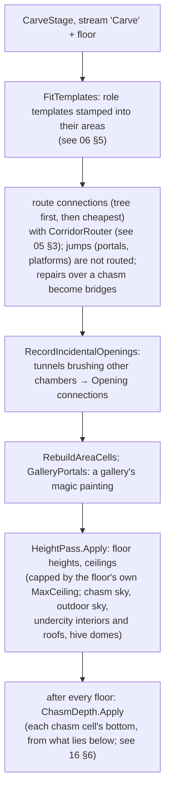
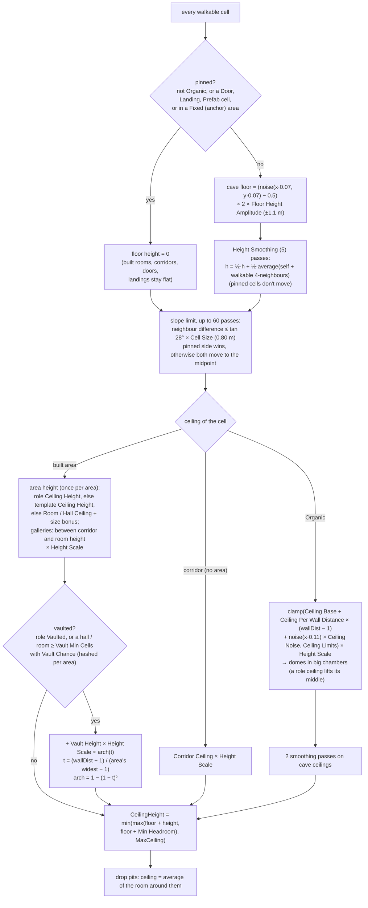
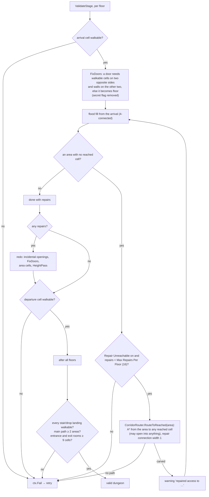
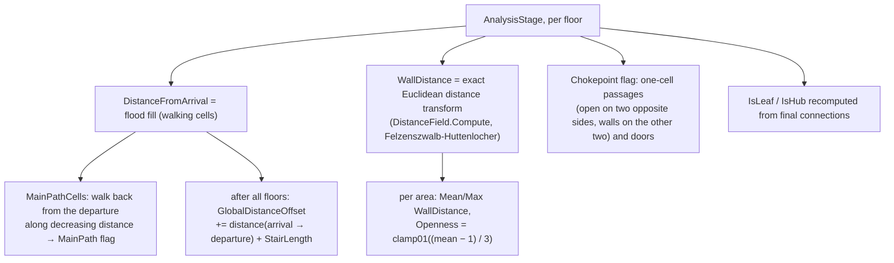

# Dungeon 07 — Carve, Validate and Analyse

**Scripts:** `Stages/Carve/CarveStage.cs` (`CarveStage`, `HeightPass`), `Stages/Carve/CorridorRouter.cs`,
`Stages/Validate/ValidateStage.cs`, `Stages/Analysis/AnalysisStage.cs`, `Common/DistanceField.cs`.

---

## 1. Concept

Stages 5–7 turn the plan into a **finished, measured floor**:

| Stage | Question it answers |
|---|---|
| 5 Carve | Where exactly do the corridors run, where are the doors, and how high is every floor and ceiling cell? |
| 6 Validate | Can the player really walk from the arrival to every area, to every stair and to the exit? If not, repair it or retry. |
| 7 Analyse | How far is each cell from the arrival and from the walls? Where are the main path, the chokepoints and the open spaces? |

## 2. Carve (per floor, in parallel)

Validation floods with `FloorLayout.Flood`, which crosses teleporters and moving platforms; doors are never placed
outdoors or over a chasm, and the chasm depth is applied again after repairs. Analysis walks the main path across
jumps too, and bridges count as chokepoints.

## 3. Heights — how floor and ceiling heights are calculated

**The rules:**

- **Base heights** (Rooms › Heights): rooms 5 m, halls 7.5 m, corridors 3.6 m. Caves: 4 m next to the walls, +0.6 m
  per cell towards the middle, between 3.4 and 10 m.
- **Bigger rooms are taller** (Heights › Extra Per Room Cell): +0.2 m per cell of the room's shorter side beyond 6
  cells, at most +2.5 m. A 12-cell-wide hall is 7.5 + 1.2 = 8.7 m.
- **Vaults** (Heights › Vault Chance / Vault Height): half of the halls and large rooms (70+ cells) rise towards their
  middle by up to 2.5 m. The rise follows the distance to the walls, so pillars make cross vaults between them.
- **Special rooms** set their own ceiling in their role rule (Ceiling Height, Vaulted): the boss hall 10 m vaulted,
  thrones 10 m vaulted, arenas and guardian rooms 8 m, shrines 7 m vaulted, libraries 7 m, crypts 6 m vaulted.
- **Height Scale** multiplies every one of these heights at once: 1.5 = everything 50% taller.
- **Headroom:** every ceiling is at least Min Headroom (2.6 m) above its floor.
- **Room between floors:** `MaxCeiling = max(2.5, FloorSpacing − cave floor amplitude − Rock Between Floors)`. With
  **Auto Floor Spacing** (on by default) the generator raises Floor Spacing until the tallest ceiling the profile can
  produce fits (`DungeonProfile.TallestCeiling`, `EffectiveFloorSpacing`), so nothing is cut down — stairs simply get
  longer. With it off, Floor Spacing is kept and ceilings above MaxCeiling are lowered to it.
- **Flat built spaces:** rooms, corridors, doors and landings stay at height 0, the floor's base. Doors and stairs
  therefore always meet level ground, and tile-kit pieces sit flat.
- **Walkable caves:** the slope limit (28° per cell) keeps every cave floor climbable. The pinned-wins rule makes cave
  floors ramp smoothly down (or up) to meet a flat corridor.

The inspector's **Ceiling Heights** buttons set all of these together:

| Preset | Rooms / halls / corridors | Caves (base → max) | Size bonus | Vaults | Door |
|---|---|---|---|---|---|
| Classic | 4 / 6.5 / 3.2 m | 3.2 → 7.5 m | none | none | 2.6 m |
| Standard (default) | 5 / 7.5 / 3.6 m | 4 → 10 m | +0.2 m/cell, ≤ 2.5 m | 50%, +2.5 m | 3 m |
| Tall | 6.5 / 10 / 4.5 m | 5 → 13 m | +0.3 m/cell, ≤ 3.5 m | 65%, +3.5 m | 3.4 m |
| Cathedral | 8 / 14 / 5.5 m | 6 → 17 m | +0.4 m/cell, ≤ 5 m | 80%, +5 m | 4 m |

### Worked example (Standard, cell 1.5 m)

A 12 × 9-cell vaulted room: base 5 m + size bonus 0.2 × (9 − 6) = 5.6 m at the walls. Its widest point is 4.5 cells
from the walls; a cell 3 cells in has t = (3 − 1) / 3.5 = 0.57, arch = 1 − 0.43² = 0.82, so its ceiling is
5.6 + 2.5 × 0.82 = 7.65 m, and 8.1 m in the very middle.

Floor spacing: the tallest Standard ceiling is the boss hall (10 m + 2.5 m vault = 12.5 m), plus the cave floor
amplitude (1.1 m) and Rock Between Floors (0.8 m) = 14.4 m → floors 14.5 m apart; stair wells are
14.5 m / tan 33° = 22.3 m → 15 cells long.

## 4. Validate and repair

Validation is the safety net that makes **"every area is reachable"** a guarantee rather than a hope. Repairs are rare
with default settings. In the headless test run, the 360 regular dungeons all passed on the first attempt (see
[11](11-Editor-Tools-and-Testing.md)).

## 5. Analysis

| Output | Used by |
|---|---|
| `DistanceFromArrival` | population safe zone (no mobs near the spawn), pack cells, `DungeonInstance.PathDepth` |
| `WallDistance` | portal back wall, boss position (the cell farthest from walls), pack clearance, prop rules (wall-adjacent < 1.6, centre ≥ 2) |
| `MainPathCells` / `MainPath` flag | preview overlay, gameplay |
| `Chokepoint` flag | no mob packs on chokepoints, *Chokepoint* props (traps, barricades) |
| Area Openness, Mean/Max wall distance | gameplay queries, custom stages |
| `GlobalDistanceOffset` | "walking distance from the dungeon entrance" across floors (`DungeonInstance.PathDepth`) |

## 6. Configuration

| Setting | Default | Effect |
|---|---|---|
| Caves › Floor Height Amplitude / Scale | 1.1 m / 0.07 | cave floor relief and bump size |
| Caves › Height Smoothing | 5 | gentler slopes |
| Caves › Ceiling Base / Per Wall Distance / Limits / Noise | 4 / 0.6 / 3.4–10 / 0.8 | cave ceiling shape |
| Rooms › Room / Hall / Corridor Ceiling | 5 / 7.5 / 3.6 m | built ceilings |
| Heights › Height Scale | 1 | multiplies every ceiling |
| Heights › Extra Per Room Cell / Size Scaling From / Max Size Bonus | 0.2 m / 6 cells / 2.5 m | bigger rooms taller |
| Heights › Vault Chance / Vault Min Cells / Vault Height | 0.5 / 70 / 2.5 m | arched ceilings in halls and large rooms |
| Heights › Min Headroom / Door Height | 2.6 m / 3 m | lowest clearance, door openings |
| Heights › Auto Floor Spacing / Rock Between Floors | on / 0.8 m | floors move apart to fit the ceilings |
| Roles › Ceiling Height / Vaulted | per rule | special rooms' own heights |
| Floor Spacing | 12 m | the minimum distance between floors (raised automatically) |
| Validation › Repair Unreachable | on | carve passages to unreachable areas |
| Validation › Max Repairs Per Floor | 16 | beyond this the attempt fails |
| Validation › Max Attempts | 6 | retries per dungeon |
| Validation › Log Report | off | print the report after each generation |

The slope limit (28°), the 9-cell minimum for the entrance/exit rooms and the 60-pass limit
are constants in code.

## 7. Performance

The height pass is O(cells × (smoothing + up to 60 slope passes)). The distance transform is linear. The flood fills
are linear. A repair costs one A* each. Everything runs per floor in parallel.

## 8. Debugging

Dungeon Preview views: **Heights** (floor heights), **Distance** (walking distance from the arrival),
**Wall Distance**.

| Symptom | Cause | Fix |
|---|---|---|
| Report lists many "repaired access to …" | corridors fail to route (templates with blocked sockets, crowded floors) | lower room coverage, check templates |
| "can't be reached" failures and retries | Repair Unreachable off, or the repair limit reached | enable repairs / raise the limit |
| Doors missing where expected | door cell lacked walls on both sides → turned into an archway | expected behaviour |
| Cave ceilings feel low | Ceiling Base / Limits min low, small chambers | raise them (keep below Floor Spacing) |
| Ceilings flat at a cap | MaxCeiling reached (Floor Spacing too small) | raise Floor Spacing |
| Player can't climb a cave slope | a controller slope limit below 28° | set the CharacterController slope limit ≥ 30° |
