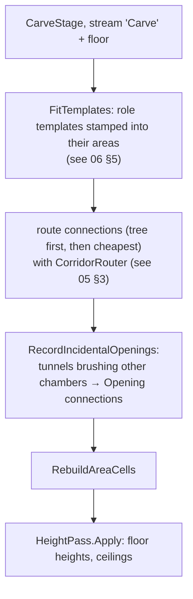
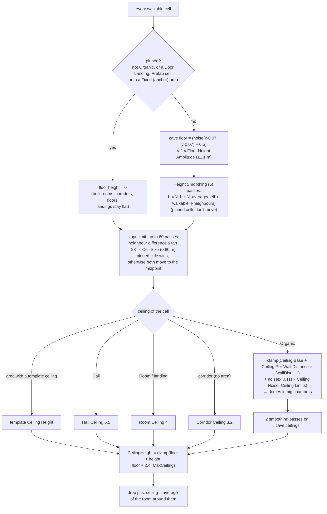
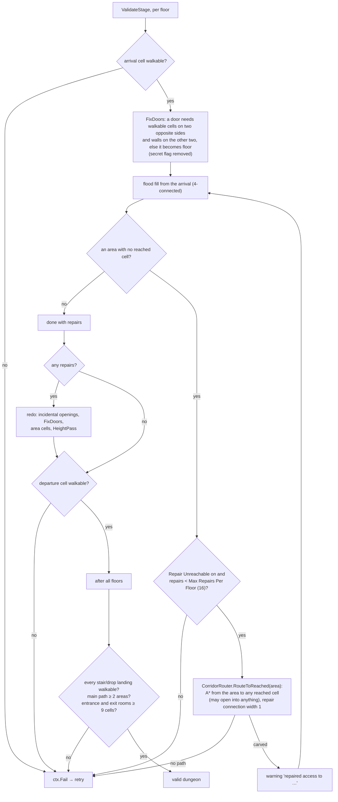
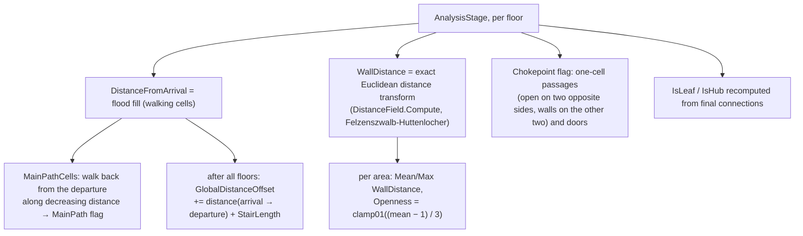

# Dungeon 07 — Carve, Validate and Analyse

**Scripts:** `Stages/Carve/CarveStage.cs` (`CarveStage`, `HeightPass`), `Stages/Carve/CorridorRouter.cs`,
`Stages/Validate/ValidateStage.cs`, `Stages/Analysis/AnalysisStage.cs`, `Common/DistanceField.cs`.

---

## 1. Concept

Stages 5–7 turn the plan into a **finished, measured floor**:

| Stage | Question it answers |
|---|---|
| 5 Carve | Where exactly do the corridors run, where are the doors, and how high is every floor and ceiling cell? |
| 6 Validate | Can the player really walk from the arrival to every area, to every stair and to the exit? If not, repair it or retry. |
| 7 Analyse | How far is each cell from the arrival and from the walls? Where are the main path, the chokepoints and the open spaces? |

## 2. Carve (per floor, in parallel)

## 3. Heights — how floor and ceiling heights are calculated

**Why these rules:**

- **Flat built spaces:** rooms, corridors, doors and landings stay at height 0, the floor's base. Doors and stairs
  therefore always meet level ground, and tile-kit pieces sit flat.
- **Walkable caves:** the slope limit (28° per cell) keeps every cave floor climbable. The pinned-wins rule makes cave
  floors ramp smoothly down (or up) to meet a flat corridor.
- **Headroom:** every ceiling is at least 2.4 m above its floor.
- **Floor thickness:** `MaxCeiling = max(2.5, FloorSpacing − cave floor amplitude − 0.8)` keeps rock between a
  ceiling and the floor above.

### Worked example (defaults, cell 1.5 m)

A cave cell whose noise is 0.80: floor = (0.80 − 0.5) × 2 × 1.1 = **+0.66 m** before smoothing. Say the average of it
and its neighbours is +0.40 m. Then one smoothing pass gives ½ × 0.66 + ½ × 0.40 = 0.53 m, and five passes pull it
further towards its neighbours. Next to a corridor cell (0 m), the slope limit caps it at **0.80 m**
(tan 28° × 1.5 = 0.797).

Its ceiling, 3 cells from the nearest wall with ceiling noise −0.2: 3.2 + 0.55 × (3 − 1) − 0.2 = **4.1 m** above the
floor. That lies inside the limits 2.8–7.5, so the absolute ceiling is 0.53 + 4.1 = 4.63 m, well below MaxCeiling 8.1 m.

## 4. Validate and repair

Validation is the safety net that makes **"every area is reachable"** a guarantee rather than a hope. Repairs are rare
with default settings. In the headless test run, the 360 regular dungeons all passed on the first attempt (see
[11](11-Editor-Tools-and-Testing.md)).

## 5. Analysis

| Output | Used by |
|---|---|
| `DistanceFromArrival` | population safe zone (no mobs near the spawn), pack cells, `DungeonInstance.PathDepth` |
| `WallDistance` | portal back wall, boss position (the cell farthest from walls), pack clearance, prop rules (wall-adjacent < 1.6, centre ≥ 2) |
| `MainPathCells` / `MainPath` flag | preview overlay, gameplay |
| `Chokepoint` flag | no mob packs on chokepoints, *Chokepoint* props (traps, barricades) |
| Area Openness, Mean/Max wall distance | gameplay queries, custom stages |
| `GlobalDistanceOffset` | "walking distance from the dungeon entrance" across floors (`DungeonInstance.PathDepth`) |

## 6. Configuration

| Setting | Default | Effect |
|---|---|---|
| Caves › Floor Height Amplitude / Scale | 1.1 m / 0.07 | cave floor relief and bump size |
| Caves › Height Smoothing | 5 | gentler slopes |
| Caves › Ceiling Base / Per Wall Distance / Limits / Noise | 3.2 / 0.55 / 2.8–7.5 / 0.7 | cave ceiling shape |
| Rooms › Room / Hall / Corridor Ceiling | 4 / 6.5 / 3.2 m | built ceilings |
| Floor Spacing | 10 m | sets MaxCeiling |
| Validation › Repair Unreachable | on | carve passages to unreachable areas |
| Validation › Max Repairs Per Floor | 16 | beyond this the attempt fails |
| Validation › Max Attempts | 6 | retries per dungeon |
| Validation › Log Report | off | print the report after each generation |

The slope limit (28°), the 2.4 m minimum headroom, the 9-cell minimum for the entrance/exit rooms and the 60-pass limit
are constants in code.

## 7. Performance

The height pass is O(cells × (smoothing + up to 60 slope passes)). The distance transform is linear. The flood fills
are linear. A repair costs one A* each. Everything runs per floor in parallel.

## 8. Debugging

Dungeon Preview views: **Heights** (floor heights), **Distance** (walking distance from the arrival),
**Wall Distance**.

| Symptom | Cause | Fix |
|---|---|---|
| Report lists many "repaired access to …" | corridors fail to route (templates with blocked sockets, crowded floors) | lower room coverage, check templates |
| "can't be reached" failures and retries | Repair Unreachable off, or the repair limit reached | enable repairs / raise the limit |
| Doors missing where expected | door cell lacked walls on both sides → turned into an archway | expected behaviour |
| Cave ceilings feel low | Ceiling Base / Limits min low, small chambers | raise them (keep below Floor Spacing) |
| Ceilings flat at a cap | MaxCeiling reached (Floor Spacing too small) | raise Floor Spacing |
| Player can't climb a cave slope | a controller slope limit below 28° | set the CharacterController slope limit ≥ 30° |
