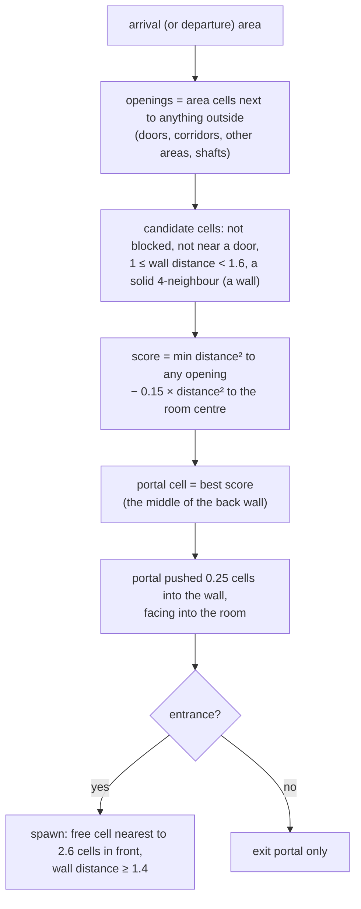
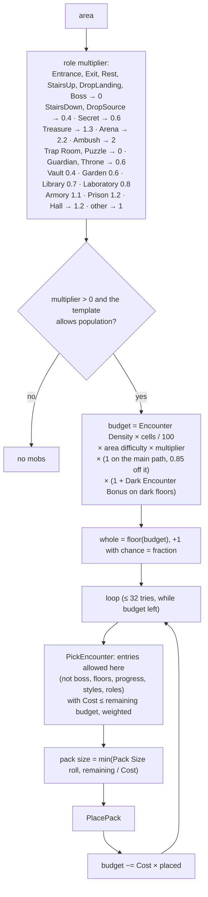
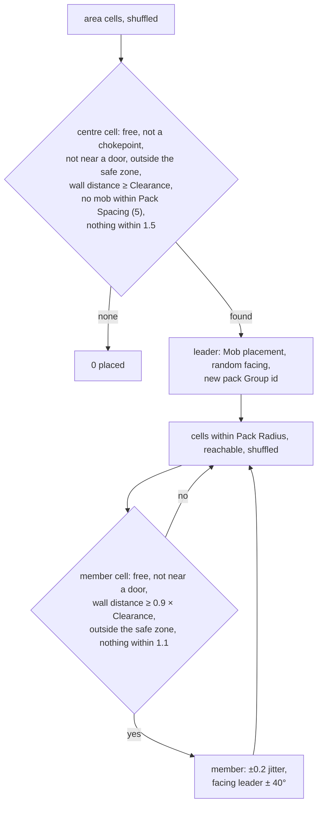
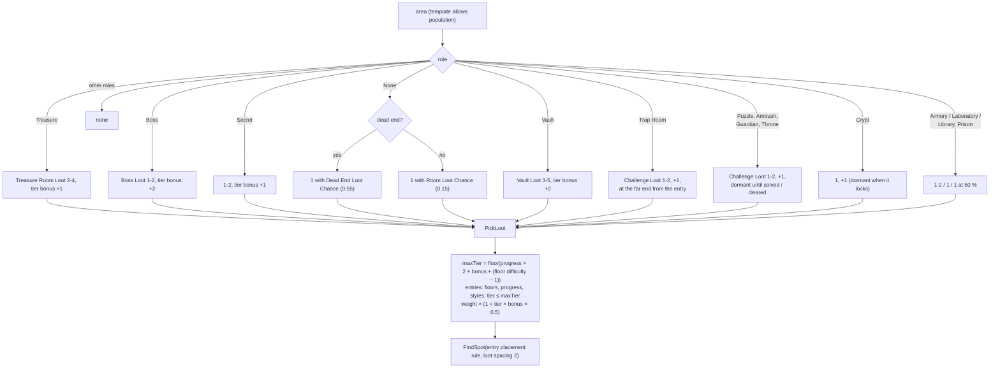
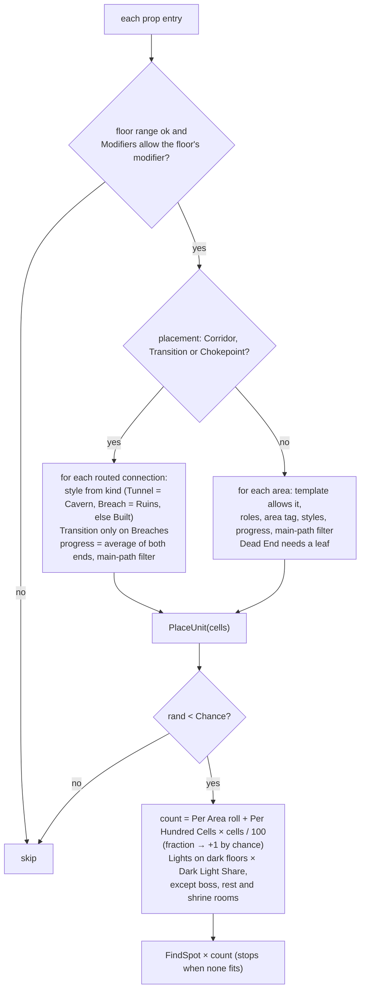

# Dungeon 08 — Population: Portals, Spawn, Mobs, Loot and Props

**Scripts:** `Stages/Population/PopulationStage.cs` (`PopulationStage`, `FloorPopulator`),
`Config/DungeonEncounterTable.cs`, `Config/DungeonLootTable.cs`, `Config/DungeonPropTable.cs`,
`Config/DungeonDefaults.cs`, `Config/SpawnableMobImport.cs`, `Common/SpatialHash2D.cs`.

---

## 1. Concept

Stage 8 decides **what goes where, as data only**. Each decision is a `Placement`: kind, table entry, floor, area,
position (in cells), height, yaw, pack group, scale and tier. The builder creates the objects later, on the main
thread ([09](09-Meshing-and-Build.md)).

Everything is placed from three tables plus built-in placements:

| Source | Placement kinds |
|---|---|
| built-in | `PlayerSpawn`, `EntrancePortal`, `ExitPortal` |
| **Encounter table** | `Mob`, `Boss` |
| **Loot table** | `Loot` |
| **Prop table** | `Interactable`, `PointOfInterest`, `Hazard`, `Decoration`, `Light` |

An empty or missing table falls back to `DungeonDefaults` (primitive chests, torches, crystals, traps and placeholder
mobs), so a fresh profile shows a fully furnished dungeon with no art at all.

## 2. Macro flowchart (per floor, in parallel)

```mermaid
flowchart TD
    A["FloorPopulator, stream 'Population' + floor"] --> B{"floor 0?"}
    B -- yes --> C["PlaceEntrance: entrance portal on the<br/>arrival room's back wall + player spawn in front"]
    B -- no --> D
    C --> D{"last floor?"}
    D -- yes --> E["PlaceExit: exit portal on the<br/>departure room's back wall"]
    D -- no --> R
    E --> R["ReserveLocks: pick the vault doors and the shortcut<br/>(only where nothing gets cut off)"]
    R --> RC["ReserveCrossings: teleport pads, magic paintings,<br/>moving platforms on their connections"]
    RC --> F["PlaceBosses: a boss encounter in each Boss area"]
    F --> EL["PlaceElites: the toughest allowed mob in<br/>Guardian and Throne rooms (scaled, tier +1)"]
    EL --> G["PlaceEncounters: mob packs from per-area budgets<br/>+ corridor wanderers (never on bridges); ambush rooms and pit fights<br/>split into waves; barracks soldiers put to sleep"]
    G --> H["PlaceLoot: treasure, boss, secret, special rooms,<br/>dead ends, rooms"]
    H --> RF["PlaceRoomFixtures: nests, the wine cellar's lever and barrel stash,<br/>the gas chamber's cloud and valve"]
    RF --> I["PlaceProps: every prop entry by its rule<br/>(roles, area tags, floor modifier filter, fewer lights on dark floors)"]
    I --> MC["PlaceMechanics: keys and locked doors, puzzle plates,<br/>room controllers and gates, the shortcut door,<br/>altar rewards, shifting walls, a roaming mini-boss"]
    MC --> TR["PlaceTraps: tripwires and arrow launchers in long corridors"]
    TR --> J["stop anywhere once Max Placements Per Floor (500)"]
    J --> K["after all floors: no PlayerSpawn → ctx.Fail"]
```

**Order matters.** Portals and the spawn claim their cells first, the lock cells and crossings are reserved, then
bosses, elites, packs, loot, room fixtures, props and the mechanics. The newer rooms and mechanics are described in
[15](15-Types-Special-Rooms-Mechanics.md) and [16](16-Towers-Cities-Hives-Chasms.md). Spacing checks
use three `SpatialHash2D` indexes (occupied, mobs, loot), so later items keep clear of earlier ones.

## 3. Portals and the player spawn

The player therefore arrives **in front of the entrance portal, facing into the room**, as far as possible from the
room's exits. The entrance portal leads back to the world, and the exit portal completes the dungeon or goes deeper.

## 4. Encounters — mobs and bosses

### Budget per area (micro)

**Area difficulty** (from [06](06-Roles-and-Templates.md)) = floor difficulty × (0.75 + 0.5 × progress), and floor
difficulty = request difficulty × (1 + 0.2 × floor + 0.25 × depth). Deeper floors, later rooms and harder portals all
get more mobs. The *Cost* of an entry spends more budget on tougher mobs, so fewer of them fit.

### Placing a pack (micro)

**Safe zone:** a cell whose walking distance from the floor's arrival is below *Safe Radius* (16 cells on floor 0, 8
on deeper floors) never gets a mob. Nothing waits at the spawn or at the bottom of the stairs.

**Corridor wanderers:** each routed connection at least 8 cells long has a *Corridor Encounter Chance* (0.12) to get
one mob (cost ≤ 2) somewhere in its middle (not the first or last 2 cells).

**Elites:** each Guardian (Mini Boss) and Throne area gets the highest-cost encounter allowed there, on its most
central cell, scaled by *Elite Scale* (1.3) with *Elite Tier Bonus* (+1); the room's ordinary packs (×0.6) are its
guards.

**Ambush waves:** an Ambush area's packs are split into *Ambush Waves* (2–3) groups. The first wave is dormant until
players enter; each next wave appears when the previous one is dead. A crypt that rolls *Crypt Ambush Chance* is treated the
same way ("the dead rise").

**Bosses:** each Boss area gets one boss encounter (entries marked *Boss*), placed on the cell **farthest from the
walls** (the middle of the arena) and facing the floor's arrival.

## 5. Loot

Higher tiers appear **later along the path, in rewarding rooms, and in harder dungeons**. The bonus also tilts the
weights towards high tiers in treasure and boss rooms. **Dormant** loot (the boss's, a puzzle's, a cleared room's)
is built hidden and appears when the room's event completes.

## 6. Props

### FindSpot rules (micro)

| Placement | Cell must be | Position / facing |
|---|---|---|
| **Anywhere**, **Dead End** | wall distance ≥ 1.4, not near a door | ±0.15 jitter, random yaw |
| **Wall Adjacent** | wall distance < 1.6, a solid 4-neighbour, not near a door | pushed 0.3 towards the wall, facing away from it |
| **Corner** | two perpendicular solid neighbours, not near a door | pushed 0.25 into the corner, facing out of it |
| **Center** | wall distance ≥ 2 (sorted: most central first) | random yaw |
| **Corridor** | `Corridor` flag, not near a door | random yaw |
| **Doorway** | next to a door | facing the door |
| **Chokepoint** | `Chokepoint` flag | random yaw |
| **Transition** | `Rubble` flag (where caves meet built structure) | random yaw |
| **Back Wall** | wall distance < 1.6, a solid 4-neighbour, not near a door (most central first) | pushed 0.3 into the wall, facing the room's middle |
| **Off Path** | not main path, not a chokepoint, wall distance ≥ 1.4, not near a door | random yaw (hazards that must never block the way) |

Every spot must also be ≥ *Spacing* from others of the same entry, ≥ *Away From Mobs* from mobs, ≥ 0.9 from any other
placement, and not a door, landing or occupied cell.

### Built-in defaults (`DungeonDefaults`)

| Entry | Kind | Placement | Styles | Per area | Per 100 cells | Spacing | Chance | Roles |
|---|---|---|---|---|---|---|---|---|
| Wall Torch | Light | Wall Adjacent (1.9 m up) | Built, Ruins | 1 | 1.8 | 6 | 1 | — |
| Glow Crystal | Light | Wall Adjacent | Cavern | 0–1 | 1.4 | 7 | 0.9 | — |
| Brazier | Light | Corner | all | 2–4 | 0 | 4 | 1 | Arena, Boss, Entrance |
| Barrel | Decoration | Corner | Built | 0–2 | 0 | 1.5 | 0.55 | — |
| Crate | Decoration | Wall Adjacent | Built, Ruins | 0–2 | 0.3 | 2 | 0.5 | — |
| Bones | Decoration | Anywhere | Cavern, Ruins | 0–1 | 0.7 | 4 | 0.6 | — |
| Mushrooms | Decoration | Wall Adjacent | Cavern | 0–2 | 1.2 | 3 | 0.7 | — |
| Rubble | Decoration | Transition | all | 1–3 | 0 | 1.2 | 1 | — |
| Altar | Point Of Interest | Center | all | 1 | 0 | 2 | 1 | Shrine |
| Fountain | Point Of Interest | Center | all | 1 | 0 | 2 | 1 | Rest |
| Bookshelf | Interactable | Wall Adjacent | Built | 1–3 | 0 | 2 | 0.8 | Secret, Treasure, Shrine |
| Spike Trap | Hazard | Corridor (progress 0.15–1) | Built, Ruins | 1 | 0 | 6 | 0.2 | — |
| Pillar | Decoration | Corner | Built | 4 | 0 | 2 | 0.35 | Arena, Boss |
| Library Shelves | Decoration | Wall Adjacent | Built, Ruins | 3–5 | 3 | 1.6 | 1 | Library |
| Reading Table | Decoration | Center | all | 1–2 | 0 | 3 | 1 | Library, Laboratory, Prison |
| Candles | Light | Anywhere | all | 2–3 | 0.5 | 2.5 | 1 | Library, Crypt, Shrine |
| Weapon Rack | Decoration | Wall Adjacent | all | 2–4 | 1 | 2 | 1 | Armory |
| Armor Stand | Decoration | Wall Adjacent | all | 1–3 | 0 | 2.2 | 1 | Armory, Throne |
| Supply Crates | Decoration | Corner | all | 1–3 | 0 | 1.5 | 1 | Armory |
| Cell Cage | Decoration | Wall Adjacent | all | 2–4 | 1 | 2.6 | 1 | Prison |
| Remains | Decoration | Anywhere | all | 1–3 | 0 | 2 | 1 | Prison, Crypt, Trap Room |
| Sarcophagus | Decoration | Anywhere | all | 2–4 | 2.5 | 2.6 | 1 | Crypt |
| Cobwebs | Decoration | Corner (2.2 m up) | all | 1–3 | 0 | 2 | 0.8 | Crypt, Prison, Library |
| Alchemy Table | Decoration | Wall Adjacent | all | 1–3 | 0.5 | 2.2 | 1 | Laboratory |
| Cauldron | Light | Center | all | 1 | 0 | 3 | 1 | Laboratory |
| Overgrowth | Decoration | Wall Adjacent | all | 2–5 | 2 | 1.5 | 1 | Garden |
| Garden Mushrooms | Decoration | Anywhere | all | 2–4 | 1 | 2 | 1 | Garden |
| Healing Herbs | Interactable | Anywhere | all | 1–2 | 0 | 3 | 1 | Garden |
| Throne | Point Of Interest | Back Wall | all | 1 | 0 | 4 | 1 | Throne |
| Banners | Decoration | Wall Adjacent | Built, Ruins | 2–4 | 0 | 2.5 | 1 | Throne, Boss, Armory |
| Statue | Decoration | Corner | all | 2–4 | 0 | 3 | 1 | Throne, Shrine, Puzzle, Vault |
| Treasure Pedestal | Decoration | Center | all | 1–2 | 0 | 2.5 | 1 | Vault |
| Spike Floor | Hazard | Anywhere | all | 2 | 7 | 1.6 | 1 | Trap Room |
| Fire Jet | Hazard | Anywhere | all | 1 | 5 | 2.2 | 1 | Trap Room |
| Blade Pendulum | Hazard | Center | all | 1–2 | 0 | 4 | 1 | Trap Room |
| Dart Wall | Hazard | Wall Adjacent | all | 1–3 | 0 | 3 | 1 | Trap Room |
| Corridor Darts | Hazard | Corridor (progress 0.3–1) | Built, Ruins | 1 | 0 | 8 | 0.12 | — |
| Egg Sacs | Decoration | Anywhere | all | 2–4 | 1 | 2 | 1 | Nest |
| Gnawed Bones | Decoration | Anywhere | all | 1–3 | 0 | 2 | 1 | Nest, Gas Chamber |
| Blood Altar | Interactable | Back Wall | all | 1 | 0 | 4 | 1 | Gambling |
| Cursed Altar | Interactable | Wall Adjacent | all | 1 | 0 | 4 | 0.7 | Gambling |
| Ritual Candles | Light | Anywhere | all | 2–4 | 0 | 2 | 1 | Gambling |
| Long Table | Decoration | Center | all | 1–2 | 0 | 3.5 | 1 | Kitchen |
| Benches | Decoration | Anywhere | all | 2–3 | 0 | 2.2 | 1 | Kitchen |
| Stove | Light | Wall Adjacent | all | 1 | 0 | 3 | 1 | Kitchen |
| Pots of Stew | Interactable | Wall Adjacent | all | 1–2 | 0 | 2 | 1 | Kitchen |
| Kitchen Barrels | Decoration | Corner | all | 1–3 | 0 | 1.2 | 1 | Kitchen |
| Paintings | Decoration | Wall Adjacent | all | 4–8 | 3 | 2.2 | 1 | Gallery |
| Gallery Statues | Decoration | Corner | all | 1–3 | 0 | 3 | 1 | Gallery |
| Viewing Bench | Decoration | Center | all | 1 | 0 | 3 | 0.8 | Gallery |
| Bunks | Decoration | Wall Adjacent | all | 3–6 | 4 | 1.4 | 1 | Barracks |
| Barracks Rack | Decoration | Wall Adjacent | all | 1–2 | 0 | 2 | 1 | Barracks |
| Spectators | Decoration | Wall Adjacent | all | 3–6 | 2 | 3.4 | 1 | Colosseum |
| Arena Braziers | Light | Corner | all | 2–4 | 0 | 3 | 1 | Colosseum |
| Arena Banners | Decoration | Wall Adjacent | all | 2–4 | 0 | 3 | 1 | Colosseum |
| Planters | Decoration | Wall Adjacent | all | 2–4 | 2 | 2.2 | 1 | Greenhouse |
| Rare Herbs | Interactable | Anywhere | all | 1–2 | 0 | 3 | 1 | Greenhouse |
| Poisonous Plants | Hazard | Anywhere | all | 2–4 | 2 | 2 | 1 | Greenhouse |
| Greenhouse Vines | Decoration | Wall Adjacent | all | 1–3 | 0 | 1.5 | 1 | Greenhouse |
| Wine Racks | Decoration | Wall Adjacent | all | 2–4 | 2 | 1.8 | 1 | Wine Cellar |
| Wine Barrels | Decoration | Wall Adjacent | all | 3–6 | 3 | 1.4 | 1 | Wine Cellar |
| Cellar Cobwebs | Decoration | Corner (2.2 m up) | all | 1–2 | 0 | 2 | 0.8 | Wine Cellar |
| Map Table | Interactable | Center | all | 1 | 0 | 4 | 1 | Map Room |
| Chart Shelves | Decoration | Wall Adjacent | all | 1–2 | 0 | 2 | 1 | Map Room |
| Map Room Candles | Light | Corner | all | 1–2 | 0 | 2 | 1 | Map Room |
| Gas Vents | Decoration | Anywhere | all | 2–4 | 2 | 2.5 | 1 | Gas Chamber |
| Swinging Log | Hazard | Corridor (progress 0.25–1) | all | 1 | 0 | 10 | 0.1 | — |
| Stalactites | Decoration | Anywhere | Cavern | 0–3 | 1 | 3 | 0.5 | — |

Floor style props (*Area Tag* set, so only in areas the newer layouts tag):

| Entry | Kind | Placement | Per area | Per 100 cells | Spacing | Chance | Area tag |
|---|---|---|---|---|---|---|---|
| Street Lamps | Light | Wall Adjacent | 1–2 | 3 | 6 | 1 | Street |
| Carts | Decoration | Wall Adjacent | 0–1 | 0.5 | 8 | 0.5 | Street |
| Plaza Well | Point Of Interest | Center | 1 | 0 | 5 | 0.6 | Plaza |
| Market Stalls | Decoration | Anywhere | 2–4 | 2 | 3.5 | 0.9 | Plaza |
| Plaza Lamps | Light | Corner | 2–4 | 0 | 5 | 1 | Plaza |
| Ruined Walls | Decoration | Anywhere | 2–4 | 2 | 2.5 | 1 | Ruin |
| Hoard Gold | Decoration | Anywhere | 6–12 | 1 | 2.2 | 1 | Den |
| Dragon Bones | Decoration | Off Path | 1–2 | 0 | 6 | 1 | Den |
| Den Stalactites | Decoration | Anywhere | 3–6 | 1 | 4 | 1 | Den |
| Hive Egg Sacs | Decoration | Wall Adjacent | 0–2 | 1 | 2.5 | 0.7 | Hive |
| Hive Fungus | Light | Wall Adjacent | 0–2 | 1 | 3 | 0.8 | Hive |
| Brood Eggs | Decoration | Anywhere | 3–6 | 2 | 2 | 1 | Brood |
| Brood Fungus | Light | Wall Adjacent | 1–3 | 1 | 3 | 1 | Brood |
| Star Motes | Light | Anywhere | 1–3 | 1 | 4 | 1 | Platform |
| Island Crystals | Light | Wall Adjacent | 0–2 | 1 | 4 | 0.6 | Island |

Floor modifier props (*Modifiers* set, so only on those floors):

| Entry | Kind | Placement | Styles | Per area | Per 100 cells | Spacing | Chance | Modifier |
|---|---|---|---|---|---|---|---|---|
| Lava Pool | Hazard | Off Path | Cavern, Ruins | 0–1 | 1.6 | 5 | 0.9 | Molten |
| Spore Vent | Hazard | Off Path | all | 0–1 | 0.8 | 6 | 0.8 | Overgrown |
| Roots | Decoration | Wall Adjacent | all | 0–2 | 2.5 | 1.5 | 0.9 | Overgrown |
| Glowcaps | Light | Anywhere | all | 0–2 | 1.5 | 3 | 0.9 | Overgrown |
| Ice Crystals | Light | Wall Adjacent | all | 0–2 | 1.8 | 3 | 0.9 | Frozen |
| Dark Cobwebs | Decoration | Corner (2.2 m up) | all | 0–2 | 0 | 2 | 0.6 | Darkness |
| Giant Roots | Decoration | Off Path | all | 0–1 | 0.8 | 6 | 0.7 | Overgrown |

**Fill Missing Role Props** (on by default): when a profile has its own prop table, every special room (Library,
Armory, Prison, Crypt, Laboratory, Garden, Throne, Trap Room, Vault, Shrine, Rest, Nest, Gambling, Kitchen, Gallery,
Barracks, Colosseum, Greenhouse, Wine Cellar, Map Room, Gas Chamber), every floor style tag (Street, Plaza, Ruin, Den,
Hive, Brood, Platform, Island), the swinging logs and every floor modifier that the table has no entry for gets the
built-in entries above, so new rooms are never empty with an older table.

Default loot: Chest (weight 1, tier 0, wall), Ornate Chest (0.5, tier 1, progress ≥ 0.4), Urn (0.7, tier 0, corner,
built/ruins). Default encounters: Placeholder Mob (cost 1, packs of 1–3), Placeholder Brute (cost 3, progress ≥ 0.3,
tier 1), Placeholder Boss (boss, cost 10, tier 2).

## 7. Tables

| Table | Entry fields |
|---|---|
| **Encounter** (`DungeonEncounterTable`) | Name, Prefab (NavMeshAgent of the profile's agent type), Placeholder, Boss, Weight, Cost, Pack Size, Pack Radius, Min/Max Floor, Progress, Styles, Roles (empty = any area except Entrance, Rest and landings), Clearance, Tier. The inspector's **Import** copies the world's `SpawnableMob` list (prefab, weight, rarity, pack behaviour; biome and height preferences don't apply underground). |
| **Loot** (`DungeonLootTable`) | Name, Prefab, Placeholder, Weight, Tier, Progress, Styles, Placement, Min/Max Floor |
| **Prop** (`DungeonPropTable`) | Name, Kind, Prefab, Placeholder, Placement, Roles, Area Tag, Styles, Modifiers, Main Path (Any / Only / Off), Chance, Per Area, Per Hundred Cells, Spacing, Away From Mobs, Progress, Min/Max Floor, Height Offset, Scale, Light Colour/Range (primitives) |

Profile › Population also has *Default Loot*, *Default Props* and *Placeholder Mobs* (use the built-ins when a table
is missing or a mob has no prefab).

## 8. Example

A Medium room (70 cells) on floor 1 of a difficulty-1 dungeon at progress 0.5, on the main path, role None:

- area difficulty = 1.2 × (0.75 + 0.25) = 1.2;
- budget = 2.2 × 70 / 100 × 1.2 × 1 × 1 = **1.85** → 1, plus 1 more with 85 % chance;
- with the defaults: probably 1 pack of 1–2 Placeholder Mobs (cost 1 each). The Brute (cost 3) doesn't fit a budget
  of 2.

The same room as an **Arena** (×2.2): budget 4.07 → 4 (5 with 7 % chance), e.g. a Brute plus a mob, or 1–3 packs of
small mobs.

## 9. Performance

Linear in cells × entries per floor, with spatial hashes for the spacing tests. Floors run in parallel.
*Max Placements Per Floor* (500) caps the worst case, which matters for the build step as each placement becomes a
GameObject.

## 10. Debugging

Dungeon Preview: **Placements** toggle (dots per placement), hover to read an area's role, progress and difficulty.

| Symptom | Cause | Fix |
|---|---|---|
| Report: "No player spawn could be placed" (retry) | the entrance room is too cramped (all cells near walls/doors) | raise Entrance Size |
| No mobs at all | encounter table empty and *Placeholder Mobs* off; entries' Roles/Styles/Progress exclude everything; Encounter Density 0 | check the table filters |
| Mobs right at the spawn | not possible within Safe Radius; if Safe Radius is small, raise it | Safe Radius |
| Too many mobs deep down | Difficulty Per Floor, depth chain, Arena multiplier | lower Encounter Density or Difficulty Per Floor |
| Loot always tier 0 | progress/difficulty low, higher tiers' Progress ranges exclude early rooms | check tiers and progress ranges |
| Props missing in template rooms | template *Allow Population* off | enable it |
| A special room is empty | own prop table without entries for it and *Fill Missing Role Props* off | turn it on, or **Add Missing Built-in Props** on the table |
| Boss/puzzle loot not visible | it is dormant until the room's event completes | kill the boss / solve the puzzle |
| Torches too dense | Per Hundred Cells high, Spacing low | lower density / raise spacing |
