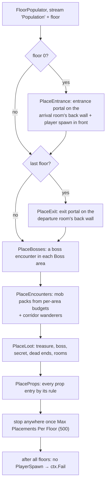
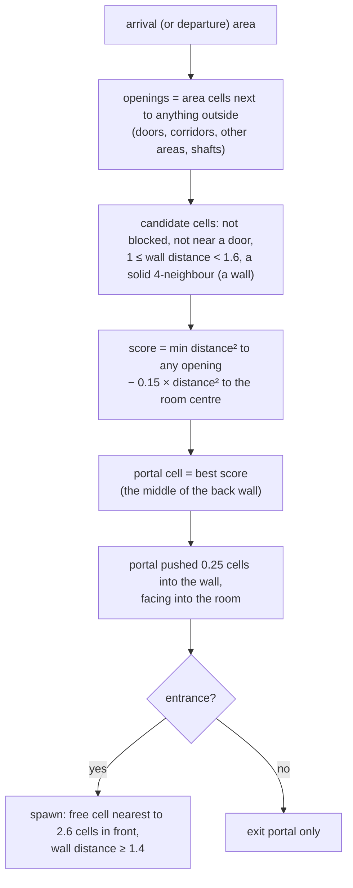
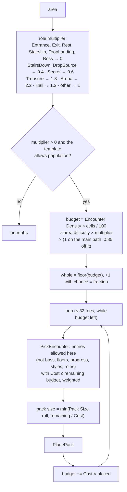
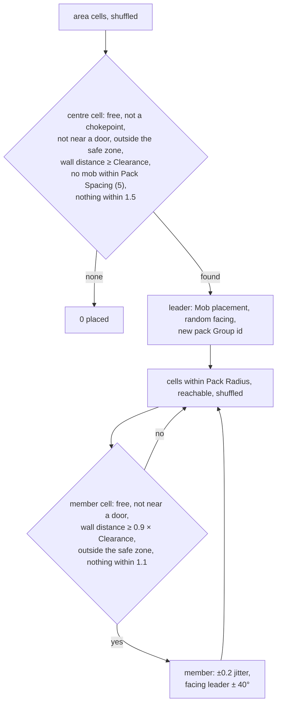
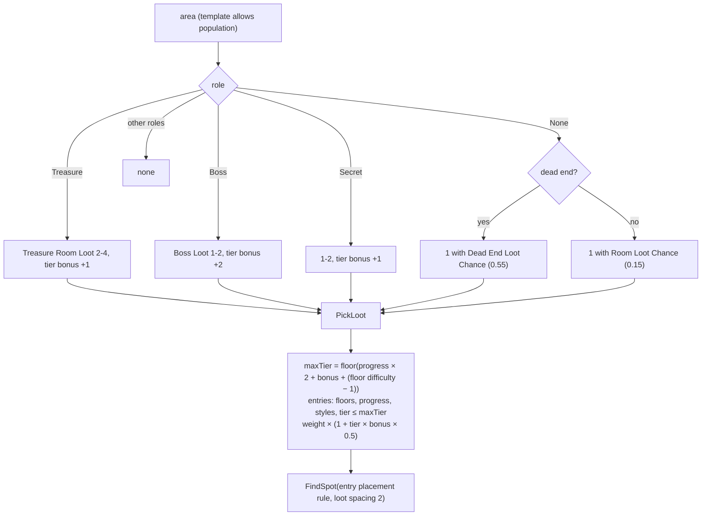
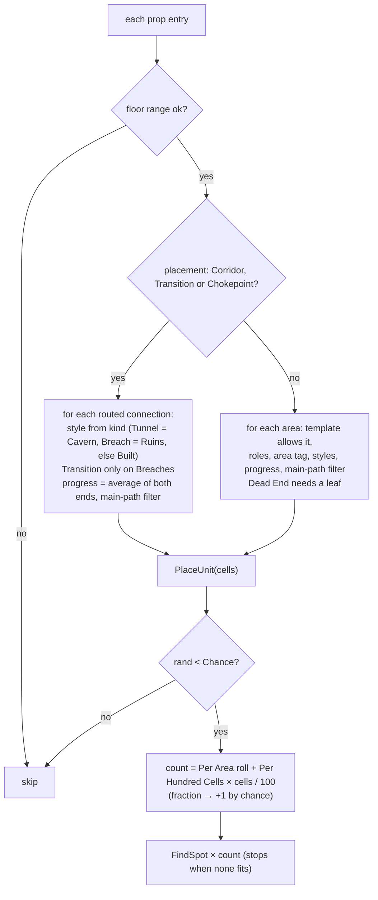

# Dungeon 08 — Population: Portals, Spawn, Mobs, Loot and Props

**Scripts:** `Stages/Population/PopulationStage.cs` (`PopulationStage`, `FloorPopulator`),
`Config/DungeonEncounterTable.cs`, `Config/DungeonLootTable.cs`, `Config/DungeonPropTable.cs`,
`Config/DungeonDefaults.cs`, `Config/SpawnableMobImport.cs`, `Common/SpatialHash2D.cs`.

---

## 1. Concept

Stage 8 decides **what goes where, as data only**. Each decision is a `Placement`: kind, table entry, floor, area,
position (in cells), height, yaw, pack group, scale and tier. The builder creates the objects later, on the main
thread ([09](09-Meshing-and-Build.md)).

Everything is placed from three tables plus built-in placements:

| Source | Placement kinds |
|---|---|
| built-in | `PlayerSpawn`, `EntrancePortal`, `ExitPortal` |
| **Encounter table** | `Mob`, `Boss` |
| **Loot table** | `Loot` |
| **Prop table** | `Interactable`, `PointOfInterest`, `Hazard`, `Decoration`, `Light` |

An empty or missing table falls back to `DungeonDefaults` (primitive chests, torches, crystals, traps and placeholder
mobs), so a fresh profile shows a fully furnished dungeon with no art at all.

## 2. Macro flowchart (per floor, in parallel)

**Order matters.** Portals and the spawn claim their cells first, then bosses, packs, loot and props. Spacing checks
use three `SpatialHash2D` indexes (occupied, mobs, loot), so later items keep clear of earlier ones.

## 3. Portals and the player spawn

The player therefore arrives **in front of the entrance portal, facing into the room**, as far as possible from the
room's exits. The entrance portal leads back to the world, and the exit portal completes the dungeon or goes deeper.

## 4. Encounters — mobs and bosses

### Budget per area (micro)

**Area difficulty** (from [06](06-Roles-and-Templates.md)) = floor difficulty × (0.75 + 0.5 × progress), and floor
difficulty = request difficulty × (1 + 0.2 × floor + 0.25 × depth). Deeper floors, later rooms and harder portals all
get more mobs. The *Cost* of an entry spends more budget on tougher mobs, so fewer of them fit.

### Placing a pack (micro)

**Safe zone:** a cell whose walking distance from the floor's arrival is below *Safe Radius* (16 cells on floor 0, 8
on deeper floors) never gets a mob. Nothing waits at the spawn or at the bottom of the stairs.

**Corridor wanderers:** each routed connection at least 8 cells long has a *Corridor Encounter Chance* (0.12) to get
one mob (cost ≤ 2) somewhere in its middle (not the first or last 2 cells).

**Bosses:** each Boss area gets one boss encounter (entries marked *Boss*), placed on the cell **farthest from the
walls** (the middle of the arena) and facing the floor's arrival.

## 5. Loot

Higher tiers appear **later along the path, in rewarding rooms, and in harder dungeons**. The bonus also tilts the
weights towards high tiers in treasure and boss rooms.

## 6. Props

### FindSpot rules (micro)

| Placement | Cell must be | Position / facing |
|---|---|---|
| **Anywhere**, **Dead End** | wall distance ≥ 1.4, not near a door | ±0.15 jitter, random yaw |
| **Wall Adjacent** | wall distance < 1.6, a solid 4-neighbour, not near a door | pushed 0.3 towards the wall, facing away from it |
| **Corner** | two perpendicular solid neighbours, not near a door | pushed 0.25 into the corner, facing out of it |
| **Center** | wall distance ≥ 2 (sorted: most central first) | random yaw |
| **Corridor** | `Corridor` flag, not near a door | random yaw |
| **Doorway** | next to a door | facing the door |
| **Chokepoint** | `Chokepoint` flag | random yaw |
| **Transition** | `Rubble` flag (where caves meet built structure) | random yaw |

Every spot must also be ≥ *Spacing* from others of the same entry, ≥ *Away From Mobs* from mobs, ≥ 0.9 from any other
placement, and not a door, landing or occupied cell.

### Built-in defaults (`DungeonDefaults`)

| Entry | Kind | Placement | Styles | Per area | Per 100 cells | Spacing | Chance | Roles |
|---|---|---|---|---|---|---|---|---|
| Wall Torch | Light | Wall Adjacent (1.9 m up) | Built, Ruins | 1 | 1.8 | 6 | 1 | — |
| Glow Crystal | Light | Wall Adjacent | Cavern | 0–1 | 1.4 | 7 | 0.9 | — |
| Brazier | Light | Corner | all | 2–4 | 0 | 4 | 1 | Arena, Boss, Entrance |
| Barrel | Decoration | Corner | Built | 0–2 | 0 | 1.5 | 0.55 | — |
| Crate | Decoration | Wall Adjacent | Built, Ruins | 0–2 | 0.3 | 2 | 0.5 | — |
| Bones | Decoration | Anywhere | Cavern, Ruins | 0–1 | 0.7 | 4 | 0.6 | — |
| Mushrooms | Decoration | Wall Adjacent | Cavern | 0–2 | 1.2 | 3 | 0.7 | — |
| Rubble | Decoration | Transition | all | 1–3 | 0 | 1.2 | 1 | — |
| Altar | Point Of Interest | Center | all | 1 | 0 | 2 | 1 | Shrine |
| Fountain | Point Of Interest | Center | all | 1 | 0 | 2 | 1 | Rest |
| Bookshelf | Interactable | Wall Adjacent | Built | 1–3 | 0 | 2 | 0.8 | Secret, Treasure, Shrine |
| Spike Trap | Hazard | Corridor (progress 0.15–1) | Built, Ruins | 1 | 0 | 6 | 0.2 | — |
| Pillar | Decoration | Corner | Built | 4 | 0 | 2 | 0.35 | Arena, Boss |

Default loot: Chest (weight 1, tier 0, wall), Ornate Chest (0.5, tier 1, progress ≥ 0.4), Urn (0.7, tier 0, corner,
built/ruins). Default encounters: Placeholder Mob (cost 1, packs of 1–3), Placeholder Brute (cost 3, progress ≥ 0.3,
tier 1), Placeholder Boss (boss, cost 10, tier 2).

## 7. Tables

| Table | Entry fields |
|---|---|
| **Encounter** (`DungeonEncounterTable`) | Name, Prefab (NavMeshAgent of the profile's agent type), Placeholder, Boss, Weight, Cost, Pack Size, Pack Radius, Min/Max Floor, Progress, Styles, Roles (empty = any area except Entrance, Rest and landings), Clearance, Tier. The inspector's **Import** copies the world's `SpawnableMob` list (prefab, weight, rarity, pack behaviour; biome and height preferences don't apply underground). |
| **Loot** (`DungeonLootTable`) | Name, Prefab, Placeholder, Weight, Tier, Progress, Styles, Placement, Min/Max Floor |
| **Prop** (`DungeonPropTable`) | Name, Kind, Prefab, Placeholder, Placement, Roles, Area Tag, Styles, Main Path (Any / Only / Off), Chance, Per Area, Per Hundred Cells, Spacing, Away From Mobs, Progress, Min/Max Floor, Height Offset, Scale, Light Colour/Range (primitives) |

Profile › Population also has *Default Loot*, *Default Props* and *Placeholder Mobs* (use the built-ins when a table
is missing or a mob has no prefab).

## 8. Example

A Medium room (70 cells) on floor 1 of a difficulty-1 dungeon at progress 0.5, on the main path, role None:

- area difficulty = 1.2 × (0.75 + 0.25) = 1.2;
- budget = 2.2 × 70 / 100 × 1.2 × 1 × 1 = **1.85** → 1, plus 1 more with 85 % chance;
- with the defaults: probably 1 pack of 1–2 Placeholder Mobs (cost 1 each). The Brute (cost 3) doesn't fit a budget
  of 2.

The same room as an **Arena** (×2.2): budget 4.07 → 4 (5 with 7 % chance), e.g. a Brute plus a mob, or 1–3 packs of
small mobs.

## 9. Performance

Linear in cells × entries per floor, with spatial hashes for the spacing tests. Floors run in parallel.
*Max Placements Per Floor* (500) caps the worst case, which matters for the build step as each placement becomes a
GameObject.

## 10. Debugging

Dungeon Preview: **Placements** toggle (dots per placement), hover to read an area's role, progress and difficulty.

| Symptom | Cause | Fix |
|---|---|---|
| Report: "No player spawn could be placed" (retry) | the entrance room is too cramped (all cells near walls/doors) | raise Entrance Size |
| No mobs at all | encounter table empty and *Placeholder Mobs* off; entries' Roles/Styles/Progress exclude everything; Encounter Density 0 | check the table filters |
| Mobs right at the spawn | not possible within Safe Radius; if Safe Radius is small, raise it | Safe Radius |
| Too many mobs deep down | Difficulty Per Floor, depth chain, Arena multiplier | lower Encounter Density or Difficulty Per Floor |
| Loot always tier 0 | progress/difficulty low, higher tiers' Progress ranges exclude early rooms | check tiers and progress ranges |
| Props missing in template rooms | template *Allow Population* off | enable it |
| Torches too dense | Per Hundred Cells high, Spacing low | lower density / raise spacing |
