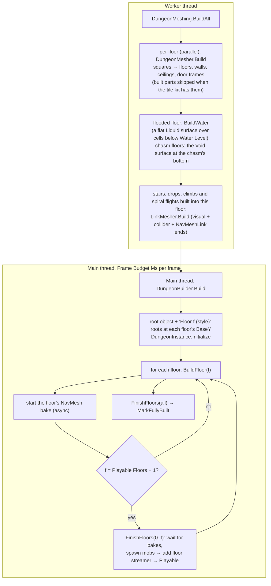
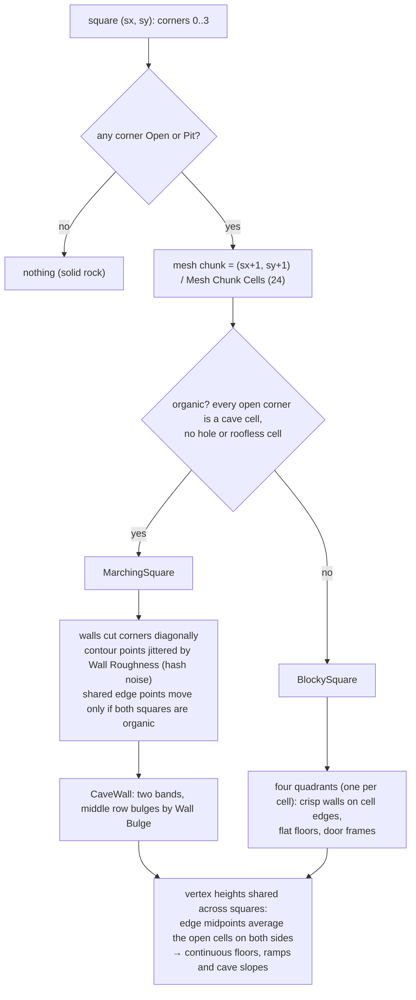
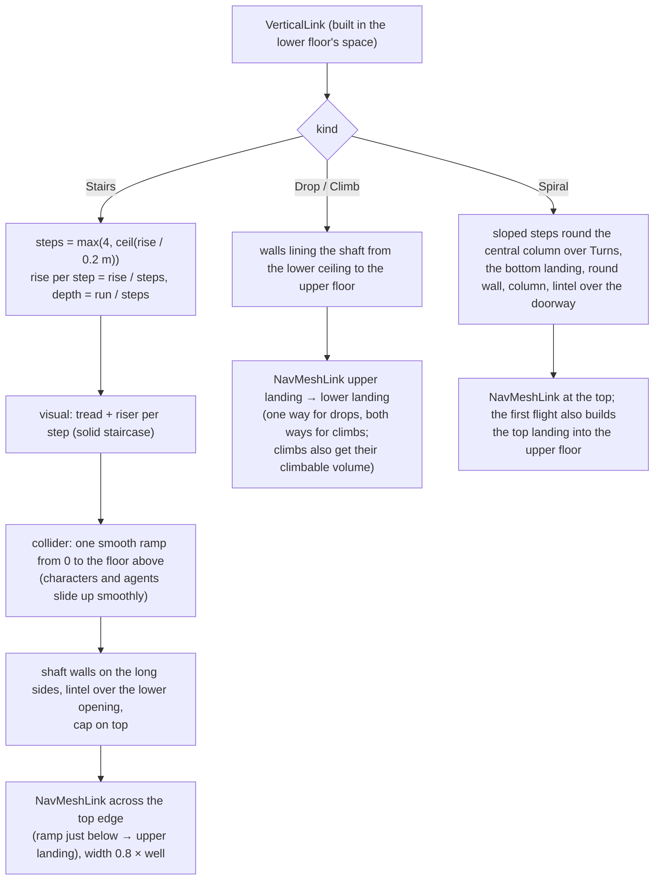
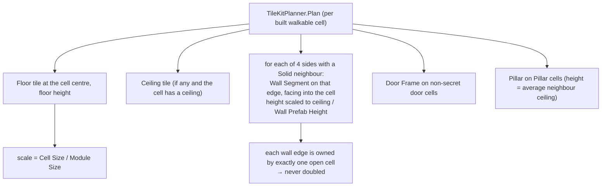
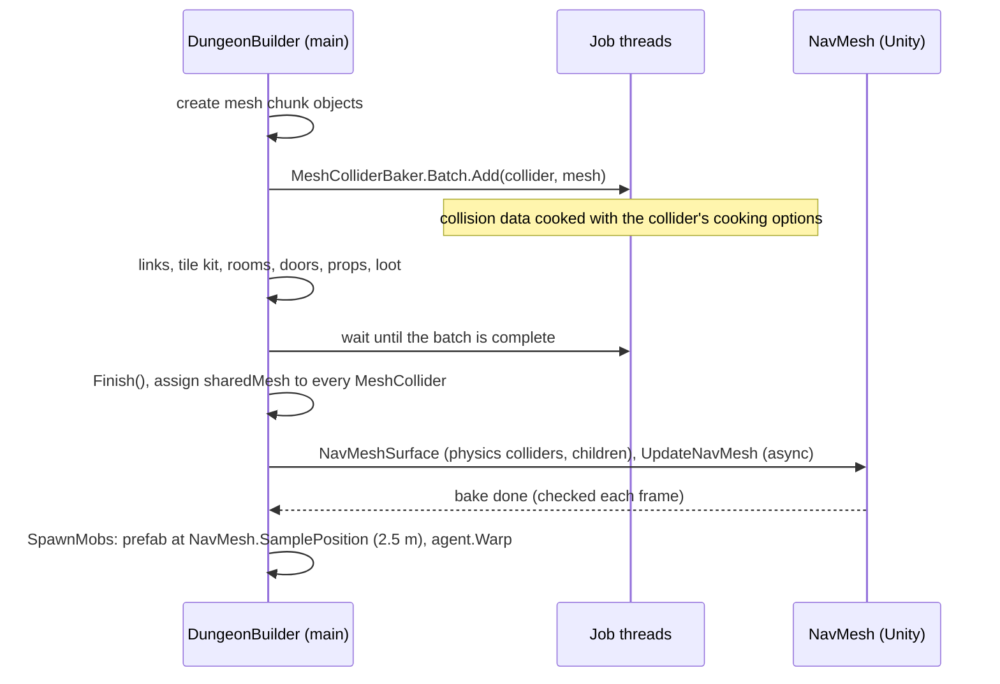

# Dungeon 09 — Meshing and Build

**Scripts:** `Presentation/DungeonMeshing.cs`, `Presentation/DungeonMesher.cs`, `Presentation/LinkMesher.cs`,
`Presentation/MeshBuffers.cs`, `Presentation/TileKitPlanner.cs`, `Build/DungeonBuilder.cs`,
`Build/DungeonMaterials.cs`, `Build/DungeonObjectPool.cs`, `Build/DungeonPrimitives.cs`, `Config/DungeonTheme.cs`,
(shared) `Procedural/World/.../MeshColliderBaker.cs`.

---

## 1. Concept

Turning the finished `DungeonLayout` into a playable scene has two parts:

| Part | Thread | Output |
|---|---|---|
| **Meshing** (`DungeonMeshing.BuildAll`) | the same worker that generated the layout, floors in parallel | `FloorMeshData`: vertex/normal/UV/triangle lists per mesh chunk, plus stair and drop geometry |
| **Building** (`DungeonBuilder.Build`) | main thread, a coroutine limited to *Frame Budget Ms* (6 ms) per frame | GameObjects: meshes, colliders, tile kit, prefab rooms, doors, portals, props, loot, NavMesh, mobs |

The dungeon becomes **playable after the first *Playable Floors* (2)**, while deeper floors keep building behind the
player.

## 2. Macro flowchart

### BuildFloor (micro)

```mermaid
flowchart TD
    A["BuildFloor(f)"] --> B["Geometry: one GameObject per mesh chunk<br/>MeshFilter + MeshRenderer (one submesh per surface)<br/>+ MeshCollider queued for job-thread cooking<br/>+ 'Water' surface on flooded floors (visual only)<br/>+ 'Void' at a chasm's bottom (collider, kept out of the NavMesh)"]
    B --> C["Links built into this floor<br/>(own visual + collider mesh)<br/>+ NavMeshLink (two-way for stairs, spirals and climbs, one-way for drops;<br/>none on a spiral's top landing)<br/>+ climbs: DungeonClimbable trigger + a giant root with vines"]
    C --> D{"theme has a tile kit and Use Tile Kit?"}
    D -- yes --> E["BuildTileKit: floor, wall, ceiling, door-frame,<br/>pillar prefabs from TileKitPlanner (pooled)"]
    D -- no --> F
    E --> F["BuildPrefabRooms: prefab templates at their footprint,<br/>socket children toggled (used / unused)"]
    F --> G["BuildDoors: door leaves (theme) and<br/>secret doors (theme prefab or a stone block + DungeonSecretDoor;<br/>a lever's door can't be searched; registered by cell)"]
    G --> G2["AddFloorMechanics: DungeonChasm (chasm floors),<br/>DungeonGravityShift (astral), DungeonShiftingFloor (shifting walls)"]
    G2 --> H["SpawnPlacement for everything except mobs:<br/>player spawn marker, portals (+ DungeonPortal),<br/>loot, props, keys, gates, locked and shortcut doors,<br/>pressure plates, room events (pooled prefabs or primitives)<br/>dormant placements built inactive"]
    H --> I["wait for this floor's collider cooking,<br/>assign colliders (MeshColliderBaker.Batch.Finish)"]
```

Mobs come **after** the NavMesh bake, because they need a NavMesh to stand on.

## 3. Meshing a floor — the square grid

The mesher walks **squares** whose four corners are four neighbouring cell centres (`sx, sy` from −1 so the outer
walls close). Each corner is classified:

| Corner sample | Cells | Geometry |
|---|---|---|
| **Solid** | rock, out of bounds | wall boundary |
| **Open** | Floor, Door (not prefab) | floor and ceiling |
| **Hole** | stair well, prefab room | nothing — built by `LinkMesher` or the prefab |
| **Pit** | drop opening on the upper floor | no floor, no wall, but a ceiling |

**Why this works:**

- Walls always sit exactly between an open and a solid cell. The mesh is therefore **exactly as walkable as the grid**,
  and diagonal-only contacts never become passages.
- Heights are shared, so a cave floor sloping into a corridor needs no extra geometry, and meshes of neighbouring chunks
  meet seamlessly.
- Organic surfaces **weld** shared vertices (smooth shading). Built surfaces don't (crisp edges).
- UVs are world-aligned (*Texture Scale* metres per repeat), so textures line up across chunks.
- The noise is a position hash (`PlacementRandom.Value(seed, 'mesh', x, y)`), identical across chunks and threads.

**Surfaces / submeshes:** `BuiltFloor`, `BuiltWall`, `BuiltCeiling`, `CaveFloor`, `CaveWall`, `CaveCeiling`, `Trim`
(door frames), `Stairs`, `Liquid` (water). Each gets the theme's material or a flat-colour default (`DungeonMaterials` copies the render
pipeline's default material from a primitive, so it works in Built-in, URP and HDRP).

## 4. Stairs and drops (`LinkMesher`)

Each pair of floors has its own rise (floors are spaced per style), so each flight has its own length. Spiral flights
are sized by the tower planner: enough quarter turns that the steps are never steeper than *Spiral Slope* beside the
column (see [16 §3](16-Towers-Cities-Hives-Chasms.md)).

With the defaults (10 m rise over 11 cells = 16.5 m run) that is 50 steps of 0.2 m rise and 0.33 m depth, a 31°
slope.

## 5. Tile kit (optional)

When the theme has at least a **Floor Tile** and a **Wall Segment** prefab, built areas are assembled from your
modular pieces instead of generated meshes. Caves are always generated.

The mesher skips exactly the built parts the kit provides (floor, wall, ceiling, door frame), so kit and generated
geometry never overlap. Tile-kit pieces bring their own colliders. Set *Cell Size* equal to the kit's *Module Size* to
avoid scaling.

## 6. Colliders, NavMesh and mobs

- **No "missing pre-baked collision" warning and no main-thread cooking.** Colliders are cooked on job threads with
  their own cooking options, then assigned. This is the same mechanism as terrain chunks (see
  [Terrain 11](../Terrain/11-Mesh-and-Collider.md)).
- **NavMesh per floor** is baked from physics colliders (ceilings included, so small unreachable patches can appear on
  ceilings. They are harmless because spawns sample the NavMesh nearest the floor). NavMeshLinks on stairs join floors.
- **Barriers** (gates, vault doors, shortcut doors) get a `NavMeshModifier` (ignored by the bake) and a carving
  `NavMeshObstacle` as soon as they are built, so the floor bakes open and a closed barrier carves its doorway. Gates
  start open with their colliders off.
- **Mobs:** encounter prefabs (with a NavMeshAgent of *NavMesh Agent Type Id*) are instantiated at the nearest NavMesh
  point. Entries without a prefab use a placeholder primitive when *Placeholder Mobs* is on.

## 7. Placements → objects

| Placement | Object |
|---|---|
| PlayerSpawn | empty "Player Spawn" marker |
| EntrancePortal / ExitPortal | theme's portal prefab (pooled) or primitive portal + `DungeonPortal` (entrance: *Return To World*; exit: the manager's *Exit Portal Action*) |
| Loot | entry prefab (pooled) or primitive (chest, barrel…) |
| Props (Interactable, POI, Hazard, Decoration, Light) | entry prefab or primitive (torches and braziers get a `Light` + `DungeonFlicker`; the spike trap gets `DungeonHazard`), scaled |
| Mob / Boss | encounter prefab or placeholder (after the NavMesh); elites scaled by *Elite Scale* |
| Key | theme's Key prefab or primitive key + `DungeonKey` |
| LockedDoor | theme's Locked Door or primitive vault door + `DungeonLockedDoor` (`DungeonBarrier`) |
| Gate | theme's Gate or primitive portcullis + `DungeonGate`, starts open |
| Shortcut | theme's Shortcut Door or primitive door + `DungeonShortcutDoor` |
| Switch | theme's Pressure Plate or primitive plate + `DungeonPressurePlate` |
| RoomController | empty object + `DungeonRoomEvent` (Lock Until Cleared / Ambush / Pit Fight) or `DungeonPuzzle` |
| Teleporter | theme's Teleporter or a rune pad (Entry 0) / magic painting on the wall (Entry 1) + `DungeonTeleporter` |
| MovingPlatform | theme's Moving Platform or a stone deck + `DungeonMovingPlatform` (waypoints from the connection's track, deck level with the ledges), kinematic Rigidbody, kept out of the NavMesh |
| Tripwire | a wire across the corridor + `DungeonTripwire` |
| ArrowLauncher | a dart plate in the wall + `DungeonDartTrap` (Triggered Only, volley 2) |
| ShiftingWall | a stone slab + `DungeonShiftingWall`, starts open |
| Lever | theme's Lever or an iron lever + `DungeonLever` (Open Secret Door / Close Gas Valve) |
| Nest | theme's Nest or an egg mound + `DungeonNest` (hatches the placement's encounter) |
| AreaEffect | "Poison Gas" object + `DungeonGasCloud` (puffs over the room) |
| Mob with an order | Sleep → `DungeonSleeper`, Roam → `DungeonRoamer` ("Roaming …"), Champion → "Champion …" |
| Water (flooded floors) | "Water" mesh object, visual only (no collider) |
| Void (chasm floors) | "Void" mesh object at the chasm's bottom (collider, NavMesh ignore) |

**Dormant** placements (ambush waves, a boss's or puzzle's reward) are built with `SetActive(false)` and revealed by
their room's event. Hazard primitives get their components: spike trap `DungeonHazard` (constant), fire jet
`DungeonHazard` (Cycle, fire), spore vent `DungeonHazard` (Cycle, poison), lava pool `DungeonHazard` (constant, fire),
poisonous plant `DungeonHazard` (constant, poison), blade pendulum `DungeonBladeTrap` and swinging log
`DungeonBladeTrap` (Forward Back, with a shove; both hung from the ceiling height at that cell, like giant roots and
stalactites), dart wall `DungeonDartTrap`. Interactable primitives get `DungeonShrine` (altar), `DungeonRestPoint`
(fountain), `DungeonChest` (chests), `DungeonHerb` (herb patch; rare herbs 60%; pots of stew 25%),
`DungeonGamblingAltar` (blood / cursed altar), `DungeonMapTable` (map table), `DungeonBreakable` (barrels, crates,
wine barrels) and `DungeonSpectators` (stands). The instance gets a `PlaceholderMob` factory so nests can hatch stand-ins. The dungeon root gets `DungeonFloorAtmosphere` (floor modifier
light and fog) next to the floor streamer.

Every spawned object gets a `DungeonSpawned` component (kind, floor, area, tier, group, placement index, entry name),
so gameplay code knows what it is. Pooled prefab instances return to `DungeonObjectPool` on teardown and are reused by
the next dungeon (components implementing `IPooledTerrainObject` get their reset calls).

**Primitives** (`DungeonPrimitives`): chest, barrel, crate, torch, brazier, crystal, altar, pillar, rubble, spike
trap, fountain, bookshelf, bones, mushroom, placeholder mob and boss, both portals, and sarcophagus, table, candles,
weapon rack, armor stand, cage, alchemy table, cauldron, vines, herb patch, throne, banner, statue, pedestal, fire trap,
blade trap, dart trap, lava pool, spore vent, ice spikes, cobweb, key, gate, locked door, pressure plate, and
(`DungeonPrimitivesMore.cs`) lamp post, market stall, cart, well, debris, bed, long table, bench, stove, pots, painting,
planter, rare herb, poison plant, wine rack, wine barrel, map table, blood and cursed altars, nest, egg sac, fungus,
spectators, gold pile, dragon bones, giant root, stalactite, star mote, railing, tripwire, log trap, gas vent, lever,
teleporter pad, moving platform, a stone slab (shifting wall) and the climbing root. They are built from Unity
primitives with one collider each and lights where they glow. The pivot is at the base, facing +z (a lever's at its
plate, a moving platform's at its deck top).

## 8. Configuration (Build settings and theme)

| Setting | Default | Effect | Performance |
|---|---|---|---|
| Frame Budget Ms | 6 | main-thread time per frame while building | higher = faster build, bigger frame spikes |
| Stream Floors / Floors Around | on / 1 | deactivate far floors after building | fewer active objects |
| Bake NavMesh / NavMesh Agent Type Id | on / 0 (Humanoid) | NavMesh per floor + links | bakes run async |
| Geometry Layer | 0 | layer of generated geometry | — |
| Mesh Chunk Cells | 24 (8–64) | cells per mesh chunk side | smaller = more objects, finer culling |
| Build Ceilings | on | generate ceilings | off saves triangles (open-top) |
| Cast Shadows | on | geometry shadows | off is cheaper |
| Use Tile Kit | on | use the theme's kit when present | many kit pieces = many GameObjects |
| Door Frames | on | trim around doors | — |
| Mark Static | on | mark geometry static (editor builds outside Play mode) | — |
| Playable Floors (DungeonManager) | 2 (1–4) | floors finished before *Ready* | lower = faster entry |
| Theme: materials, colours, Texture Scale | flat colours, 3 m | look of generated meshes | — |
| Theme: tile kit (Floor Tile, Wall Segment, Ceiling Tile, Door Frame, Pillar, Module Size 2, Wall Prefab Height 4, Scale Walls To Ceiling) | empty | modular built areas | — |
| Theme: Entrance/Exit Portal, Door, Secret Door prefabs | empty | replace primitives | — |
| Theme: Gate, Locked Door, Shortcut Door, Key, Pressure Plate prefabs | empty | replace the mechanic primitives | — |
| Theme: Teleporter, Moving Platform, Lever, Nest prefabs | empty | replace the newer mechanic primitives | — |
| Theme: Void Material / Void Color | near-black blue | the chasm's bottom | — |
| Theme: Liquid material / colour | translucent teal | flooded floors' water | one extra transparent mesh |
| Heights › Door Height | 3 m | door openings and frame headers; barriers are door height + 0.4 m | — |
| Theme: lights and atmosphere (torch colour/intensity/range, crystal and portal glow, ambient, fog) | warm torches, dark ambient | see [10](10-Runtime-Session-Portals.md) | many long-range lights cost GPU |

## 9. Performance

- Meshing measured ~12 ms per dungeon in the headless harness (plain .NET, see [11](11-Editor-Tools-and-Testing.md)).
- Building is spread across frames by *Frame Budget Ms*. The heaviest parts are mesh uploads, tile-kit instantiation
  (one GameObject per piece) and props.
- Collider cooking is off the main thread. NavMesh baking is asynchronous.
- Only the floors around the player stay active after the build (floor streamer).
- Meshes over 65 000 vertices switch to 32-bit indices automatically. Mesh chunks keep most below that.

## 10. Debugging

| Symptom | Cause | Fix |
|---|---|---|
| Pink / missing materials | theme materials for another render pipeline | use pipeline-matching materials (or clear them for flat colours) |
| Frame hitches while entering | Frame Budget Ms too high; heavy tile kit | lower the budget; fewer, larger kit modules |
| Mobs not spawning | no NavMesh (Bake NavMesh off, agent type mismatch); no prefab and Placeholder Mobs off | match *NavMesh Agent Type Id* with the prefab's agent |
| Mobs can't use stairs | NavMeshLink width/agent mismatch; agent climb/slope settings | check the agent type settings |
| Player slides/stuck on stairs | CharacterController slope limit < stair slope (≈ 31°) | slope limit ≥ 35°, or lower *Max Stair Slope* |
| Doubled walls with a tile kit | a custom kit piece with wrong pivot/facing | wall pivot at the bottom centre of its face, facing +z into the room |
| Visible gaps between kit tiles | Cell Size ≠ Module Size with non-scalable pieces | set Cell Size = Module Size |
