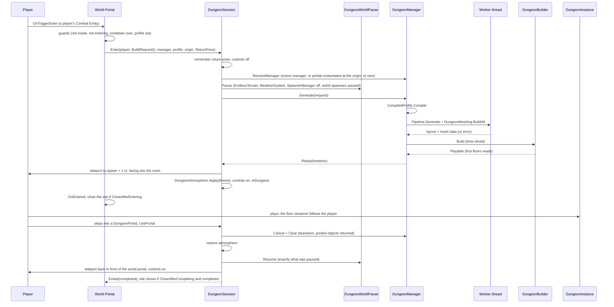
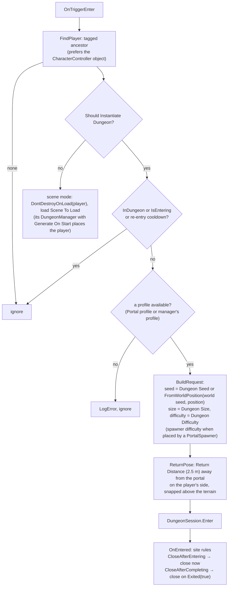
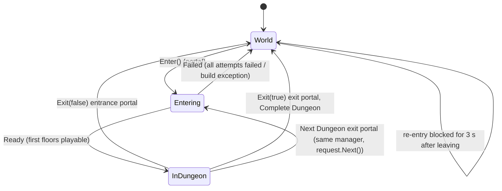
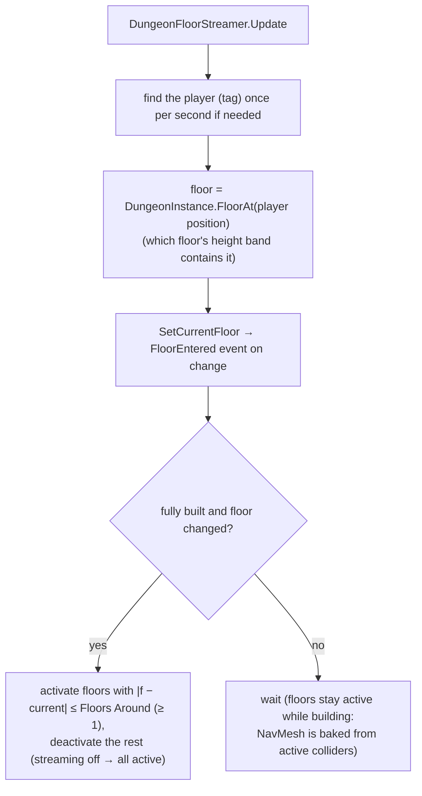
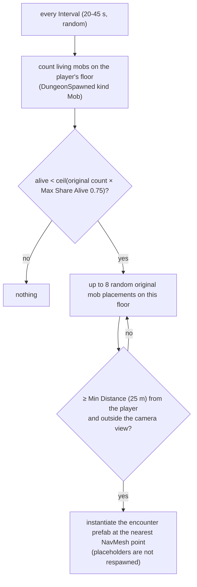

# Dungeon 10 — Runtime: Session, Portals and Gameplay API

**Scripts:** `Essentials/Portal.cs` (world portal), `Runtime/DungeonSession.cs` (`DungeonSession`,
`DungeonWorldPause`, `DungeonAtmosphere`), `Runtime/DungeonManager.cs` (+ `DungeonWorkers`), `Runtime/DungeonPortal.cs`,
`Runtime/DungeonInstance.cs`, `Runtime/DungeonFloorStreamer.cs`, `Runtime/DungeonRespawnDirector.cs`,
`Runtime/DungeonHazard.cs`, `Runtime/DungeonSecretDoor.cs`, `Runtime/DungeonFlicker.cs`, `Runtime/DungeonSpawned.cs`.
Terrain side: `PortalSpawner`, `WorldSpawnRegistry` ([Terrain 15](../Terrain/15-Portals-and-Mobs.md)).

---

## 1. Concept

| Component | Lives on | Job |
|---|---|---|
| **Portal** (world) | a portal prefab in the open world | detects the player, builds a `DungeonRequest`, calls `DungeonSession.Enter` |
| **DungeonSession** (static) | — | moves the player between world and dungeon; pauses/resumes the world; never leaves controls disabled |
| **DungeonManager** | a prefab instantiated at the dungeon origin (or a scene object) | generation on a worker, building on the main thread, events |
| **DungeonInstance** | the built dungeon's root | the gameplay API: spawn, floors, areas, roles, walkability, depth, spawned objects |
| **DungeonPortal** | the entrance/exit portals inside | hands the player back to the session (leave, complete, go deeper) |
| **DungeonFloorStreamer** | dungeon root | keeps only the floors near the player active |
| **DungeonRespawnDirector** | optional, on the manager | brings mobs back over time |
| **DungeonHazard / DungeonSecretDoor / DungeonFlicker / DungeonSpawned** | spawned objects | traps, hidden passages, flame lights, placement info |

## 2. Portal → dungeon → world (full sequence)



### The world portal (`Portal`)



| Portal field | Default | Meaning |
|---|---|---|
| Should Instantiate Dungeon | on | dungeon mode (off = load a scene) |
| Dungeon Manager | — | **recommended**: the manager prefab from *Create Default Setup* (instantiated per visit and destroyed after) |
| Dungeon Profile | — | the kind of dungeon; overrides the manager's profile. One of the two is required |
| Dungeon Origin | (0, −10000, 0) | where the dungeon is built — far below the world |
| Dungeon Seed | 0 | 0 = derived from the world seed + portal position (stable per portal) |
| Dungeon Size | Medium | size class |
| Dungeon Difficulty / Use Spawner Difficulty | 1 / on | difficulty; spawned portals use the spawner's distance-based difficulty |
| Player Tag | Player | **fallback only**: players are recognised by their Combat Entity (any character with a `PlayerStatusController`), so every player of a multiplayer game can enter and the one who entered is sent |
| Bring Party Within | 0 m | party members of the entering player within this distance travel with them (0 = only the player who entered) |
| Return Distance | 2.5 m | where the player comes back (outside the trigger) |
| Despawn Time / random range | 0 | 0 = the portal stays |
| Scene To Load / Position | — | scene mode only |

The portal adds a trigger box around its renderers if it has no trigger collider. The player needs a
CharacterController or a Rigidbody, otherwise trigger events don't fire.

**Several players.** `DungeonSession` keeps the list of players inside (`DungeonSession.Participants`,
`IsParticipant`, `NearestParticipant`): the player who entered and the party members who came with them. They are
placed around the spawn, only participants can use the dungeon's portals, the whole group leaves (or goes deeper)
together and everyone returns around the world portal. Floors with any participant stay active; secret doors open
for any player; respawns keep away from every player; traps hurt every player (see
[Inventory 09 §6](../Inventory/09-Teams-Factions-and-Targeting.md)).

## 3. Entering and leaving (state machine)



What each transition does:

| Transition | Actions |
|---|---|
| **Enter** | remember the return pose (not when switching to the next dungeon), controls off, resolve the manager, pause the world (first entry only), subscribe to Ready/Failed, `Generate` |
| **Ready** | teleport to `PlayerSpawn` + *Spawn Lift* (1 m, the player drops onto the floor), apply the theme atmosphere, controls on, `Entered` event |
| **Failed** | clear (destroy an owned manager), restore atmosphere, resume the world, teleport back, controls on, `Failed` event |
| **Exit** | same as Failed, then the `Exited(completed)` event |

**Controls:** `SetControls` toggles the player's `PlayerMovementController` and `CharacterController`. **Teleport**
disables the CharacterController while moving and calls `Physics.SyncTransforms`.

### World pause

`DungeonWorldPause.Pause` sets `WorldSpawnRegistry.Paused` (no new world portals or mobs; world mobs switched off),
disables every enabled `EndlessTerrain`, `WeatherSystem` and `SpawnerManager`, plus the manager's *Pause While Inside*
behaviours, and hides its *Hide While Inside* objects. `Resume` restores **exactly** what it changed. Without the pause,
`EndlessTerrain` would follow the player's x/z and stream terrain chunks above the dungeon.

### Atmosphere

When the theme has *Apply Atmosphere*: ambient mode Flat with the theme's ambient light, exponential-squared fog with
the theme's colour and density, and every enabled directional light (the sun) switched off. The scene's values are
restored on leaving.

## 4. Floor streaming



## 5. Respawns (optional `DungeonRespawnDirector`)



Reusing the generator's own placements keeps respawns under the same rules: never near the spawn, never in doorways.

## 6. Interactive pieces

| Component | Behaviour | Fields (defaults) |
|---|---|---|
| **DungeonPortal** | on trigger enter by the player (after *Arm Delay*): `DungeonSession.UsePortal` → Return To World / Complete Dungeon / Next Dungeon | action, Player Tag, Arm Delay 1.5 s |
| **DungeonSecretDoor** | a wall block that sinks into the floor when the player stays within *Search Distance* for *Hold Time*, or when `Open()` is called; carves the NavMesh only while closed | Search Distance 1.8 m, Hold Time 1.5 s, Open Speed 1.2 m/s; `Opened` event |
| **DungeonHazard** | while a *Target Tag* collider stays in the trigger: a hit every *Interval* → `onHit` UnityEvent and static `AnyHit(hazard, target, damage)` (your health system applies the damage); spikes pop up | Damage 10, Interval 1 s, Spike Rise 0.25 |
| **DungeonFlicker** | flame-like light intensity | Amount 0.25, Speed 7 |
| **DungeonSpawned** | on every spawned object: kind, floor, area, tier, group, placement index, entry name, `Dungeon`, `Area`; `Destroyed` event | set by the builder |

## 7. Gameplay API (`DungeonInstance`)

| Member | Returns |
|---|---|
| `PlayerSpawn`, `EntrancePortal`, `ExitPortal` | world `Pose`s |
| `FloorCount`, `CurrentFloor`, `FloorEntered` event, `IsFullyBuilt`, `FullyBuilt` event | floor state |
| `FloorRoot(f)` | the floor's transform |
| `CellToWorld(floor, cell[, height])`, `WorldToCell(world, out floor, out cell)`, `FloorAt(world)` | coordinate conversion |
| `IsWalkable(world)`, `TryGetArea(world, out area)` | grid queries |
| `AreasWithRole(role, floor = −1)`, `AreasWithTag(tag, floor = −1)` | e.g. find the boss room |
| `PathDepth(world)` | walking distance (cells) from the entrance along the main path; −1 if unreachable |
| `Spawned(kind)`, `Placements(kind, floor)` | spawned objects / planned placements |
| `Layout`, `Profile`, `Seed`, `Manager` | raw data |

`DungeonManager` events: `Ready` (first floors playable), `Completed` (every floor built), `Failed(message)`,
`Cleared`. Also `Progress` (0–1), `Status`, `LastReport`, `Generate(request)`, `GenerateImmediate(request)` (editor
and tests: synchronous, no frame budget), `Cancel()` and `Clear()`. `DungeonSession` events: `Entered`, `Exited(bool
completed)` and `Failed`.

```csharp
// Example: react when the boss dies. Deeper floors (and their mobs) may still be building when the player
// enters, so hook the boss once the dungeon is fully built.
DungeonSession.Entered += dungeon =>
{
    void Hook(DungeonInstance d)
    {
        foreach (DungeonSpawned s in d.Spawned(PlacementKind.Boss))
            s.Destroyed += _ => Debug.Log($"Boss of floor {s.floor} defeated");
    }
    if (dungeon.IsFullyBuilt) Hook(dungeon);
    else dungeon.FullyBuilt += Hook;
};
```

## 8. Performance

At runtime the session is event-driven and costs nothing. The floor streamer does a floor lookup per frame. The
respawn director does a tag lookup when needed and a count per interval. The main costs are generation (worker) and
building (time-sliced) — see [09](09-Meshing-and-Build.md).

## 9. Debugging

| Symptom | Cause | Fix |
|---|---|---|
| Walking into the portal does nothing | no trigger collider (auto-added only if the portal has none); player not tagged; no CharacterController/Rigidbody; inside the 3 s cooldown; no profile | **Tools › SimpleMovements › Dungeon › Validate Portal Setup**; Portal inspector status box |
| "no dungeon to build" error | neither a Dungeon Manager with a profile nor a Dungeon Profile on the portal | assign one |
| Player stuck frozen | should not happen (every path re-enables controls); a custom controller not covered by `SetControls` | toggle your controller on `DungeonSession.Entered/Exited/Failed` |
| Terrain appears inside the dungeon | the dungeon origin is inside the world | keep Dungeon Origin far below the lowest terrain (default y = −10000) |
| World mobs attack while inside | world spawner not registered with `WorldSpawnRegistry` | use the package spawners, or list them in *Pause While Inside* |
| Sun lights the dungeon | *Apply Atmosphere* off | enable it in the theme |
| Sent straight back through the portal | arriving inside the trigger | Return Distance and Arm Delay handle this; raise them |
| Mobs never come back | no respawn director, or placeholders (never respawned) | add `DungeonRespawnDirector` to the manager and use prefabs |
