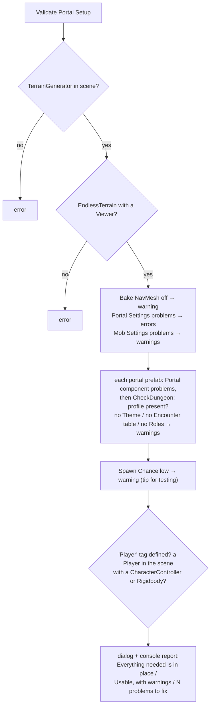
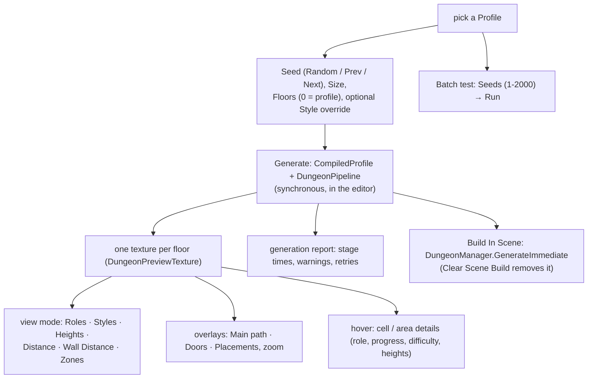

# Dungeon 11 — Editor Tools and Testing

**Scripts:** `Editor/DungeonPreviewWindow.cs`, `Editor/DungeonPreviewTexture.cs`, `Editor/DungeonSetupMenu.cs`,
`Editor/PortalSetupMenu.cs`, `Editor/PortalEditor.cs`, `Editor/DungeonInspectors.cs`, `Editor/RangeDrawers.cs`,
`Editor/Tests/DungeonGenerationTests.cs`.

---

## 1. Setup menus

| Menu | What it does |
|---|---|
| **Tools › SimpleMovements › Dungeon › Create Default Setup…** | asks for a folder and creates: `DungeonTheme`, `DungeonLoot` (default loot copied in), `DungeonProps` (the built-in prop set), `DungeonEncounters` (empty — fill it or *Import* world mobs), `Template_PillaredHall` (Shape Mask example), `Template_LegacyRoom` (legacy RoomBehaviour example), `DungeonProfile` wired to all of them, a **Dungeon Manager prefab**, and a **World Portal prefab** pointing at that manager |
| **… › Add Dungeon Manager To Scene** | a DungeonManager object in the open scene (for testing without portals) |
| **… › Open Preview** | opens the Dungeon Preview window |
| **… › Create World Portal Prefab…** | builds a ready portal prefab (stone frame, glowing surface, light, trigger box, `Portal` wired to a Dungeon Manager prefab) with its two materials, and offers to add it to the scene's `EndlessTerrain` portal list |
| **… › Validate Portal Setup** | checks the whole terrain → portal → dungeon chain of the open scene (below) |

### Validate Portal Setup

## 2. Dungeon Preview window

**Window › SimpleMovements › Dungeon Preview** (or *Open Preview* on a profile): generates dungeons **without entering
Play mode** and shows each floor from above.

| View | Shows |
|---|---|
| Roles | area roles (entrance, exit, boss, treasure, rest…) |
| Styles | Built / Cavern / Ruins |
| Heights | floor heights (cave relief, ramps) |
| Distance | walking distance from the floor's arrival |
| Wall Distance | distance to the nearest wall (open spaces bright) |
| Zones | hybrid zones |

**Batch test** generates many seeds and reports: success count and retries (attempts per dungeon), average and max
time (single thread), floors per dungeon, areas per floor, loops per floor, dead-end share, main-path length,
placements, the style mix, and the first 10 failures with their reasons. Use it after changing a profile to see
whether generation stays reliable.

## 3. Inspectors

| Inspector | Adds |
|---|---|
| **DungeonProfile** | what is required, what is optional and what the profile falls back to; Open Preview |
| **DungeonEncounterTable** | **Import** button: copies a world `SpawnableMob` list (prefab, weight, rarity, packs) through serialization |
| **DungeonManager** | how it is used by portals, and in Play mode its status, progress and test buttons (generate, clear) |
| **Portal** (`PortalEditor`) | a status box listing what is missing, and a button to add the trigger collider |
| Range fields (`RangeDrawers`) | compact min–max drawing of `FloatRange` / `IntRange` |

The terrain's `EndlessTerrain` inspector also has *Add Portal Prefab* and recommended portal settings (see
[Terrain 17](../Terrain/17-Editor-Tools.md)).

## 4. Automated tests

`Editor/Tests/DungeonGenerationTests.cs` (Edit Mode, **Window › General › Test Runner**). They compile only when the
Unity Test Framework is installed (`UNITY_INCLUDE_TESTS`).

| Test | Checks |
|---|---|
| `EveryStyleProducesTraversableDungeons` | every style × 8 seeds × sizes: every area reachable from its floor's arrival, departure reachable, link landings walkable |
| `MixedDungeonsHaveEntranceExitBossAndSpawn` | 15 mixed dungeons: spawn and portals valid, main path from floor 0 to the last floor, exactly one boss room |
| `SameSeedSameDungeon` | two generations of the same Large request have identical fingerprints |
| `MeshesAreBuilt` | mesh data for every floor, every link meshed on its lower floor |

## 5. Verification done during development

The dungeon system was developed outside Unity. Every file compiles against the Unity 2021.3 reference assemblies
(editor and player). The generation, analysis, population and meshing code was then run headless (a UnityEngine math
shim under .NET 8). The package's `Procedural/Dungeon/README.md` records the results:

| Check | Result |
|---|---|
| 60 seeds × each style + 60 mixed (360) + 48 stress cases (9-floor huge, 12-floor deep, 1-floor, legacy-prefab mazes, role templates) | all 408 valid; the 360 regular ones on the first attempt |
| Independent invariants (every area reachable, doors framed, slopes walkable, ceilings ≥ 2.4 m, corridors open only into their two areas, shafts sealed except at landings, landings walkable, one boss, no mobs in the safe zone, main path spans all floors) | 0 violations |
| Determinism (sequential, repeated, parallel on worker threads) | identical |
| Mesh watertightness: 213,994 random rays from inside every area | 0 escaped; 5 hit a back face (hairline pinch points where two corridors touch only diagonally) |
| Tile kit | one wall per edge (1,180 of 1,180), no duplicates |
| Timing (headless, one thread) | generation typically 50–150 ms per dungeon; meshing ~12 ms |

**Not verifiable outside Unity — check in the editor:** how materials look in your render pipeline; NavMesh baking and
NavMeshLink behaviour on stairs with your agent settings; your CharacterController on the stair ramps; mob prefabs
spawning on the NavMesh; frame-time spikes on your hardware (tune *Frame Budget Ms* and *Mesh Chunk Cells*).

The package also ships two reference images in `Procedural/Dungeon/Docs~/` (`sample_floors.png`, `sample_3d.png`).
The `~` suffix makes Unity ignore the folder.

## 6. Tuning workflow

1. *Create Default Setup*, open the profile, press **Open Preview**.
2. Generate a few seeds per size. Check the Roles and Styles views.
3. Adjust one group at a time (rooms, caves, connections, roles, population).
4. Run a **Batch test** (100+ seeds). Aim for no failures and ~1.0 attempts per dungeon.
5. **Build In Scene** to look at geometry, materials and the tile kit.
6. Play through a world portal. Watch *Generation Stats* ("Dungeon: …" rows) and the Profiler.
