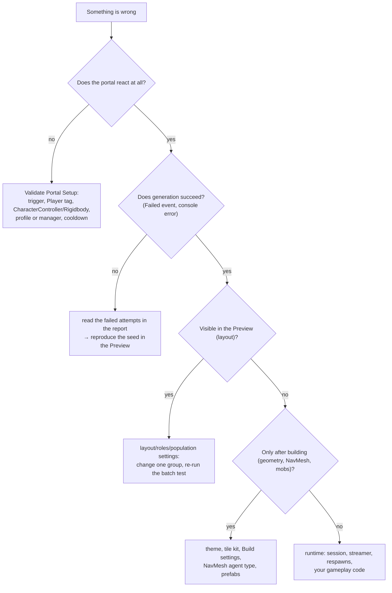

# Dungeon 13 — Debugging Guide

## 1. Tools to reach for first

| Tool | Where | Shows |
|---|---|---|
| **Dungeon Preview** | Window › SimpleMovements › Dungeon Preview | every floor from above (roles, styles, heights, distance, wall distance, zones), main path, doors, placements, report — no Play mode |
| **Batch test** | Dungeon Preview | success rate, retries, timings, areas, loops, dead ends over many seeds; the first failures with reasons |
| **Build In Scene** | Dungeon Preview | the real geometry in the editor |
| **Validate Portal Setup** | Tools › SimpleMovements › Dungeon | the terrain → portal → dungeon chain |
| **Portal / DungeonManager inspectors** | Inspector | what is missing; status, progress and test buttons in Play mode |
| **Generation report** | Profile › Validation › Log Report, or `DungeonManager.LastReport` | per-stage ms, warnings, failed attempts |
| **Generation Stats** | Window › SimpleMovements › Generation Stats | "Dungeon: <stage>" timings, "Dungeons generated" |
| **Unity Profiler** | Window › Analysis | "Dungeon Worker" threads, the builder's main-thread frames |
| **Edit Mode tests** | Test Runner | traversability, bosses, determinism, meshes |

## 2. How to isolate a problem

**Reproducing a dungeon:** every dungeon is fully determined by (request seed, size, difficulty, depth, floor count,
style override) and the profile. Read the seed from `DungeonInstance.Seed`, or tick *Log Report*: the first line reads
"Dungeon seed N (attempt k, seed M) …". The root object is named "Dungeon N" only when the request has no label
(portals label it "Dungeon (portal name)"). Enter the seed in the Preview with the same size and difficulty.

## 3. Problem catalogue

| Problem | Symptoms | Likely causes | What to inspect | Fix |
|---|---|---|---|---|
| **Portal does nothing** | walking in has no effect | no trigger collider; player not tagged; no CharacterController/Rigidbody; within 3 s of leaving; no profile | Portal inspector status box, Validate Portal Setup | fix the reported item |
| **"no dungeon to build"** | console error on entering | neither a manager with a profile nor a portal profile | Portal fields | assign one |
| **Generation fails** | player returned, `Failed` event, error with reasons | every attempt failed: tiny floors for the anchors, a required role with impossible limits, blocked landings | report › Failed Attempts | see §4 |
| **Long wait before entering** | seconds of loading | Huge sizes, many floors, Playable Floors high, low Frame Budget | report timings, Generation Stats | smaller sizes, Playable Floors 1–2 |
| **Frame hitches while inside** | stutter right after entering | deeper floors still building; Frame Budget high; many tile-kit pieces or props | Profiler (main thread) | lower Frame Budget, Max Placements, kit piece count |
| **Unreachable room** | a room with no way in | should not happen (validated); a custom stage changed the grid after validation, or a prefab template without matching sockets | Preview Distance view | put custom stages before *AfterValidation*, check prefab sockets |
| **Player falls through the floor** | falls on arrival | colliders not assigned yet (custom code teleporting early); spawn inside a prefab room without colliders | `DungeonSession.Entered` timing, prefab colliders | teleport only on Ready; give prefab rooms colliders |
| **Player stuck on stairs** | can't climb | CharacterController slope limit below the stair slope (~31°) or step offset too small | controller settings | slope limit ≥ 35° or lower *Max Stair Slope* |
| **Cave slopes too steep** | sliding | controller slope limit < 28° | controller | raise it; or lower Floor Height Amplitude |
| **Mobs don't spawn** | empty dungeon | no encounter prefabs and Placeholder Mobs off; Bake NavMesh off; agent type mismatch; table filters exclude every area | table entries, Build › NavMesh Agent Type Id | fix filters, match agent types |
| **Mobs don't move / can't take stairs** | stand still | NavMeshAgent missing or of another agent type; NavMeshLink width | agent settings | match the agent type |
| **Mobs at the spawn** | attacked immediately | Safe Radius small; a custom spawner | Population › Safe Radius | raise Safe Radius |
| **No boss** | — | Boss rule removed or not Required; no Boss encounter entry (a boss room exists but stays empty) | Roles list, encounter table *Boss* flag | add a Boss entry |
| **Too dark / too bright** | — | theme atmosphere; torch density | Theme › Ambient, Fog; prop table | adjust |
| **Pink materials** | magenta surfaces | theme materials from another render pipeline | Theme materials | pipeline-matching materials or none (flat colours) |
| **Tile kit misaligned** | gaps, doubled or rotated walls | pivots/facing wrong; Cell Size ≠ Module Size | Theme tile-kit notes | follow the pivot rules in the tooltips |
| **Terrain visible in the dungeon** | hills through the ceiling | Dungeon Origin inside the world | Portal › Dungeon Origin | keep it at y = −10000 or lower |
| **World keeps streaming / weather inside** | chunks load above | world pause missed a custom component | DungeonManager › Pause While Inside | list your component |
| **Same dungeon from different portals** | — | same 8 m cell; forced Dungeon Seed | portal positions/seed | move the portal or change the seed |
| **Different dungeon from the same portal** | — | the portal's position changed; world seed changed; request seed 0 | Portal seed and position | set Dungeon Seed or keep positions stable |
| **Next Dungeon never ends** | endless chain | Exit Portal Action = Next Dungeon | DungeonManager | expected; use Complete Dungeon to finish |

## 4. Reading generation failures

| Report message | Stage | Meaning | Fix |
|---|---|---|---|
| "No room for the entrance." / "No room for the exit." | MacroPlan | footprint too small for Entrance/Exit Size + margins | smaller rooms, larger size class |
| "No room for stairs between floors a and b." | MacroPlan | overlapping footprint too small for the well + landings | lower Footprint Variation / Edge Margin / Landing Size |
| "Floor N: the arrival cell lost its area." / "… lost its landing areas." | Layout | a (custom) strategy overwrote anchor cells | don't touch Fixed areas or Reserved cells |
| "Required role 'X' has no suitable area on floor N." | Roles | nothing fits even after relaxing | lower Min Cells, check floors |
| "The exit can't be reached from the entrance." | Roles | the cross-floor graph is broken (e.g. a custom stage removed connections) | — |
| "Floor N: <area> can't be reached …" | Validate | repairs disabled or exhausted | enable repairs / raise the limit |
| "<link> has a blocked landing." | Validate | a landing cell is not walkable | check custom stages / templates near landings |
| "The entrance room is too small." / "The exit room is too small." | Validate | < 9 cells | raise Entrance/Exit Size |
| "No player spawn could be placed." | Population | entrance room too cramped | raise Entrance Size |

Warnings (not failures): "could not route …" (a connection; reachability is still validated), "repaired access to …",
"template '…' doesn't fit …", "Floor spacing … is tight …", template parse errors.

## 5. Resetting state

| Situation | Do |
|---|---|
| Changed the profile in Play mode | the next `Generate` compiles it again (no cache to clear) |
| Stuck inside after an error | `DungeonSession.Exit(false)` restores everything |
| Clear a built dungeon | `DungeonManager.Clear()` (pooled objects are returned) |
| Preview shows old results | press Generate again (the preview compiles the profile each time) |
