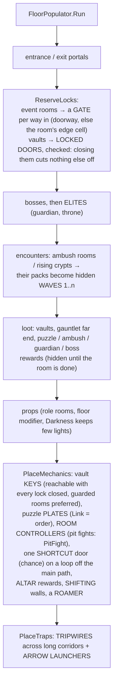

# Dungeon 15 — Dungeon Types, Special Rooms, Mechanics and Floor Modifiers

**Scripts:** `Config/DungeonTypes.cs`, `Config/DungeonProfile.cs` (`DefaultRoles`, `SpecialRoomRules`),
`Config/DungeonSettings.cs` (`RoomEventSettings`, `FloorModifierSettings`), `Config/DungeonDefaults.cs`,
`Stages/Planning/MacroPlanStage.cs` (floor modifiers), `Stages/Population/PopulationStage.cs` +
`PopulationFeatures.cs`, `Build/DungeonBuilder.cs`, `Build/DungeonPrimitives.cs`, and the runtime components
`DungeonRoomEvent`, `DungeonGate`, `DungeonLockedDoor`, `DungeonKey`, `DungeonShortcutDoor`, `DungeonBarrier`,
`DungeonPuzzle`, `DungeonPressurePlate`, `DungeonHazard`, `DungeonBladeTrap`, `DungeonDartTrap`, `DungeonInteractable`,
`DungeonRestPoint`, `DungeonShrine`, `DungeonChest`, `DungeonHerb`, `DungeonFloorAtmosphere`, `DungeonGameplay.cs`
(`DungeonMessages`, `DungeonKeyRing`, `DungeonRunStats`, `DungeonPlayers`), and for the newer rooms
`Stages/Population/PopulationRooms.cs`, `Build/DungeonPrimitivesMore.cs`, `DungeonNest`, `DungeonGamblingAltar`,
`DungeonBreakable`, `DungeonLever`, `DungeonGasCloud`, `DungeonMapTable`, `DungeonMapOverlay`, `DungeonSleeper`,
`DungeonRoamer`, `DungeonTripwire`, `DungeonShiftingWall`, `DungeonShiftingFloor`, `DungeonSpectators`,
`DungeonTeleporter`. The floor styles behind the newer types are in [16](16-Towers-Cities-Hives-Chasms.md).

---

## 1. Concept

Three layers of variety sit on top of the generator:

| Layer | Chosen | What it changes |
|---|---|---|
| **Dungeon type** | per profile (or per portal, from a list) | the whole dungeon: floor styles, room shapes, ceilings, which special rooms, mechanics, floor modifiers, colours |
| **Floor modifier** | rolled per floor | one floor: flooded, molten, overgrown, dark or frozen (light, props, hazards) |
| **Special room** | role rules, per floor | one area: guardian, vault, trap gauntlet, puzzle, ambush, library, armory, prison, crypt, laboratory, garden, throne, nest, cursed altars, kitchen, gallery, barracks, pit fight, greenhouse, wine cellar, map room, gas chamber |
| **Floor mechanic** | per floor | a roaming mini-boss, shifting walls, tripwires in long corridors, swinging logs, chasm falls, gravity flips |

Every mechanic is decided as **data** on the worker thread (placements with `Dormant`, `Wave`, `Elite`, `Link`), and
brought to life by small runtime components the builder adds. Nothing ever blocks progress: every permanent lock is
checked so it cannot cut any other part of a floor off, and room fights reopen if the players leave.

## 2. Dungeon types

Pick one in the profile inspector (**Dungeon Type ▸ Apply**), or create a complete setup with
*Tools ▸ SimpleMovements ▸ Dungeon ▸ Create Dungeon Type ▸ …* (profile, theme with matching colours, prop / loot /
encounter tables, templates, a Dungeon Manager prefab and a world portal). From code: `DungeonTypes.Apply(profile,
type)` and `DungeonTypes.ApplyTheme(theme, type)`.

| Type | Floor styles | Ceilings | Floor modifiers | Special rooms favoured |
|---|---|---|---|---|
| Classic | every style | Standard | 30% (any) | all |
| Crypt | Catacombs, BSP, some Rooms / Citadel / Maze | Standard | 45%, mostly Darkness | crypts (1–2 per floor, the dead rise 70%), libraries, puzzles, secrets |
| Deep Caves | Caverns, Hybrid | Tall, caves up to 15 m | 60% from floor 0 (flooded, overgrown, molten, frozen) | gardens, ambushes; more drops |
| Fortress | BSP, Citadel, Rooms | Tall, pillared and octagonal halls | 15% | armories, prisons, guardians, throne, arenas |
| Labyrinth | Grid Maze, Catacombs | Standard | 25% | trap gauntlets, puzzles, vaults, many treasures; few loops, many dead ends |
| Sunken Temple | Hybrid, Rooms, Caverns, Citadel | Tall, apses and cloisters | 75%, mostly Flooded | shrines, libraries, puzzles, vaults |
| Volcanic Forge | Caverns, Hybrid, BSP | Tall | 70%, Molten | armories, laboratories, trap gauntlets, guardians |
| Cathedral | Rooms, Citadel | Cathedral (vaults 90%) | 15% | shrines, crypts, libraries, throne |
| Prison | BSP, Grid Maze | Standard | 35%, mostly Darkness | prisons (1–3 per floor), ambushes, guardians, vaults |
| Frozen Depths | Caverns, Hybrid | Tall | 80%, Frozen | ambushes, shrines |
| Overgrown Ruins | Hybrid (heavy ruins), Rooms | Standard | 70%, Overgrown (giant roots) | gardens, greenhouses, shrines, libraries; climbing vines between floors (Climb Chance 0.45) |
| Tower | Tower only (one spiral staircase) | Standard | 15% | barracks, kitchens, libraries, map rooms, armories, a throne |
| Undercity | Undercity, a little Caverns / Catacombs / Rooms | Tall | 30%, mostly Darkness | kitchens, wine cellars, galleries, cursed altars, barracks, map rooms, pit fights; roamers 55% |
| Fungal Hive | Hive, Caverns | Standard | 70% from floor 0, Overgrown | nests (1–2), gas chambers, greenhouses, ambushes; more drops |
| Chasm Islands | Islands, Caverns | Tall | 35% | shrines, cursed altars, nests; falls drop a floor |
| Dragon's Den | Caverns, Hybrid, a few Islands; **last floor a Den** | Tall, caves up to 15 m | 45%, mostly Molten | treasures, guardians, nests |
| Astral Void | Astral, Islands | Tall | 20%, Darkness / Frozen | shrines, cursed altars, puzzles, map rooms |

The classic types also gained the newer rooms where they fit (fortress barracks, kitchens, map rooms and pit fights;
prison barracks and gas chambers; cathedral galleries; labyrinth map rooms, gas chambers, more tripwires and shifting
walls…) and drop the ones that don't. The newer floor styles appear only in Classic and in the types built on them.

Applying a type replaces styles, openness, complexity, rooms, caves, hybrid, citadel, catacombs, tower, undercity, hive,
islands, den, astral, the last floor's style, connections, links, heights, mechanics, floor modifiers and roles.
Tables, the theme reference, build and validation settings are kept.

**Several types from one portal:** a world `Portal` has **Random Profiles**. When the list has profiles, the portal
leads to one of them, picked from its dungeon seed — the same portal always leads to the same type, different portals
to different types.

## 3. Special rooms

The role rules (`DungeonProfile.SpecialRoomRules`, part of **Default Roles**; **Add Special Rooms** appends the ones a
profile lacks) give areas these roles. Each is optional, with a chance per floor.

| Room | Rule (default) | What is in it | Mechanic |
|---|---|---|---|
| **Guardian** (`MiniBoss`) | 40%, on the main path, progress 0.35–0.9, large, 8 m ceiling | the toughest ordinary mob as an **elite** (×1.3 size, tier +1) + guards | gates lock until they're dead; reward appears |
| **Vault** | 35%, a dead end, built / ruins | 3–5 loot, tier +2; pedestals, statues | **locked door**; its **key** lies elsewhere on the floor, preferably guarded |
| **Trap Gauntlet** (`TrapRoom`) | 35%, off the main path | spike floors, fire jets, blade pendulums, dart walls (cycling, out of step) | reward (1–2, tier +1) at the far end |
| **Puzzle** | 30%, off the main path, 6 m ceiling | 3–4 pressure plates, statues | plates light up in an order; step on them in that order to reveal the reward |
| **Ambush** | 30%, on the main path | looks empty | doors lock on entry, mobs appear in 2–3 waves; reward after |
| **Library** | 30%, 7 m ceiling | shelves, reading tables, candles, cobwebs | 50%: a loot item |
| **Armory** | 30% | weapon racks, armor stands, crates, banners | 1–2 loot |
| **Prison** | 25%, off the main path | cages with remains, tables | more mobs; 50%: a loot item |
| **Crypt** | 30%, 6 m vaulted | sarcophagi, candles, remains, cobwebs | 50% (Mechanics › Crypt Ambush Chance): the dead rise — hidden waves and locked doors |
| **Laboratory** | 20%, built | alchemy tables, a glowing cauldron | 1 loot |
| **Garden** | 25%, caverns / ruins | overgrowth, mushrooms, **healing herbs** | herbs heal 35% once |
| **Throne** | 30%, from floor 1, once per dungeon, 10 m vaulted | a throne against the back wall, banners, armor stands, statues, braziers | an elite and guards, gates lock (like Guardian) |
| **Nest** | 25%, progress 0.3–1, 6 m ceiling | egg sacs, gnawed bones; 1–2 **nests** | each nest hatches the cheapest mob allowed there (up to 3 alive, one every 7 s) while players are within 16 m, until it is destroyed (weapons, or stomping on it) |
| **Cursed Altars** (`Gambling`) | 25%, off the main path, built / ruins, 6.5 m vaulted | a **blood altar** against the back wall, often a **cursed altar**, red candles | blood: pay 30% health; cursed: take a curse (4 min: weaker defences, slower attacks, clumsiness or dimwittedness); either reveals the hidden reward beside it |
| **Kitchen** | 25%, built / ruins | long tables, benches, a stove, **pots of stew**, barrels | the stew heals 25% once per pot |
| **Gallery** | 20%, off the main path, built, 6.5 m | paintings, statues, a bench; sometimes a **magic painting** | a painting that leads to a pocket room (a portal connection; see 16 §6) |
| **Barracks** | 30%, built / ruins | bunks, a weapon rack | 80% of its soldiers are **asleep**: sneak past crouched; they wake when a player comes within 5 m (1.6 m crouched), hurts one, or a sleeper within 6 m wakes |
| **Pit Fight** (`Colosseum`) | 25%, on the main path, once per dungeon, large, 10 m | **spectators** in stands, braziers, banners | gates close, 3–4 waves come out at the gates, the **champion** (the toughest mob allowed, ×1.45, tier +2) comes with the last; the crowd cheers; reward after |
| **Greenhouse** | 20%, off the main path, 7 m vaulted | planters, **rare herbs** (heal 60%), **poisonous plants** (poison when touched), vines | |
| **Wine Cellar** | 25%, built / ruins, prefers a room with a dead end beside it | wine racks, **wine barrels** that break | a **hidden lever** opens the secret door to the dead end beside it (made a secret room; the door can't be found by searching); one barrel hides a stash |
| **Map Room** | 30%, progress 0–0.6, small | a carved **map table**, chart shelves, candles | studying the table reveals the floor's map (shown again with the Map key) |
| **Gas Chamber** | 25%, off the main path | gas vents, bones; a **valve** lever at the far end | the room floods with poison gas (7 s on, 6 s clear, a hiss before); the valve stops it for good |

The classic roles gained mechanics too: the **Boss** room locks until the boss dies (and its loot appears then),
**Arenas** lock until cleared, **Rest** fountains heal / revive / set a checkpoint, **Shrine** altars bless.

Special rooms are furnished by the prop table's entries with that role. When the table has nothing for a role (or a
floor modifier), the built-in props are added (**Population › Fill Missing Role Props**, on by default), so new rooms are
never empty. The prop table inspector's **Add Missing Built-in Props** copies them into the table so you can assign
your own prefabs.

## 4. Mechanics — generation

The newer rooms add steps around this: **ReserveCrossings** (before the bosses) puts teleport pads, magic paintings and
moving platforms on their connections; **pit fights** turn their packs into waves standing at the gates and add the
champion; **barracks** put most soldiers to sleep; **PlaceRoomFixtures** (after the loot, before the props, so the
furniture fits round them) places nests, the wine cellar's lever and barrel stash, and the gas chamber's cloud and
valve. All newer choices use the population's "Features" random stream.

| Placement kind (newer) | Fields used | Becomes |
|---|---|---|
| `Teleporter` | Entry 0 pad / 1 painting, Link = pair id | `DungeonTeleporter` (pad or magic painting; theme Teleporter) |
| `MovingPlatform` | Link = the connection (its Track), Cell = the first track cell | `DungeonMovingPlatform` (theme Moving Platform) |
| `Nest` | Table Encounters, Entry = the mob it hatches | `DungeonNest` (theme Nest) |
| `Lever` | Entry 0: Link = the secret door's cell · Entry 1: Link = the gas chamber's area | `DungeonLever` (theme Lever) |
| `AreaEffect` | Link = `AreaEffectKind.PoisonGas`, Area | `DungeonGasCloud` (no object of its own: puffs over the room) |
| `ShiftingWall` | Link = the connection, Yaw = along the passage | `DungeonShiftingWall` (a stone slab) |
| `Tripwire` / `ArrowLauncher` | Link = Group = the tripwire's group | `DungeonTripwire` / `DungeonDartTrap` in triggered mode |
| `Mob` | `Order`: Sleep / Roam / Champion | `DungeonSleeper` / `DungeonRoamer` / "Champion …" |
| `Loot` | Dormant + Link = an altar's id, or Link = `PlacementLinks.BarrelStash` (−3) | revealed by the altar / a broken barrel |

| Placement kind | Fields used | Becomes |
|---|---|---|
| `Gate` | Area = the room, Yaw = along the passage | `DungeonGate` (iron bars or the theme's Gate) |
| `LockedDoor` | Area = the vault, Link = key id | `DungeonLockedDoor` (studded door or the theme's Locked Door) |
| `Key` | Link = key id | `DungeonKey` (golden key or the theme's Key) |
| `Switch` | Area = the puzzle, Link = order | `DungeonPressurePlate` (rune plate or the theme's Pressure Plate) |
| `RoomController` | Link = `RoomEventMode`, Tier = waves | `DungeonRoomEvent` or `DungeonPuzzle` (no visible object) |
| `Shortcut` | Yaw = the side it opens from | `DungeonShortcutDoor` |
| any | `Dormant`, `Wave` | created hidden, revealed by the room's event |
| `Mob` | `Elite`, `Scale`, `Tier` | spawned bigger, named "Elite …", `DungeonSpawned.elite` |

**Safety rules** (also checked by the tests):

- A vault's locked doors are placed only if closing them leaves every other cell of the floor reachable; otherwise
  the vault stays an open treasure room. Its key is placed only where players can reach it with every lock closed.
- A shortcut door goes only on a loop connection off the main path, and only if the floor stays fully reachable with
  it closed. It opens from its far side (the side farther from the floor's way in).
- Event rooms' gates start **open**. They close only while players are inside and a fight is on, and reopen when every
  player has left (or died) for Leave Grace (4 s) — the fight resumes when someone returns.
- Respawns (`DungeonRespawnDirector`) never use hidden waves, elites, or the mob spots of event rooms.
- **Shifting walls** go only on loop passages off the main path whose cells touch only their two areas, at a one-cell
  spot, and only where the floor stays reachable with that wall closed. At run time the floor re-decides which walls
  stand every 90–180 s: a wall that is the last way between two parts of the floor always sinks (secret doors don't
  count as ways), and a wall with someone next to it keeps its state.
- **Roaming mini-boss** (35% per floor): the toughest mob allowed, ×1.3, an elite, starting in a hub without an event;
  it patrols the middle of up to 5 rooms it can walk to.
- **Tripwires** (15% per corridor of 8+ cells): a wire in the middle third of the corridor and up to 3 launchers in the
  walls of the cells around it, shooting across.

## 5. Mechanics — runtime

| Component | Behaviour |
|---|---|
| `DungeonRoomEvent` | When a living player stands in its area: closes the area's gates (message "The doors slam shut!"), reveals ambush waves one after another ("Wave 2!"), and when every mob with a Combat Entity is dead opens the gates, reveals the hidden reward and counts the room as cleared. Placeholder mobs don't count. |
| `DungeonGate`, `DungeonLockedDoor`, `DungeonShortcutDoor` (`DungeonBarrier`) | Sink into the floor to open. Closed: collider on, NavMeshObstacle carving. Never rise into someone standing in the doorway. Ignored by the NavMesh bake. |
| `DungeonKey` | Spins and bobs; the first player within 1.3 m picks it up for the whole party (`DungeonKeyRing`). |
| `DungeonLockedDoor` | Opens for any player who comes within 2.2 m while the party holds its key; otherwise "Locked. The Vault Key must be somewhere on this floor." `Unlock()` opens it from code. |
| `DungeonShortcutDoor` | Opens when a player comes within 2 m on its forward side ("A shortcut opens."); from the other side: "It doesn't open from this side." |
| `DungeonPuzzle` + `DungeonPressurePlate` | On entry the plates light up in order; stepping on them in that order solves it (reward revealed). A wrong plate: 8 true damage (lightning), lights out, the order is shown again. Fewer than two plates: solved at once. |
| `DungeonHazard` | Constant or **Cycle** (Active / Inactive Seconds, Phase Offset), with a damage type and element. Children named "Active" show only while active. Used by spike traps, fire jets (fire), spore vents (poison), lava pools (fire, constant). |
| `DungeonBladeTrap` | A pendulum hanging from the ceiling; its blade's hit box damages players once per swing. |
| `DungeonDartTrap` | Shoots a dart along its forward when a player is in its lane (9 m); darts stop at walls. |
| `DungeonRestPoint` | Fountain: heals living players within 8 m, revives dead participants, sets `DungeonSession.Checkpoint`. Every 60 s. |
| `DungeonShrine` | Altar: one blessing for players within 8 m for 150 s — Might (+20% weapon damage, +4 Strength), Fortitude (+15 Defense and Magic Resistance), Swiftness (+20% attack speed, +15% casting speed) or Insight (+5 Intelligence, +10% critical chance) — through `TimedStatModifiers`. Once. |
| `DungeonChest` | Opens its lid, drops its Drops prefabs, raises `Opened` / `AnyOpened(chest, tier)`. |
| `DungeonHerb` | Heals the player 35% once (only when hurt). |
| `DungeonInteractable` | Base of rest points, shrines, chests and herbs: works with the player's **Interact** key, and also by standing next to it for Hold To Use seconds (so it works without any interaction setup). |
| `DungeonFloorAtmosphere` | On the dungeon root: re-tints the ambient light and fog when the players reach a floor with a modifier. |
| `DungeonNest` | Hatches its mob (prefab, or a stand-in) next to itself while a player is within 16 m: one every 7 s, at most 3 alive (Max Spawns 0 = forever). Weapons damage it (`IWeaponHittable`, 120 hit points); using it stomps (25%). "The last nest is destroyed!" |
| `DungeonGamblingAltar` | Blood: takes 30% of max health (refused when it would kill). Curse: a random curse through `TimedStatModifiers` for 240 s. Then reveals the loot with its link. Once. Hold To Use 2 s. |
| `DungeonBreakable` | Barrels, crates and wine barrels: a weapon hit or the Interact key smashes it into tumbling pieces. In a room with a barrel stash each broken barrel may hold it (the last one always does). |
| `DungeonLever` | Pull: opens the secret door in its cell (`DungeonInstance.SecretDoorAt`) or shuts the gas chamber's `DungeonGasCloud`. Once. |
| `DungeonGasCloud` | Cycles flooding (puffs over the room, poison damage 5 per 0.8 s to players in the area) and clear; "The vents hiss..." before; `Shut()` stops it. |
| `DungeonMapTable` + `DungeonMapOverlay` | Studying the table calls `DungeonInstance.RevealMap(floor)` and shows the map for 8 s. The overlay (added to the dungeon root) draws the current floor's map when it is revealed — rooms, corridors, special rooms, the chasm, the players — toggled with the **Map** key (an input action named "Map", created when missing: M / gamepad Select, rebindable). |
| `DungeonSleeper` | Switches its mob's AI off with a "Zzz" glow; wakes it (and sleepers within 6 m) when a player comes within 5 m (1.6 m crouched) or it is hurt; the waking mob targets that player. |
| `DungeonRoamer` | Sets its mob's patrol points (world positions) to the middle of reachable rooms; a stand-in walks the route with its own NavMeshAgent. |
| `DungeonTripwire` + `DungeonDartTrap` (Triggered Only) | Crossing the wire (not crouched) fires every launcher of its group: 2 darts each across the corridor; re-arms after 5 s. |
| `DungeonBladeTrap` (Forward Back) | Swinging logs in corridors: a log on two ropes swinging along the corridor, 14 damage and a shove. |
| `DungeonShiftingWall` + `DungeonShiftingFloor` | The walls are barriers (sink to open, carve the NavMesh while closed); the floor controller reshuffles them (see §4). |
| `DungeonSpectators` | The crowd's figures sway, and jump and cheer while the pit fight is on and after it is won. |
| `DungeonRoomEvent` (Pit Fight) | Like an ambush, with "The crowd roars!", "The champion enters the arena!" and "Victory!". |

**Messages:** `DungeonMessages.Show` shows short texts above the hotbar through the player's Inventory Manager and
raises `DungeonMessages.Shown(text, important)` for your own UI.

**Stats:** `DungeonInstance.Stats` (`DungeonRunStats`) counts mobs, elites and bosses killed, chests opened, keys,
secrets, puzzles solved, rooms cleared, shrines used, shortcuts opened and the time — e.g. for an end-of-run screen.
`DungeonInstance.RoomCompleted(floor, area)` fires when a room's event finishes.

## 6. Floor modifiers

Rolled per floor in the macro plan on their own random stream (they never move the layout):
*Floor Modifiers › Chance* (0.3) from *First Floor* (1), weighted by the modifier weights.

| Modifier | Generation | Build / runtime |
|---|---|---|
| Flooded | — | a water surface (no collider) at Water Level (0.35 m) over every cell lower than it: built floors wade, caves get pools; blue-green misty atmosphere |
| Molten | lava pools (fire hazard) off the walking route in caves and ruins | red glow, warm fog |
| Overgrown | roots, glowcaps (lights), spore vents (poison, cycling) | green tint |
| Darkness | only Dark Light Share (20%) of the lights (boss, rest, shrine, entrance and exit rooms keep theirs); +25% mobs; cobwebs | ambient ×0.3, fog ×1.9 |
| Frozen | ice crystals (cold lights) | cold, pale blue atmosphere |

Props can be limited to modifiers with **Modifiers** on a prop entry (Normal = floors without one; nothing ticked =
every floor). The preview window shows each floor's modifier next to its style.

## 7. Customising

- **Your own art:** theme slots Gate, Locked Door, Shortcut Door, Key, Pressure Plate, Teleporter, Moving Platform,
  Lever, Nest, Liquid (water material) and Void Material;
  prop entries for the furniture and traps (the built-in names: Library Shelves, Weapon Rack, Cell Cage, Sarcophagus,
  Alchemy Table, Cauldron, Throne, Banners, Statue, Spike Floor, Fire Jet, Blade Pendulum, Dart Wall, Lava Pool, Spore
  Vent, Blood Altar, Cursed Altar, Map Table, Wine Barrels, Pots of Stew, Rare Herbs, Poisonous Plants, Spectators,
  Swinging Log, Street Lamps, Market Stalls, Hoard Gold…). Prefabs get the mechanic components added when they lack them
  (keys, doors, gates, plates, teleporters, platforms, levers, nests); add `DungeonShrine`, `DungeonRestPoint`,
  `DungeonChest`, `DungeonHazard`, `DungeonGamblingAltar`, `DungeonMapTable`, `DungeonBreakable`… to your own prop
  prefabs yourself.
- **Balance:** *Mechanics* (lock boss / arena / guardian rooms, ambush waves, crypt ambush chance, elite scale and
  tier, vault keys, puzzle plates, shortcut chance, max gates, pit fight waves and champion scale, sleeper share, nests
  per room, roamer chance and scale, shifting chance / share / interval, tripwire chance, chasm fall and fall damage), *Population › Vault Loot / Challenge Loot*, each role
  rule's chance and per-floor count.
- **Your own rooms:** a role rule with role Custom and a tag, props with that tag (Area Tag), and a room template.

## 8. Debugging

| Symptom | Cause | Fix |
|---|---|---|
| A room's doors never close | its mobs are placeholders (no Combat Entity), or the room has more ways in than Max Gates Per Room | give the encounter table real mobs; raise Max Gates |
| A vault has no lock | locking it would have cut part of the floor off (shared doorway) | normal: it stays an open treasure room |
| Can't find the key | it's in a guarded room of the same floor | the vault door's message says so; check the preview (yellow dot) |
| Puzzle reward never appears | a wrong plate restarts the order; fewer than 2 plates solve at once | watch the order, then step |
| Shrines / fountains don't react | the player's Interact ray doesn't hit them | stand next to them for Hold To Use seconds |
| A flooded floor looks dry | its floor is above Water Level everywhere, or the floor has no modifier | check the preview's floor label; raise Water Level |
| A wine cellar has no lever | no dead end beside it could be hidden (caves, or every neighbour has two ways in) | normal: it is just a cellar with breakable barrels |
| A nest never hatches | no player within its Activation Radius, or its encounter has no prefab and placeholder mobs are off | come closer; turn on Placeholder Mobs or give the table a mob |
| Barracks soldiers wake at once | the players walk upright within Wake Radius | crouch (sneak) past them |
| The map key does nothing | the floor's map isn't revealed yet | find the floor's map room |
| Walls appear and vanish | a shifting floor | normal; nothing is ever cut off |
