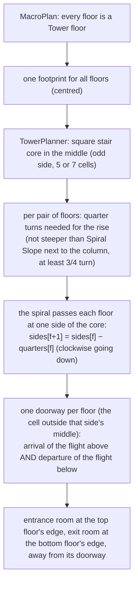

# Dungeon 16 — Towers, Cities, Hives, Chasms, Dens and the Void

**Scripts:** `Stages/Planning/MacroPlanStage.cs`, `Stages/Planning/TowerPlanner.cs`, `Stages/Layout/TowerLayout.cs`,
`UndercityLayout.cs`, `HiveLayout.cs`, `IslandLayout.cs`, `DenLayout.cs`, `Stages/Layout/LayoutStage.cs` (`LayoutUtil`),
`Stages/Connect/ConnectivityStage.cs`, `Stages/Carve/CarveStage.cs` + `CarveFeatures.cs` (`GalleryPortals`,
`ChasmDepth`), `Core/TileGrid.cs` (chasm, roof, sky), `Core/DungeonLayout.cs` (`FloorLayout.Flood`, `Jumps`,
`PresetLinks`), `Presentation/DungeonMesher.cs`, `Presentation/LinkMesher.cs` (spirals, climbs), `Build/DungeonBuilder.cs`,
and the runtime components `DungeonChasm`, `DungeonTeleporter`, `DungeonMovingPlatform`, `DungeonClimbable`,
`DungeonGravityShift`.

---

## 1. Concept

Six floor styles that break the "rooms in rock" mould:

| Style | Shape | Joins | What is special |
|---|---|---|---|
| **Tower** | a round floor: a stair core in the middle, a ring hall and wedge chambers (or one great columned hall), turrets in the corners | doors | in a tower dungeon every floor shares one footprint and **one continuous spiral staircase** runs through the core |
| **Undercity** | a street grid in a huge cavern: avenues, side streets, plazas, buildings of 1–3 rooms, collapsed ruins | doors onto the streets | streets and plazas are **outdoor** (the cavern's sky high above); buildings are **roofed** — their walls stop at a roof with the cavern above |
| **Hive** | round cells on a honeycomb lattice, a few merged into brood chambers | fleshy tunnels | everything organic; the cells are domed |
| **Islands** | islands and a rim ledge inside a **chasm** | bridges and moving platforms | falling off drops you to the floor below (or kills, see §6) |
| **Den** | one huge noisy cavern (the boss's lair, tallest ceiling of the dungeon) plus side caves | tunnels | tagged "Den" for the hoard; suggested for the boss |
| **Astral** | stone platforms floating in a **void** | portals (teleport pads), moving platforms, narrow bridges | gravity flips every so often |

They sit in the same pipeline as every other style (styles are chosen per floor by the profile's style weights). A
dungeon may also force its last floor's style (**Override Last Floor Style**, e.g. a Den at the bottom of a cave
dungeon) — see the *Dragon's Den* type in [15](15-Types-Special-Rooms-Mechanics.md).

## 2. Heights per floor

Every style has its own ceiling range, so floors are spaced **per pair**:

- `FloorSpec.SpacingAbove` = the spacing the floor's style needs (`CompiledProfile.SpacingFor(style)`: its tallest
  ceiling + cave floor variation + rock between floors) **plus the chasm depth of the floor above** (islands 6 m,
  astral void 8 m), so a chasm never reaches into the floor below.
- `FloorSpec.BaseY` accumulates those spacings; `FloorSpec.MaxCeiling` caps the floor's ceilings.
- Each pair's stairs are as long as their own rise needs (`StairLengthFor(rise)`); `DungeonLayout.FloorSpacing` is the
  largest gap (used for budgets only).
- `DungeonInstance.FloorAt(world)` uses these bands: a floor reaches down to the top of the floor below, so a chasm's
  depths belong to the floor they cut through.

## 3. Towers and the spiral staircase



- **One continuous helix.** Each flight (`VerticalLink`, kind `Spiral`) knows the flight above and below
  (`Above` / `Below`), its `StartAngle` and `Turns`. The mesher builds each flight into the lower floor's root: sloped
  steps round the central column (`Newel Radius`), the landing at the bottom, the round wall, the column and a lintel
  over the doorway, plus a NavMeshLink at the top. The first flight also builds the top landing into the top floor.
- **Walkable:** the steps are never steeper than *Spiral Slope* where they are steepest (beside the column); more turns
  are added until they are. A thicker column keeps the inside walkable.
- A **Tower floor among other styles** has a solid core instead (its stairs are ordinary stairs elsewhere).

## 4. Undercity: outdoor streets, roofed buildings

- Streets run in a grid (one wider avenue each way, a street along the cavern wall); some crossings become **plazas**.
  Blocks between streets are split into lots; each lot is a **building** of one to three rooms behind one-cell walls with
  a door onto a street, or now and then a collapsed **ruin** open to the street. Lots shrink to fit around plazas and
  stairs.
- Cells are flagged `Outdoor` (streets, plazas, ruins) or `Roofed` (buildings). `TileGrid.RoofHeight` / `SkyHeight`
  (created on demand by `EnsureRoofs`) hold the building's roof and the cavern's sky above it; the sky is the same noise
  field over streets and roofs (`UndercityLayout.SkyAt`), so the cavern ceiling is continuous.
- The mesher builds roofs in two layers (the building's ceiling below, the roof top above) and the cavern ceiling over
  everything. Outdoor cells have no doors; connectivity adds no loops and no dead-end fixes inside the city grid.
- Props by tag: street lamps and carts on "Street", wells, market stalls and lamps on "Plaza", ruined walls on "Ruin".

## 5. Hives and dens

- **Hive:** cells on a hexagonal lattice (wobbling outlines, a few missing), some merged into **brood chambers**
  (tag "Brood"), the rest tagged "Hive"; tunnels join neighbours with a chance (connectivity adds the rest). Domed
  ceilings. Props: egg sacs and glowing fungi.
- **Den:** an ellipse bent by noise filling a good share of the floor (*Cave Share*), its ceiling *Cave Height* (16 m),
  hinted as the boss room, tagged "Den" — the hoard (gold piles, dragon bones, stalactites) is placed there. Side
  tunnels lead to side caves; some side caves join each other.

## 6. Chasms, bridges and the void

```mermaid
flowchart LR
    A["IslandLayout: the floor inside a rock rim becomes CHASM<br/>(Solid + CellFlags.Chasm)"] --> B["islands / platforms carved on a jittered grid;<br/>anchor rooms get an island; maybe a rim ledge"]
    B --> C["spanning tree + a few loops over island centres → PresetLinks"]
    C --> D{"join kind"}
    D -->|bridge| E["cells carved across: Walkable + Chasm"]
    D -->|moving platform| F["Platform connection: DoorA/DoorB on the ledges,<br/>Track = the chasm cells between (Reserved)"]
    D -->|portal (astral)| G["Portal connection: a teleport pad at each end"]
    E & F & G --> H["CarveStage: ChasmDepth sets each chasm cell's bottom"]
```

- **Jumps.** Portal and platform connections are *jumps*: nothing is carved between their ends. `FloorLayout.Flood`
  (used by validation, analysis, population and the tests) crosses them, so reachability counts them.
- **Depth.** `ChasmDepth.Apply` gives each chasm cell its bottom (stored as a negative floor height): over open space on
  the floor below it stays above that space's ceiling; over solid rock it goes down almost to the lower floor's level;
  over a stair well it stays shallow; on the last floor it is 26 m deep. The ceiling over a chasm is the floor's sky.
- **Mesh.** Chasm cells get a dark **Void** surface at their bottom (theme *Void Material / Void Color*) with a
  collider that catches fallers and is kept out of the NavMesh; the chasm's walls are rock; bridges are 0.35 m thick
  with a trimmed underside.
- **Falling** (`DungeonChasm` on the floor's root, settings in *Mechanics › Chasms*): a player who drops below the
  ledges (4 m, sooner where the chasm is shallow) lands on the nearest walkable spot of the floor below with *Fall
  Damage* (20% of max health), or dies — *Chasm Fall*: **Floor Below Else Death** (death only on the last floor),
  **Floor Below** (on the last floor: back to where they last stood safely, hurt), **Death**.
- **Moving platforms** (`DungeonMovingPlatform`): float along the track between the two ledges at 2.2 m/s, waiting
  1.8 s at each end, and carry the players standing on them. Mobs stay on their island (the NavMesh doesn't cross).
- **Portals** (`DungeonTeleporter`): stand on a pad for 0.6 s to be sent to its partner (same pair id); 2.5 s before
  the same player can be sent again. A gallery's **magic painting** is the same thing hung on a wall (step up to it).
- **Gravity flips** (astral floors, `DungeonGravityShift`, *Astral › Gravity*): every 35–70 s, after a 3 s warning,
  players on the floor float up to *Float Height* (3 m) for *Flip Duration* (6 s) and can drift over the void, then drop
  — a player who drifted off a platform falls into the chasm. Loose rigidbodies are lifted too.

## 7. Climbing shafts

*Links › Climb Chance* (0.12; Overgrown Ruins 0.45) turns some drops into **climbs**: a shaft between two floors with a
giant root and vines up its middle. `DungeonClimbable` (a trigger the size of the shaft): inside it, Jump or forward
climbs up, Crouch or back climbs down, no input holds on (no gravity while holding); at the top the player is helped
over the edge. It needs a player with a `PlayerMovementModel` (it suspends gravity) and reads the player's shared
input. The NavMeshLink of a climb works both ways.

## 8. Configuration

| Group | Settings (defaults) |
|---|---|
| Styles | Tower 0.15, Undercity 0.25, Hive 0.25, Islands 0.2, Den 0.12, Astral 0.1 (weights next to the classic styles); Override Last Floor Style / Last Floor Style (Den) |
| Tower | Diameter 28–36 · Core Size 5 · Ring Width 2–3 · Chambers 4–8 · Great Hall Chance 0.2 · Spiral Slope 40° · Newel Radius 1.1 m · Balcony Chance 0.3 |
| Undercity | Avenue Width 3–4 · Street Width 2–3 · Block Size 10–16 · Plaza Chance 0.35 · Plaza Size · Rooms Per Building · Ruin Chance 0.12 · Sky Height 13–17 m · Interior Ceiling 4.5 m · Roof Above 0.8–4 m |
| Hive | Cell Radius · Wall · Missing Chance · Join Chance · Brood Chance · Wobble · Ceiling 3.6–6.5 m |
| Islands | Island Radius · Gap · Platform Share 0.3 · Bridge Width · Rim Width 2 · Ceiling 10–14 m · Chasm Depth 6 m |
| Den | Cave Share · Side Tunnels · Side Cave Size 5–9 · Cave Height 16 m · Hoard Piles 6–12 |
| Astral | Platform Radius 3–5 · Gap 4–8 · Portal Share 0.45 · Platform Share 0.25 · Ceiling 12–16 m · Void Depth 8 m · Flip Interval 35–70 s (0 = never) · Flip Duration 6 s · Float Height 3 m |
| Links | Climb Chance 0.12 · Climb Size 1 |
| Mechanics › Chasms | Chasm Fall (Floor Below Else Death) · Fall Damage 0.2 |
| Theme | Void Material / Void Color, Teleporter, Moving Platform prefabs |

## 9. Performance

The new layouts are linear in the floor's cells (disc stamping, a lattice, a street grid). The tower planner is
constant time per floor. Chasm depth is one pass per chasm floor after carving. At run time each chasm floor checks
the players a few times per second; moving platforms and teleporters only look at the players.

## 10. Debugging

| Symptom | Cause | Fix |
|---|---|---|
| A player stands in the void and nothing happens | they are above the fall trigger on a shallow pit edge | lower *Fall Depth* on the floor's `DungeonChasm` |
| Mobs don't follow across a chasm | the NavMesh doesn't cross platforms and portals | by design: islands keep their mobs |
| The spiral is too steep / too long | Spiral Slope and Newel Radius set the turns | raise the slope or thicken the column |
| A tower dungeon isn't a single spiral | some floor isn't a Tower floor | set every style weight but Tower to 0 (the Tower type does) |
| City buildings have no roofs | the area isn't flagged Roofed (a ruin) | ruins are open by design (*Ruin Chance*) |
| Climbing doesn't work | the player has no `PlayerMovementModel`, or input actions lack Jump/Movement/Crouch | add them; others can still drop down |
