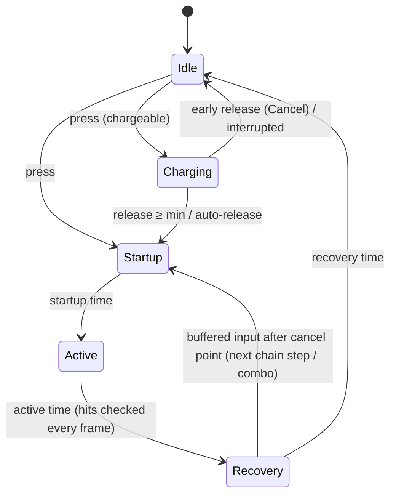

# 05 — Weapons & Attacks

## 1. `WeaponSO`

| Section | Fields |
|---|---|
| Weapon Attributes | Category (Sword, Greatsword, Axe, Mace, Hammer, Spear, Dagger, Fist, Bow, Crossbow, Staff, Wand, Shield, Tool, Thrown...), tool type, min/max damage, crit chance and multiplier, knockback (metres), attack speed, **scaling attribute** (Strength / Agility / Intelligence) |
| Animation System | Animation set; optionally swap the Animator Controller while held (restored when unequipped) |
| Weapon Actions | **Normal** (required), Light, Heavy, Special, **Alternate** (right click / secondary: shield bash, thrust, charged shot...) |
| Combo System | Combo sequences (fixed input strings → special attack) and an optional Combo Tree (conditional branches) |
| While Wielded | **Passive Effects** (any `EquipmentEffect`: stats, resistances, passives, on-hit procs, abilities on keys) and *Apply Traits To Wielder* |
| Weapon Traits | Traits that change the weapon's attacks (enhancements are applied per attack, the asset is not modified) |

Weapon passives go through the same `EquipmentManager` as armor (virtual slot `"Main Hand"`), so a sword can give
"+10% crit chance, 20% chance on hit to burn, Double Jump while held" with no code.

## 2. Attacks

`AttackAction` (a weapon's action) and `AttackVariation` (the next steps of its chain) share `AttackComponent`:

| Group | Fields |
|---|---|
| Timing | Animation, speed, **startup / active / recovery** seconds, **cancel point** (fraction of recovery after which the next attack may start), stamina cost |
| Movement | Lock movement, speed multiplier during the attack, forward movement |
| Damage | **Damage mode** (Auto / Weapon Damage / Effects Only), damage multiplier, damage type (Physical / Magical / True), element override, crit chance bonus, knockback multiplier |
| Hit detection | **Auto** (weapon cast if configured, else hit shape), **Hit Shape** (cone, circle, line, ring... around the attacker, scaled by charge), **Weapon Blade** (the weapon's hit volumes — capsules, spheres, boxes — on the model in the hand, following the animation and swept between frames; each attack picks which volumes), **Weapon Cast** (the old overlap at the hand), **None** (behaviours do the work) · hit filter · **target rules** (friendly fire, kinds, factions) · max targets · re-hit interval |
| Impact | Optional **ground slam**: when the weapon reaches the ground (or at a chosen moment), its own area around the impact point hits everyone inside with its own filter, damage, falloff and effects ([08 §5](08-Setup-Guide.md)) |
| On hit | **On-hit effects**: any `AbilityEffect` (stun, slow, knockback, damage over time, heal self...) · hit VFX and sound |
| Charge | See §3 |
| Behaviours | See §4 |
| Legacy effects | `AttackActionEffect` list (old stat-change effects) |
| Presentation | Sound, particles, trail |

### Chains (light combos)

An action with variations is a chain: *Slash 1 → Slash 2 → Slash 3*. Pressing again within the action's *Variant
Time* continues the chain; waiting longer restarts it. The first press now always performs the action itself
(the old code skipped straight to the first variation). Inputs pressed during an attack are buffered and start
the next step at the cancel point.

### Look-alike settings, explained

| Question | Answer |
|---|---|
| **Hit Shape vs Attack Cast** | Not the same. The **Hit Shape** belongs to each attack: an area (cone, circle, line...) at the attacker's feet, facing where they look, checked every frame of the attack's *Active* phase. The **Attack Cast** belongs to the weapon and is the *old* system: one physics overlap at the hand, the same for every attack, used only when it has *Target Layers* (or an attack says *Weapon Cast*). New weapons: leave the Attack Cast's layers empty. |
| **Weapon Range** | A hint (AI, gizmos, your scripts); it never decides what is hit. The real reach of an attack is its Hit Shape (+ its Forward Movement). The inspector shows each attack's reach and has **Set Max Range From Attacks**. |
| **Hit Filter** | Relation to the attacker, from `CombatEntity` teams (*Team* field; empty = `Player` for players, the mob type for mobs). **Self** = the attacker; **Allies** = same team; **Enemies** = hostile - for a player every character of another team (mobs, animals), for a mob whoever its AI is hostile to; **Neutral** = neither (a mob another mob ignores). Unity's old popup listed *All* and *Everything* (and *None* / *Nothing*): they were the same thing; the field is now four buttons. |
| **Weapon Traits vs a Grant Traits passive** | *Weapon Traits* belong to the weapon: they change only its attacks (damage, speed, stamina, elements, lifesteal, slow...) and count for Required / Enhancement Traits; the player does not get them unless *Apply Traits To Wielder*. A **Grant Traits** effect in *While Wielded* gives the trait to the **player** while the weapon is held: it acts on everything the player does. Putting the same trait in both counts it twice (the inspector warns). |
| **Use Feedback sound vs Attack Sound** | *Use Feedback* (item) is for usable items - drinking, eating. Weapons never play it (hidden in the weapon inspector). **Attack Sound** plays at the swing (an attack's own sound, else the weapon's); an attack's **Hit Sound** plays when a hit lands. |

## 3. Charge / hold attacks

With **Charge** enabled, holding the input charges and releasing attacks:

| Field | Meaning |
|---|---|
| Min / Max Charge Time | Release before *Min*: *Early Release* decides (perform a normal attack, or cancel). At *Max*: full charge |
| Damage / Area At Full Charge | Multipliers interpolated from 1 by the charge ratio |
| Auto Release At Full | Attack as soon as fully charged |
| Stamina Per Second | Drained while charging |
| Move Speed While Charging | Movement slow while holding |
| Charge Animation, Charging / Full Charge VFX, Full Charge Sound | Presentation |

`Charge Speed` (combat stat) shortens charge times. `WeaponController.PendingChargeRatio` exposes the current charge
for UI.

## 4. Attack behaviours

Extra things an attack does, at a chosen **moment** (Start, Active Start, Each Hit, Active End, End, Charge Start,
Full Charge):

| Behaviour | Use |
|---|---|
| **Cast Ability** | Fire a projectile, shockwave or beam (aim forward, at the target, or on self); can scale with the attack's strength |
| **Lunge** | Move forward/back over a duration (lunging stab, leap, backstep) |
| **Effects On Self** | Heal, shield, speed boost... on the attacker |
| **Area Burst** | Hit everything in a shape at one moment with a fraction of weapon damage + its own effects (ground slam, spin) |
| **Spawn Effect** | A prefab and sound at a moment (slash trail, sparks) |
| **Invulnerability** | Invulnerable for a moment (parry, dodge-through, unstoppable finisher) |

Add your own by deriving from `AttackBehaviour` with an `[AbilityMenu]` attribute; it gets an `AttackContext`
(controller, weapon, attack, attacker entity, hand, last hit target/point, `DealWeaponDamage(target, fraction)`).

## 5. Combos

| Tool | How it works |
|---|---|
| **Combo Sequences** (on the weapon) | When the last inputs match the sequence (e.g. Normal, Normal, Heavy), its *Special Action* runs instead, with its damage multiplier and crit bonus |
| **Combo Tree** (asset) | Branches: *trigger input* + **conditions** → branch action, with priority, damage bonus and finisher flag |

Combo conditions: Input Timing, Stamina/Health/Mana Threshold, Trait Required, Weapon Trait Required, Status Effect
(on the attacker), Combo Count, Elemental Charge (consecutive elemental hits), **Previous Attack**, **Target Health
Below**, **Charged Attack**, **In Air** — each can be inverted. The combo damage bonus is now actually applied.

## 6. Runtime



| Class | Job |
|---|---|
| `WeaponController` | Input (the player's Attack input = Normal; optional `InputActionReference`s for Light/Heavy/Special/Alternate; `BeginAttackInput/ReleaseAttackInput` for AI or UI), events, durability, stamina, accessors |
| `WeaponManager` | Equips the weapon model in hand, animator controller swap/restore, registers the weapon with `EquipmentManager` and `CombatStats.SetWielded` |
| `AttackExecutor` | The state machine above, hit detection, damage, knockback, on-hit effects, behaviours, movement |
| `WeaponHitResolver` | Damage roll and legacy trait reactions |
| `ComboSystem`, `VariationSystem`, `InputBufferSystem` | Combo choice, chain steps, buffered presses/releases |

### Damage of a weapon hit

```
damage = random(min, max)
       × weapon trait and wielder trait multipliers (legacy string effects)
       × trait stat Weapon Damage
       × CombatStats: (1 + Weapon Damage%) × (1 + scaling attribute × 1%) × (1 + Elemental Damage% if elemental)
       × attack damage multiplier × charge × combo bonus
       × elemental multiplier (weapon/target elements)
       × crit multiplier (+ Critical Damage%) on a crit (chance = weapon + attack bonus + Critical Chance + Agility)
→ CombatEntity.ApplyDamage(type, element) → target's Defense / Magic Resistance / elemental resistance
```

Anything implementing `IWeaponHittable` (e.g. `CollectableItem`, destructibles) is notified of weapon hits too.
