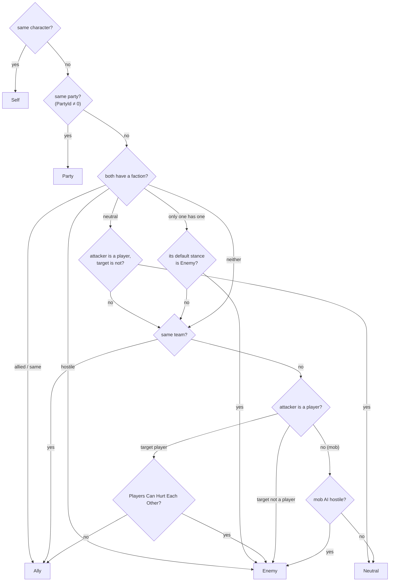

# 09 — Teams, Factions, Parties & Targeting

**Scripts:** `Essentials/Ability/Core/CombatEntity.cs` (`CombatRelations`), `CombatFaction.cs`, `CombatTargeting.cs`
(`TargetRules`, `CombatTargeting`, `CombatParties`), `CombatSettings.cs`, `AbilityEnums.cs` (`TargetFilter`,
`CombatRelation`), `AbilityCastInstance.cs`, `AbilityEffects.cs`, `Inventory/Items/Weapon/WeaponController/AttackExecutor.cs`,
`Mob/AI/MobBrain.cs`.

Who can hit whom is decided by **four separate layers**. Keeping them apart is what makes parties, friendly fire,
factions and multiplayer possible without special cases.

| # | Layer | Answers | Configured in |
|---|---|---|---|
| 1 | **Physics layers** | What can a query physically touch or see? | *Combat Settings ▸ Character / Obstacle / Ground Layers*, an Impact's *Ground Layers* |
| 2 | **Relation** | Who is this character to me: Self, Party, Ally, Enemy, Neutral? | Teams, parties, factions, PvP rule, AI |
| 3 | **Filter + Target Rules** | Which relations (and kinds, factions) does this hit select? | Each attack / ability hit / effect |
| 4 | **Harm rule (friendly fire)** | May *harmful* effects land on a friend? | *Combat Settings*, overridable per hit |

**Layers never decide friend or foe.** They only say what is solid, what is ground and which colliders belong to
characters.

---

## 1. Relations

`CombatRelations.Get(from, to)` decides, in this order:



| Source | Set by |
|---|---|
| **Team** | `CombatEntity ▸ Team Override`; empty = `Player` for players, the mob Type (or Team Override) for mobs. Same team = Ally |
| **Party** | `CombatEntity.SetParty(id)` / `CombatParties.Form(a, b, c)`; summons inherit their summoner's |
| **Faction** | A `CombatFaction` asset on the `CombatEntity` or the `Mob`; summons inherit |
| **PvP** | *Combat Settings ▸ Players Can Hurt Each Other* |
| **AI** | The mob brain: preys, threats, taunts, aggression ([Mobs 02 §4](../Mobs/02-AI-Profiles-and-Behaviour.md)) |

Characters **without** factions or parties behave exactly as before.

### Factions

*Assets ▸ Create ▸ SimpleMovements ▸ Combat ▸ Faction*:

| Field | Meaning |
|---|---|
| Allies | Factions it never fights. The same faction is always allied |
| Enemies | Factions it is hostile to |
| Default Stance | Toward factions in neither list (and characters without a faction): Neutral, Ally or Enemy |

Relations are **symmetric**: listing Bandits as enemies of Kingdom also makes Kingdom an enemy of Bandits; *Enemy*
wins when one side lists the other as ally and the other as enemy. Mobs also use factions to choose fights: hostile
factions are attacked on sight, allied factions never.

### Parties

A party is just an **id** on each member's `CombatEntity` (0 = none) — trivial to synchronise in multiplayer: the
server hands out ids, every client computes the same relations.

```csharp
int party = CombatParties.Form(player1Entity, player2Entity);   // or entity.SetParty(serverPartyId)
CombatParties.SameParty(a, b);                                  // true
entity.SetParty(0);                                             // leave
```

---

## 2. Filters

Every weapon attack, impact, ability hit and ability effect has a **Target Filter**, drawn as toggle buttons:

| Button | Selects |
|---|---|
| Self | The attacker itself |
| Allies | Same team, allied factions — **and party members** |
| Enemies | Hostile characters |
| Neutral | Neither |
| Party | Only party members (a party-only heal) |

There is no "All vs Everything" any more: the old Unity popup showed both (and *None / Nothing*) for the same value.

**Target Rules** (optional, on weapon attacks, impacts and ability hits) narrow it further:

| Field | Meaning |
|---|---|
| Friendly Fire | **Game Rule** (Combat Settings decide), **Never** (never harms party / allies), **Always** (harms party / allies caught in it) |
| Kinds | Players, Mobs, Others |
| Only Factions / Ignore Factions | Restrict to, or exclude, factions |

---

## 3. Harmful vs helpful, and friendly fire

Effects are **harmful** (damage, damage over time, stun, silence, root, slow, taunt, knockback, pull, a lowered
stat) or **helpful** (heal, cleanse, invulnerability, a raised stat). A weapon attack is harmful when it deals
damage, knockback or harmful on-hit effects.

| Rule | Combat Settings | Default |
|---|---|---|
| Party Friendly Fire | Harmful effects can land on party members | Off |
| Ally Friendly Fire | Harmful effects can land on other allies | Off |

* **Off**: harmful effects never land on party members / allies — even if a filter includes them — while helpful
  effects still do. One nova can damage Enemies and heal Allies.
* **On**: harmful hits also hit friends **caught in them**, even when the filter only says Enemies (a fireball's
  blast hurts the teammate standing in it).
* **Per hit**: *Target Rules ▸ Friendly Fire* = Never (a precise ability that must never hurt friends) or Always
  (a grenade, a trap).

---

## 4. Recipes

| Want | Set |
|---|---|
| Party members never hurt each other | Defaults (Party Friendly Fire off) |
| Friendly fire game mode | *Combat Settings ▸ Party Friendly Fire* (and Ally Friendly Fire) on |
| An ability that only ever hits enemies | Filter **Enemies**, Target Rules ▸ Friendly Fire **Never** |
| A weapon / ability that heals or buffs the party | Filter **Party** (or Allies), effects Heal / buff; no damage |
| One nova: damage enemies, heal friends | Filter Enemies + Allies; Damage effect *Only Affects* Enemies, Heal *Only Affects* Allies |
| Hit enemies and neutral creatures | Filter Enemies + Neutral |
| Only hurt undead | Target Rules ▸ Only Factions = Undead |
| Never hit villagers | Target Rules ▸ Ignore Factions = Villagers |
| Bandits fight the Kingdom, wildlife stays out | Bandits ▸ Enemies = Kingdom; Wildlife ▸ Default Stance = Neutral |
| PvP between parties | *Players Can Hurt Each Other* on; party members stay safe (Party Friendly Fire off) |
| A hammer slam that only hits enemies on the ground | Impact ▸ Filter Enemies; Ground Layers = terrain ([08 §5](08-Setup-Guide.md)) |

---

## 5. Multiplayer notes

* Relations are pure functions of synchronised data (team strings, party ids, faction assets, the PvP flag), so the
  server and every client agree.
* Run hit detection and damage on the server (authority); clients only show results.
* The AI hostility layer depends on each mob's memory, so mobs should run on the server.

---

## 6. Finding players (no tags, any number of players)

Gameplay never identifies players by **tag** or **layer**: a player is a `CombatEntity` of kind *Player* (any
character with a `PlayerStatusController`; it registers itself on Awake). `PlayerLocator` is the one place to ask:

| Call | Returns |
|---|---|
| `PlayerLocator.FromCollider(collider)` | The player a collider (any child collider) belongs to — *who entered this trigger* |
| `PlayerLocator.All` | Every player |
| `PlayerLocator.Nearest(position)` / `DistanceToNearest(position)` / `AnyWithin(position, r)` | Proximity |
| `PlayerLocator.MovableRoot(player)` | The object to teleport (the one with the CharacterController) |
| `PlayerLocator.PartyMembersNear(player, r, list)` | Who travels with a player |
| `PlayerLocator.Local` | **This machine's** player (camera, UI, telegraph colours). Set it from your networking code when the local player spawns; with one player it is that player |

What uses it:

| System | Before | Now |
|---|---|---|
| World portal | the object with the `Player` tag | the player whose collider entered; optional **Bring Party Within** |
| Portal into another scene | `FindGameObjectWithTag("Player")` after loading | the player who went through |
| Dungeon session | one player | `Participants`: every player who entered; they leave together |
| Dungeon portals | tag | the player who entered (participants only) |
| Floor streaming | the tagged player's floor | every floor with a participant |
| Secret doors | the tagged player | any player searching |
| Respawns | distance to the tagged player | distance to every player |
| Traps (`DungeonHazard`) | tag; damage left to your code | *Affects* (players / mobs / others); damage through the combat system |
| World mob / portal spawners | tagged objects | registered players (tagged objects as an extra) |
| Telegraph colours | relation to the nearest player | relation to `PlayerLocator.Local` |
| Inventory / armor set UI lookups | "any inventory in the scene" | the player's own (scene search only when there is exactly one) |
| Old `AbilityEffectSO` | `Player` / `Mob` tags | any Combat Entity |

Tags are still fine for **non-gameplay identity** (terrain chunks use a `Ground` tag); they are no longer needed on
players.

