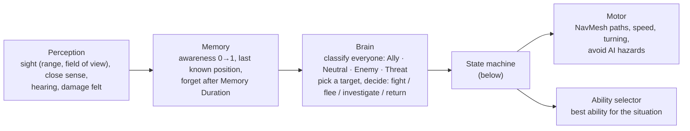
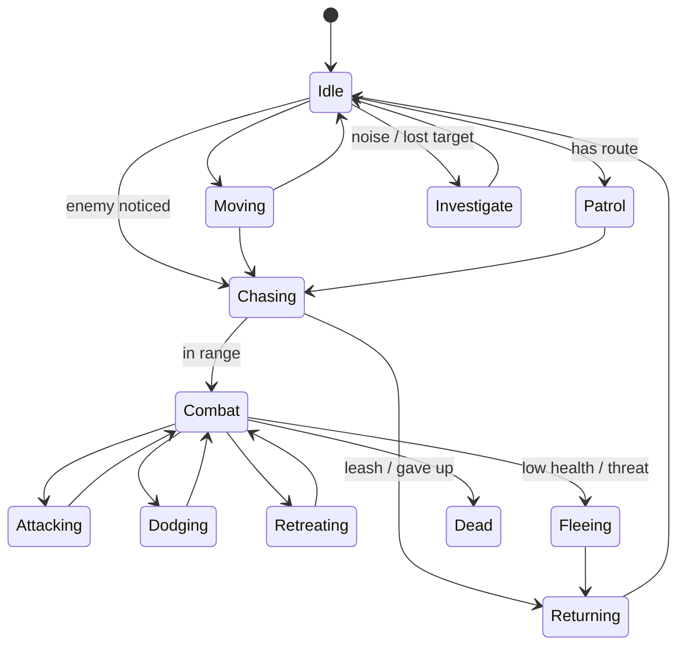

# Mobs 02 — AI, Profiles & Behaviour

**Scripts:** `Mob/Controller/MovementStateMachine/MobMovementStateMachine.cs`, `States/*`, `Mob/AI/MobProfile.cs`,
`MobPerception.cs`, `MobBrain.cs`, `MobMotor.cs`, `MobCombatCoordinator.cs`, `Mob/Mob.cs`.

---

## 1. The AI loop

The brain thinks every *Decision Interval* seconds (faster near players; mobs far from every player think slowly,
and sleep beyond *Combat Settings ▸ AI Sleep Distance*, unless *Always Full Rate*).

## 2. States

| State | When |
|---|---|
| **Idle** | Resting between walks (*Idle Time Range*) |
| **Moving** | Wandering around home (*Wander Radius*), or following its summoner |
| **Patrol** | Has a patrol route; walks it (Loop, Ping Pong or Random; waits at each point) |
| **Investigate** | Heard a noise or lost a target: goes to the last known position and looks around |
| **Chasing** | Running to an enemy that is out of reach |
| **Combat** | Engaged: positioning around the target between attacks (circling, strafing, keeping its preferred range) |
| **Attacking** | Using an ability / the basic attack |
| **Dodging** | Jumping out of a telegraphed area or away from a weapon swing |
| **Retreating** | Backing off (skirmishers, kiters, ranged mobs keeping distance) |
| **Fleeing** | Running away (prey, cowards at low health, feared types) |
| **Returning** | Leashed: going back home after a fight (optionally invulnerable and healing) |
| **Stunned** | Crowd-controlled |
| **Dead** | Death animation, then removal |

---

## 3. `MobProfile`

One asset per mob type (*Assets ▸ Create ▸ SimpleMovements ▸ Mobs ▸ Mob Profile*, or
*Mob Profile From Preset…*). Every field has a tooltip; the main ones:

| Section | Fields |
|---|---|
| **Temperament** | **Aggression**: Passive (never starts fights), Defensive (only when attacked or an ally calls), Territorial (attacks enemies near home within *Territory Radius*), Aggressive (attacks every enemy it notices). **When Attacked**: Fight, Flee, Fight If Healthy. **Courage**, **Flee Health Threshold**, *Flee From Players Within* (skittish animals), **Fears** (types it runs from) |
| **Perception** | **Sight Range**, **Field Of View**, *Close Sense Radius* (notices all around), eye height, **Hearing** multiplier, *Awareness Gain Rate* (how hard it is to sneak past), *Sneak Detection Multiplier* (vs crouching players), **Memory Duration**, **Reaction Time**, **Call For Help Radius** / *Respond To Help Radius* |
| **Movement** | Walk / run / combat speed (× Speed Manager), turn speed, acceleration, *Wander Radius*, *Idle Time Range*, patrol mode and wait, **Leash Distance**, *Max Chase Time*, return home (evade, heal on return), avoid hazards, flee distance |
| **Combat** | **Combat Style** (Auto, Melee, Ranged, Skirmisher, Kiter, Brute), preferred min / max range, **Aggressiveness**, share melee slots, circle distance, strafing, *Min Time Between Attacks* |
| **Dodging** | Chance to dodge telegraphs, chance to dodge weapon swings, cooldown, distance, duration, invulnerable while dodging, cancel own wind-up to dodge |
| **Abilities** | Choice randomness, decision interval, use the basic attack when it has no melee ability, absorb chance multiplier |
| **Animation** | Parameter names ([04 §1](04-Animation-Death-Spawning.md)) |
| **Death** | Destroy delay, disable colliders on death |
| **Performance** | Always think at full rate (bosses, important NPCs) |

### Presets

| Preset | Plays like |
|---|---|
| Brute | Aggressive heavy melee: almost never flees, never dodges swings, barely strafes |
| Skirmisher | Aggressive hit and run: strafes a lot, dodges often, flees at 25 % health |
| Archer | Aggressive kiter: keeps 7–16 m away, long sight (24 m), dodges telegraphs |
| Caster | Aggressive ranged: keeps 8–18 m away, does not cancel its casts to dodge |
| Tank | Territorial (14 m) brute: never flees or dodges, slow |
| Predator | Aggressive skirmisher that hunts: fast, wide view, notices quickly, calls its pack (25 m), fights while healthy |
| Prey Animal | Passive: flees when attacked and from players within 6 m, sees almost all around, warns nearby animals |
| Guard | Territorial (18 m) melee, leash 30 m, returns to its post, patrols ping-pong, calls for help |
| Boss | Aggressive, fearless, thinks fast at full rate, sees 360° / 30 m, no leash, ignores attack slots |

---

## 4. Who a mob fights, ignores or flees

For every character it perceives, the brain decides one of: **Ally**, **Neutral** (ignored), **Enemy** (fight),
**Threat** (flee from). In order:

1. Same **team** (Type, or Team Override) or same **party** → Ally.
2. **Factions** (when either has one): allied factions → Ally; hostile factions → Enemy (a mob whose *When Attacked*
   is Flee treats them as a Threat instead); neutral → continue.
3. It **taunted** this mob → Enemy. It **hurt** this mob (threat) or an ally called for help → reaction from *When
   Attacked*.
4. **Summons** fight their summoner's enemies.
5. **Prey / predator**: a type in its *Preys* → Enemy; a type that hunts it, or a type it *Fears* → Threat
   (Enemy when cornered).
6. **Players**: Enemy when `Player` is in *Preys*; Threat when skittish (*Flee From Players Within*).
7. Otherwise Neutral.

**Which enemy it attacks** (Mob Profile ▸ Threat ▸ *Use Threat Table*, on by default): the one with the most threat —
damage, healing its enemies, crowd control, taunts, being noticed, with a head start for the first one. It keeps its
target until another exceeds it by the switch margin (110% in melee, 130% at range, × *Threat Loyalty*) after a minimum
time on target; threat fades when nothing new happens. Formulas, the Threat stat and multiplayer notes:
[Player 06 §6](../Player/06-Races-Classes-Stats-and-Threat.md#6-threat-and-aggro-mobs-multiplayer).

**Aggression** then decides whether it *starts* a fight with an Enemy (Passive and Defensive wait to be attacked;
Territorial only inside its territory).

---

## 5. Teams and factions

* **Team** — the simple way: mobs of the same Type (or Team Override) never hurt each other and help each other.
* **Faction** — a `CombatFaction` asset (*Create ▸ SimpleMovements ▸ Combat ▸ Faction*) with allies, enemies and a
  default attitude. Use it when several types share a side (Bandits: archers, brutes and their boss) or sides fight
  each other (Undead vs Kingdom). Set it on the mob component or its `CombatEntity`.

The full model (layers vs relations vs filters, parties, friendly fire) is in
[Inventory 09 — Teams, Factions & Targeting](../Inventory/09-Teams-Factions-and-Targeting.md).
