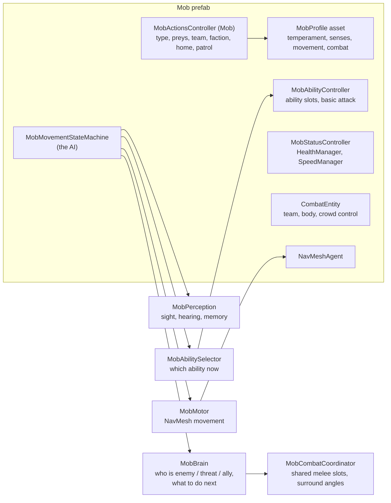

# Mobs — Guide

Creatures and enemies: how to set one up, how the AI decides what to do, how mobs fight, animate, die and spawn.
Mobs use the same combat core and abilities as the player.

| Chapter | Covers |
|---|---|
| [01 — Mob Setup](01-Mob-Setup.md) | Step by step: the quick setup, components, model and Animator, NavMesh, layers, checklist |
| [02 — AI, Profiles & Behaviour](02-AI-Profiles-and-Behaviour.md) | The AI loop, the states, `MobProfile` (temperament, senses, movement, combat, dodging), presets, who a mob fights or flees |
| [03 — Combat & Abilities](03-Combat-and-Abilities.md) | The basic attack, ability slots, how abilities are chosen, group combat, dodging, absorption |
| [04 — Animation, Death & Spawning](04-Animation-Death-Spawning.md) | Animator parameters, death and corpse removal, spawning on the terrain and in dungeons, summons |
| [05 — Troubleshooting](05-Troubleshooting.md) | Symptoms → causes → fixes |

## A mob at a glance

## Five-minute mob

1. *Tools ▸ SimpleMovements ▸ Mobs ▸ Create New Mob* (or right-click a model in the Hierarchy ▸ *SimpleMovements ▸ Quick Setup Mob*).
2. Put your model under **Model / VisualModel** and assign its **Animator Controller**.
3. On the mob: set **Type** (e.g. `Wolf`) and **Preys** (`Player` to attack players).
4. Assign a **Mob Profile** — *Create From Preset ▾* in the mob's inspector (Predator, Brute, Archer, Prey Animal…).
5. Bake the NavMesh, press Play.
