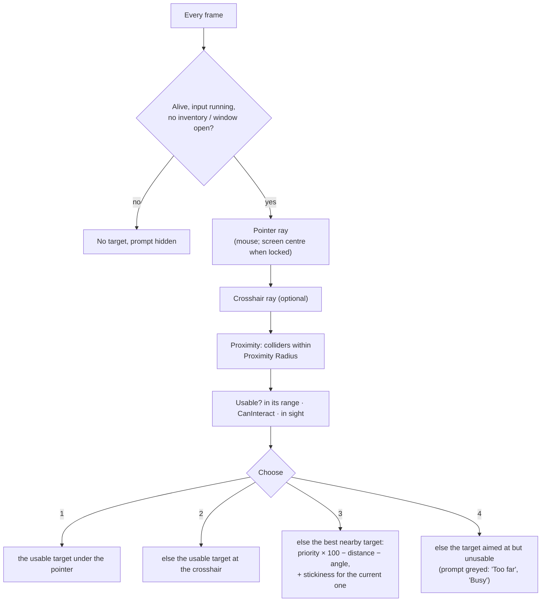

# 01 — Interaction

**Scripts:** `Essentials/Interactables/PlayerInteractor.cs`, `IInteractable.cs`, `InteractionPromptUI.cs`,
`LegacyInteractableTarget.cs`, `Essentials/Input/PointerCapture.cs`.

The `PlayerInteractor` (on the player) finds what the player can interact with, shows a prompt, and interacts with
the **Interact** input or a **click**. It works with every `IInteractable` — NPCs, and your own objects.

---

## 1. Finding the target



| Setting | Default | Meaning |
|---|---|---|
| Targeting | Pointer Ray + Proximity | Any combination of *Pointer Ray*, *Screen Center Ray*, *Proximity*. Proximity works with a gamepad and without aiming. |
| Ray Distance | 12 m | Length of the camera rays. A target hit by a ray must still be within **its own** Interaction Range of the player. |
| Proximity Radius / Angle | 3 m / 160° | Where nearby targets are searched; only those in front (following the camera). |
| Interactable Layers | Everything | Layers of the targets' colliders. The NPC inspector warns when an NPC is on a layer the interactor does not search. |
| Trigger Colliders | Collide | Whether trigger colliders count (an NPC's interaction volume may be a trigger). |
| Require Line Of Sight | on | Ignores targets behind walls. |
| Focus Stickiness | 0.5 m | Keeps the current target unless another one is clearly better — no flicker between two NPCs side by side. |
| Handle Legacy Interactables | off | See §5. |

**Several NPCs nearby:** aiming wins (the pointer, then the crosshair). Otherwise the highest **Interaction Priority**
wins (NPCs default to 10, items on the ground to −2), then the nearest and most in front. Only one NPC is ever the
target, and only usable ones are chosen.

**Valid targets only:** a target must be enabled, in range (measured on the ground plane from its *Interaction
Point*), in sight, and accept the interaction (`CanInteract`: a dead NPC, one that is busy with its maximum of players,
or one refusing hostile players says no, with a reason).

## 2. Input

| Input | How it is found | Default |
|---|---|---|
| **Interact** | *Interact Action* (an Input Action reference), else an action named `Interact`, `Interaction` or `Talk` in the player's input actions, else one is **created** in the Player map | `<Keyboard>/e`, `<Gamepad>/buttonNorth` |
| **Click** | *Click Action*, else an action named `InteractClick`, else one is created | `<Mouse>/leftButton` |

Created actions are listed in *Settings ▸ Key Bindings*, rebindable and saved like the others (the same mechanism as the
block, reload and rotate inputs — `CombatInputBinding`). A default control already used by another action is skipped
with a warning, so one key never does two things.

**To choose the key yourself:** add an `Interact` action (Button) to your input actions asset, or assign an Input
Action reference to *Interact Action*.

**Clicking:** a click on a target under the pointer, in range, whose *Allows Click* is on, interacts. While the pointer
is over such a target, the click is **claimed** (`PointerCapture`) so it does not also attack or use the item in hand
(*Click Blocks Attack*). Clicks over UI are ignored.

**Holding:** a target with a *Hold Duration* (an NPC's *Hold To Interact*) needs the key or button held; the prompt's
key badge fills up.

**While an interaction is open** (a shop, a dialogue) the interactor stops targeting, and the Interact input closes it
(*Interact Key Closes*). Typing in a text field of a window pauses gameplay keys, so typing "e" does not close the shop.

## 3. The prompt

`[E] Trade  Bram the Smith` — the key of the device in use, the target's verb and name; greyed with the reason when
the target cannot be used (*Show Unavailable*). *Prompt Placement*: **Above Target** (follows the NPC on screen) or
**Screen Bottom**. Generated at runtime on the player's inventory canvas; assign *Prompt Prefab* (an object with an
`InteractionPromptUI`, all fields optional) for your own.

## 4. Your own interactable objects

Implement `IInteractable` on a component of the object (or a parent of its collider):

```csharp
public class Lever : MonoBehaviour, IInteractable
{
    public string InteractionName => "Old lever";
    public string InteractionVerb => pulled ? "Push" : "Pull";
    public Transform InteractionPoint => transform;
    public float InteractionRange => 2f;
    public int InteractionPriority => 0;
    public float HoldDuration => 0.5f;
    public bool AllowsClick => true;
    bool pulled;

    public bool CanInteract(PlayerInteractor who, out string reason) { reason = ""; return true; }
    public void Interact(PlayerInteractor who) { pulled = !pulled; /* open the gate */ }
    public void OnFocusChanged(PlayerInteractor who, bool focused) { /* highlight */ }
}
```

`who.PlayerObject`, `who.Inventory` give the player and their inventory. To open a window that the Interact key should
close, call `who.BeginInteraction(this, close)` and `who.EndInteraction(this)` when it closes (NPCs do this).

## 5. The older `Player.OnInteract`

The `Player` component's ray (wired through a Player Input event) keeps working for doors, items on the ground and
chests. NPCs are opened by the Player Interactor (an `NPC` does not depend on the older `Interactable` class, so the
NPC system compiles whatever that class looks like). Scripts and UnityEvents can call `NPC.Interact()` directly; the
NPC handles only the first request of a frame, so two inputs never open and close it at once.

To use the interactor for **everything**, turn on *Handle Legacy Interactables* (doors, dungeon objects, `ItemPickable`,
`Storage` get prompts, proximity and clicks — they are recognised by their class names at runtime) and **unwire
`Player.OnInteract`** from the Player Input events, or doors would toggle twice.

| Script | API |
|---|---|
| `PlayerInteractor` | `Focused`, `FocusedAvailable`, `Current`, `IsBusy`, `DoInteract(target)`, `IsInRange(target)`, `BeginInteraction` / `EndInteraction`, events `FocusChanged`, `Interacted`, `For(anyOnPlayer)` |
| `PointerCapture` | `Claim(owner, anyOnPlayer)`, `Release(owner)`, `IsCapturedFor(player)` |
