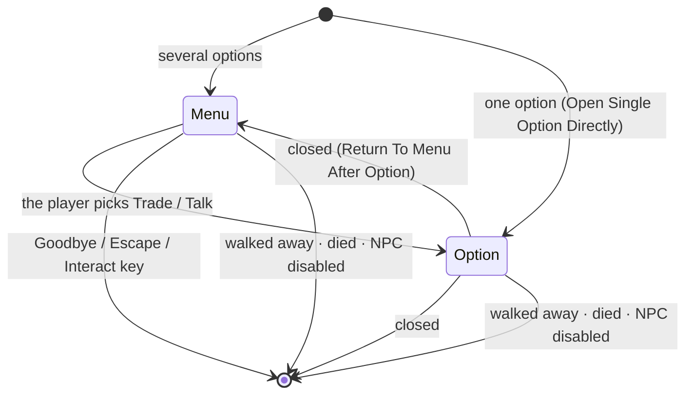

# 02 — NPCs & Dialogue

**Scripts:** `NPC/Core/NPC.cs`, `NPCBehaviour.cs`, `NPCInteractionSession.cs`, `NPCDialogue.cs`,
`NPC/UI/NPCWindow.cs`, `NPCDialogueWindow.cs`.

An NPC is an object with an **`NPC`** component (identity, range, conversation) and one or more **behaviours** — the
options it offers: `Merchant` (Trade), `NPCDialogue` (Talk), and any you write.

---

## 1. The NPC component

| Section | Setting | Default | Meaning |
|---|---|---|---|
| Identity | Display Name, Title, Portrait | | Shown in the prompt, the dialogue and the shop. |
| | NPC Id | generated | Stable id for saves and networking (the inspector warns about duplicates). |
| Interaction | Interaction Range | 3 m | How close the player must stand (ground plane, from the Interaction Point). |
| | Interaction Priority | 10 | Wins over lower targets when several are near (items on the ground are −2). |
| | Allow Click | on | Clicking the NPC interacts. |
| | Interaction Point | this object | Where the range is measured from — put it at the counter for a shopkeeper behind one. |
| | Leave Distance Margin | 2 m | The conversation ends when the player walks farther than Range + this. |
| | Interaction Cooldown | 0.2 s | After a conversation ends, before a new one can start. |
| | Max Players At Once | 0 (any) | Others see "Busy". |
| | Refuse Hostile Players | off | Uses the NPC's Combat Entity relations (a Combat Entity without AI treats players as enemies — set up its faction first). |
| | Hold To Interact | 0 | Seconds to hold the key (0 = a press). |
| Conversation | Greetings / Farewells | | A random greeting in the NPC's menu; a farewell message when the player leaves. |
| | Open Single Option Directly | on | A merchant-only NPC opens its shop at once. |
| | Return To Menu After Option | off | Closing the shop goes back to the NPC's menu instead of ending the conversation. |
| Presentation | Face The Player, Turn Speed, Turn Back When Done | on, 360°/s, on | |
| | Focus Indicator | | An object shown while the NPC is the player's target (a ring, a marker). |
| | Animator + Interact Trigger | "Talk" | Set when a conversation starts (only if the animator has that trigger). |
| | Greeting Sound | | Played at the NPC. |
| | Dialogue Window Prefab | | Your window (see §4); empty = generated. |
| Events | On Conversation Started / Ended | | UnityEvents with the player object. |

The NPC needs a **collider** on itself or a child (the inspector offers *+ Collider*). A dead NPC (Combat Entity at 0
health) cannot be used.

## 2. Sessions

Interacting opens an `NPCInteractionSession`: the player (root object), their `PlayerInteractor`, `Inventory`,
`Wallet`, the canvas their windows go on, and the open option.



While a session is open its window is a **registered panel** of the player's inventory: the cursor is free, clicks do
not attack, abilities that share keys with the UI wait, and **Escape** closes it before the pause menu opens (the pause
menu's *Close Inventory First*). Interacting with the NPC again also closes it.

From code: `npc.StartSession(player)` (cutscenes, quest triggers), `npc.EndAllSessions()`, `session.End()`,
`npc.SessionFor(player)`, events `SessionStarted` / `SessionEnded` and the static `NPC.AnySessionStarted` /
`AnySessionEnded`.

## 3. Talking: `NPCDialogue`

A "Talk" option: lines shown one page at a time (**Continue**, Enter, Space, gamepad A), or one random line
(*Random Line*). Several `NPCDialogue` components on one NPC give several topics, each with its own *Option Label*.
*On Finished* is raised when the player has read it.

## 4. The dialogue window

Bottom-centre window with the portrait, name and title, the text, and the options (each behaviour's label — an option
that is not available is disabled and shows why, or is hidden when it gives no reason — then *Goodbye*), or *Continue* while reading lines. Generated at runtime when the NPC
has no *Dialogue Window Prefab*.

**Your own window:** a UI prefab with an `NPCDialogueWindow` whose fields you assign — Portrait (+ Portrait Frame),
Name, Title, Body texts, an Options Container, an Option Button Template (a `Button` with a TextMeshPro label, copied
for each option), Continue and Close buttons. Every field is optional. One instance is made per canvas and prefab and
reused by every NPC.

## 5. A new kind of NPC

Derive from `NPCBehaviour`:

```csharp
[AddComponentMenu("SimpleMovements/NPC/Trainer")]
public class Trainer : NPCBehaviour
{
    public int cost = 50;
    private void Reset() => optionLabel = "Train";

    public override bool IsAvailable(NPCInteractionSession s, out string reason)
    {
        reason = "";
        if (s != null && s.Wallet.GetBalance(null) < cost)
        {
            reason = "Not enough gold";   // shown in the menu, disabled, with this reason
            return false;
        }
        return isActiveAndEnabled;
    }

    public override void Begin(NPCInteractionSession s)
    {
        // Open your window (an NPCWindow subclass gets the cursor / Escape / session handling for free),
        // use s.Player, s.Inventory, s.Wallet, then:
        s.BehaviourFinished(this);   // back to the menu, or the end of the conversation
    }

    public override void End(NPCInteractionSession s) { /* close your window */ }
}
```

An `NPCWindow` subclass calls `Bind(session)` to show itself and `Unbind()` to hide; override `RequestClose()` for its
close button / Escape.
