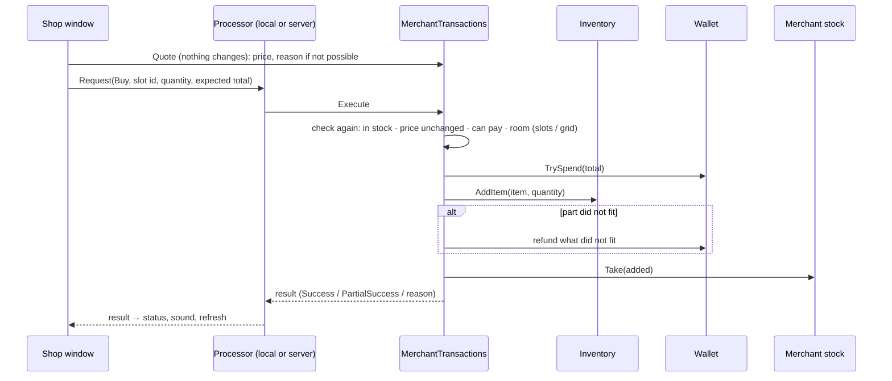

# 05 — Money, Categories & Transactions

**Scripts:** `Essentials/Currency/*`, `Inventory/Items/Categories/*`, `Inventory/Items/MaterialSO.cs`,
`MiscItemSO.cs`, `NPC/Merchant/MerchantTransactions.cs`.

---

## 1. Money

**`CurrencyDefinition`** (*Assets ▸ Create ▸ SimpleMovements ▸ Economy ▸ Currency*): display name, symbol ("g"), icon,
colour, thousands separator, **Starting Amount**, **Max Amount**, and optionally a **Backing Item**.

The project's **default currency** is `Resources/DefaultCurrency` (*Tools ▸ SimpleMovements ▸ Project Setup ▸ Create
Default Currency (Resources)*), else a built-in "Gold" starting at 100. A merchant prices in its own *Currency*, else
in the player's default.

**`CurrencyWallet`** holds the player's money: one balance per currency. It is added to the player automatically the
first time something needs it; add it yourself to set the *Default Currency* and starting *Balances*.

```csharp
CurrencyWallet wallet = CurrencyWallet.For(player);   // finds or adds it
int gold = wallet.GetBalance(null);                    // null = the default currency
bool ok  = wallet.TrySpend(null, 50);                  // all or nothing
wallet.TryAdd(null, 200);                              // a quest reward
wallet.SetBalance(null, savedAmount);                  // loading a save
wallet.BalanceChanged += (currency, before, after) => hud.Refresh();
```

Every change is all-or-nothing and raises `BalanceChanged` (and the static `AnyBalanceChanged`), which the shop window
and any HUD follow.

**Coins as items:** give the currency a *Backing Item* (a `MiscItemSO` "Gold Coin" with a big Stack Max, a Grid Size,
a weight). The balance is then how many the player carries; paying removes them and earning adds them — which needs
room in the bag (slots or grid). The shop checks it and gives the sold items back when the coins do not fit. The
merchant never buys its own coin item.

The live inspector of the wallet has −100 / −10 / +10 / +100 buttons per currency.

## 2. Item categories

A category is an **`ItemCategory`** asset: name, icon, colour, sort order, an optional **Parent** (then it is a
subcategory), explicit **Items**, and **Rules**. The **`ItemCategoryDatabase`** lists them and decides where each item
goes:

1. the **Category** set on the item (*Item ▸ Trading ▸ Category*) — a top category or a subcategory;
2. a category that **lists** the item;
3. the **subcategory** with the highest *Match Priority* whose rules match (catch-alls such as "Other Weapons" use −10);
4. a **top category** whose rules match;
5. the **Fallback** (Miscellaneous).

A rule matches when every condition that is set holds: **Kind** (Weapon, Armor, Accessory, Equippable, Consumable,
Ammo, Material, Miscellaneous), **Item Types**, **Equipment Slots** (the slot the item is worn in: armor by its armor
slot, others by type), **Weapon Categories**, **Material Kinds**, **Consumable Effects** (instant / timed — buffs),
**Name Contains**.

The standard tree (used when the project has no database, and created by *Tools ▸ SimpleMovements ▸ Project Setup ▸
Create Item Category Database (Resources)*):

| Category | Subcategories |
|---|---|
| Weapons | Swords, Axes, Hammers & Maces, Daggers, Spears, Bows (and crossbows), Staves & Wands, Throwing, Fist Weapons, Tools, Other Weapons |
| Armor | Helmets, Chest Armor, Gloves, Boots, Leg Armor, Shields (shield armor and shield weapons), Shoulders, Bracers |
| Accessories | Rings, Amulets, Belts, Trinkets, Cloaks |
| Consumables | Potions, Buffs (potions with timed effects), Food, Ammunition, Other Consumables |
| Materials | Ores & Ingots, Wood & Stone, Herbs, Cloth & Leather, Gems, Monster Parts, Other Materials |
| Miscellaneous | — (the fallback) |

The database inspector shows the tree (add / remove categories and subcategories; they are stored inside the database
asset) and **Where the project's items go** — every item with its category, and those only the fallback took. Each
category's inspector lists the items it takes. A merchant can use its own *Category Database*, show only some tabs (*Shown
Categories*, in that order), list a good under another category (*Category Override*), and price categories
differently (*Category Price Modifier*).

## 3. New item kinds and trading fields

| Asset | Create menu | Use |
|---|---|---|
| `MaterialSO` | *Items ▸ Material* | Crafting resources: Material Kind (Ore, Ingot, Wood, Stone, Herb, Cloth, Leather, Gem, Monster Part, Essence), Tier. Stacks to 64. |
| `MiscItemSO` | *Items ▸ Miscellaneous* | Keys, junk, valuables, trophies; **Quest Item** turns off *Can Be Sold*. |

Every item has a **Trading** header: **Category** (optional) and **Can Be Sold**. Its **Price** is its value — what
merchants' prices are calculated from. `ItemType` gained `Material` and `Miscellaneous`; they go in common slots.

## 4. How a purchase or sale is made safe



* **Everything is checked before anything changes**: stock, price (the request carries the total the player saw; a
  changed price is refused, never charged), money, room in the inventory, ownership (selling: the stack must be in the
  player's bag or hotbar, not worn, not being dragged, with enough units).
* **Changes happen in an order that can be undone.** Buying: pay → add items → refund what did not fit → take from
  stock. Selling: remember the units' durabilities → remove the units (`InventoryManager.ConsumeItem`: weight, the hand
  and emptied stacks follow) → get paid → if the money cannot be received, the very same items come back (or are
  dropped next to the player when there is no room) → the merchant may resell them.
* Money only moves in whole amounts through `TrySpend` / `TryAdd`, which move all or nothing; quantities are clamped
  and overflow-checked.
* One request at a time per window: buttons wait while a request is pending (useful with a server round trip); a late
  answer for a closed window is ignored.

## 5. Multiplayer

Nothing in the window changes the game: it sends `MerchantTransactionRequest`s (merchant, player, stock slot id or the
player's stack, quantity, expected total) to an `IMerchantTransactionProcessor`. The default
`LocalMerchantTransactionProcessor` runs them immediately. For a server-authoritative game:

```csharp
public class NetworkMerchantProcessor : IMerchantTransactionProcessor
{
    public void Submit(MerchantTransactionRequest r, Action<MerchantTransactionResult> done)
    {
        // send (merchant NPC Id, slot id / stack id, quantity, expected total) to the server;
        // the server rebuilds the request from its own objects and runs MerchantTransactions.Execute(request);
        // when its answer comes back: done(result);
    }
}
Merchant.GlobalProcessor = new NetworkMerchantProcessor();     // or merchant.Processor = ... for one merchant
```

Prices come from `MerchantPricing` (deterministic, the same on every machine); stock lives in the merchant's
`MerchantInventory` (`SetQuantity` for replication); balances in `CurrencyWallet` (`SetBalance`); NPCs have a stable
*NPC Id*. The window refreshes from replicated changes through the same events it already listens to.
