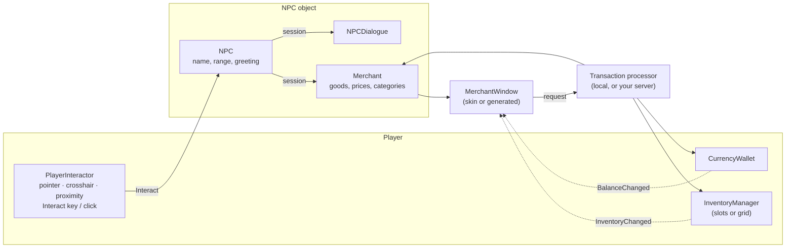

# NPCs, Interaction & Merchants — Guide

Non-player characters the player talks to and trades with: the player's interaction (key, click, proximity), the NPC
component and its options (behaviours), dialogue, and the first NPC type — the **merchant** — with buying, selling,
money, item categories and a shop window that follows the inventory's slot or grid mode.

| Chapter | Covers |
|---|---|
| [01 — Interaction](01-Interaction.md) | `PlayerInteractor`: how targets are found (pointer, crosshair, proximity), several NPCs at once, input actions, clicking, holding, the prompt, `IInteractable`, the older `Player.OnInteract` |
| [02 — NPCs & Dialogue](02-NPCs-and-Dialogue.md) | `NPC`, sessions, options (`NPCBehaviour`), `NPCDialogue`, the dialogue window, events, writing a new kind of NPC |
| [03 — Merchant Setup](03-Merchant-Setup.md) | **Step by step**: a merchant, goods and stock, restocking, prices, buying from the player, categories, currency |
| [04 — Shop Window & Custom UI](04-Shop-Window-and-Custom-UI.md) | The window, slots vs grid (following the inventory), the sell mirror, the skin (your prefabs, sprites, fonts, colours, sounds), the generated fallback UI, a window prefab of your own |
| [05 — Money, Categories & Transactions](05-Money-Categories-and-Transactions.md) | `CurrencyWallet` and currencies (coins as items too), item categories and rules, the new item kinds, how a purchase / sale is made safe, multiplayer |

## Five-minute setup

1. **GameObject ▸ SimpleMovements ▸ NPC ▸ Merchant NPC** (or select your character model and use
   *Tools ▸ SimpleMovements ▸ NPC ▸ Create Merchant NPC*). It gets a collider, an `NPC` and a `Merchant`.
2. Accept the offer to add a **Player Interactor** to the player (or *Tools ▸ SimpleMovements ▸ NPC ▸ Add Player
   Interactor To Players*).
3. In the **Merchant** inspector: select some item assets in the Project window (lock the inspector) and press
   **Add Selected Items**, or **Add Items From Folder…**. The *Shop preview* shows every item's tab and prices.
4. Play. Walk up to the merchant: the prompt reads **[E] Trade Merchant**. Press **E** (or click the merchant).
   Buy on the Buy tab, sell on the Sell tab, close with **Escape**, **E** again or by walking away.

Nothing else is required: the categories, the currency (Gold, 100 to start) and the whole shop window are created
at runtime when you have not made your own. To customise them:

| To change | Do |
|---|---|
| Categories (tabs) | *Tools ▸ SimpleMovements ▸ Project Setup ▸ Create Item Category Database (Resources)* and edit it |
| The money | *Tools ▸ SimpleMovements ▸ Project Setup ▸ Create Default Currency (Resources)* |
| Starting money | A `CurrencyWallet` on the player (Balances) or the currency's *Starting Amount* |
| The window's look | *Assets ▸ Create ▸ SimpleMovements ▸ NPC ▸ Merchant UI Skin*, assign it to the merchant |
| The Interact key | An `Interact` action in your input actions (or the interactor's *Interact Action*) |

## How it fits together

## Files

| Folder | Contents |
|---|---|
| `NPC/Core/` | `NPC`, `NPCBehaviour`, `NPCInteractionSession`, `NPCDialogue` |
| `NPC/UI/` | `NPCWindow` (base of NPC windows, window cache), `NPCDialogueWindow` |
| `NPC/Merchant/` | `Merchant`, `MerchantStock` (+ entries, runtime stock), `MerchantPricing` (+ modifiers), `MerchantTransactions` |
| `NPC/Merchant/UI/` | `MerchantWindow`, `MerchantUISkin`, `MerchantUIBuilder`, `MerchantItemEntryUI`, `MerchantTabButton`, `MerchantDetailsPanel`, `MerchantConfirmDialog`, `MerchantDisplayEntry` (+ `MerchantGridPacker`) |
| `Essentials/Interactables/` | `IInteractable`, `PlayerInteractor`, `InteractionPromptUI`, `LegacyInteractableTarget` |
| `Essentials/Currency/` | `CurrencyDefinition`, `ICurrencyAccount`, `CurrencyWallet` |
| `Essentials/Input/PointerCapture.cs`, `Essentials/UI/GameplayUIRoot.cs` | Click claiming, the canvas for gameplay windows |
| `Inventory/Items/` | `MaterialSO`, `MiscItemSO`, `Categories/ItemCategory`, `Categories/ItemCategoryDatabase` |
| `Inventory/InventoryManager/IGameplayPanel.cs` | Windows that count as open inventory UI |
| `CustomEditor/NPC/` | Inspectors, setup menus, Edit Mode tests |

### Changes to existing scripts

| Script | Change | Why |
|---|---|---|
| `ItemSO` | **Trading** header: `Category` (optional), `Can Be Sold` (on). `ItemType` gains `Material` and `Miscellaneous` (at the end, so assets keep their values) | Items need a shop category and a way to forbid selling quest items |
| `InventoryManager` | `For(player)`; `RegisterPanel` / `UnregisterPanel` / `CloseTopPanel`, `IsExternalPanelOpen`, `IsAnyPanelOpen`; inputs and the cursor respect registered windows; hotbar keys wait while gameplay input is paused | A shop must keep the cursor free, stop clicks from attacking, and close with Escape before the pause menu — like the inventory itself |
| `PlayerAbilityController.IsPointerCapturedFor` | Also true when a click is claimed through `PointerCapture` | Clicking an NPC must not swing the weapon |
| `PauseMenuManager` | Escape closes a registered window before the inventory | Same order as the inventory |
