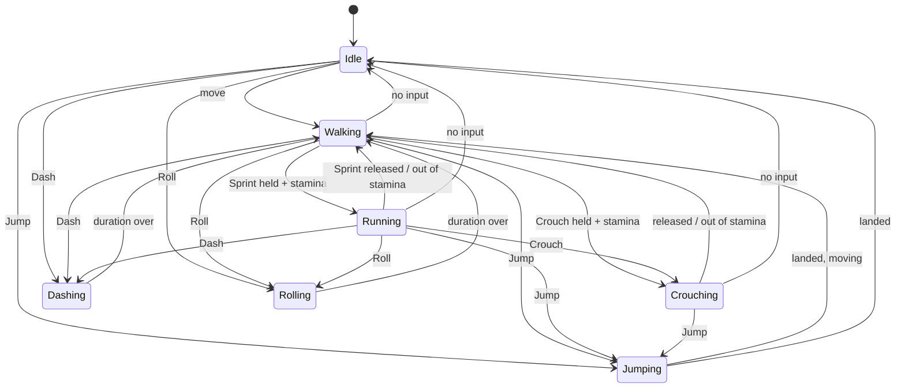

# Player 02 — Movement & Input

**Scripts:** `Player/Controller/MovementStateMachine/MovementStateMachine.cs`, `MovementContext.cs`,
`MovementState.cs`, `States/*`, `Player/Controller/Movement/PlayerMovementController.cs`,
`Player/Model/PlayerMovementModel.cs`, `PlayerDashModel.cs`, `PlayerRollModel.cs`,
`Player/Controller/SharedPlayerInput.cs`, `Player/Controller/AvailabilityStateMachine/*`.

---

## 1. The movement state machine

Every frame the current state is asked for the next one (`GetNextState`), then updated. Changing state runs the old
state's `ExitState` and the new one's `EnterState`.

| State | Speed | Stamina | Notes |
|---|---|---|---|
| Idle | 0 | regenerates | |
| Walking | Speed Manager ▸ Speed | regenerates | |
| Running | Speed × Running Multiplier | Sprint Cost every *Stamina Consume Interval* | Needs Sprint held |
| Crouching | Speed × Crouching Multiplier | Crouch Cost per interval | Needs Crouch held |
| Jumping | keeps horizontal speed | Jump Cost once | Running jumps use 1.75× the force |
| Dashing | Dash Speed × speed for Dash Duration | Dash Cost once | Cooldown |
| Rolling | Roll Speed × speed for Roll Duration | Roll Cost once | Cooldown |

Every transition also requires `AvailabilityStateMachine.CanMove()`: nothing moves while **stunned** or **dead**.
Stamina costs only apply when the model's **Should Consume Stamina** is on.

### Jumping

* **Jump height** ≈ `Jump Force² / (2 × |Gravity × Gravity Multiplier|)`. Example: force 6, gravity −9.81,
  multiplier 2 → 0.92 m.
* **Jump buffering**: a press is remembered for *Jump Buffer Time* (0.2 s, `MovementContext`). Pressing slightly
  before landing, or on a frame the state machine is busy, still jumps.
* The jump lasts while the player moves upward or is in the air; it ends on landing. (It used to end on its first
  frame because the player was still touching the ground, and the jump was lost.)
* The ground check is a short ray from the feet (`PlayerMovementController.IsGrounded`). The *Shell* object of the
  Movement Model is its origin: put it at the feet.

---

## 2. Input actions

Create an Input Actions asset, tick **Generate C# Class** and name the class **`PlayerInput`**. The movement
states read these actions of the **Player** map (names must match):

| Action | Type | Used by |
|---|---|---|
| `Movement` | Value, Vector2 (WASD / left stick) | Walking, running, crouching |
| `Sprint` | Button (hold) | Running |
| `Crouch` | Button (hold) | Crouching |
| `Jump` | Button | Jumping (buffered) |
| `Dash` | Button | Dashing |
| `Roll` | Button | Rolling |
| `OpenEmoteWheel` | Button | Emote wheel |

Other systems find their actions **by name**, so missing ones are simply unused:

| System | Action names looked for | Fallback |
|---|---|---|
| Inventory open / close | `Inventory`, `OpenInventory`, `ToggleInventory` | Tab and I |
| Use item / attack with the weapon | `UseItem`, `Use`, `Attack`, `PrimaryAttack`, `Fire`, then any Player action bound to the left mouse button | Left mouse button |
| Armor Sets window | `ArmorSetUI`, `ArmorSets`, `Sets` | The Sets button on the inventory |
| Ability keys | Chosen per key in the ability key inspector | — |

Camera look, zoom, interaction and the extra attack inputs come through a **Player Input** component's events
([01 §5](01-Player-Setup.md)).

`SharedPlayerInput` keeps **one** generated `PlayerInput` per player for every reader (each `new PlayerInput()`
otherwise builds and enables a full copy of the actions). It counts holders and enables, so one component turning
off never cuts the input of the others.

---

## 3. Settings

### Movement Model

| Field | Meaning |
|---|---|
| Speed Increment Factor | How fast speed ramps up (1 = normal) |
| Amount Of Sprint / Crouch Stamina Cost | Stamina per tick while sprinting / crouch-walking |
| Stamina Consume Interval | Seconds between those ticks (0.2) |
| Gravity | Negative acceleration (−9.81) |
| Gravity Multiplier | Higher = snappier jumps, faster falls |
| Jump Force | Upward speed when jumping |
| Amount Of Jump Stamina Cost | Per jump |
| Player Shell Object | The feet (ground check origin) |
| Player Transform | What rotates to face the movement / camera |
| Controller | The `CharacterController` |
| Should Consume Stamina | Sprint, crouch, jump (and traits like wall climb) spend stamina |

### Dash / Roll Models

| Field | Dash | Roll |
|---|---|---|
| Speed | `Dash Speed` (× current speed) | `Roll Speed Modifier` (× current speed) |
| Duration (s) | `Dash Duration` | `Roll Duration` |
| Cooldown (s) | `Dash Cool Down` | `Roll Cool Down` |
| Stamina | `Amount Of Dash Stamina Cost` | `Amount Of Roll Stamina Cost` |

### Speed Manager

Base **Speed**, the **running** and **crouching** multipliers, and speed effects (slows and hastes from abilities,
traits, weight). The weight carried can slow the player (Weight Manager).

---

## 4. Availability (stun, silence, death)

`AvailabilityStateMachine` has three states: **Unaffected**, **Stunned** (cannot move or act) and **Death**. It also
tracks silence (no abilities), slows and poison as status effects. Combat effects call it; its inspector has test
buttons in Play mode (Stun 2s, Silence 3s, Clear, Kill, Revive).

When health reaches 0 through combat damage the player is killed (*Combat Settings ▸ Kill Players At Zero Health*).
