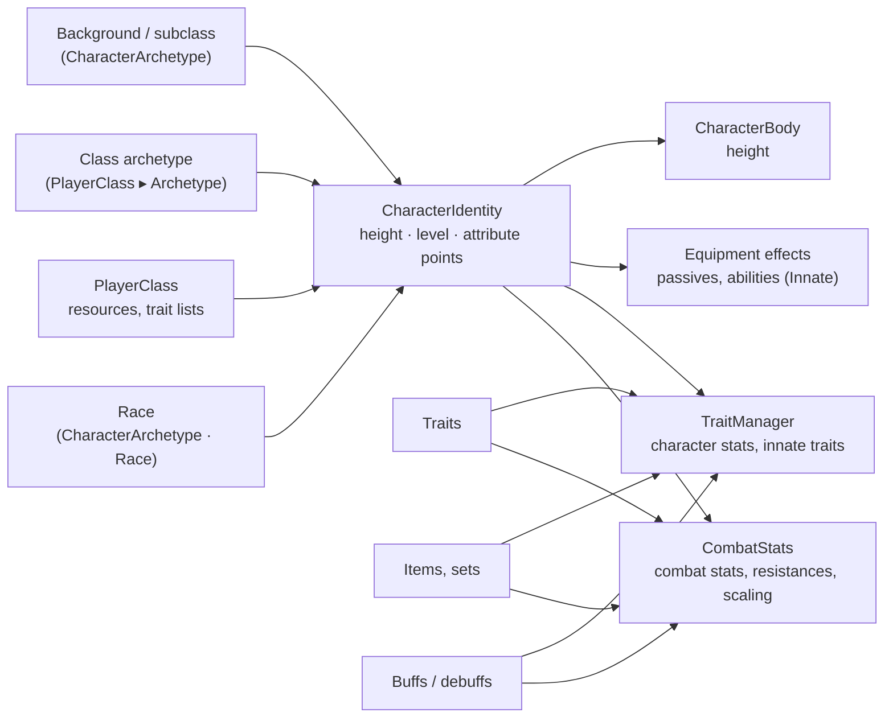

# Player 06 — Races, Classes, Advanced Stats, Buffs & Threat

How characters differ (race, class, background, traits), every combat stat with its formula, stacking rule and cap,
how stats reach weapons, abilities and items (and how those change stats back), timed buffs and debuffs, and how mobs
choose between several players (threat / aggro).

---

## 1. Races or classes? One model for both

**Recommendation:** use `CharacterArchetype` for anything that defines a character, and combine them.



* **Only classes:** keep `PlayerClass`; add a `CharacterIdentity` to the player so its combat block is applied; link an
  archetype when a class needs growth per level, scaling, passives or abilities.
* **Only races:** archetypes of kind *Race* in *Character Creation UI ▸ Available Races*; classes can stay minimal.
* **Both:** a race + a class (+ backgrounds). They stack; *Incompatible With* forbids combinations.

`PlayerClass` is kept (existing assets, the creation screen, resource values that the status controller sets). The
archetype holds everything that is shared between races and classes, so there is no second "class stats" system.

---

## 2. `CharacterArchetype` (Create ▸ SimpleMovements ▸ Character ▸ Character Archetype (Race - Class))

| Section | Fields |
|---|---|
| Identity | Kind (Race, Class, Background, Other), name, description, icon, colour, available at creation |
| Body | Sets Height, Height Range, Default Height (metres) |
| Base Combat Stats | Combat stats, elemental resistances, scaling rules (`Agility gives 0.1 Critical Chance per point`), character stats (max health %, move speed...) |
| Growth Per Level | Combat stats and character stats × (level − 1) |
| Passives & Abilities | Any equipment effect: **Ability On A Key** (racial ability, granted as *Innate*), On Hit, When Hit, Pulse / aura, Conditional (night, low health), Grant Traits, **Enhance Trait** (a trait ×1.2 for this race) |
| Traits | Innate traits (free, cannot be removed), Offered Traits (extra choices at creation), Forbidden Traits, Trait Affinities (cost × per trait or per type), Bonus Trait Points |
| Combinations | Incompatible With |

The inspector shows what the player will see, a growth preview at any level, setup checks, **Apply Preset**
(Human, Elf, Dwarf, Orc, Warrior, Rogue, Mage) and, in Play Mode, the characters using it with a *Re-apply* button.
*Assets ▸ Create ▸ SimpleMovements ▸ Character ▸ Archetype Presets* creates the four races or the three class
archetypes at once.

### `CharacterIdentity` (on the player or a mob)

| Field | Meaning |
|---|---|
| Race, Other Archetypes | The archetypes of this character. |
| Use Class From Status | The `PlayerStatusController`'s class is used: its combat block and its archetype. |
| Apply Class Combat Stats | Strength, Agility, Intelligence, Endurance, Defense, Magic Resistance, Critical Chance, Critical Damage (above 150), Attack / Casting Speed (above 1). |
| Height | Metres (0 = the race's default), clamped to the race's range. |
| Level | 0 = from the Experience Manager; set it on mobs. |
| Attribute Upgrades | Points spent on level-up. **Save this list** with the character. |

API: `SetRace`, `AddArchetype`, `RemoveArchetype`, `SetHeight`, `SetLevel`, `AddAttribute`, `SetAttributeUpgrades`,
`Reapply`, `Archetypes`, `Describe()`, event `Changed`. Level-ups apply only the new growth (abilities keep their
cooldowns, traits are not re-added).

### Character creation

*Character Creation UI ▸ Races (optional)*: Available Races, Race Required, Race List Container (race buttons use the
class button prefab), Race Description, Height Slider / Height Text, All Traits (the pool when a class has no trait
list). With no races configured there is no race step. Trait points = class points + archetype bonuses;
the trait list = the class's selectable traits (or All Traits) + the race's offered traits − forbidden / *Only For*
traits; costs use the class's preferred / difficult types × every archetype's affinities (drawbacks keep their value).
On *Create*, a `CharacterIdentity` is added when needed with the race and height.

---

## 3. Stat reference

All percent stats are **percentage points that add**: +10 and +15 = +25%. Every source — base stats, race, class,
traits, items, set bonuses, buffs, debuffs, attribute points — stacks the same way. Scaling rules use the raw totals
(they never chain). Caps are on the *Combat Stats* component.

### Attributes and existing stats

| Stat | Effect |
|---|---|
| Strength / Agility / Intelligence | Weapons scaling with the attribute: +1% damage per point (*Weapon Damage Percent Per Attribute Point*). Agility: +0.5% attack speed and +0.2 crit chance per point. Intelligence: +1% ability damage per point. |
| Endurance | +5 max health per point. |
| Defense (Armor) | Points. Physical damage × (1 − armor / (armor + *Defense Half Value* 100)), at most *Max Damage Reduction* (80%). Body parts can use their own armour. |
| Magic Resistance | Same curve for magical damage. |
| Critical Chance / Damage | Weapons **and abilities** (*Use Caster Critical* on Damage effects). |
| Attack / Casting / Charge Speed | Weapon timing; ability cast time ÷ (1 + %); charging hold attacks. |
| Weapon Damage, Attack Stamina Cost, Knockback | % more weapon damage; % stamina per attack (negative = cheaper); % longer knockback. |
| Elemental Damage | % more damage of elemental hits **dealt** (weapons, abilities, DoTs). Limited to Poison = *Poison Damage*. |

### New stats

| Stat | Formula / use | Limit |
|---|---|---|
| **Height** | Body scale = 1 + %. Model, collider, NavMeshAgent, body-part hitboxes, measured body (hit shapes, strike heights). | scale 0.5–2 |
| **Threat** | Threat generated × (1 + %) — damage, healing, control, taunts, Threat effects. Negative = stealthy. | ≥ 0 |
| **Crowd Control Duration** | Stuns, roots, silences, slows, taunts applied last × (1 + %). | ≥ 0 |
| **Crowd Control Resistance** | Control on this character lasts × (1 − %). Multiplies with the trait stat *Control Duration Taken*. | *Max Control Resistance* 80% |
| **Buff Duration / Strength** | Stat buffs last longer / have stronger values; heals over time last longer (same healing per second). | ≥ 0 |
| **Debuff Duration / Strength** | Stat debuffs and damage over time last longer / tick harder. Element filter: *Poison Strength* = Debuff Strength (Poison). | ≥ 0 |
| **Status Chance** | Added to the chance of DoTs and debuffs (points). *Poison Chance* = Status Chance (Poison). | chance 0–1 |
| **Status Resistance** | DoTs and debuffs on this character last × (1 − %). *Poison Resistance* = Status Resistance (Poison). | *Max Status Resistance* 80% |
| **Physical / Magic Defense** | % less physical / magical damage after armour / MR. Penetration does not reduce it. | *Max Damage Reduction* |
| **Armor Penetration** | % of the target's armour ignored (applied first). | 0–100% |
| **Physical Penetration** | Armour points ignored (after Armor Penetration). | armour ≥ 0 |
| **Magic Penetration** | % of the target's Magic Resistance ignored. | 0–100% |
| **Draw Speed** | Bows / crossbows / thrown weapons draw × (1 + %) (on top of Charge Speed). | ≥ 0.1× |
| **Reload Speed** | Reload time ÷ (1 + %). | ≥ 0.1× |
| **Mana Cost Reduction** | Ability mana cost × (1 − %). Scope: Everything, Skills, Innate, Items. | *Max Mana Cost Reduction* 80% |
| **Cooldown Reduction** | Ability cooldowns × (1 − %). Scope as above; *Items* also shortens consumable / item cooldowns (potions, weapon cooldowns, quickslots). | *Max Cooldown Reduction* 60% |

**Filters on a modifier** (the inspector shows the one the stat uses): *Only With Weapon* (category), *Only Element*
(element-aware stats: Elemental Damage, Debuff Duration / Strength, Status Chance / Resistance), *Scope* (Cooldown and
Mana Cost Reduction). Filtered modifiers count only for that element / kind of ability.

**Poison, in full:** chance = effect chance + Status Chance (Poison); damage per tick × Debuff Strength (Poison) ×
Elemental Damage (Poison) of the attacker; duration × Debuff Duration (Poison) of the attacker × (1 − Status Resistance
(Poison)) of the target; each tick reduced by the target's Poison elemental resistance. The same applies to every
element (burn, bleed...) and to mobs.

### Damage pipeline (any source: weapons, abilities, DoTs, thrown items, players and mobs)

```
1. Attacker:  weapon / ability amount, crit (crit chance + crit damage of the attacker)
2. Attacker:  Elemental Damage for the hit's element                     (IDamageDealtModifier)
3. Target:    Physical → armour × (1 − ArmorPen%) − PhysPen → curve → × (1 − Physical Defense%)
              Magical  → MR × (1 − MagicPen%)              → curve → × (1 − Magic Defense%)
              True     → nothing
4. Target:    elemental resistance of the hit's element
5. Target:    traits (Damage Taken), shields, body-part multipliers, other damage-taken modifiers
```

---

## 4. How stats, items, weapons, abilities and traits affect each other

| When | Stats used | Changed by |
|---|---|---|
| **Using a weapon** | Attack Speed, Attack Stamina Cost, Charge Speed, Draw Speed, Reload Speed, Knockback (per weapon category) | Race / class / traits / items / buffs; weapon traits |
| **Dealing weapon damage** | Weapon Damage, attribute scaling, Crit Chance / Damage, Elemental Damage, Armor / Physical / Magic Penetration, Threat (+ the attack's *Threat Multiplier*) | same |
| **Casting an ability** | Casting Speed (cast time), Intelligence (damage), Cooldown / Mana Cost Reduction by scope (skill, innate, item), trait ability modifiers | same; *Innate* = granted by race / class / traits, *Items* = granted by equipment |
| **Ability effects** | Damage: crits, threat. DoT: Status Chance, Debuff Strength / Duration. Stat buffs: Buff / Debuff stats. Control: Crowd Control Duration. Heals: Buff Duration (HoT), threat | the caster's stats |
| **Using an item** | Cooldown Reduction (Items) | same |
| **Receiving damage** | Defense, MR, Physical / Magic Defense, elemental resistances, body-part armour, shields, Damage Taken | everything above, debuffs (armour break) |
| **Receiving control / DoT / debuffs** | Crowd Control Resistance, Status Resistance (per element) | same |
| **Body size** | Height | race, height picked, items, buffs (giant potion) |

And the other direction — what changes stats: race / class / background (permanent), level growth and attribute
points, traits (while owned), equipment and set bonuses (while worn, partial sets by tier), **Stat Buff or Debuff**
effects (abilities, weapon on-hit effects, consumables that cast an ability), conditional effects (low health, night),
and auras / pulses.

---

## 5. Buffs and debuffs

**Ability effect: Buff ▸ Stat Buff or Debuff** — label, kind (Auto: a debuff only when nothing in it helps; Buff;
Debuff), duration, element, combat stats, resistances, character stats, stacking (Refresh / Stack up to N / Ignore),
attached VFX.

* Buffs: duration × the caster's Buff Duration; values × Buff Strength.
* Debuffs: chance + Status Chance; duration × Debuff Duration × the target's (1 − Status Resistance); values × Debuff
  Strength. Element filters apply (a poison's "weakened" debuff with element Poison).
* Applied as one modifier set on the target (`TimedStatModifiers`, added automatically) and **removed exactly** on
  expiry, cleanse, dispel, death, revive or when the component is destroyed. Refresh re-applies at the new strength;
  Stack keeps separate copies.
* **Support ▸ Cleanse**: crowd control, debuffs, optionally damage over time. **Support ▸ Dispel Buffs**: removes the
  target's buffs.

Examples: *Battle Cry* (+15% Weapon Damage, +10% Attack Speed, 10 s, self + allies); *Armor Break* (−30 Defense, 6 s,
enemies); *Neurotoxin* (Poison: −25% Move Speed, Debuff, element Poison); *Giant Potion* (+20% Height, +20% Max
Health). Weapons use them through their on-hit ability effects; consumables through the ability they cast.

---

## 6. Threat and aggro (mobs, multiplayer)

Threat lives on the mob's `CombatEntity` (one table per mob, per attacker).

| Source | Threat |
|---|---|
| Damage | amount × *Threat Per Damage* (1) × attack / ability *Threat Multiplier* × attacker's Threat stat |
| Healing an ally the mob is fighting | healed × *Threat Per Healing* (0.5), split among the mobs fighting that ally |
| Crowd control | each stun / root / slow / silence applied: *Threat Per Control* (0.02) × the mob's max health |
| Taunt | jumps above the top threat × *Taunt Threat Multiplier* (1.1) — and the mob is forced onto the taunter for the taunt |
| Being noticed | *Detection Threat* (0.02 × max health) once |
| First contact | the first character on an empty table gets *First Contact Threat* (0.1 × max health) extra |
| **Support ▸ Threat** effect | Add an amount, Multiply (2 = double, 0 = vanish), or Top (taunt without forcing) |

Threat **decays** after *Threat Decay Delay* (5 s without new threat) by *Threat Decay Per Second* (5%) and is
forgotten after the mob's memory. Mobs with *Use Threat Table* (Mob Profile ▸ Threat, on by default) attack the top
threat, but keep their current target until someone exceeds it by the **switch margin** — 110% in melee range
(*Threat Melee Range* 4 m), 130% at range — and only after *Threat Min Time On Target* (1.5 s). *Threat Loyalty*
scales the margins per mob (bosses 2 = sticky, beasts 0.5 = fickle). A target it cannot reach (no ranged attack) counts
at 30%, so others take over.

So: the first player to hit or be seen is attacked first; a tank (Threat +25%, taunts) holds it; a big hitter or a
healer can pull it away by out-threatening the margin; a rogue (Threat −25%, a Multiply 0 "vanish") sheds it.

**Debugging:** select the mob in Play Mode — the *Combat Entity* inspector shows the threat table as bars, the
current target and its buffs / debuffs. `GetThreatTable()` and the `ThreatAdded(source, amount, kind)` event drive
threat meters.

**Multiplayer:** run threat and target selection on the server / host only (it owns the mobs); clients only need the
mob's target (one id) and, if you show meters, the table. Damage, healing and control already flow through
`CombatEntity` on the authority, so threat needs no extra sync. Only the identity (race, class, height, level,
attribute points, traits) must be replicated per player — every stat is derived from it.

---

## 7. Traits with combat stats

*Trait ▸ Combat Stats / Resistances / Scaling Rules* add to Combat Stats while the trait is active (scaled by its
strength, e.g. *Enhance Trait* from a race or an armour set) and are removed exactly. *Only For* lists the races /
classes that may take it; the Trait Manager refuses others in game too. Trait-side stats (*Control Duration Taken*,
*Ability Cooldown*, *Ability Cost*) still work and multiply with the combat stats.

---

## 8. Setup checklist

1. Player: `CombatStats` (added automatically), add **`CharacterIdentity`** and, for height, **`CharacterBody`**
   (Model = the visual child, Model Height = its authored height).
2. Create races (*Character Archetype From Preset ▸ Races*) and tune them; link class archetypes in each `PlayerClass`.
3. Character Creation UI ▸ Races: assign the races, a container, optionally the height slider.
4. Traits: add combat stats, *Only For*; races: affinities, offered / forbidden traits.
5. Abilities: *Stat Buff or Debuff*, *Threat*, *Cleanse*, *Dispel*; damage effects keep *Use Caster Critical* on.
6. Mobs: optional `CharacterIdentity` (race, level) and `CombatStats`; Mob Profile ▸ Threat.
7. Save `CharacterIdentity.AttributeUpgrades`, race, height and level with the character.

## 9. Troubleshooting

| Symptom | Cause / fix |
|---|---|
| Class Strength / Defense do nothing | No `CharacterIdentity` on the player (or *Apply Class Combat Stats* off). |
| Stats doubled | The same values in `CombatStats ▸ Innate Values` and in the class — keep one. |
| Height changes nothing | No `CharacterBody`, or its *Model* is empty (only the collider is resized). |
| A race trait is not offered | It is not in the class list / All Traits / the race's *Offered Traits*, or *Only For* excludes it. |
| Mob never switches target | *Threat Loyalty* high, margins in Combat Settings ▸ Threat, or *Use Threat Table* off. |
| A debuff is never applied | Its chance, the target's Status Resistance, or *Only Affects* does not include enemies. |
