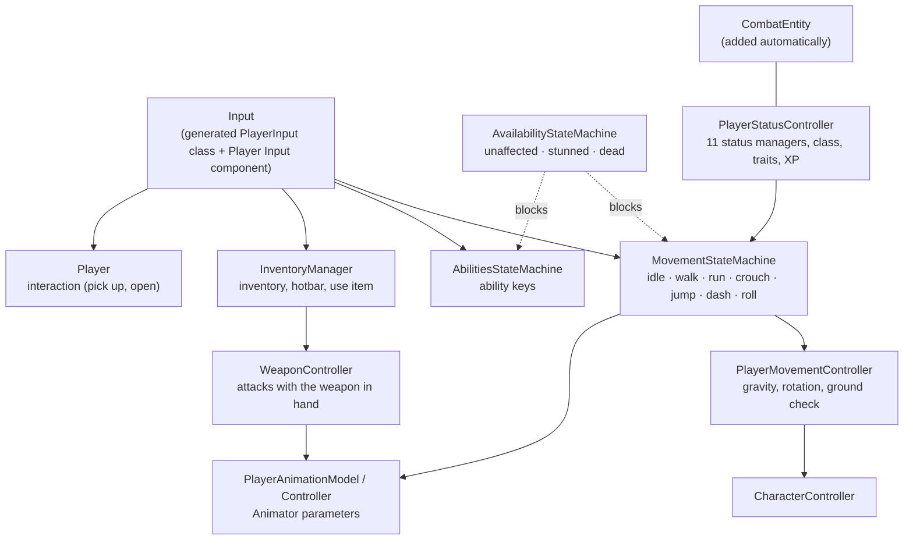

# Player — Guide

How to build the player prefab and what each of its scripts does: movement and input, stamina and the other status
bars, classes, traits and experience, the camera, animation and ability keys. The inventory, items, armor and weapons
the player carries are in the [Inventory guide](../Inventory/README.md).

| Chapter | Covers |
|---|---|
| [01 — Player Setup](01-Player-Setup.md) | Step by step: the prefab, its components and hierarchy, the setup buttons, the input component, the UI |
| [02 — Movement & Input](02-Movement-and-Input.md) | Movement state machine (idle, walk, sprint, crouch, jump, dash, roll), input actions, jump buffering, stamina costs, stun and death |
| [03 — Status, Classes, Traits & Experience](03-Status-Classes-Traits-XP.md) | The 11 status managers, `PlayerStatusController`, player classes, traits, experience and level-ups |
| [04 — Camera, Animation & Abilities](04-Camera-Animation-Abilities.md) | Cinemachine cameras, the Animator parameters, interaction, ability keys |
| [05 — Troubleshooting](05-Troubleshooting.md) | Symptoms → causes → fixes |

## The player at a glance

## Ten-minute setup

1. Create the Combat Settings and Trait Database: *Tools ▸ Abilities ▸ Create Combat Settings (Resources)*,
   *Tools ▸ Traits ▸ Create Trait Database (Resources)*.
2. Make a player GameObject with a `CharacterController` and the movement scripts; press each component's
   **Auto-assign References** ([01 §3](01-Player-Setup.md)).
3. Add `PlayerStatusController` and press **Complete Setup Wizard**: it adds every status manager, the experience and
   trait managers and the dash / roll models, and wires them.
4. Add the model with its Animator as a child; add `PlayerAnimationModel` and `PlayerAnimationController`.
5. Add an `InventoryManager` and a `WeaponController` (Hand = the hand bone). Select the player: the inventory UI,
   status bars and interaction prompt are built automatically.
6. Add a **Player Input** component for the camera and interaction events ([01 §5](01-Player-Setup.md)).
7. Press Play.
