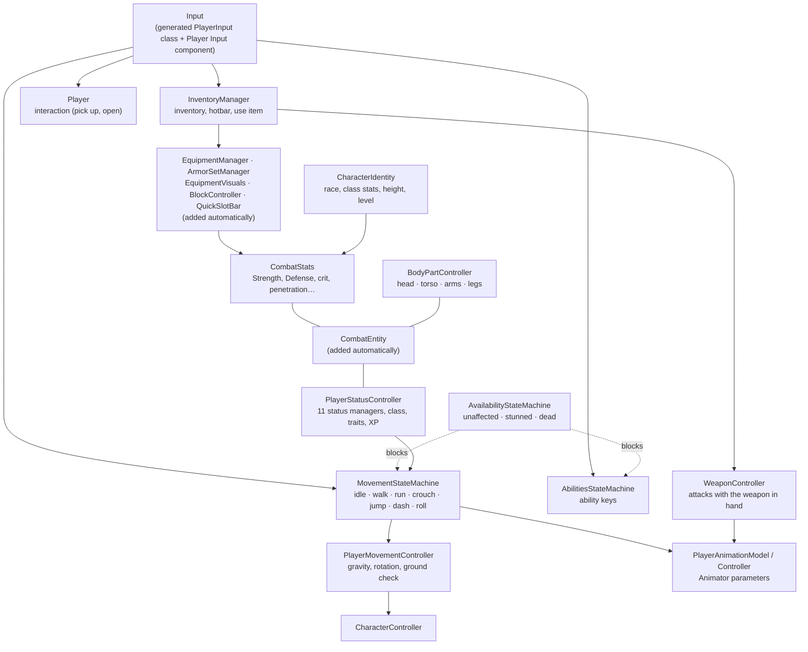

# Player — Guide

How to build the player prefab and what each of its scripts does: movement and input, stamina and the other status
bars, classes, races, traits and experience, combat stats, body parts, the camera, animation and ability keys. The inventory, items, armor and weapons
the player carries are in the [Inventory guide](../Inventory/README.md).

| Chapter | Covers |
|---|---|
| [01 — Player Setup](01-Player-Setup.md) | Combat Settings, Absorption Settings and the other project assets (what and why), the hierarchy, every component (added by you or automatically), the Player Setup Validator, body parts, the Armor Sets window, input, the character creation screen, the pause and settings menu (key bindings), checklist |
| [02 — Movement & Input](02-Movement-and-Input.md) | Movement state machine (idle, walk, sprint, crouch, jump, dash, roll), input actions, jump buffering, stamina costs, stun and death |
| [03 — Status, Classes, Traits & Experience](03-Status-Classes-Traits-XP.md) | The 11 status managers, `PlayerStatusController`, player classes, traits, experience and level-ups |
| [04 — Camera, Animation & Abilities](04-Camera-Animation-Abilities.md) | Cinemachine cameras, the Animator parameters, interaction, ability keys |
| [05 — Troubleshooting](05-Troubleshooting.md) | Symptoms → causes → fixes |
| [06 — Races, Classes, Advanced Stats, Buffs & Threat](06-Races-Classes-Stats-and-Threat.md) | Races / classes / backgrounds on one archetype model, character identity and height, every combat stat with formulas and caps, the damage pipeline, timed buffs and debuffs, threat and multiplayer aggro |

## The player at a glance

## Ten-minute setup

1. Create the Combat Settings and Trait Database: *Tools ▸ SimpleMovements ▸ Project Setup ▸ Create Combat Settings (Resources)*,
   *Tools ▸ SimpleMovements ▸ Project Setup ▸ Create Trait Database (Resources)*; put the player's layer in *Combat Settings ▸ Character Layers*
   ([01 §1](01-Player-Setup.md#1-project-wide-assets-once-per-project)).
2. Make a player GameObject with a `CharacterController` and the movement scripts; press each component's
   **Auto-assign References** ([01 §3](01-Player-Setup.md)).
3. Add `PlayerStatusController` and press **Complete Setup Wizard**: it adds every status manager, the experience and
   trait managers and the dash / roll models, and wires them.
4. Add the model with its Animator as a child; add `PlayerAnimationModel` and `PlayerAnimationController`.
5. Add an `InventoryManager` and a `WeaponController` (Hand Game Object = the right hand bone). Select the player: the
   inventory UI, quickslots, status bars, interaction prompt and Armor Sets window are built automatically.
6. Optional: `CharacterIdentity` + `CharacterBody` (race, class stats, height), `BodyPartController` with
   **Add Hitboxes (Humanoid)** ([01 §5](01-Player-Setup.md#5-body-parts-on-the-player)).
7. Add a **Player Input** component for the camera and interaction events ([01 §7](01-Player-Setup.md#7-input)).
8. Add a **Player Setup Validator** and fix anything red. In the scene: *Tools ▸ SimpleMovements ▸ Scene UI ▸ Build Pause & Settings Menu*,
   and where characters are created *Tools ▸ SimpleMovements ▸ Scene UI ▸ Build Character Creation Screen*
   ([01 §8](01-Player-Setup.md#8-the-scene-character-creation-and-the-pause-menu)).
9. Press Play.
