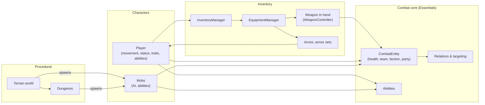
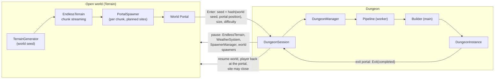

# Simple Movements — Documentation

Guides for every system in `Assets/Scripts/`. Each part has a README with its chapters; the **setup** chapters are
step-by-step, the others explain how the system works and what every setting does.

| Part | Folder | Start with |
|---|---|---|
| **Player** — the player prefab and its scripts: movement and input, stamina and status bars, classes, traits, experience, camera, animation, ability keys | [`Player/`](Player/README.md) | [Player 01 — Setup](Player/01-Player-Setup.md) |
| **Mobs** — creatures and enemies: setup, AI profiles, perception, temperament, combat, abilities, animation, death, spawning | [`Mobs/`](Mobs/README.md) | [Mobs 01 — Setup](Mobs/01-Mob-Setup.md) |
| **Inventory, items, armor and weapons** — inventory UI (slots or grid), items, equipment, armor sets, weapons and attacks, dual wielding, shields and blocking, ranged weapons and ammo, body-part damage, equipment visuals, quickslots, teams / factions / friendly fire | [`Inventory/`](Inventory/README.md) | [Inventory 08 — Setup Guide](Inventory/08-Setup-Guide.md) |
| **Terrain** — the endless open world: noise, landforms, mountains, volcanoes, Voronoi biomes, climate, water (oceans, lakes, rivers, waterfalls), erosion, meshes, colliders, textures and shaders, weather, objects, world portals and mobs | [`Terrain/`](Terrain/README.md) | [Terrain 01 — Architecture](Terrain/01-Architecture.md) |
| **Dungeons** — multi-floor procedural dungeons entered through world portals: planning, layouts (rooms, BSP, caves, hybrid, maze), connectivity and corridors, roles, heights, validation, population, meshing and build, runtime | [`Dungeon/`](Dungeon/README.md) | [Dungeon 01 — Architecture](Dungeon/01-Architecture.md) |

## How the parts fit together

* The **player** owns the inventory; items in equipment slots and the weapon in hand change the player's stats,
  traits and attacks.
* The **player** and **mobs** are both `CombatEntity`s: weapons, abilities and AI all damage, heal and target them
  through the same combat core (teams, factions, parties, friendly fire).
* The **terrain** and **dungeons** spawn mobs; dungeons are entered through world portals.

---

# Procedural generation

Documentation for the two procedural systems in `Assets/Scripts/Procedural/`.

## How the two systems meet

The dungeon reuses terrain infrastructure (`TerrainWorkerPool`, `PlacementRandom`, `MeshColliderBaker`,
`GenerationStats`, `WorldSpawnRegistry`) but no terrain data. It is built far below the world (y = −10 000).

## Editor menus

Everything is under one **SimpleMovements** entry in each menu.

| Menu | Contents |
|---|---|
| *Assets ▸ Create ▸ SimpleMovements ▸ Character* | Player Class, Character Archetype (Race - Class), Archetype Presets (races, class archetypes), Trait, Trait From Preset…, Trait Database |
| *… ▸ Items* | Weapon, Weapon From Template, Armor, Ammo (+ Ammo Preset), Consumable (+ Consumable Preset), Equippable (Accessory), Armor Set, Combo Tree, Random Item Spawns (Storage) |
| *… ▸ Abilities* | Ability Definition, Ability From Preset…, Ability Database, Absorption Settings |
| *… ▸ Combat* | Combat Settings, Faction, Body Part Profile, Elemental Reactions |
| *… ▸ Mobs* / *World* / *Dungeon* | Mob Profile (+ presets) / Biome / dungeon profiles, themes, tables, room templates |
| *… ▸ Legacy* | Old ability assets (AbilityEffectSO, PlayerAbilitySO) and the old Player Class template, kept for existing assets — use the entries above for new ones |
| *Tools ▸ SimpleMovements ▸ Project Setup* | Create Combat Settings / Absorption Settings / Ability Database / Trait Database (Resources) |
| *… ▸ Player* | Add Player Setup Validator To Selection, Auto-Setup All Players In Scene |
| *… ▸ Scene UI* | Build Character Creation Screen, Build Pause & Settings Menu |
| *… ▸ Inventory* | UI Builder, Auto-Build UI When Missing, Armor Set Wizard, Attack Preview, Grid Inventory |
| *… ▸ Mobs* | Create New Mob, Add Missing Components, Spawnable Mob Helper, Help |
| *… ▸ Validate* | Validate All Abilities / Players / Traits |
| *… ▸ Dungeon* / *Legacy* | Dungeon tools / Convert Selected Legacy Abilities |
| *GameObject ▸ SimpleMovements* | Quick Setup Mob (right-click a model) |

## Reading order

1. The two **Architecture** chapters (macro flowcharts, data flow with feedback loops, dependency graphs).
2. The chapter for the system you are working on (each has micro flowcharts of its algorithms).
3. **Configuration Reference** ([Terrain 18](Terrain/18-Configuration-Reference.md),
   [Dungeon 12](Dungeon/12-Configuration-Reference.md)) before tuning.
4. **Debugging** ([Terrain 19](Terrain/19-Debugging.md), [Dungeon 13](Dungeon/13-Debugging.md)) when something looks
   wrong.

## Flowchart index

| Topic | Macro | Micro |
|---|---|---|
| Terrain generation (whole world) | [Terrain 01 §3–4](Terrain/01-Architecture.md) | — |
| Chunk lifecycle, streaming, LOD | [Terrain 02](Terrain/02-World-Chunks-Streaming.md) | lifecycle state diagram, rings |
| How a height is calculated | [Terrain 04 §3](Terrain/04-Height-and-Landforms.md) | coordinate → height ([03 §3](Terrain/03-Noise.md)), base heights per cell, landform suggestion, massif height |
| Landforms and mountains | [Terrain 04](Terrain/04-Height-and-Landforms.md) | massif pipeline, belts, transitions |
| Volcanoes | [Terrain 05](Terrain/05-Volcanoes.md) | placement, cone/caldera profile |
| Biomes (Voronoi + climate) | [Terrain 06](Terrain/06-Voronoi.md), [08](Terrain/08-Biomes.md) | site assignment, blend weights, climate fitness ([07](Terrain/07-Climate.md)) |
| Water | [Terrain 09 §2](Terrain/09-Water.md) | continent, ocean shaping, **lake placement**, springs, **river trace**, junctions, waterfalls, classification |
| Erosion | [Terrain 10](Terrain/10-Erosion.md) | thermal, hydraulic droplet, seamless tiles |
| Mesh and collider | [Terrain 11](Terrain/11-Mesh-and-Collider.md) | collider baking sequence |
| Textures and shaders | [Terrain 12](Terrain/12-Texturing-and-Shaders.md) | splat weights, tri-planar, shader passes |
| Objects | [Terrain 14](Terrain/14-Object-Placement.md) | per-rule stages, landmarks |
| World portals and mobs | [Terrain 15](Terrain/15-Portals-and-Mobs.md) | site planning, spawn resolution |
| Dungeon (portal → dungeon → world) | [Dungeon 01 §2](Dungeon/01-Architecture.md) | pipeline, threads, data flow |
| Dungeon floors, stairs, drops | [Dungeon 03](Dungeon/03-Macro-Plan.md) | style choice, anchors, stairs, drops |
| Dungeon layouts | [Dungeon 04](Dungeon/04-Layout-Styles.md) | rooms, BSP, cellular-automaton caves, hybrid zones, maze |
| Dungeon connections and corridors | [Dungeon 05](Dungeon/05-Connectivity-and-Corridors.md) | loops, dead ends, kinds, A* step cost |
| Dungeon roles and templates | [Dungeon 06](Dungeon/06-Roles-and-Templates.md) | role assignment, area choice, templates |
| Dungeon heights, validation, analysis | [Dungeon 07](Dungeon/07-Carve-Validate-Analysis.md) | height pass, repair loop, analysis |
| Dungeon mobs, loot, props, portals | [Dungeon 08](Dungeon/08-Population.md) | portal wall, budgets, packs, loot tiers, props |
| Dungeon meshes and build | [Dungeon 09](Dungeon/09-Meshing-and-Build.md) | squares, stairs, tile kit, colliders/NavMesh sequence |
| Dungeon runtime and portals | [Dungeon 10](Dungeon/10-Runtime-Session-Portals.md) | full sequence, portal trigger, states, streaming, respawns |

