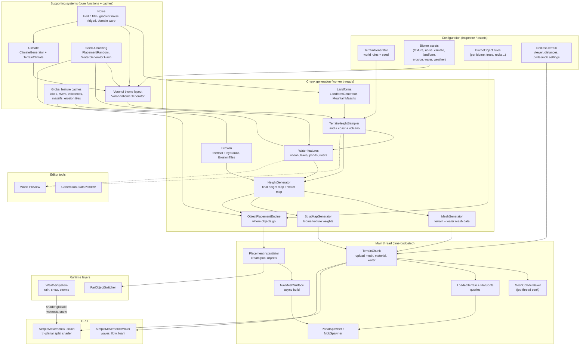
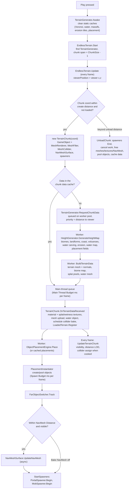
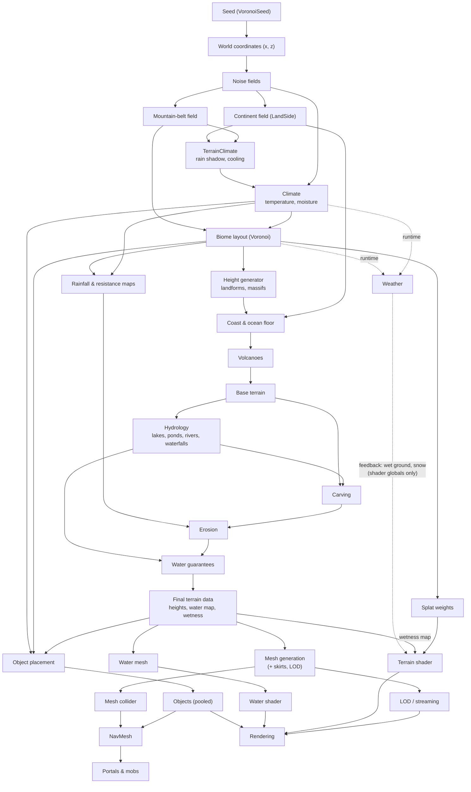
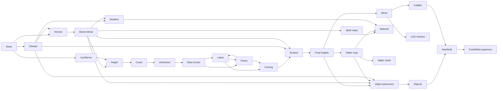

# Terrain 01 — System Architecture

> **Who this is for:** a developer who has never opened this terrain system. Read this chapter first; every later
> chapter zooms into one box of the diagrams below.
>
> **Source root:** `Scripts/Procedural/World/` (runtime) and `Scripts/CustomEditor/TerrainGenerator/` (editor).

---

## 1. What the system does, in one paragraph

The terrain system builds an **endless, streamed 3D landscape** around the player at runtime. Nothing is stored on
disk: every hill, river, tree and texture is **calculated from a single number, the world seed**
(`TerrainGenerator > Voronoi Seed`), plus the settings in the Inspector. The world is cut into square **chunks**
(240 × 240 world units by default). Chunks near the player are generated on background threads, turned into Unity
meshes, textured, given colliders, water, trees and rocks, a navigation mesh, and finally portals and mobs. Chunks that
fall far behind are destroyed; when the player comes back they are regenerated **identically**, because every step is
deterministic.

## 2. The two central components

| Component | Lives on | Responsibility |
|---|---|---|
| `TerrainGenerator` (4 partial files) | one scene GameObject | **Holds every rule of the world** (≈150 settings), owns the worker-thread pool, generates chunk data on request, applies finished work on the main thread within a time budget, creates placed objects a few per frame. |
| `EndlessTerrain` (+ nested `TerrainChunk`) | one scene GameObject | **Decides which chunks exist** around the viewer, creates/unloads them, and drives each chunk's lifecycle: mesh, collider, water, objects, LOD, NavMesh, spawners. |

Everything else is a static "generator" class that turns a **world position** into some piece of data. They are
pure functions of *(position, seed, settings)*, which is what makes the world seamless and repeatable.

---

## 3. High-level architecture

**How to read it:** configuration feeds pure "supporting" functions; worker threads combine them into a chunk's data;
the main thread turns that data into Unity objects; the GPU draws them. The dotted lines show that the **World
Preview** reuses the exact same samplers (so what you see in the editor is what the game builds, before erosion).

---

## 4. End-to-end flow: from pressing Play to a rendered chunk

The same chunk therefore passes through **four execution contexts**: a worker thread (heights, meshes, textures'
pixels), the main thread (Unity objects), a Unity job thread (collider cooking) and Unity's async NavMesh builder.

---

## 5. What runs before what (and why)

The order inside one chunk's height calculation is **not** "height → climate → biome", which is what many tutorials
use. In this project it is:

```mermaid
flowchart LR
    S["Seed + settings"] --> C["Climate fields<br/>(temperature, moisture)<br/>+ terrain climate:<br/>mountain belts, continents"]
    C --> V["Voronoi points get<br/>their biome labels"]
    V --> W["Biome blend weights<br/>at this position"]
    W --> L["Landform relief +<br/>base elevation"]
    L --> CO["Coast / ocean shaping"]
    CO --> VO["Volcanoes"]
    VO --> WF["Water features traced<br/>on this base terrain"]
    WF --> CA["Pre-erosion carving<br/>(lake bowls, river valleys)"]
    CA --> E["Erosion"]
    E --> G["Post-erosion water<br/>guarantees"]
    G --> F["Final heights + water map"]
```

**Why climate comes first:** biomes are *chosen* from the climate, and heights are *computed* from the biomes. If
climate depended on the final heights, and heights on biomes, the system would be circular. `TerrainClimate` breaks the
circle by reading only two fields that do not depend on which biome is where: the **mountain-belt field** (where
mountain biomes are *encouraged* to go) and the **continent field** (where oceans are). See
[Climate](07-Climate.md).

**Why water features are traced before erosion but enforced after it:** lakes and rivers are decided on the
deterministic *base* terrain (identical for every chunk), carved into it, then weathered by erosion so they look
natural, and finally their rims, banks and channels are **re-enforced** so erosion can never open a leak.

### Systems that run independently

| System | Independent of | Notes |
|---|---|---|
| `WeatherSystem` | chunk generation | Samples climate and biomes at the viewer at runtime; only talks back to the terrain through shader globals. Paused while inside a dungeon. |
| World Preview | Play mode | Uses `TerrainHeightSampler`, `LakeGenerator`, `RiverGenerator` directly in the editor. |
| `PortalSitePlanner` | chunk data | Portal *sites* are known for any area before its chunks exist; only the exact spot needs the chunk. |
| Landmark spots | chunk data | `ObjectPlacementEngine.FindLandmarkSpots` works from the coarse world shape. |
| Dungeons | the terrain | Generated far below the world; the terrain is paused while you are inside (see the Dungeon docs). |

---

## 6. Master data flow (all systems, with real feedback loops)

**Feedback relationships that really exist** (and the ones that do not):

| Relationship | Exists? | Where |
|---|---|---|
| Terrain shape → climate | **Yes, indirectly** — via the mountain-belt and continent fields, never via actual heights | `TerrainClimate.Shifts` |
| Climate → biome placement | Yes | `VoronoiBiomeGenerator.ComputeBaseWeights` |
| Climate → erosion strength | Yes (rainfall map) | `HeightGenerator.BuildBaseHeights` |
| Biomes → erosion resistance | Yes | `Biome.erosionResistance` |
| Water features → terrain | Yes (carving + guarantees) | `ChunkWaterContext` |
| Erosion → water placement | **No** — lakes/rivers are traced on pre-erosion base terrain | by design, for determinism |
| Weather → terrain shape | **No** | weather is visual/gameplay only |
| Weather → shader (wetness, snow) | Yes | `WeatherSystem` sets `_SMWeatherWetness`, `_SMWeatherSnow` |
| Water → object placement | Yes (water rules, wetness) | `PlacementEnvironment` |

---

## 7. Dependency graph (only real dependencies)

`Lakes ⇄ Rivers` is a genuine two-way dependency: a river ends when it reaches a lake, a lake's outlet starts a river,
and a lake's final water level is lowered if another river cuts through its rim (`RiverGenerator.ComputeLakeWaterLevel`).
It is resolved lazily and cached, so it cannot loop.

---

## 8. Script map

| Folder | Key classes | Chapter |
|---|---|---|
| `World/` | `TerrainGenerator` (+`.Generation`, `.Properties`, `.Threading`), `EndlessTerrain` (+`.TerrainChunk`), `DataStructure`, `TerrainMonitor` | [02](02-World-Chunks-Streaming.md), [16](16-Performance-and-Threading.md) |
| `World/Threading/` | `TerrainWorkerPool`, `WorkToken` | [16](16-Performance-and-Threading.md) |
| `World/Terrain/` | `HeightGenerator`, `TerrainHeightSampler`, `ErosionGenerator`, `ErosionTiles` | [04](04-Height-and-Landforms.md), [10](10-Erosion.md) |
| `World/LandForms/` | `LandformGenerator` (5 partials), `MountainMassifs`, `LandformSettings`, `Volcanoes/*` | [04](04-Height-and-Landforms.md), [05](05-Volcanoes.md) |
| `World/Biome/` | `Biome`, `BiomeInstance`, `BiomeObject`, `Layout/VoronoiBiomeGenerator` (5 partials), `ClimateGenerator`, `TerrainClimate` | [06](06-Voronoi.md), [07](07-Climate.md), [08](08-Biomes.md) |
| `World/Water/` | `WaterGenerator`, `WaterSettings`, `ChunkWaterContext`, `WaterMapData`, `Oceans/*`, `Lakes/*`, `Rivers/*`, `WaterVolume` | [09](09-Water.md) |
| `World/Mesh/` | `MeshGenerator` (+`.Water`), `MeshData`, `WaterMeshData`, `MeshColliderBaker` | [11](11-Mesh-and-Collider.md) |
| `World/Texturing/` | `SplatMapGenerator`, `SplatBlendData`, `TextureGenerator`, `Resources/SimpleMovementsTerrain.shader/.hlsl` | [12](12-Texturing-and-Shaders.md) |
| `World/Weather/` | `WeatherSystem` (+`.Effects`, `.Storms`), `WeatherModel`, `WeatherTypes` | [13](13-Weather.md) |
| `World/Placement/` | `ObjectPlacementEngine` (+`.Site`, `.Landmarks`), `PlacementPlan`, `PlacementRules`, `PlacementInstantiator`, `FarObjectSwitcher`, … | [14](14-Object-Placement.md) |
| `World/Spawnable/` | `PortalSpawner`, `PortalSitePlanner`, `MobSpawner`, `ChunkSpawnerBase`, `SpawnGround`, `WorldSpawnRegistry` | [15](15-Portals-and-Mobs.md) |
| `World/Queries/` | `LoadedTerrain`, `FlatSpots` | [14](14-Object-Placement.md), [15](15-Portals-and-Mobs.md) |
| `World/Diagnostics/` | `GenerationStats` | [16](16-Performance-and-Threading.md), [17](17-Editor-Tools.md) |
| `CustomEditor/TerrainGenerator/` | `TerrainGeneratorEditor` (≈20 partials, World Preview), `GenerationStatsWindow`, `WeatherSystemEditor` | [17](17-Editor-Tools.md) |

**Legacy / unused code** (kept by the project, not part of the pipeline): `Procedural/LEGACY/**`,
`LEGACY_VoronoiGeneratior.cs` (commented out), `Spawnable/ObjectSpawner.cs` (old per-cell placer, not called),
`QuadTree.cs` (not referenced), the hidden `TerrainGenerator.splatMapShader` compute-shader field.

---

## 9. The implementation-status legend used in these docs

| Label | Meaning |
|---|---|
| **Implemented** | Used by the running pipeline. |
| **Partially implemented** | Exists, but only some paths use it, or a setting has no effect with the package shader. |
| **Placeholder** | A field or class kept for compatibility; nothing reads it. |
| **Not currently implemented** | Asked about in design discussions but does not exist; see *Potential Future Improvements* in [20](20-Glossary-and-Future.md). |

Next: [02 — World, Chunks, Streaming and LOD](02-World-Chunks-Streaming.md)
