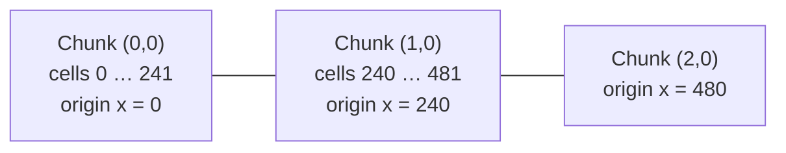
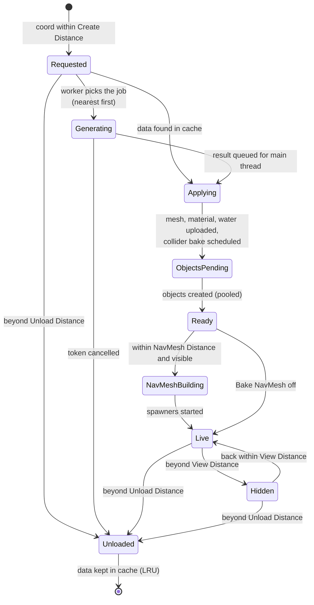
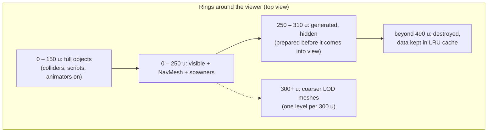
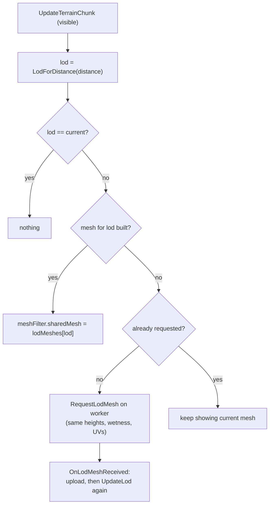

# Terrain 02 — World, Chunks, Streaming and LOD

**Scripts:** `EndlessTerrain.cs`, `EndlessTerrain.TerrainChunk.cs`, `TerrainGenerator.Threading.cs`,
`TerrainGenerator.Properties.cs` (`LodForDistance`), `MeshGenerator.SkirtDepth`, `MeshData.AddSkirt`.

---

## 1. Concept: an endless world made of chunks

An endless world cannot be built all at once, so it is cut into equal square pieces called **chunks**. Only the chunks
around the **viewer** (the player or camera) exist at any moment. As the viewer moves, new chunks are generated in
front and old ones behind are destroyed. This is called **streaming**.

For streaming to be invisible, two properties are essential:

1. **Determinism** — generating the same chunk twice gives exactly the same result, so a chunk can be thrown away and
   rebuilt later without the player noticing.
2. **Seamlessness** — two neighbouring chunks, generated independently (possibly on different threads, in any order),
   must agree exactly along their shared edge.

Both come from one rule applied everywhere in this project: **every value is a pure function of world position, the
seed and the settings** — never of "which chunk is asking", "what was generated before", or a shared random number
generator.

---

## 2. Coordinate systems

| Name | Unit | Example (Extra Large chunks) | Used for |
|---|---|---|---|
| **World position** | Unity world units (metres). The terrain uses X and Z; Y is height. | `(1234.5, 87.2, -560.0)` | everything visible |
| **World cell** | integer X, Z of the height grid (1 world unit apart, since Scale Factor is fixed at 1) | `(1234, -560)` | height maps, erosion, water rasters |
| **Chunk coordinate** | integer (cx, cz) | `(5, -3)` | `EndlessTerrain` dictionary key |
| **Chunk origin / global offset** | world cell of the chunk's corner = `coord × span` | `(1200, -720)` | `TerrainChunk.globalOffset` |
| **Local cell** | index inside a chunk's arrays, `0 … ChunkSize` | `[34, 160]` | `heightMap[x, y]` |
| **Voronoi cell** | integer cell of size `VoronoiScale` | `(3, -2)` | biome points (a separate grid!) |
| **Feature grid cells** | integer cells of `LakeSpacing`, `RiverSpacing`, `VolcanoSpacing`, … | — | one feature candidate per cell |

**Chunk span.** `TerrainSize` sets `ChunkSize` = 61, 121, 181 or 241 (default **241**, "Extra Large"). A chunk
**spans `ChunkSize − 1` world units** (240), and its height map has **`ChunkSize + 1`** samples per side (242).



The last two columns of chunk (0,0) (cells 240 and 241) are the first two columns of chunk (1,0). Because both chunks
compute cell 240 from the *same* world position with the *same* pure functions, they get the *same* height — that is
the first and most important seam guarantee.

`chunk (x, y)` covers world `[x·240, (x+1)·240)` on each axis:
`currentChunk = floor(viewerPosition / 240)` (`EndlessTerrain.UpdateVisibleChunks`).

---

## 3. Deterministic generation — where randomness comes from

There is **no shared `Random`** in the generation path. Every random decision is one of:

| Mechanism | Formula / class | Used by |
|---|---|---|
| Per-cell `System.Random` seeded from a hash | `new System.Random(WaterGenerator.Hash(cellX, cellY, seed, salt))` | lakes, ponds, springs, volcanoes, sea stacks |
| Per-Voronoi-cell `System.Random` | `GenerateSeed(cell, seed)` (Squirrel Eiserloh bit-noise hash) | biome points |
| Stateless hash streams | `PlacementRandom.Value(seed, salt, cellX, cellY, stream)` | object placement, portal sites |
| Coordinate hash | `ErosionGenerator.HashCoord(worldX, worldY, seed)` | droplet start points |
| Noise | Perlin / gradient noise at `worldPosition / scale + seedOffset` | everything continuous |

A *salt* is a constant per feature type (e.g. `LakeSalt = 0x1A4E`) so that lakes and ponds at the same cell do not
share random numbers.

**Things that are NOT part of the seed:** the order chunks load, the number of worker threads, frame rate, and the
player's path. With **Order Independent Biome Layout** on (default), even the biome layout is independent of load
order (see [Voronoi](06-Voronoi.md)).

**Things that DO change the world:** the seed and practically every generation setting, the biome list and each biome
asset's values, **biome asset names** (they seed per-biome noise phases), and chunk size.

---

## 4. Chunk lifecycle



### 4.1 Which chunks must exist? (`EndlessTerrain.UpdateVisibleChunks`)

Every frame:

1. `currentChunk = floor(viewer.xz / span)`.
2. `range = ceil(CreateDistance / span)`, capped by **Max Chunks Per Side** when **Should Have Max Chunk Per Side** is on.
3. A list of offsets `(-range … range)²` is **sorted by squared distance** once (rebuilt only when `range` changes), so
   the chunks nearest the viewer are created — and therefore queued — first.
4. For each offset whose chunk is not loaded and whose **nearest edge** is within `CreateDistance`, a `TerrainChunk`
   is created.
5. Every loaded chunk is either unloaded (outside the range square or beyond `UnloadDistance`) or updated.

| Distance | Formula | Default (span 240, View 250) |
|---|---|---|
| View distance | `Max View Dst` | 250 |
| Create distance | `Max View Dst + 0.25 × span` (chunks are prepared slightly before they become visible) | 310 |
| Unload distance | `Unload Distance`, or `Max View Dst + span` when 0; never below `Create + 1` | 490 |
| NavMesh distance | `NavMesh Distance` (0 = view distance) | 250 |
| Full-object distance | `Full Object Distance` on the TerrainGenerator | 150 |
| Full-detail LOD distance | `LOD Full Detail Distance` | 300 |

"Distance to a chunk" always means the distance from the viewer to the **nearest point of the chunk's square**
(`TerrainChunk.DistanceToViewer`), so the chunk under the player is at distance 0.

### 4.2 Chunk streaming diagram



### 4.3 Loading (generation) and applying

`TerrainChunk` constructor → `TerrainGenerator.RequestChunkData(callback, globalOffset, DistanceToViewer, token)`.
The job's **priority** is a delegate — the chunk's current distance to the viewer — re-evaluated every time a worker
thread picks its next job, so if the player turns around, the chunks now in front jump the queue. The **WorkToken**
is cancelled when the chunk is unloaded; queued jobs are then dropped, and results already computed are discarded
before they reach the main thread (`TerrainGenerator.Deliver`).

### 4.4 Unloading (`TerrainChunk.Unload`)

In this exact order:

1. `token.Cancel()` — pending worker jobs and main-thread callbacks for this chunk become no-ops.
2. Portal and mob spawners `End()` — their objects are removed **without** counting as used/killed.
3. `LoadedTerrain.Unregister`.
4. Finish the collider bake job (a mesh must never be destroyed while being cooked).
5. Cancel/remove the NavMesh data.
6. Destroy every mesh (all LOD levels, the water mesh) and the chunk's material with its splat and wetness textures
   (the shared biome texture array is kept).
7. Hand placed objects back to the pool (or destroy them), restore far-object components.
8. Destroy the chunk GameObject.

### 4.5 Caching and regeneration

`EndlessTerrain` keeps the generated data of the last **Chunk Data Cache Size** (default 16) unloaded chunks in an
LRU list (`CachedChunkData`: `TerrainData` + `PlacementResult`, without the large temporary buffers). A chunk that
comes back and is found in the cache skips the whole worker phase; only the main-thread upload runs again. Each entry
costs roughly 1–5 MB.

Beyond the per-chunk cache, several **global, process-wide caches** make neighbouring chunks cheap and consistent:

| Cache | Key | Content | Cleared by |
|---|---|---|---|
| Voronoi points / labels / neighbourhoods | Voronoi cell | biome points | `VoronoiBiomeGenerator.ClearCache` |
| Lakes, ponds | lake/pond grid cell | `LakeFeature` | `WaterGenerator.ClearCaches` |
| Rivers | spring / outlet cell | traced `RiverPath` | same |
| Volcanoes, sea stacks | grid cell | feature | same |
| Mountain massif tiles & masks | tile of 32 × 32 nodes | signed distance field | same (and Voronoi clear) |
| Erosion tiles | chunk position | eroded heights (max 160) | same |
| Landmark picks | region | chosen spots | `ObjectPlacementEngine.ClearCaches` |
| Placement plan, prefab shapes | — | compiled object rules | `TerrainGenerator.RefreshGenerationCaches` |

`TerrainGenerator.Awake` clears them all, because static fields can survive between Play sessions when *Reload
Domain* is disabled. **If you change generation settings at runtime**, call `RefreshGenerationCaches()`, clear the
Voronoi and water caches and `EndlessTerrain.UnloadAllChunks()` — otherwise old cached features mix with new ones.

`EndlessTerrain.RemovePlacedObject` records a removed tree/rock as a `PlacedObjectId(chunkX, chunkY, index)` so it
stays gone when the chunk is regenerated (save it with `RemovedObjects` / `SetRemovedObjects`).

---

## 5. How neighbouring chunks stay continuous (seam handling)

Every layer has its own guarantee. Together they make chunk borders invisible.

| Layer | What could go wrong | How it is prevented |
|---|---|---|
| Base height | Different heights at the shared edge | Heights are a function of **world** position only; the shared edge cells are computed identically by both chunks. |
| Biome layout | A biome border that "jumps" at a chunk edge | Voronoi points live on their own world grid; the blend uses points from the 3 × 3 neighbouring Voronoi cells; Order-Independent layout removes load-order effects. |
| Landforms / massifs | Mountains cut off at chunk edges | All landform functions use world coordinates; mountain depth comes from world-space cached tiles. |
| Lakes, rivers, volcanoes | A river that ends at a chunk edge | Features are traced **once, globally**, cached, and each chunk only *rasterizes* the parts that touch it. A chunk gathers every river whose source is within `River Max Length` + margins. |
| Erosion | Erosion is a simulation — each chunk's droplets differ near its edge | **Padding** (40 cells) gives each chunk context; with **Seamless Erosion** chunks are assembled from shared, cached world tiles crossfaded over 16 cells, with a fixed summation order so every chunk gets bit-identical floats. |
| Mesh | Cracks between chunks at different LOD | **Skirts** (vertical strips under every edge) sized from the actual worst-case edge deviation. |
| Textures | Visible texture seams | The package shader projects textures in **world space**; splat maps are per chunk but computed from the same world biome blend. |
| Water mesh | Transparent water drawn twice on the border | Quads past the chunk's own extent are skipped (`lastOwnedX = mapWidth − 2`). |
| Objects | Two trees overlapping across a border | Each chunk knows its neighbours' *possible* spots (world-consistent stages) and rejects conflicts; a candidate belongs to exactly one chunk. |
| Portals | Duplicate portals across a border | Sites are planned per world region; each site belongs to exactly one chunk. |

---

## 6. LOD (Level of Detail)

### 6.1 Concept

Distant terrain covers few pixels on screen, so it can use fewer triangles. **LOD** means keeping several versions
of a mesh at different resolutions and showing the coarser ones farther away.

### 6.2 Implementation

**Level of Detail** (`levelOfDetail`, 0–6) sets the *base* resolution. The vertex step is:

```
lodFactor = (lod > 0) ? lod * 2 : 1        // 0 → every cell, 1 → every 2nd, 2 → every 4th … 6 → every 12th
```

| LOD | Vertex step | Vertices per side (241 chunk) | Triangles per chunk |
|---|---|---|---|
| 0 | 1 | 242 | 116 162 |
| 1 | 2 | 121 | 28 800 |
| 2 (recommended) | 4 | 61 | 7 200 |
| 3 | 6 | 41 | 3 200 |
| 4 | 8 | 31 | 1 800 |
| 6 (code default) | 12 | 21 | 800 |

> The field initializer in code is **6**, the Inspector's *Reset To Recommended* sets **2**. Check which one your
> scene uses — at 6 terrain looks faceted (12 m triangles).

**Distance LOD** (`distanceLod`, default on) picks a coarser level per chunk:

```
LodForDistance(d) =
    levelOfDetail                                   if distanceLod off, d ≤ FullDetailDistance, or levelOfDetail ≥ LodMaxLevel
    min(LodMaxLevel, levelOfDetail + 1 + floor((d − FullDetailDistance) / LodDistanceStep))   otherwise
```

Example (recommended values: base 2, full 300, step 300, max 4): a chunk 200 u away → LOD 2; 450 u → LOD 3;
800 u → LOD 4.



Rules:

- LOD meshes are built **lazily** (first time needed) and **kept** until the chunk unloads.
- The **collider, NavMesh, object placement and `LoadedTerrain` queries always use the base level**, never the
  distance-LOD mesh. Physics therefore never changes as you walk.
- **LOD seams:** neighbours at different levels do not share edge vertices, so thin cracks could open. Every chunk
  hangs **skirts** under its four edges. `MeshGenerator.SkirtDepth` measures, along the 3 outermost cell rows, the
  largest difference between the real heights and the coarsest possible mesh surface, and uses
  `LodSkirtDepth + 2 × deviation`. Skirt vertices copy the normal of the ground vertex above them, so they are lit
  like the ground.
- **Texture LOD:** splat UVs are computed per height-map cell when skirts are on, so switching LOD never shifts
  textures. Textures themselves use GPU mipmaps.
- **Water LOD:** the water mesh uses the **base** LOD so shorelines always match the collider-accurate terrain.

### 6.3 Collider LOD

There is none — see [Mesh and Collider](11-Mesh-and-Collider.md). The collider is cooked once from the base mesh on a
job thread.

---

## 7. Configuration (chunks & streaming)

| Variable | Where | Default | Increase | Decrease | Performance |
|---|---|---|---|---|---|
| Terrain Size | TerrainGenerator | Extra Large (241) | fewer, bigger chunks; bigger per-chunk jobs | more chunks, smaller jobs, more draw calls | per-chunk cost ∝ size² |
| Max View Dst | EndlessTerrain | 250 | see farther | less memory/CPU | chunk count ∝ distance² |
| Max Chunks Per Side | EndlessTerrain | 5 (11 × 11) | allows larger view distances | caps memory | hard cap |
| Unload Distance | EndlessTerrain | 0 (auto) | fewer regenerations when turning | less memory | — |
| Chunk Data Cache Size | EndlessTerrain | 16 | faster returns | less memory | ~1–5 MB each |
| NavMesh Distance | EndlessTerrain | 250 | mobs/portals farther out | less async NavMesh work | NavMesh builds are expensive |
| Level Of Detail | TerrainGenerator | 6 (recommended 2) | coarser, faster | finer detail, more triangles | triangles ∝ 1/step² |
| Distance LOD | TerrainGenerator | on | — | — | big saving at long view distance |
| LOD Full Detail Distance / Step / Max Level | TerrainGenerator | 300 / 300 / 4 | keep detail farther | coarser sooner | — |
| LOD Skirt Depth | TerrainGenerator | 2 | hides cracks | — | negligible |

---

## 8. Debugging chunks

| Symptom | Likely cause | Check |
|---|---|---|
| Nothing generates | `Viewer` empty, no TerrainGenerator | EndlessTerrain inspector status box |
| Chunks appear late / pop in | too few worker threads, big chunk size, heavy settings | Generation Stats: "Waiting for a worker thread", "Chunk total" |
| Visible crack between chunks at different distances | skirts disabled (distance LOD off but meshes differ) or extreme edge relief | raise LOD Skirt Depth |
| Step/seam between chunks in the ground | Seamless Erosion off, or Erosion Padding ≤ Droplet Lifetime | TerrainGenerator validation warnings |
| World differs between runs | changed biome names/settings, or Order Independent Biome Layout off | compare settings with *Copy Settings* |
| Old terrain after changing settings at runtime | global caches | clear caches + `UnloadAllChunks()` |
