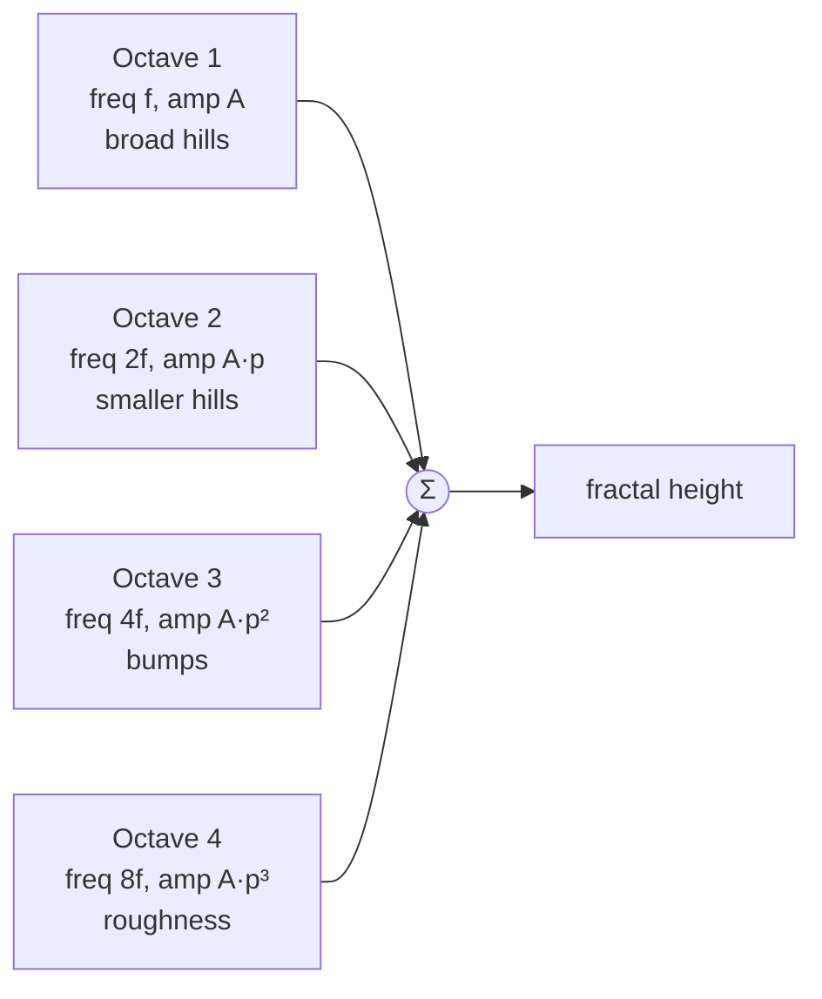
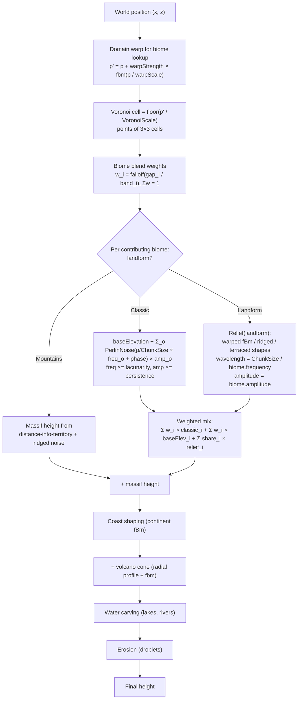

# Terrain 03 — Noise

**Scripts:** `HeightGenerator.ComputeBiomeNoise` (Classic terrain), `LandformGenerator.Noise.cs` (landform noise),
`VoronoiBiomeGenerator.Blend.cs` (`FractalWarpNoise`), `ClimateGenerator.FractalNoise`, `WaterGenerator.Fbm`,
`PlacementRandom` (value noise), `WeatherModel` (drifting gradient noise), `SimpleMovementsTerrain.hlsl`
(`TerrainValueNoise`).

---

## 1. Concept

### 1.1 Noise vs random numbers

A **random number** has no relation to its neighbours: `rand(10) = 0.83`, `rand(11) = 0.02`. A height map made of
random numbers is static — spikes next to pits.

**Procedural noise** is a *smooth* function `n(x, y)`: points close together get similar values, points far apart are
unrelated. Terrain needs exactly that: nearby ground has similar height, distant ground can be anything.

| Property | Meaning here |
|---|---|
| **Continuous** | No jumps: moving 0.01 units changes the value a tiny bit. |
| **Deterministic** | `n(x, y)` always returns the same value for the same input — no state. |
| **Seeded** | A *seed* shifts or scrambles the function so different worlds get different noise. |
| **Band-limited** | Each noise function has a typical feature size (its **wavelength**). |

### 1.2 Gradient (Perlin) noise

The world is divided into a grid of unit squares. At each grid corner a pseudo-random **gradient direction** is chosen
(from a hash of the corner). For a point inside a square, each corner contributes `dot(gradient, point − corner)`, and
the four contributions are blended with a smooth curve (`6t⁵ − 15t⁴ + 10t³`). The result is 0 at every grid corner and
varies smoothly in between — hills about one grid square wide.

`Mathf.PerlinNoise(x, y)` is Unity's built-in version (output ≈ 0…1). The landform system uses its **own** gradient
noise (`LandformGenerator.Gradient`) because its exact output range is known and identical on every platform (the
landform shaping thresholds depend on it), and its 8 gradient directions are rotated 22.5° so no gradient is parallel to
a grid axis (axis-aligned gradients produce exactly-zero lines that ridged noise would turn into straight creases).

### 1.3 Frequency, amplitude, wavelength, scale

```
value = amplitude × noise(x × frequency, y × frequency)
wavelength = 1 / frequency
```

- **Frequency ↑** → features closer together (small bumps). **Frequency ↓** → broad rolling shapes.
- **Amplitude ↑** → taller features. **Amplitude ↓** → flatter.
- **Domain scaling** = dividing coordinates by a *scale* (e.g. `x / VoronoiScale`) — the same as frequency = 1/scale.

### 1.4 Octaves, lacunarity, persistence → fractal noise (fBm)

Real terrain has detail at every scale: mountains, hills on the mountains, rocks on the hills. **Fractal Brownian
motion (fBm)** sums several **octaves** of noise, each with a higher frequency and a lower amplitude:

```
h(x) = Σ (o = 0 … octaves−1)  amplitude_o × noise(x × frequency_o)
frequency_(o+1) = frequency_o × lacunarity       (typically 2: each octave twice as detailed)
amplitude_(o+1) = amplitude_o × persistence      (typically 0.5: each octave half as tall)
```



| Parameter | Increase | Decrease | Cost |
|---|---|---|---|
| Octaves | more fine detail (up to where amplitude is negligible) | smoother, blobby | linear in octaves |
| Lacunarity | octaves spread further apart in scale, more "gaps" between detail sizes | octaves overlap, muddier | none |
| Persistence | rougher, craggier (fine octaves stay tall) | smoother | none |

**Normalization.** Summing octaves grows the range. Normalized fBm divides by `Σ amplitudes`, so the result stays in
about −1…1 regardless of octave count (used by the landform, climate, water and weather noise). The **Classic** biome
terrain is *not* normalized: its amplitude is in world units on purpose.

### 1.5 Ridged and billow noise

- **Ridged noise:** `1 − |n|`. Where `n` crosses zero the result peaks sharply → knife-edge ridges. Raising it to a
  power sharpens the crests further. Used for mountain crests, canyons, ravines and sea ravines.
- **Billow noise:** `|n|` — rounded, puffy shapes. The code uses a close relative for **rounded summits**:
  `1 − n²` (soft crest), mixed with ridged noise by a "sharpness" field.
- **Ridged multifractal:** each octave is multiplied by a *weight* derived from the previous octave's ridge value, so
  detail gathers on ridges and valley floors stay smooth (`RidgeFeedback = 2` in `LandformGenerator.Shapes`).

### 1.6 Domain warping

Instead of `noise(p)`, sample `noise(p + warp(p))` where `warp` is another noise field. Straight or blob-shaped
features become bent, swirling and organic. Used for: biome borders (`WarpPosition`), mountains (ridges curve, peaks
are lopsided), hills, plateaus, glacial troughs, coastlines (continent field), mountain belts, massif outlines.

The Voronoi border warp is clamped: `warpStrength ≤ 0.35 × warpScale`, because a warp stronger than a fraction of its
own wavelength folds space over itself and tears borders into self-crossing shapes.

### 1.7 Masking, remapping, thresholds

- **Mask:** a 0–1 field that multiplies another (e.g. `rangeMask` limits mountains to range lines, a "ledge zone" mask
  limits highland cliffs to patches).
- **Remap / smoothstep:** `SmoothStep(a, b, v)` maps `v` from `[a, b]` to `[0, 1]` with zero slope at both ends —
  the workhorse for thresholds that must not create kinks (`t² (3 − 2t)`).
- **Falloff:** `1 − smoothstep` for fades toward a border.
- **Terracing:** `floor` + smoothstep per step (plateau tiers, cliff bands, highland ledges).

---

## 2. Every noise function in the project

| Function | Type | Range | Seed input | Used for |
|---|---|---|---|---|
| `Mathf.PerlinNoise` via `HeightGenerator.ComputeBiomeNoise` | fBm, unnormalized | ±Σ amp | per-biome **phase** = `(name.GetHashCode() % 1000) × 0.137` | Classic biome terrain |
| `LandformGenerator.Noise / Gradient` | Perlin gradient noise, own permutation, 8 rotated gradients, ×1.96, repeats every 256 units | −1…1 | key = hash(seed, landform, layer) → offset up to 256 units | every landform shape |
| `LandformGenerator.Fbm / Fbm01` | normalized fBm, lacunarity 2.03, ×1.3 | −1…1 / 0…1 | same keys | landforms, mountain belts, massifs |
| `VoronoiBiomeGenerator.FractalWarpNoise` | 3-octave Perlin fBm, lacunarity 2.3 (non-integer so octaves never realign) | −1…1 | `seed × 0.0001` | biome border warp |
| `ClimateGenerator.FractalNoise` | normalized Perlin fBm (3 octaves temperature, 4 moisture) | 0…1 | `seed × 0.0001` + 10007 / 30011 | temperature, moisture |
| `WaterGenerator.Fbm` | normalized Perlin fBm, lacunarity 2.07 | −1…1 | `seed × 0.0001 + salt` | continents, coasts, cliffs, islands, volcano outlines |
| `ErosionGenerator.HashCoord` | integer hash (not noise) | — | seed | droplet positions |
| `PlacementRandom` value noise | bilinear-smoothstep value noise, octaves | 0…1 | seed + salt | object density patches |
| `WeatherModel.Gradient / Fbm01` | gradient noise **drifting over time** along the wind | 0…1 | `Seed × 7919 + layer × 104729` | weather systems |
| `TerrainValueNoise` (HLSL) | value noise on the GPU | 0…1 | `_NoiseSeedOffset = seed × 0.618` | texture UV offsets, snow edges |

> **Note on `string.GetHashCode`.** The Classic-terrain phase uses `biome.name.GetHashCode()`. On Unity's Mono and
> IL2CPP runtimes this is stable, but .NET does not guarantee it across runtimes. Landforms and placement use the
> stable FNV-1a `StableHash` instead. See *Potential Future Improvements*.

---

## 3. How a world coordinate becomes a height

The height at world `(x, z)` is **not one noise call** — it is a pipeline. Chapter 04 details each box; this is the
noise view of it.



### 3.1 Classic terrain formula (exact)

From `HeightGenerator.ComputeBiomeNoise`:

```
height = biome.baseElevation
frequency = biome.frequency ; amplitude = biome.amplitude
for o in 0 … Octaves−1:
    sx = (worldX / ChunkSize) × frequency + phase
    sz = (worldZ / ChunkSize) × frequency + phase
    height += (PerlinNoise(sx + 0.5, sz + 0.5) × 2 − 1) × amplitude
    frequency ×= Lacunarity
    amplitude ×= biome.persistence
    if amplitude < 0.001: stop
```

So **biome.frequency is "features per chunk width"**: frequency 2 on 241-cell chunks → one hill every ~120 units.
Changing the Terrain Size therefore rescales every Classic biome.

**Worked example** (Plains biome: amplitude 6, frequency 1.5, persistence 0.4, baseElevation 2; global Octaves 5,
Lacunarity 2): the octave amplitudes are 6, 2.4, 0.96, 0.38, 0.15 → worst case ±9.9 above/below 2. Wavelengths are
160, 80, 40, 20, 10 units. That is gentle, rolling ground.

### 3.2 Landform noise formula (general shape)

```
wavelength = ChunkSize / |biome.frequency|
amplitude  = biome.amplitude
roughness  = clamp(biome.persistence, 0.2, 0.7)
relief = landform-specific combination of Fbm / ridged / smoothstep / terrace terms
```

The key `Key(seed, landform, layer)` means **two neighbouring biomes with the same landform read the same noise**, so
their border is invisible in the ground itself.

---

## 4. Configuration

| Variable | Where | Typical | Increase | Decrease | Visual effect | Cost |
|---|---|---|---|---|---|---|
| Octaves | TerrainGenerator > Noise | 4–6 (default 5) | more fine detail in **Classic** biomes; also widens slope-safe biome borders (worst-case amplitude estimate grows) | smoother | roughness | linear per cell |
| Lacunarity | TerrainGenerator > Noise | 1.8–2.2 (default 2) | detail sizes further apart | detail muddier | texture of relief | none |
| Biome Amplitude | Biome | plains 3–8, hills 10–20, mountains 35–80 | taller | flatter | relief height | none |
| Biome Frequency | Biome | 0.5–4 | smaller, denser features | broader shapes | feature size | none |
| Biome Persistence | Biome | 0.3–0.6 (default **1** — very rough; lower it!) | craggier | smoother | fine detail | none |
| Base Elevation | Biome | −20…60 | whole biome higher | lower | biome level | none |
| Voronoi Warp Strength / Scale Mult. | TerrainGenerator | 50 / 1.5 | wobblier borders | straighter | border shape | 3 Perlin calls |
| Climate Scale Multiplier | TerrainGenerator | 5–10 (default 6) | bigger climate zones | salt-and-pepper biomes | biome clustering | none |
| UV Noise Strength / Scale | TerrainGenerator | 0.3 / 0.1 | stronger texture offset | more visible tiling | texture variation | GPU value noise |

> **Default `persistence = 1` on a new Biome asset** makes every Classic octave as tall as the first — very noisy
> terrain. The tooltip warns about it; 0.35–0.5 is a sensible start.

---

## 5. Performance

Noise is evaluated **per height-map cell, per contributing biome, per octave**, on worker threads. A 241 chunk with
erosion padding 40 is 322 × 322 ≈ 104 000 cells. With 2–3 biomes blending and 5 octaves that is ~1.5 million noise
calls for Classic terrain; landforms use 5–15 noise calls each. Mountain massifs cache their expensive distance field in
tiles, so their per-cell cost is a bicubic lookup plus the ridged layers. Row loops run through
`TerrainWorkerPool.For`, so idle worker threads help the chunk nearest the player.

## 6. Debugging noise

| Symptom | Likely cause | Fix |
|---|---|---|
| Terrain looks like "static", spiky | persistence ≈ 1, too many octaves, high frequency | persistence 0.35–0.5, frequency ≤ 3 |
| Terrain too flat | amplitude small, landform Plains/Wetland, base elevations equal | raise amplitude/base elevation differences |
| Every biome looks the same | biome blend band too wide (terrain averaged) | see validation warning; lower Height Blend Range |
| Repeating pattern | two biomes with same name (same phase) | give biomes unique names |
| Straight creases on ridges | (fixed by rotated gradients) — if seen in Classic terrain, lower octaves | — |
