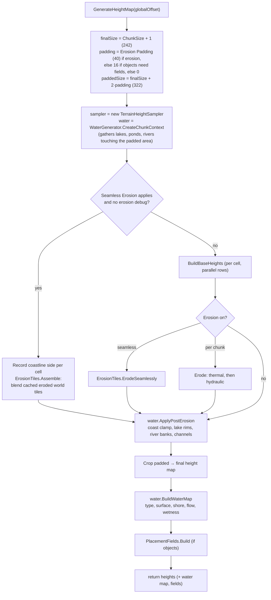
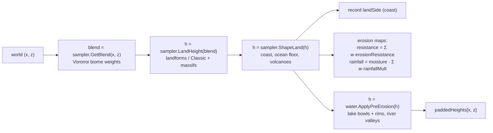
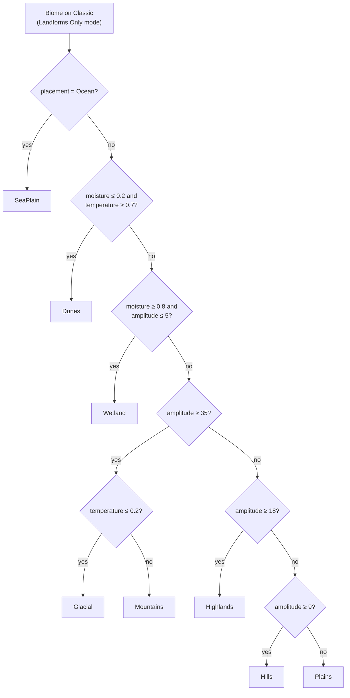
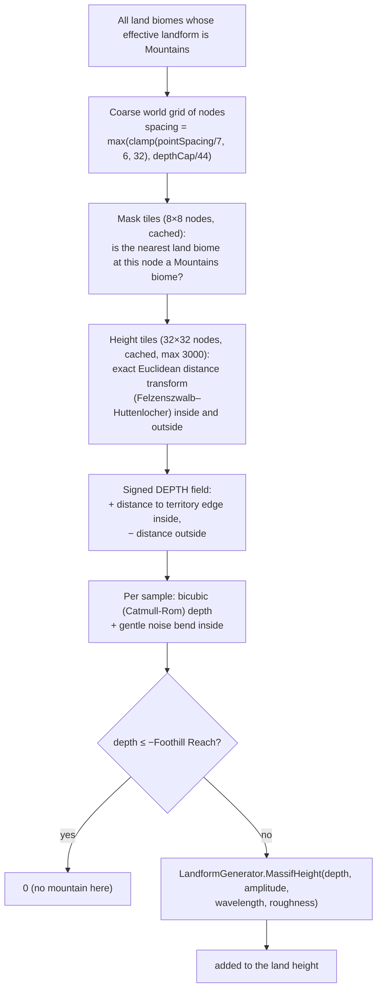
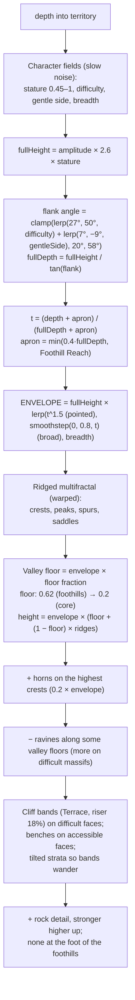
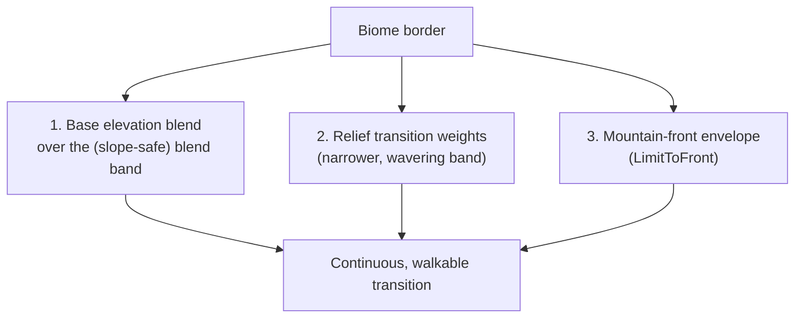

# Terrain 04 — Height Generator and Landforms

**Scripts:** `Terrain/HeightGenerator.cs`, `Terrain/TerrainHeightSampler.cs`, `LandForms/LandFormGenerator.cs`,
`LandformGenerator.Shapes.cs`, `.Seafloor.cs`, `.Massifs.cs`, `.Noise.cs`, `LandForms/MountainMassifs.cs`,
`LandForms/LandformSettings.cs`, `LandformTypes.cs`.

---

## 1. Responsibility

The height generator answers one question for every cell of a chunk: **how high is the ground here?** The answer
feeds the mesh, the collider, water, textures (indirectly), objects and the NavMesh. It is the most expensive and most
important part of generation.

Two classes share the work:

| Class | Role |
|---|---|
| `TerrainHeightSampler` | The **base terrain** at any world point: biome blend → landform/Classic height → mountain massifs → coast/ocean → volcanoes. Stateless per call; used by chunks, water tracing, the World Preview, weather and landmarks, so they all see the *same* terrain. |
| `HeightGenerator` | Builds a whole **chunk**: a padded area of base heights, water carving, erosion, water guarantees, the final `float[,]` height map, the water map and the object-placement environment. |

---

## 2. Data in and out

| In | Out |
|---|---|
| `TerrainGenerator` settings, `globalOffset` (chunk origin), world seed | `float[ChunkSize+1, ChunkSize+1]` height map (world Y per cell) |
| Biome assets (amplitude, frequency, persistence, base elevation, landform, placement, erosion) | `WaterMapData` (surface, type, shore level, flow, wetness) |
| Global feature caches (lakes, rivers, volcanoes, massif tiles, erosion tiles) | `PlacementFields` (heights + water around the chunk) |
| | optional erosion-delta debug map |

Runs on: a **worker thread** (`TerrainWorkerPool`), rows parallelised with `pool.For`.

---

## 3. The chunk height pipeline (`HeightGenerator.GenerateHeightMap`)



### 3.1 `BuildBaseHeights` — one cell



**Why padding?** Erosion moves material between cells; a cell near a chunk edge needs to know what is beyond it.
The padded ring is computed, eroded, and then cropped away. `Erosion Padding` should exceed `Droplet Lifetime`
(the inspector warns otherwise).

---

## 4. Combination operations — how features are combined

| Operation | Where | Example |
|---|---|---|
| **Weighted blend (sum of weights = 1)** | biome heights and base elevations | `h = Σ wᵢ · hᵢ` near biome borders |
| **Addition** | massifs, volcano cones, fBm octaves, rock detail, island tops | `h += massifHeight(x, z)` |
| **Multiplication (masks)** | range masks, uplift, ledge zones, cluster densities | `relief = A · uplift · rangeMask · peaks` |
| **Curves / smoothstep / power** | summits, cliffs, crest sharpness | `crest = pow(ridge, 2.3)`, `hills = smoothstep(0.3, 1.15, shape)` |
| **Min / max** | river carving (`min`), lake rims and banks (`max`), channels (`min`) | `h = min(h, riverCarve)` |
| **Lerp by a field** | coast → inland, cliff character, sharp vs round crests | `lerp(coastal, inland, smoothstep(side / width))` |
| **Domain warping** | ridges, borders, coastlines | `q = p + warp(p)` |
| **Thresholds** | plateau tiers, dune crests, ocean detection | `floor(stepped)` |
| **Distance fields** | mountain massifs (depth into territory), lake/river distances, placement | Euclidean distance transform |
| **Voronoi regions** | biome ownership and blending | nearest point per biome |
| **Terracing** | plateau steps, cliff bands, benches | `Terrace(h, step, riser)` |

---

## 5. Landforms

### 5.1 What a landform is

A **biome** describes an *environment* (textures, climate, objects, water likelihoods). Its **landform** decides the
*shape* of the ground. Two different biomes can share a landform (a pine forest and a birch forest both on Hills), and
their border is then invisible in the ground.

`Biome.landform` values: `Classic, Plains, Hills, Mountains, Dunes, Wetland, Plateau, Highlands, Glacial` (land) and
`SeaPlain, SeaRavines, SeaReef, SeaRocky` (ocean biomes).

**Terrain Shape Mode** (TerrainGenerator):

| Mode | Behaviour |
|---|---|
| Classic Only | every biome uses the original Classic fBm; landform settings ignored |
| Per Biome (default) | each biome uses its own landform; biomes left on Classic stay Classic |
| Landforms Only | every biome uses a landform; Classic biomes get a **suggested** one |

`LandformGenerator.Suggest(biome)`:



All landforms take the same three biome inputs:

```
wavelength = ChunkSize / |biome.frequency|     (feature size, world units)
amplitude  = biome.amplitude                    (height scale)
roughness  = clamp(biome.persistence, 0.2, 0.7)
```

and return **relief** — height above the biome's `baseElevation`.

### 5.2 Landform catalogue (cross-sections are schematic)

**Plains** — long low swells and occasional shallow basins.
`relief = A · (0.9·swell − 0.8·basin + 0.08·detail)`
```
  ____        ______            ____
      \______/      \__  __ ___/
                       \/  (shallow basin)
```

**Hills** — rounded, rolling, broad lows. Warped fBm → `smoothstep(0.3, 1.15, shape)` (the upper edge is above the
noise range, so summits stay domed, never clipped flat); a slow "size" field varies hill size by region.
`relief = A · 2.2 · size · hills + detail`
```
       ___             __
     /     \         /    \        ___
 ___/       \_______/      \______/   \___
```

**Mountains (without massifs)** — three scales (used only if the massif system is unavailable):
large range lines (`1 − |fbm|·1.5`), an **uplift** field, a **ridged multifractal** at the peak scale with a
sharp/rounded "sharpness" field, and rock detail. `relief = A · 2.5 · uplift · rangeMask · peaks`.
In the normal pipeline Mountains are built by **Mountain Massifs** (section 6).

**Dunes** — crests across a seed-chosen wind direction. Each dune is an asymmetric wave: 72 % gentle windward slope,
28 % steep lee side; crests wander (warped phase), vary in height, and are grouped into dune fields separated by flat
pans.
```
   wind →      /|        /|         /|
           ___/ |___ ___/ |____ ___/ |___
```

**Wetland** — flat, low, hummocks and hollows where ponds settle. `relief = A · (0.5·hummocks − 0.9·hollow)`

**Plateau** — flat-topped tablelands in up to 3 tiers with steep risers (smoothstep 0.72–0.95 of each tier) and narrow
canyons (`pow(1 − |n|, 10)`).
```
        __________              _______
   ____|          |____   _____|       |
  |                    |_|             |_____
               canyon ^
```

**Highlands** — big rolling uplands (larger than Hills), **rock ledges** (contour lines of a slow field become steep
risers of `max(3.5, 0.5·A)` metres) only inside patchy "ledge zones" whose soft edges shrink the risers to ramps — so
there is always a way around — plus narrow ravines (`pow(line, 14)`) in their own patches.

**Glacial** — high mountain relief (`1.1 × Mountains`) cut by **U-shaped troughs**: a flat floor across the middle
~45 % of the trough, steep walls, floors at different heights per valley, plus **hanging side valleys** whose floors
sit halfway up the main walls.
```
  /\    /\                 /\  /\
 /  \  /  \  ___________  /  \/  \
/    \/    \|  U-trough |/        \
```

**Ocean landforms** (relative to the normal sea floor, only for `placement = Ocean` biomes):
SeaPlain (rolling floor + seamounts), SeaRavines (branching submarine canyons), SeaReef (banks and atoll rings with
lagoons, rising close to the surface), SeaRocky (ridged, stepped rock and boulders).

**Classic** — the original fBm (see [Noise](03-Noise.md) §3.1).

### 5.3 Typical relief (used to size transitions)

| Landform | Typical relief |
|---|---|
| Mountains, Glacial | 1.3 · A |
| Plateau, Highlands | 1.2 · A |
| Hills | 0.9 · A |
| Dunes | 0.7 · A |
| Plains, Sea* | 0.5 · A |
| Wetland | 0.4 · A |
| Classic | 0.5 · Σ octave amplitudes |

---

## 6. Mountains: Mountain Massifs

### 6.1 Why mountains need special treatment

A mountain made from noise and cut out by a biome border looks like **a big hill with a cliff at the border**. Real
mountains have structure: the highest ground is in the *middle* of the range, ridges run along the range's spine,
valleys reach in from the edges (the natural routes up), passes (saddles) sit where the range narrows, and foothills
rise out of the surrounding land.

`MountainMassifs` produces that structure from the **shape of the mountain territory**:



With several mountain biomes, each node takes its own (or nearest mountain node's) amplitude, wavelength and roughness,
box-blurred twice, so different mountain biomes merge smoothly.

### 6.2 `MassifHeight` — the shape of a massif



What each piece achieves:

| Real-world feature | How it is produced |
|---|---|
| **Height grows toward the middle** | the envelope rises with depth; small territories → small formations, large → broad massifs |
| **Main ridge along the spine** | the depth field's maximum runs along the middle of the territory |
| **Passes / saddles** | where the territory narrows, depth (and so the envelope) dips |
| **Peaks and ridges** | ridged multifractal: `crest = pow(1.04 − sqrt(n² + 0.0016), 2.3)`, each octave weighted by the previous (detail gathers on crests) |
| **Valleys that lead up** | valley floors sit at 62 % of the envelope near the edge and 20 % in the core, rising gradually from the foothills |
| **Steepness / accessibility** | `difficulty` field: steep flanks (up to 50°+), cliff bands and more ravines vs long gentle flanks and benches |
| **Asymmetric massifs** | `gentleSide` field makes one side gentler |
| **Pointed vs broad summits** | `breadth` field blends `t^1.5` and `smoothstep` profiles |
| **Foothills** | the envelope starts `Foothill Reach` outside the border; no rock detail at the very foot |
| **Organic outlines** | depth is sampled at a noise-bent position inside the territory (`MassifDepthWarp`) |

### 6.3 Mountain belts (where mountain biomes go)

`LandformGenerator.MountainBelt(position)` is a 0–1 field of long, connected **lines** (where a slow, warped fBm
crosses zero: `line = 1 − |fbm|·2.2`, squared). When a Voronoi point picks its biome, each biome's weight is
multiplied by a **placement affinity**:

| Landform group | Affinity at belt value `b` |
|---|---|
| Mountains, Glacial, Plateau | `0.1 + 3b` (strongly on belts) |
| Hills, Highlands | `0.6 + 1.2·√b` (next to belts) |
| Plains, Wetland, Dunes | `1.2 − 0.9b` (away from belts) |

blended with `lerp(1, affinity, Mountain Belt Strength)`. Result: **mountain ranges several chunks long**, hills as
their foothills, plains in the open land between. Belt spacing = `Voronoi Scale × Mountain Belt Scale Multiplier`
(350 × 6 = 2100 by default).

---

## 7. How terrain features transition into each other

A border between a mountain biome and a plain is the hardest case: averaging a 200 m mountain with a 5 m plain over a
narrow band produces a cliff. The system uses **three separate mechanisms**:



1. **Base elevations** blend with the normal biome weights over the blend band. The band is widened automatically
   (up to one biome cell) where two neighbours' heights differ so much that the band would exceed **Boundary Max
   Walkable Slope** (28°): `band = 1.333 × heightGap / tan(maxSlope)` (see [Voronoi](06-Voronoi.md) §5).
2. **Relief** (the landform's hills, peaks, dunes) uses its own weights: full strength until the biome's *smoothed
   gap* nears its relief band, then `Falloff`. The band is `max(TransitionWidth × pointSpacing,
   1.333 × typicalRelief / slopeTangent)`, kept inside the biome's blend band, and **wobbled by noise** so the edge of
   the relief doesn't trace the straight Voronoi outline. A neighbour's influence fades in with its **presence**
   (1 when close, 0 at the edge of *Nearby Reach*), so nothing starts abruptly.
3. **Mountain front** (`LimitToFront`): near a border with a *different* landform, the part of the relief above the
   neighbour's typical height is scaled down by a soft ramp (softplus) that climbs at most the **front slope** —
   `tan 50°` for Mountains/Plateau/Glacial (they are meant to be hard to cross), the walkable slope otherwise. The
   mountain comes down into foothills **at the level of the land next to it, never below** (no ditch along the border).

Plus: `SmoothGap` (a soft-minimum distance, [Voronoi](06-Voronoi.md) §5) removes the kinks the plain Voronoi gap has
along edges between cells of the same biome, so landform slopes show no creases.

---

## 8. Coastal terrain and ocean floor (summary)

Applied by `TerrainHeightSampler.ShapeLand → OceanGenerator.ShapeHeight` after land height (detail in
[Water](09-Water.md) §2):

- **Land side:** `lerp(coastal, inland, smoothstep(side / coastBlendWidth))` — beach rising `Beach Height` over
  `Beach Width`, or a **cliff profile** (1–3 tiers, ledges, notches) where the coast character says cliff; inland,
  `Inland Rise` lifts land gradually over `Inland Rise Distance` (rivers then drain toward the sea).
- **Ocean side:** continental shelf dropping to `Ocean Depth` over `Continental Shelf Width` (narrower off cliffs),
  gentle undulation from the land relief, or an **ocean biome's seafloor landform**; islands and sea stacks on top.

## 9. Depressions, basins, valleys, canyons, cliffs — where each comes from

| Feature | Produced by |
|---|---|
| Basins / depressions | Plains basins, Wetland hollows, lake bowls (`BowlCarve`), terminal lakes, calderas |
| Valleys | between Hills/mountain ridges; massif valley floors; **river valleys** (width from cut depth); glacial troughs |
| Canyons / ravines / gorges | Plateau canyons, Highland ravines, massif ravines, rivers cutting through a rise (gorge where cut is deep), SeaRavines |
| Cliffs | Plateau risers, Highland ledges, massif cliff bands, sea cliffs, waterfall ledges, thermal erosion stops *below* the talus angle |
| Ridges | massif crests, Mountains ridged noise, dune crests |
| Plateaus | Plateau landform, flat-topped massif (broad profile), caldera floors |
| Coastal cliffs / sea stacks | `OceanGenerator.CliffProfile`, `SeaStacks` |
| Volcanoes / calderas | `VolcanoGenerator` ([05](05-Volcanoes.md)) |

---

## 10. Configuration

| Variable | Where | Default | Increase | Decrease | Perf |
|---|---|---|---|---|---|
| Terrain Shape Mode | TerrainGenerator | Per Biome | — | — | Classic cheapest |
| Relief Transition Width (`landformTransitionWidth`) | TerrainGenerator | 0.35 | longer foothills, softer landform edges | mountains stay tall closer to their edge | none |
| Mountain Belt Strength | TerrainGenerator | 0.5 | mountains line up into long ranges | scattered mountain patches | none |
| Mountain Belt Scale Multiplier | TerrainGenerator | 6 | fewer, longer, wider-spaced ranges | more, shorter ranges | none |
| Mountain Foothill Reach | TerrainGenerator | 40 | foothills climb further into neighbours | mountains rise inside their own border | slightly larger massif tiles |
| Biome Amplitude (Mountains) | Biome | 35–80 | tallest massifs ≈ 2.6 × amplitude | lower | none |
| Biome Frequency (Mountains) | Biome | 1–2 | closer peaks and ridges | broader ridges | more octaves when small |
| Biome Persistence (Mountains) | Biome | 0.4–0.6 | more rugged ridges | smoother | none |
| Boundary Max Walkable Slope | TerrainGenerator | 28° | narrower borders allowed (steeper) | wider, gentler borders | none |
| Voronoi Scale / Num Points | TerrainGenerator | 350 / 8 | bigger territories → taller, broader massifs | small formations | — |

**Tip — taller mountains need bigger territories.** A massif reaches full height only `fullHeight / tan(flank)` units
inside its territory (e.g. 150 m at 35° needs ~215 m of depth). Use a larger Voronoi Scale, fewer points, stronger
clustering or belts.

## 11. Performance notes

- Classic: cheapest (octaves × biomes Perlin calls).
- Landforms: 5–20 gradient-noise calls per landform per cell.
- Massifs: the distance transform is per **tile** (32 × 32 nodes, cached); per cell only a bicubic lookup plus the
  ridged layers. Tiles far from any mountain return a shared "far" tile immediately.
- All row loops run on the worker pool; the chunk nearest the player gets idle workers' help.

## 12. Debugging

| Symptom | Likely cause | What to check |
|---|---|---|
| Wall/step between biomes | Height Blend Range too small, big base-elevation gap, Boundary Max Walkable Slope = 0 | *Natural Biome Placement > Border Check* in the inspector |
| Mountains look like big hills | territory too small for the amplitude; Terrain Shape Mode = Classic Only; biome landform not Mountains | World Preview → *Landforms* mode |
| Mountains are scattered blobs | Mountain Belt Strength 0; landforms off | World Preview → *Biomes* |
| Everything looks averaged / similar | blend band wider than biome regions | inspector warning "Height Blend Range is wide" |
| Terrain too flat | amplitude low, Plains/Wetland everywhere, erosion too strong | World Preview → *Height* |
| Strange spikes | persistence ≈ 1 on Classic biomes | lower persistence |
