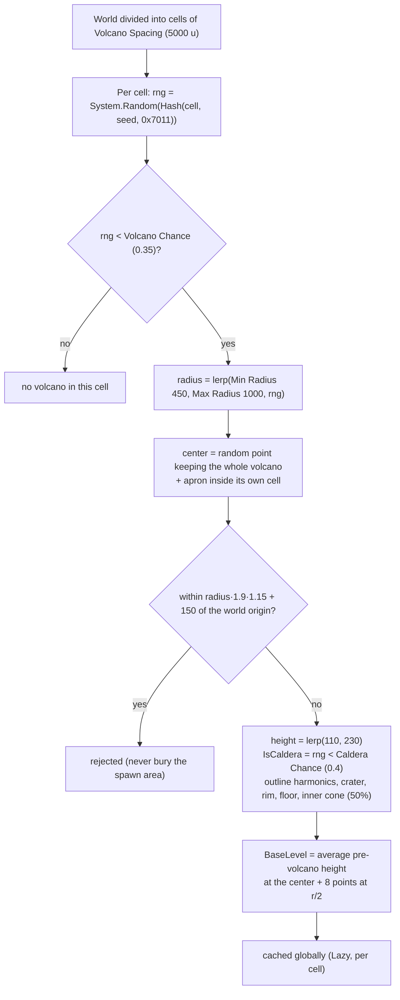
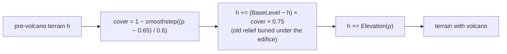

# Terrain 05 — Volcanoes and Calderas

**Scripts:** `LandForms/Volcanoes/VolcanoGenerator.cs`, `LandForms/Volcanoes/VolcanoFeature.cs`, applied from
`TerrainHeightSampler.ShapeLand`; texturing through `TerrainHeightSampler.GetTextureBlend` (Volcanic biome).

**Status:** Implemented (shape, caldera, lava-plain apron, lava-flow tongues, volcanic biome texturing).
Not implemented: molten lava, eruptions, lava damage, heat effects.

---

## 1. What a volcano is here

A volcano is a **rare, very large landmark** that reshapes a wide area: either

- a **stratovolcano** — a tall, concave cone steepening toward a summit crater, or
- a **caldera** — a broad volcanic massif whose summit collapsed into a wide, flat-floored depression ringed by steep,
  stepped walls, sometimes with a young cone inside.

Both carry radial gullies and lava-flow lobes on their flanks and sit on a wide **apron of lava plains** that buries
and smooths the older terrain around them. Rivers run down their flanks (they are part of the base terrain rivers are
traced on) and lakes can form in a caldera.

## 2. Placement: why volcanoes stay rare



- **At most one volcano per 5 km × 5 km cell**, with a 35 % chance → roughly one every 8 km on average.
- Each volcano is a pure function of `(cell, seed, settings)`, cached in a `ConcurrentDictionary<long, Lazy<…>>`, so
  every chunk sees the identical volcano no matter which one asks first.
- Lookups only check the 3 × 3 neighbouring cells, skipping any cell whose area is farther than the largest possible
  influence radius.

## 3. Shape

### 3.1 Normalized radius `ρ`

`ρ = distance to center / (Radius × wobble(angle))`. The wobble is `1 + H1·sin(θ + φ1) + H2·sin(2θ + φ2) + small fbm`,
so outlines are irregular, not circles. `ρ = 1` is the foot of the main edifice; the apron reaches `ρ = 1.9`.

### 3.2 Profiles

```
Stratovolcano                              Caldera
            crater                                  rim   floor   rim
              __                                 ___/‾‾\_______/‾‾\___
             /  \                              _/  inner cone /\       \_
            /    \                           _/         ___/  \__        \_
          _/      \_                      __/                              \__
   ______/  apron   \______        ______/     apron                         \______
```

`VolcanoFeature.Elevation(x, z, ρ)`:

| Part | Formula / behaviour |
|---|---|
| Apron (lava plains) | `0.1 × H × (1 − smoothstep(ρ / 1.9))` |
| Cone | `0.9 × H × (1 − ρ)^2.1` (concave: gentle foot, steep top) |
| Summit crater | minus `0.14 × H × (1 − (ρ/crater)²)` for `ρ < 1.4·crater`, crater 0.07–0.11 |
| Caldera massif | broad `(1 − (ρ − rim)/(1 − rim))^1.5` outside the rim (rim 0.45–0.6), crest rising and dipping around it, scalloped slump scars |
| Caldera walls | two ring-fault steps (a bench partway down) into a floor at 0.25–0.4 × H that dips gently to the middle |
| Inner cone | 50 % of calderas: `floor + 0.28 H (1 − r/0.12)^1.6` off-centre |
| Radial gullies | ridged noise in angle-space, strongest mid-flank, `−0.09 H` |
| Lava tongues | long narrow raised lobes running down the flanks, `+0.035 H` |

### 3.3 Blending with the land underneath



Old hills are **pulled toward the volcano's base level** under the edifice and apron (they are buried), and fade back to
the original terrain outside, so the volcano sits naturally on any landform.

## 4. Biome effects

If a biome has `Placement = Volcanic`, it is painted over volcanoes: `VolcanoGenerator.SurfaceMask` is 1 on the cone,
caldera and lava fields (edge at `ρ ≈ 1.05 + 0.25·fbm`, fading over 0.3) and 0 outside. In
`TerrainHeightSampler.GetTextureBlend`, every other biome's weight is multiplied by `(1 − mask)` and the volcanic biome
gets `mask`. The same blend decides the **biome map**, so a volcanic biome's objects and textures appear there too.
Without a Volcanic biome, volcanoes keep the texture of whatever land biome is there.

Weather: the volcanic biome's own `BiomeWeather` and climate values apply where it is the local biome.

## 5. Interactions

| With | Interaction |
|---|---|
| Erosion | Volcanoes are part of the base terrain, so thermal/hydraulic erosion weathers their flanks like any slope. |
| Rivers | Springs above `River Min Spring Elevation` on flanks trace downhill; steep flanks become waterfalls. |
| Lakes | Caldera floors are natural depressions — lake sites score high there (depression bonus). |
| Oceans | Volcanoes are applied **after** coast shaping; a volcano in the sea raises an island. |
| Objects | Normal placement rules; a Volcanic biome can list its own objects. |
| Climate | No direct effect (no heat field). |

## 6. Configuration

| Variable | Default | Typical | Increase | Decrease | Perf |
|---|---|---|---|---|---|
| Enable Volcanoes | on | — | — | off = no cost | a cache lookup per cell |
| Volcano Spacing | 5000 (min 500) | 3000–10000 | rarer, farther apart | more frequent | — |
| Volcano Chance | 0.35 | 0.1–0.6 | more cells have one | rarer | — |
| Min / Max Radius | 450 / 1000 | 300–1500 | bigger (apron ≈ 1.9 × radius) | smaller | larger influence area |
| Min / Max Height | 110 / 230 | 60–400 | taller summits/rims | lower | — |
| Caldera Chance | 0.4 | 0–1 | more calderas | more cones | — |

**Example:** Spacing 5000, Chance 0.35, radius 450–1000 → apron up to ~1900 u across. Walking 10 km in a straight line
you pass on average one volcano.

## 7. Debugging

| Symptom | Cause | Fix |
|---|---|---|
| No volcanoes found | spacing huge, chance low, all candidates near origin | World Preview, Area Size 20000+ |
| Volcano cut by a chunk seam | should not happen (global cache); if it does, caches were not cleared after a settings change | restart Play / `WaterGenerator.ClearCaches()` |
| Volcano texture missing | no biome with Placement = Volcanic | add one |
| Volcano too steep to walk | Max Height high relative to radius | lower height or raise radius |
