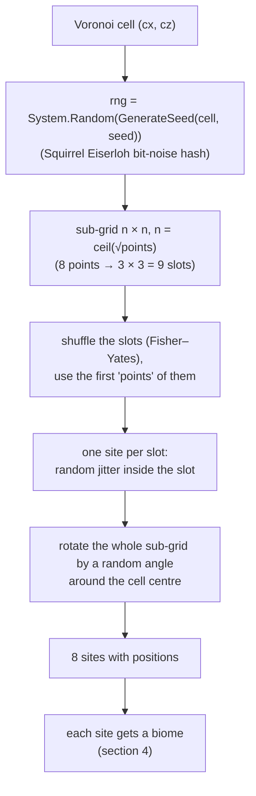
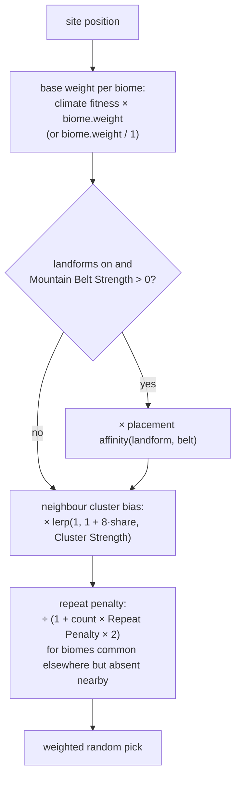
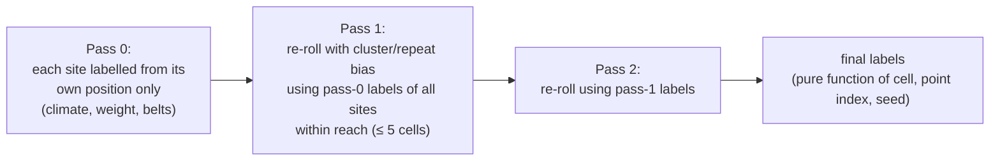
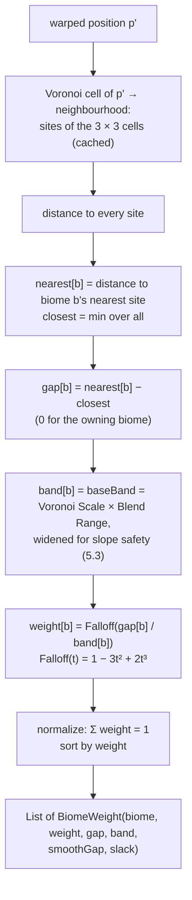

# Terrain 06 — The Voronoi Biome Layout

**Scripts:** `Biome/Layout/VoronoiBiomeGenerator.cs` (+ `.Grid.cs`, `.Selection.cs`, `.Blend.cs`,
`.OrderIndependent.cs`), used through `TerrainHeightSampler` (`GetBlend`, `SampleBiome`, `GetBiomeGaps`).

---

## 1. Concept: what a Voronoi diagram is

Scatter some points (called **sites** or **seeds**) on a plane. The **Voronoi cell** of a site is the region of all
positions closer to that site than to any other. The result is a mosaic of convex polygons — like territories around
towns.

```
   •A          |        •B
               |
  ------+      |      +------
         \     |     /
    •C    \____|____/    •D
```

Useful quantities:

| Term | Meaning |
|---|---|
| **F1** | distance to the nearest site |
| **F2** | distance to the second-nearest site |
| **F2 − F1** | 0 exactly on a border, growing toward a cell's interior → *distance to the border* (≈ half of it on the line between two sites) |
| **Cell ID** | which site is nearest (here: which biome) |

**Why Voronoi for biomes?** It produces **regions** (territories) of controllable size, each with a single identity,
from a handful of random points — cheaply, infinitely and deterministically. Noise alone gives smooth *gradients*, not
territories.

**The problem** with a raw Voronoi diagram is that it looks artificial: straight edges, similar-sized polygons,
salt-and-pepper assignments. Most of this chapter is about the measures that hide that.

## 2. Where Voronoi is used in this project

| Use | Details |
|---|---|
| **Biome distribution (land)** | the main use: each site carries a biome |
| **Ocean biome layout** | the same function evaluated at `(x/2.5 + 262144, z/2.5)` — its own cells, 2.5× larger |
| **Mountain territories** | massifs are computed from where Mountains-biome cells are (distance field) |
| **Biome blending** | per-biome distances → transition weights (terrain height, splat textures, erosion maps) |
| **Object placement borders** | `GetBiomeGaps` → distance to other biomes (biome-border rules) |
| **Climate / weather / placement** | *read* the layout (they don't create cells) |

Not Voronoi-based: water features, volcanoes, portals and placement candidates use **regular grids with one jittered
candidate per cell** (a different technique with a similar "one per region" effect).

## 3. Building the sites (`GenerateJitteredGridPoints`)

The world is divided into **Voronoi cells** of `Voronoi Scale` units (default 350) — a grid independent of terrain
chunks. Each cell gets `Num Voronoi Points` sites (default 8):



- **Jittered grid (stratified sampling)** instead of pure random: keeps cell sizes even (no giant wedge cells around
  an isolated point).
- **Shuffled slots:** when points don't fill the sub-grid, a different corner is left empty in each cell.
- **Random rotation:** otherwise every cell has the same N × N skeleton, which combined with clustering reads as a
  repeating pattern.
- **Seeded hash:** the old `baseSeed + x·73856093 ^ y·19349663` seed had almost no avalanche (neighbouring cells got
  correlated seeds); the bit-noise hash fixes that.

## 4. Assigning a biome to each site



1. **Base weights** — with *Natural Climate Placement* on, `fitness = exp(−(ΔT/tolT)² − (ΔM/tolM)²)` against the
   biome's ideal temperature/moisture ([Climate](07-Climate.md)), multiplied by `biome.weight` if *Use Weighted Biome*.
   If no biome fits at all (Σ ≈ 0) the plain weights are used instead of always picking the "least bad".
2. **Mountain belts** — see [Height & Landforms](04-Height-and-Landforms.md) §6.3.
3. **Cluster bias** (`Biome Cluster Strength`, 0.5) — points within `Cluster Radius = Voronoi Scale × 1.5` influence
   the new point linearly (`1 − d/radius`). A biome that holds the whole neighbourhood gets up to **9×** weight at
   strength 1. This turns scattered points into **contiguous territories**.
4. **Repeat penalty** (`Biome Repeat Penalty`, 0.6) — a biome that already exists elsewhere in the known area but has
   *no* point within reach is divided by `1 + count × penalty × 2`. This stops several separate same-shaped "islands"
   of one biome inside one area, without ever penalizing growth of an existing territory.

### 4.1 Order-independent layout (default ON)

In the original algorithm the "neighbours" were whatever cells had already been generated — so the layout depended on
which chunk loaded first, and chunks load on worker threads in no fixed order. **Order Independent Biome Layout**
replaces that with a two-pass relaxation whose inputs never depend on order:



Each label's RNG is seeded from `(cell, point index, pass)`. Point **positions** are identical in both modes; only
which biome each point gets differs. Switching the option changes an existing world's layout.

## 5. From sites to a biome blend at a position (`GetBiomeBlend`)

### 5.1 Border warping (organic edges)

Before any distance is measured, the position is **domain-warped**:
`p' = p + strength × fractalWarpNoise(p / warpScale)` with strength `Voronoi Warp Strength` (50) capped at
`0.35 × warpScale`, and `warpScale = Voronoi Scale × Warp Scale Multiplier` (525). Straight polygon edges become
wobbly, coastline-like borders. The 3-octave warp uses lacunarity 2.3 so no single wobble wavelength repeats along every
border.

### 5.2 Per-biome distance and weights



Key properties:

- Every biome is weighted by the distance to **its own** nearest site relative to the nearest site of **any** biome.
  Those distances are continuous everywhere, so weights (and the heights blended from them) never jump — including at
  three-biome junctions. (A two-nearest-points approach would switch blend partners abruptly and leave creases.)
- Deep inside a cell: one biome, weight 1. On a border between two biomes: 50 / 50.
- Neighbourhoods (the sites of 3 × 3 cells, their distinct biomes, the per-pair band table) are **cached once all nine
  cells exist**.

### 5.3 Slope-safe band widening

Two biomes whose heights differ a lot (Mountains 60 amp next to Plains 5 amp) need a wider transition. For every pair:

```
heightGap = 0.5 × (maxAmp_A + maxAmp_B) + |baseElevation_A − baseElevation_B|
band_pair = 1.333 × heightGap / tan(Boundary Max Walkable Slope)
```

The derivation: the blended share changes by at most ≈ 1.333 / band per world unit (the gap changes by up to 2 per
unit moved, and the falloff's steepest slope is ≈ 0.667); times the height gap, that must stay under the max slope.
Each biome's band is a presence-weighted average of its neighbours' pair bands, capped at **one biome cell**
(`VoronoiScale / √points`), so very different biomes still keep their identity.

Example: Mountains (maxAmp 90, base 40) vs Plains (maxAmp 9, base 0), 28° → heightGap ≈ 49.5 + 40 = 89.5 →
band ≈ 224 units (then capped at 350/√8 ≈ 124).

### 5.4 SmoothGap (no creases between same-biome cells)

The plain `gap` has kinks along edges between two cells of the **same** biome (where the nearest site switches).
Landforms shape slopes from the gap, so they use `SmoothGap` — a *soft minimum* (log-sum-exp) over each biome's sites:

```
softness = 0.08 × VoronoiScale / √points
smoothGap[b] = softness × ln( Σ_all exp(−(dᵢ − closest)/softness) / Σ_b exp(−(dᵢ − closest)/softness) )
```

### 5.5 Nearby reach

Biomes that are near but not yet blending (weight 0) are also listed, up to `Nearby Reach` (≈ 1.5 site spacings,
capped at half a Voronoi cell), so landform borders can start adjusting before a neighbour's weight begins.

## 6. How the layout avoids looking artificial

| Artefact | Countermeasure |
|---|---|
| Straight polygon edges | domain-warped lookup position (fractal warp) |
| Uniform, grid-like cells | jittered stratified points, shuffled slots, random rotation per cell |
| Salt-and-pepper biomes | cluster bias, climate placement at a scale ≥ 5 × Voronoi Scale |
| Same biome islands repeating | repeat penalty |
| Hard cut at borders | smooth, slope-safe blend bands |
| Creases in terrain | SmoothGap soft-minimum |
| Mountains as blobs | mountain belts + massifs |
| Same border wobble everywhere | 3-octave warp with non-integer lacunarity |

## 7. Configuration

| Variable | Default | Typical | Increase | Decrease | Perf |
|---|---|---|---|---|---|
| Num Voronoi Points | 8 | 4–16 | smaller biome regions | bigger regions | more sites per lookup (9 cells × points distances) |
| Voronoi Seed | 0 | any | — | — | **the world seed** for everything |
| Voronoi Scale | 350 | 250–800 | larger regions (and derived scales: climate, warp, belts, continents) | smaller | — |
| Use Weighted Biome | on | — | biome.weight counts | uniform | — |
| Biome Cluster Strength | 0.5 | 0.4–0.6 | bigger contiguous territories; near 1 = repetitive | scattered | — |
| Cluster Radius Multiplier | 1.5 | 1–2.5 | territories grow across more cells | local only | — |
| Biome Repeat Penalty | 0.6 | 0.3–0.8 | fewer repeated islands | more | — |
| Voronoi Warp Strength | 50 | 20–120 | wobblier borders | straighter | 3 Perlin × 2 |
| Warp Scale Multiplier | 1.5 | ≥ 1 | longer wobble | jagged (<1) | — |
| Height Blend Range (`biomeBlendRange`) | 0.25 | 0.1–0.35 | wider transitions | sharper | — |
| Boundary Max Walkable Slope | 28° | 20–35° | narrower borders | wider, gentler | — |
| Order Independent Biome Layout | on | on | — | — | slightly more work per cell of sites |

## 8. Performance

Per cell: warp (6 Perlin calls), neighbourhood lookup (cached), distances to 72 sites (9 cells × 8), a few `exp`.
Site generation happens once per Voronoi cell (under a lock) and is recorded in Generation Stats as *Voronoi points*.

## 9. Debugging

| Symptom | Fix |
|---|---|
| Biomes look like polka dots | raise Climate Scale Multiplier (≥ 5), Cluster Strength 0.5 |
| Same layout repeats | Cluster Strength too close to 1 |
| Jagged, self-crossing borders | Warp Scale Multiplier < 1 (inspector warns) |
| Layout changes between runs | Order Independent off, or biome names/settings changed |
| One biome dominates | its weight/climate niche too wide; check World Preview → Biomes + coverage stats |
