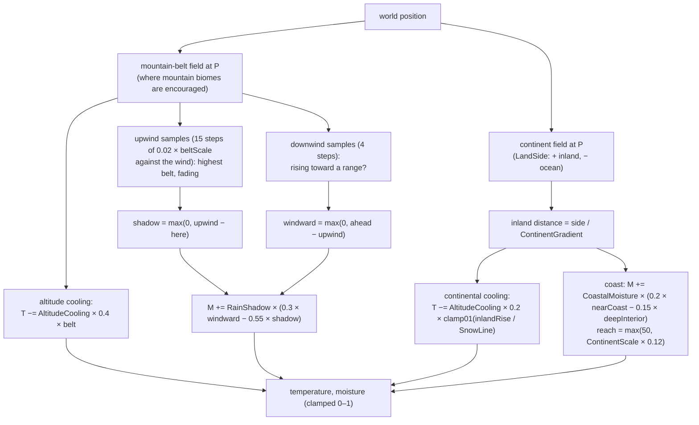
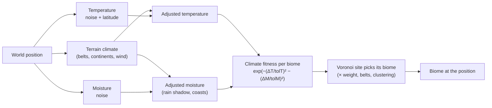

# Terrain 07 — Climate

**Scripts:** `Biome/Layout/ClimateGenerator.cs`, `Biome/Layout/TerrainClimate.cs`; consumers:
`VoronoiBiomeGenerator.Selection` (biome choice), `HeightGenerator.BuildBaseHeights` (erosion rainfall),
`PlacementEnvironment` (object climate rules), `WeatherClimateSampler` (weather), World Preview (Climate views).

---

## 1. What "climate" means in this project

Climate is **two numbers per world position, both 0–1**:

| Variable | 0 | 1 | Scale |
|---|---|---|---|
| **Temperature** | coldest | hottest | the weather maps 0–1 to −25 °C … 42 °C |
| **Moisture** (rainfall / humidity proxy) | driest | wettest | — |

Climate is **static** (it does not change over time — the *weather* does) and **deterministic**.

It is used to:

1. **Place biomes plausibly** — deserts where it is hot and dry, tundra where it is cold, rainforest where it is hot
   and wet.
2. **Scale erosion** — wetter regions feed more water into erosion droplets.
3. **Filter objects** — object rules can require a moisture/temperature range.
4. **Drive the weather** — together with each biome's own ideal climate.

Implemented climate variables: temperature, moisture, latitude gradient (weak), rain shadow, altitude cooling,
coastal moisture, prevailing wind direction. **Not implemented** as climate: seasons, humidity separate from
moisture, exposure/aspect, slope-based climate, dynamic climate change. (Slope affects placement rules, not climate.)

## 2. Base fields — `ClimateGenerator`

```
temperatureNoise = fbm(position / climateScale, 3 octaves, seed offset 10007)        ∈ [0, 1]
latitude         = 1 − clamp01(|z − 0| / (4 × climateScale))                          (1 at the "equator" z = 0)
temperature      = lerp(temperatureNoise, latitude, 0.18)
moisture         = fbm(position / climateScale, 4 octaves, seed offset 30011)         ∈ [0, 1]
climateScale     = Voronoi Scale × Climate Scale Multiplier   (350 × 6 = 2100)
```

- The **latitude term** is deliberately weak (18 %): at 50 % it pinned the whole spawn area near the maximum
  temperature for dozens of chunks and starved every biome except the hot ones.
- The climate scale is **several biome cells wide**, so neighbouring biome sites see similar climates and similar
  biomes cluster into regions. Below ~3 × Voronoi Scale the inspector warns of a "salt-and-pepper" patchwork.

## 3. Terrain-aware climate — `TerrainClimate`

When **Terrain Aware Climate** is on, the large-scale terrain modifies the base fields:



### 3.1 Why it uses belts and continents, not real heights

Biomes are chosen **from** the climate and heights are computed **from** biomes. Reading actual terrain heights here
would be circular. The two fields used are the ones that decide *where mountain biomes and oceans are likely*, and they
do not depend on the biome layout. In practice mountain landforms do sit on the belts (with default Belt Strength 0.5),
so the effect matches the visible mountains.

### 3.2 The rain-shadow model

Moist air travels with the **prevailing wind** (`Prevailing Wind Angle`, 0° = toward +X / east). When it rises over a
range it rains out:

```
   wind →      wet windward side      range       dry lee side (desert, steppe)
   ~~~~~       (+ moisture)            /\/\        (− moisture)
   ______________________________ ___/    \___________________________
```

`upwind` = the highest belt value the air crossed recently (up to 15 steps back, fading to half); if the current
point is lower than that, it lies in the shadow. `ahead` = whether the ground rises toward a range downwind with nothing
blocking the air before → windward wetting.

### 3.3 Coasts and interiors

Near the sea (within about 12 % of the continent scale) land is wetter; deep continental interiors are drier and,
where the land rises inland (`Inland Rise`), a little colder.

`BeltInfluence = clamp01(Mountain Belt Strength × 2)` — belts only affect climate when some land biome actually uses a
mountain-type landform (Mountains, Glacial, Plateau).

## 4. From world position to biome (climate view)



**Worked example.** At a point: noise temperature 0.72, latitude 0.9 → T = lerp(0.72, 0.9, 0.18) = 0.75. Moisture
noise 0.35; the point is 2 belt-steps behind a range (shadow 0.6) → M += 0.6 × (−0.55 × 0.6) = −0.2 → M = 0.15.
A Desert biome (ideal T 0.85, M 0.1, tolerances 0.35) scores `exp(−(0.1/0.35)² − (0.05/0.35)²) = 0.90`; a Temperate
Forest (0.5, 0.6) scores `exp(−0.51 − 1.65) = 0.12`. The site becomes Desert with ~88 % probability before clustering.

## 5. How climate affects other systems

| System | Effect |
|---|---|
| Biome placement | the main effect (fitness) |
| Landform suggestion | Landforms Only mode: hot+dry → Dunes, cold+tall → Glacial |
| Erosion | `rainfall = clamp01(moisture × Σ w·biome.rainfallErosionMultiplier)` → droplet water `lerp(0.4, 1.6, rainfall)` |
| Objects | Climate rules: moisture/temperature ranges with softness |
| Weather | world climate blended with the biomes' ideal climate (`Biome Influence` 0.75), altitude cooling |
| Rivers | not directly (springs use biome likelihood + elevation + snow line) |

## 6. Configuration

| Variable | Default | Typical | Increase | Decrease |
|---|---|---|---|---|
| Use Natural Climate Placement | on | on | — | biomes by weight only (random) |
| Climate Scale Multiplier | 6 | 5–10 | larger climate zones, big biome regions | patchwork |
| Terrain Aware Climate | on | on | — | pure noise climate |
| Prevailing Wind Angle | 0° (toward east) | any | rotates where rain shadows fall | — |
| Rain Shadow Strength | 0.6 | 0.3–0.8 | drier lee sides, wetter windward | weaker |
| Altitude Cooling | 0.5 | 0.3–0.7 | colder mountains/interiors (tundra, glacial) | milder |
| Coastal Moisture | 0.4 | 0.2–0.6 | wetter coasts, drier interiors | uniform |
| Biome Ideal Temperature / Moisture | 0.5 / 0.5 | per biome | — | — |
| Biome Temperature / Moisture Tolerance | 0.35 | 0.15–0.5 | biome accepts wider climates | distinct niche |

Performance: climate is evaluated once per **Voronoi site** (cheap) for placement; for erosion rainfall the terrain
climate is evaluated on a 16-unit lattice (`TerrainClimate.MoistureGrid`) and bilinearly interpolated per cell.

## 7. Debugging

Use the World Preview's **Climate**, **Temperature** and **Moisture** views.

| Symptom | Cause | Fix |
|---|---|---|
| Only hot biomes near spawn | latitude + noise near spawn happen to be hot | move the seed or widen tolerances |
| A biome never appears | its climate niche never occurs, or tolerance too narrow | widen tolerance, check Climate view |
| No desert behind mountains | Terrain Aware Climate off, no mountain landforms, Belt Strength 0 | enable; use Mountains landform |
| Climate ignores oceans | oceans disabled | coastal effects need oceans |
