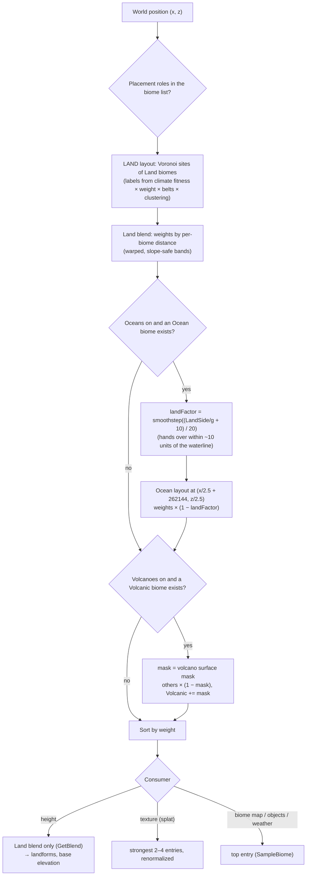

# Terrain 08 — Biomes

**Scripts:** `Biome/Biome.cs` (ScriptableObject), `Biome/BiomeInstance.cs`, `Biome/BiomeObject.cs`, the layout in
`Biome/Layout/*` ([06](06-Voronoi.md)), `TerrainHeightSampler.GetTextureBlend / SampleBiome`,
`TerrainGenerator.GenerateBiomeMap`, editor presets in `TerrainGeneratorEditor.BiomePresets.cs`.

---

## 1. Concept: procedural biomes

A **biome** is a kind of environment — desert, forest, tundra, swamp. Procedural biome generation decides **which
biome is where**, so that:

- regions are large and contiguous (territories, not noise speckles);
- placement is plausible (deserts where it is hot and dry);
- borders are gradual (height, textures and objects transition);
- the same seed always gives the same layout.

In this project a biome is an **asset** (`Assets > Create > SimpleMovements > World > Biome`) listed in
`TerrainGenerator > Biomes` together with its objects (`BiomeInstance { BiomePrefab, runtimeObjects }`). A biome
**does not** by itself decide water type or ocean: oceans come from the continent field, and rivers flow through any
biome.

## 2. Biome definition — every field

| Group | Field | Purpose | Used by |
|---|---|---|---|
| Identity | `name` | display name; **seeds per-biome noise phases** — keep it unique | Classic noise, landform wobble, splat index |
| Texture | `texture` | the biome's ground texture (layer in the texture array) | splat maps, shader |
| | `textureVariations[]` | extra textures, appended to the texture array when *Texture Variations* is on | **Partially implemented** — the package shader samples only one layer per biome |
| Height band | `minHeight`, `maxHeight` | a height band *associated* with the biome — does **not** shape terrain | object/mob default height band (`useBiomeHeightBand`, relative altitude); legacy height-based texturing |
| Shape | `amplitude` | relief height of the first octave / landform scale | height, border bands |
| | `frequency` | features per chunk width | height |
| | `persistence` | roughness (0–1) — **default 1 is very rough** | height |
| | `baseElevation` | vertical offset: makes a biome sit higher/lower | height, border bands |
| | `landform` | the ground's shape ([04](04-Height-and-Landforms.md)) | height |
| | `placement` | Land / Ocean / Volcanic | layout, texturing |
| Selection | `weight` | relative likelihood (with *Use Weighted Biome*) | Voronoi |
| Climate | `idealTemperature`, `idealMoisture` (0–1) | the biome's climate niche | Voronoi, weather |
| | `temperatureTolerance`, `moistureTolerance` | niche width | Voronoi |
| Erosion | `erosionResistance` (0–1) | hard rock erodes less and keeps steeper slopes | erosion |
| | `rainfallErosionMultiplier` (0–3) | water erosion strength | erosion |
| Water | `allowsWaterBodies` | lakes, ponds and springs may originate here | water |
| | `lakeLikelihood`, `pondLikelihood`, `riverSpringLikelihood` (0–3) | per-biome feature frequency | water |
| Weather | `weather` (`BiomeWeather`: 12 multipliers 0–3 + presets) | how often each weather happens here | weather |
| Objects | (in `BiomeInstance.runtimeObjects`) | trees, rocks, landmarks… | placement |

`ClimateFitness(T, M) = exp(−((T − idealT)/tolT)² − ((M − idealM)/tolM)²)` — 1 at the ideal climate, 0.37 one
tolerance away, 0.02 two tolerances away.

## 3. How a biome is selected at a position — decision flowchart

Important consequences:

- **Height uses only the land blend.** Ocean biomes shape the seafloor through their own landform in the ocean branch
  of `ShapeCoast`; volcanic biomes don't shape anything (the volcano does).
- **The biome map** (one biome per cell, used by object placement and gameplay queries) is the **top entry of the
  texture blend**, so objects follow the painted ground.
- If no biome has a special role, oceans and volcanoes keep the land biome that is there.

## 4. Thresholds, ranges and masks — what exists and what doesn't

| Mechanism | Implemented? | Details |
|---|---|---|
| Temperature / moisture niches | **Yes** (soft Gaussian, not hard thresholds) | `ClimateFitness` |
| Altitude-based biome selection | **No** — biomes decide height, not the reverse | climate is cooled by *belts* and continents, which correlates cold biomes with mountains |
| Slope-based biome selection | **No** | slope is used by textures (tri-planar) and objects |
| Voronoi regions | Yes | [06](06-Voronoi.md) |
| Noise-based variation | Yes | climate noise, warp, clustering randomness |
| Biome masks | Yes: blend weights, volcanic surface mask, land/ocean factor | |
| Transition zones | Yes: blend bands (base 0.25 × Voronoi Scale, slope-safe widening) | |
| Blending | Yes: heights (weighted), textures (up to 4 per pixel), erosion maps, object border fades, weather (5-sample average) | |

## 5. How the layout avoids artificial blobs

1. **Climate at a scale of several cells** — neighbouring sites get related climates, so the same biome recurs in a
   coherent region.
2. **Cluster bias** — a site prefers what its neighbours are (up to 9×).
3. **Repeat penalty** — prevents several disconnected same-shaped islands.
4. **Jittered, rotated sites** — no visible grid.
5. **Warped borders** — organic outlines.
6. **Mountain belts** — mountain biomes form ranges, not polka dots.
7. **Smooth transitions** — heights, textures and objects fade across borders instead of switching.
8. **Order independence** — the layout never depends on exploration order.

## 6. Biome catalogue

The package ships **no biome assets** — the biomes of your world are the assets you list in the TerrainGenerator. It
ships **15 presets** (Biome inspector → *Presets*), which are the reference archetypes this system was tuned with.
Presets set the climate niche, erosion, noise shape, landform and placement; `weight` and `minHeight/maxHeight` are left
to you.

| Preset | Ideal T | Ideal M | Tol T / M | Erosion res. | Rain mult. | Amp | Freq | Pers. | Landform | Placement |
|---|---|---|---|---|---|---|---|---|---|---|
| Mountain | 0.35 | 0.45 | 0.35 / 0.40 | 0.85 | 0.8 | 60 | 1.5 | 0.50 | Mountains | Land |
| Tundra | 0.08 | 0.35 | 0.20 / 0.30 | 0.55 | 0.6 | 8 | 1.2 | 0.45 | Plains | Land |
| Grassland | 0.55 | 0.45 | 0.30 / 0.30 | 0.35 | 1.0 | 4 | 1.0 | 0.40 | Plains | Land |
| Forest | 0.50 | 0.60 | 0.30 / 0.30 | 0.40 | 1.1 | 10 | 1.3 | 0.45 | Hills | Land |
| Desert | 0.85 | 0.10 | 0.25 / 0.20 | 0.20 | 0.3 | 12 | 0.8 | 0.35 | Dunes | Land |
| Swamp | 0.60 | 0.90 | 0.30 / 0.25 | 0.25 | 1.4 | 2 | 1.0 | 0.30 | Wetland | Land |
| Jungle | 0.85 | 0.85 | 0.25 / 0.25 | 0.35 | 1.6 | 14 | 1.4 | 0.50 | Hills | Land |
| Beach / Coastal | 0.65 | 0.55 | 0.35 / 0.35 | 0.15 | 1.2 | 3 | 0.9 | 0.30 | Plains | Land |
| Highland Forest | 0.45 | 0.65 | 0.30 / 0.30 | 0.50 | 1.1 | 16 | 1.0 | 0.45 | Highlands | Land |
| Glacial Valleys | 0.10 | 0.45 | 0.20 / 0.35 | 0.80 | 0.7 | 55 | 1.2 | 0.50 | Glacial | Land |
| Ocean – Deep Plain | 0.50 | 0.50 | 0.50 / 0.50 | 0.50 | 1.0 | 10 | 0.8 | 0.50 | SeaPlain | Ocean |
| Ocean – Ravines | 0.40 | 0.50 | 0.50 / 0.50 | 0.50 | 1.0 | 22 | 0.8 | 0.50 | SeaRavines | Ocean |
| Ocean – Coral Reef | 0.85 | 0.50 | 0.25 / 0.50 | 0.50 | 1.0 | 30 | 0.8 | 0.50 | SeaReef | Ocean |
| Ocean – Rocky Seabed | 0.30 | 0.50 | 0.50 / 0.50 | 0.50 | 1.0 | 8 | 1.2 | 0.50 | SeaRocky | Ocean |
| Volcanic | 0.60 | 0.30 | 0.50 / 0.50 | 0.90 | 0.5 | 10 | 1.0 | 0.50 | Plains | Volcanic |

For each archetype, what the rest of the system does with it:

| Archetype | Typical landforms | Water behaviour | Weather preset | Typical objects (object presets) |
|---|---|---|---|---|
| Mountain | massifs, ridges, cliff bands, passes | many springs (set Spring Likelihood 2–3), waterfalls, snowmelt springs above the snow line | Mountains (wind, snow, sudden storms) | Rocks/Boulder, Rocks/Scree, Landmarks/On Hilltops |
| Tundra | flat plains, frost | few lakes; cold | Tundra & Snow | Small Rock, Grass |
| Grassland | swells, shallow basins | ponds in basins | Grassland (storms, wind, tornadoes) | Plants/Grass, Trees/Lone Tree |
| Forest | rolling hills | normal | Temperate | Trees/Forest Tree, Plants/Bush, Mushroom (under trees) |
| Desert | dunes, flat pans | allowsWaterBodies often off, low spring likelihood | Desert (sandstorms, heat waves) | Small Rock, Landmarks/In Valleys |
| Swamp | wetland hummocks and hollows | pond likelihood 2–3 | Swamp & Wetland (fog, mist) | Water/Reeds, Water/Water Lily |
| Jungle | hills, high rainfall erosion | many rivers | Rainforest | Forest Tree, Bush, Cliff Plant |
| Beach / Coastal | low plains near the sea | coast | Coast | Trees/Palm (near the sea) |
| Highland Forest | uplands with ledges and ravines | springs | Temperate / Mountains | Forest Tree, Boulder |
| Glacial Valleys | U-shaped troughs, hanging valleys | lakes in trough floors | Tundra & Snow | Boulder, Scree |
| Ocean biomes | seafloor shapes | — (always ocean) | Coast | Water/Seaweed (on the bottom) |
| Volcanic | painted over cones, calderas, lava plains | caldera lakes | — | Rocks |

Special effects per biome are limited to what the systems above support: texture, wetness near water (all biomes),
snow cover (weather, all biomes above the snow line), and weather events via `BiomeWeather`.

## 7. Biome blending — where each consumer blends

| Consumer | How many biomes | Weights |
|---|---|---|
| Terrain height | all within the band (typically 1–3) | blend weights; relief with its own narrower weights |
| Erosion resistance / rainfall | all | blend weights |
| Splat textures | strongest 2–4 (**Splat Textures Per Pixel**, default 4) | renormalized |
| Biome map (objects, gameplay) | 1 | top of texture blend |
| Object border fade | own biome vs others | distance to border (`GetBiomeGaps`) |
| Weather | 5 samples within ~60 u | average of ideal climates and weather factors (centre counts 4×) |

## 8. Configuration summary

See the Voronoi, Climate and Height chapters for the layout settings. Key biome-asset guidance:

| Field | Typical | Notes |
|---|---|---|
| amplitude | plains 3–8, hills 10–20, highlands 15–25, mountains 40–80 | tallest massifs ≈ 2.6 × amplitude |
| frequency | 0.8–2 | per chunk width |
| persistence | 0.35–0.5 | default 1 is too rough |
| baseElevation | −10 … 40 | separates lowlands from uplands |
| weight | 0.5–2 | balance coverage |
| tolerances | 0.2–0.4 | narrower = more distinct niche |

## 9. Debugging biomes

| Problem | Cause | Fix |
|---|---|---|
| A biome never appears | niche outside the world's climate range, weight tiny, landform belt affinity low | World Preview → Climate; widen tolerance |
| Biomes look like blobs / patches | low climate scale, Cluster Strength 0 | climate multiplier 5–10, cluster 0.5 |
| Two biomes produce identical terrain | same name (same noise phase) and settings | rename |
| Objects of the wrong biome along coasts | ocean biome takes over within ~10 u of the waterline | expected; adjust object water rules |
| Volcano has no special texture | no Volcanic biome | add one |
| Textures don't match height bands | `minHeight/maxHeight` don't shape terrain; *Texture Based On Voronoi Points* is the only working texturing mode in the streaming pipeline | keep it ON (see [Texturing](12-Texturing-and-Shaders.md)) |
