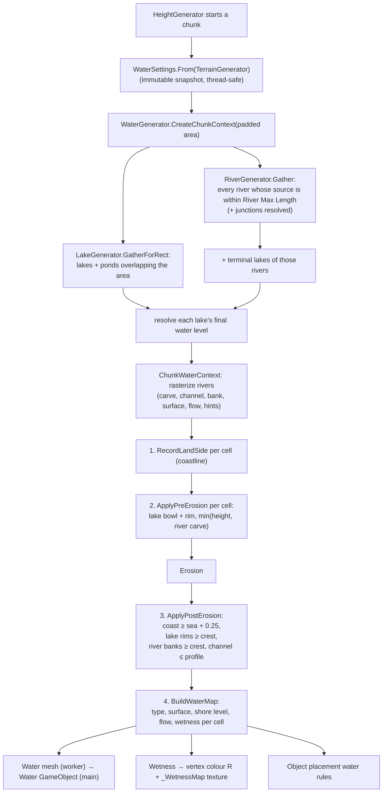
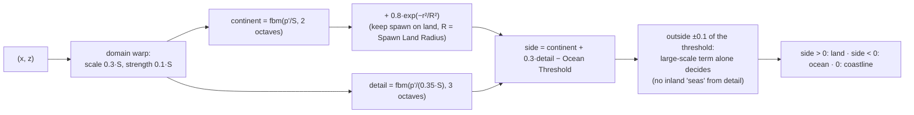
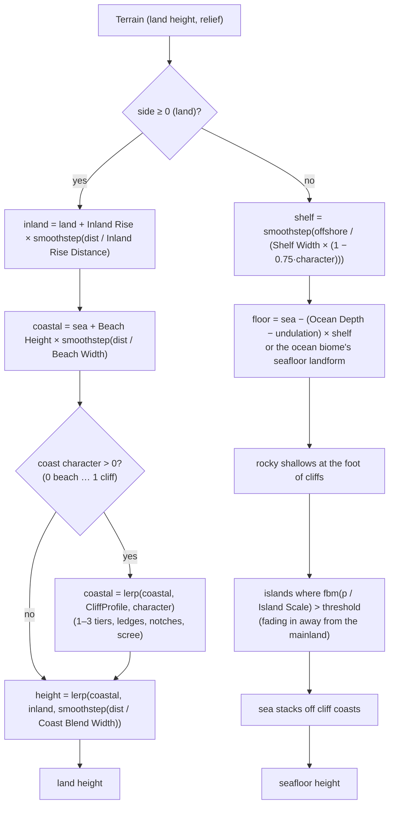
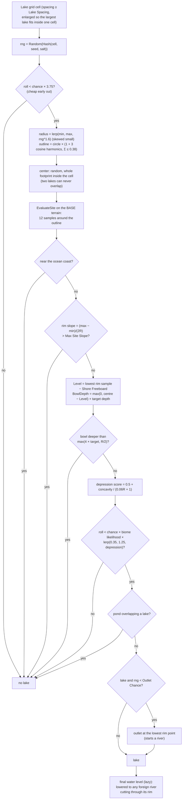
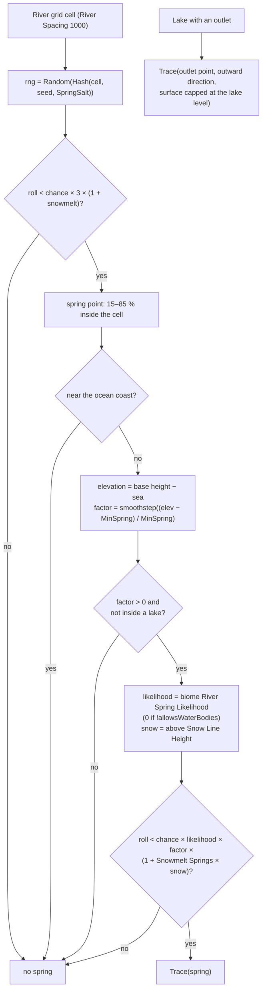
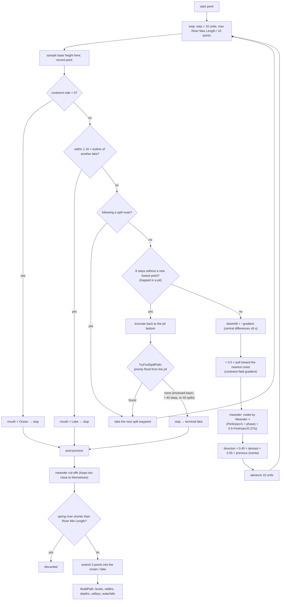
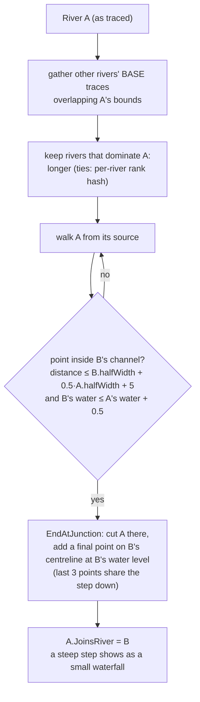
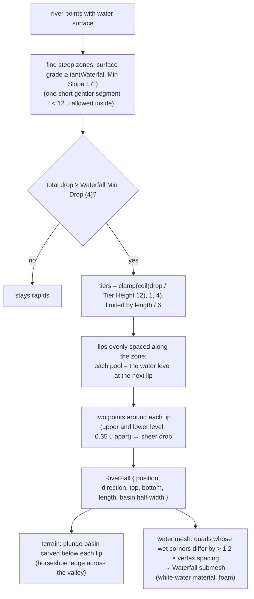
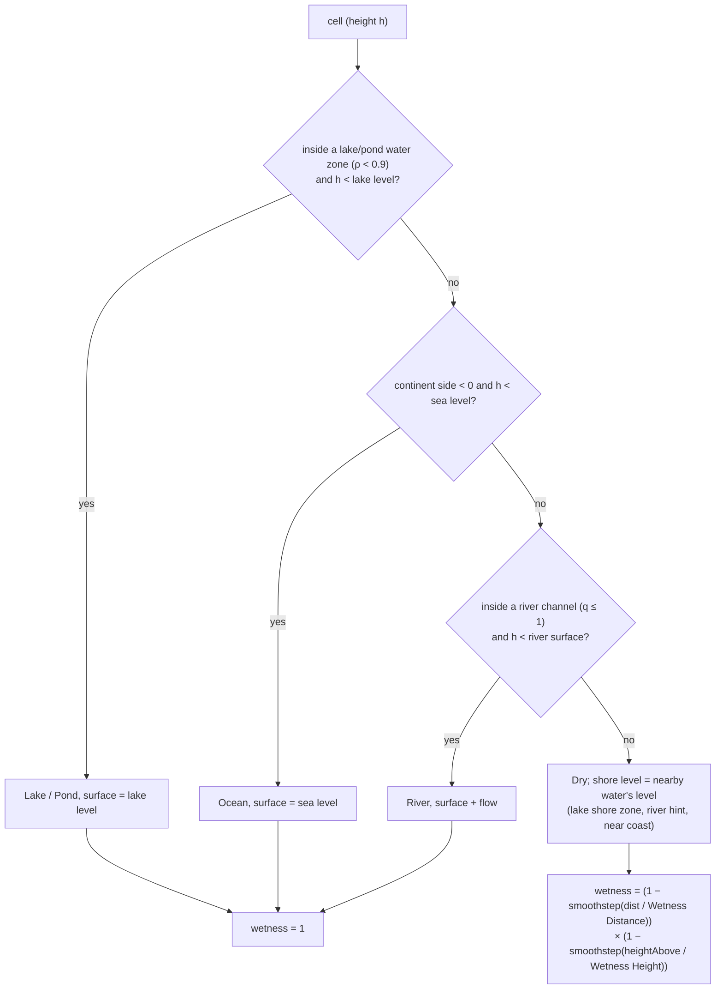

# Terrain 09 — Water: Oceans, Lakes, Ponds, Rivers, Waterfalls

**Scripts:** `Water/WaterGenerator.cs`, `WaterSettings.cs`, `ChunkWaterContext.cs`, `WaterMapData.cs`,
`WaterVolume.cs`, `Oceans/OceanGenerator(.Cliffs).cs`, `Oceans/SeaStacks.cs`, `Lakes/LakeGenerator.cs`,
`Lakes/LakeFeature.cs`, `Rivers/RiverGenerator(.Tracing, .Spill, .Path, .Junctions, .Raster).cs`, `Rivers/RiverPath.cs`,
`Rivers/RiverRaster.cs`, `Rivers/Waterfalls.cs`, `Mesh/MeshGenerator.Water.cs`, `Mesh/WaterMeshData.cs`,
`Rivers/Resources/SimpleMovementsWater.shader`.

---

## 1. Philosophy: water bodies are geographic features, not height ranges

A naive terrain generator fills everything below a "water level" with water. That produces flooded valleys, lakes
that leak over their rims, and rivers that are just wet stripes. Here each water type is a **feature with its own
placement rule, its own water level and its own way of shaping the terrain**:

| Type | Decided by | Water level | Shapes the terrain by |
|---|---|---|---|
| **Ocean** | a low-frequency *continent field* | `Water Level` (sea level) | beaches, cliffs, shelf, seafloor, islands, sea stacks |
| **Lake** | one candidate per lake-grid cell, accepted on suitable sites | just below the lowest point of its natural rim | bowl + guaranteed rim |
| **Pond** | same system, finer grid, smaller, shallower | same | same |
| **River** | springs (and lake outlets) traced downhill | running minimum of the banks — only goes down | valley, channel, banks, gorges, waterfalls |
| **Waterfall** | steep stretches of a river | a series of pools | plunge basins, rock ledge |

Every feature is a pure function of `(world position, seed, settings)`, computed **once** and cached globally, so every
chunk sees exactly the same oceans, lakes and river paths — that is what keeps water seamless across chunks.

`WaterGenerator.ClearCaches()` must be called whenever the seed or settings change (the TerrainGenerator does it in
`Awake`).

## 2. Water in the chunk pipeline



**Why carve before erosion *and* enforce after:** carving first lets erosion weather lake shores and river valleys into
natural shapes; the post-erosion pass then re-applies hard guarantees so erosion can never breach a rim, raise a
channel bed above its water, or lower a coast below the sea.

---

## 3. Oceans

### 3.1 The continent field (`OceanGenerator.LandSide`)



`S = Continent Scale = Voronoi Scale × Continent Scale Multiplier` (350 × 18 = 6300). `side / ContinentGradient`
(with `ContinentGradient = 1.5 / S`) is an approximate distance to the coast in world units.

A large, low inland area therefore **stays land** (or becomes a lake) instead of silently turning into sea.

### 3.2 Ocean terrain (`ShapeHeight`)



- **Sea level:** `Water Level` — only oceans use it.
- **Ocean mask:** a cell is ocean water when `side < 0` **and** its terrain is below sea level.
- **Depth:** `Ocean Depth` (35) at the end of the shelf; varied by land relief (±30 %) or an ocean biome's landform.
- **Shoreline:** where terrain crosses sea level; land within the beach band (+ 2 mesh vertices) is clamped to at least
  `sea + 0.25` after erosion so the water never z-fights with the beach.
- **Coasts vary along their length:** a slow *coast character* field (`CoastCharacter`, 520-unit noise) alternates
  beaches, rocky shores and cliffs; `Coast Cliff Frequency` sets how much is cliff. Cliff tops vary in height (up to
  `Coast Cliff Height`), swing in and out (headlands, coves), have notches that drop toward the sea (natural ways up),
  and are terraced into 1–3 faces (`Coast Cliff Terraces`).
- **Sea stacks:** at most one small group per `Sea Stack Spacing` cell, only off cliff coasts a short way offshore —
  isolated towers with fluted outlines, stepped tops and rocky aprons.
- **Islands:** `Island Frequency` sets the threshold (`lerp(0.55, 0.05, f)`); islands rise to `sea + Island Peak Height
  + relief × 0.35`.
- **Continental drainage:** the inland rise makes land generally climb away from coasts, and river tracing adds a gentle
  pull toward the nearest coast, so rivers tend to reach the sea.

---

## 4. Lakes and ponds

### 4.1 Placement flowchart



Depression → basin detection → water level → boundary, in terms of the request:

- **Depression:** a site scores higher when its centre is lower than its outline (`concavity`).
- **Basin:** the outline's 12 samples tell whether the ground forms a bowl; too steep a site is rejected.
- **Water level:** `lowest rim point − Shore Freeboard` — water sits just below where it would spill.
- **Boundary:** the harmonic outline; water only exists inside `ρ < 0.9` (ρ = distance / outline radius).

### 4.2 How a lake shapes the terrain (`LakeFeature`)

```
                 rim (guaranteed ≥ level + 0.15 + freeboard)
   terrain  ____/‾‾‾\__                                 __/‾‾‾\____ dam slope fades
                       \___          water          ___/            into terrain
                           \_______________________/
                        bowl = BowlDepth × (1 − ρ²)²
          ρ:  1.0+  0.9                0                0.9  1.0+
```

- `BowlCarve(ρ) = BowlDepth × (1 − ρ²)²` lowers the ground smoothly to 0 at the outline.
- `ApplyRim` raises any gap in the natural rim between `ρ = 0.9` and `Rim Width` beyond the outline to the crest
  `WaterLevel + 0.15 + freeboard`, then falls away as a **dam slope** of 0.58 (~30°) over `Dam Fade Length`
  (`max(16, 2 × Rim Width)`). Terrain already higher is never touched.
- `Rim Width = max(Shore Rim Width, 1.5 × mesh vertex spacing)`, so the water mesh edge always lands on a rim vertex
  and the shoreline is always **a closed loop** — no leaks.

**Ponds** are the same system at `Pond Spacing` with pond radius/depth/slope settings, and never overlap a lake.
**Terminal (endorheic) lakes** form where a river gets trapped in a basin it can't spill out of; they belong to that
river (radius `clamp(18 + length × 0.012, 18, 70)`).

---

## 5. Rivers

### 5.1 Source: springs and outlets



### 5.2 Tracing a river downhill (`RiverGenerator.Trace`)

This is the core "Heightmap → flow direction → accumulation → path" step. Instead of computing flow accumulation over a
whole grid (which would need the whole world), each river is **traced as a walker** over the deterministic base terrain,
once, and cached.



**Spill paths (pits):** when the walker is trapped, `TryFindSpillPath` runs a **priority flood** (like filling a basin
with water) on a world-aligned grid around the pit (61 × 61 nodes at 20-unit spacing, then 60-unit spacing): it always
expands the node reachable with the least water, until it reaches ground lower than the pit, the ocean or a lake. The
route crosses the rim at its **lowest saddle**; the river follows it with its water held at the pit level, which becomes
a **gorge** cut through the saddle.

### 5.3 Building the river profile (`BuildPath`)

| Quantity | Formula |
|---|---|
| Extra points at drops | segments whose natural height changes > 3 u are halved down to ~1.2 u (`RefineDrops`) |
| Width | `lerp(Source Width, Mouth Width, progress^0.6) × (1 + Width Variation × perlin)`, half-width ≥ 0.75 |
| Depth | `River Depth × lerp(0.4, 1, progress)` |
| **Water surface** | running minimum of `min(centre, left bank, right bank) − Bank Freeboard` — **never rises downstream** — capped by the source lake level, floored at the receiving sea/lake level |
| Sharp bends (> 60°) / steep bends (> 30° with a drop) | the approach within reach of the corner is **levelled** to the corner's water height |
| Waterfalls | steep stretches rebuilt as pools + lips (section 6) |
| Bed | `surface − depth − extra fall depth` |
| Valley half-width | `2.2 × halfWidth + 6 + cut / tan(Valley Slope)`, capped at `Max Valley Width`; `cut = natural − surface − freeboard` — a shallow cut makes a wide gentle valley, a deep cut a **gorge** |

### 5.4 River width and depth — example

Defaults: source 5, mouth 26, variation 0.35, depth 3, valley slope 28°. Halfway along a river (progress 0.5):
`width = lerp(5, 26, 0.5^0.6 = 0.66) = 18.9 × (1 ± 0.35)`, depth = 3 × 0.7 = 2.1. If the river runs 12 u below the
surrounding land there, the valley half-width is `2.2 × 9.5 + 6 + 12 / 0.53 = 49.5` units.

### 5.5 Junctions (`RiverGenerator.Junctions`, *Enable River Junctions*)

Rivers are traced independently, so two often end up in the same valley. Where a smaller river meets a bigger one, it
should flow **into** it rather than run alongside at its own, higher level.



A river only compares against the others **as traced, before their own junctions**, so junctions never chain or
depend on evaluation order. Resolution is lazy and cached per river.

### 5.6 Rasterizing rivers into a chunk (`RiverGenerator.Rasterize`)

Each chunk writes every river segment's influence into per-cell arrays. **All combinations are min/max**, so the
result doesn't depend on the order rivers or segments are processed in:

| Array | Meaning | Combined by |
|---|---|---|
| `Carve` | pre-erosion target: valley walls at `Valley Slope`, fading out past the valley edge | min |
| `Channel` | post-erosion rounded channel: `bed + (crest − bed) × q²` (q = distance / halfWidth) | min |
| `Bank` | post-erosion bank crest beside the channel (nearest channel only) | max |
| `Surface`, `Flow`, `OwnerNorm` | which river owns this wet cell, its water level, its flow | nearest |
| `Hint*` | nearest river's surface, edge distance and direction (shore extension, wetness, placement) | nearest |

Flow speed per segment: `clamp(0.4 + grade × 12, 0.4, 4)` along the segment direction — used by the water shader to
scroll ripples downstream and add foam on rapids.

### 5.7 How river leaks are prevented (sharp bends, confluences)

"Leaks" are places where a river's water stands next to ground that another stretch has carved lower — the water would
visibly float above a hole. Every mechanism below exists to stop that:

| Situation | Prevention |
|---|---|
| Surface would rise downstream | running minimum — surface only goes down |
| Water above a bank | surface = min(banks) − freeboard; post-erosion banks are raised to at least the crest |
| Tight meander loop passing beside itself | **meander cut-off**: the loop is removed and the neck filled with points (like a real oxbow cut-off) |
| Sharp bend (> 60°): channel before and after the corner overlap on the inside | the approach is **levelled** to the corner's water height (drop moved upstream) |
| Steep bend (> 30° with a drop) | same levelling |
| Two rivers side by side in one valley | **junctions**: the smaller ends in the bigger at its level |
| River cutting through a lake's rim below the lake level | the lake's water level is **lowered** to that river (`ComputeLakeWaterLevel`) |
| Stretch's round cap reaching past its end on steep water | cap water level continues at the stretch's own slope for 6 u (`CapSlopeReach`) |
| Banks raised to the level of the stretch above a drop | banks use only the **nearest** channel (tolerance 1.5 u) |
| Valley below a sheer drop cutting into the ground above | **drop lines** (horseshoe) separate above/below; neither stretch reaches past it |
| Erosion filling a channel | channel re-applied last, after erosion |

---

## 6. Waterfalls (`Waterfalls.Shape`)



Height difference → drop detection → waterfall: a river running off a cliff, a plateau edge, a massif ledge, a volcano
flank or a sea cliff produces a **flat pool, a rock lip, a sheer fall and a plunge pool**, repeated as a multi-tier fall
when the drop is taller than one tier. Pools sit at the level the original surface had at the pool's downstream end, so
water is never raised above its banks. Lake outlets and river junctions can produce falls too.

---

## 7. The water map, wetness and the water mesh

### 7.1 Classification per cell (`ChunkWaterContext.Classify`)



### 7.2 Water mesh (`MeshGenerator.GenerateWaterMesh`)

- Same vertex grid and LOD as the terrain mesh (triangle-for-triangle), so shorelines cross cleanly.
- A quad is drawn when **any** corner is wet. Dry corners sit at `min(shore level, terrain)`, so the flat water slides
  **under** the shore and the visible shoreline is exactly where terrain crosses the water surface — no gap, no floating
  edge.
- A quad touching several water types uses the lowest enum value (Ocean < Lake < Pond < River): a river mouth quad is
  drawn as the body it flows into.
- Quads past the chunk's own extent are skipped (the neighbour draws them), so transparent water is never blended twice.
- 5 submeshes/material slots: Ocean, Lake, Pond, River, Waterfall.
- Vertex data for shaders: colour R = depth (0–1 over 10 u), G = type, UV0 = world position / 20, UV1 = flow.

### 7.3 Materials and the water shader

Per type: the TerrainGenerator's material for that type → (ponds) lake material → default water material → the
package shader **`SimpleMovements/Water`** (URP and Built-in) → a plain transparent fallback (HDRP).

`SimpleMovements/Water` reads only the mesh: shallow/deep colour by depth, three travelling sine waves in world space
(none at the shoreline), flow-mapped ripples that move downstream (two phases cross-faded so they never stretch),
Fresnel sky reflection, foam along shores, on rapids (speed > 1.2) and all over waterfalls.

### 7.4 Swimming

With *Enable Swim Detection*, each wet chunk gets a trigger **BoxCollider** spanning its water cells (lowest bed to
highest surface) and a `WaterVolume` that calls `OxygenManager.SetUnderwater(true/false)` for anything with an
`OxygenManager`. It is a coarse box, not the exact water shape.

---

## 8. Interactions with other systems

| System | Interaction |
|---|---|
| Erosion | water carves before erosion; guarantees after; erosion droplets don't know about water bodies |
| Climate | coastal moisture (oceans); rain shadow is independent of water |
| Biomes | lake/pond/spring likelihoods and `allowsWaterBodies`; ocean biome seafloor; rivers flow through any biome |
| Textures / shader | wetness → darker, glossier ground (vertex colour R and `_WetnessMap`) |
| Weather | rain wets the ground (shader globals), independent of water bodies |
| Objects | water placement modes (dry, near, shoreline, in water: bottom/surface/submerged), depth, flow, distances |
| Mobs / portals | never spawn in water (`SpawnGround`, `FlatSpots`) |
| World Preview | lakes/ponds/rivers stamped on the map (rivers traced on all cores first) |

## 9. Configuration (water)

| Variable | Default | Increase | Decrease | Performance |
|---|---|---|---|---|
| Enable Water | on | — | off = zero cost | — |
| Water Level | 0 | raises sea (oceans only) | — | — |
| Enable Oceans / Continent Scale Mult. / Ocean Threshold | on / 18 / −0.2 | bigger continents / more ocean (higher threshold) | smaller / rarer oceans | cheap noise |
| Beach Width / Height, Coast Blend Width, Shelf Width, Ocean Depth | 30 / 2.5, 140, 260, 35 | wider/higher beaches, softer coasts, gentler shelf, deeper sea | — | — |
| Inland Rise / Distance | 40 / 3000 | land climbs more from the coast; rivers drain seaward | flatter continents | — |
| Island Frequency / Scale Mult. / Peak | 0.3 / 1.4 / 14 | more/bigger/taller islands | fewer | — |
| Spawn Land Radius | 700 | bigger guaranteed land around 0,0 | — | — |
| Coast Cliff Frequency / Height / Terraces | 0.35 / 26 / 0.5 | more/taller/terraced cliffs | beaches | — |
| Sea Stack Chance / Spacing / Max Height | 0.3 / 220 / 30 | more stacks | fewer | — |
| Enable Lakes, Lake Spacing / Chance | on, 900 / 0.35 | sparser (spacing) / more (chance) | — | lake evaluation per cell (12 base-height samples) |
| Lake Min/Max Radius, Max Depth, Max Site Slope, Outlet Chance | 45/130, 10, 0.3, 0.5 | bigger, deeper, allows slopes, more outlet rivers | — | — |
| Ponds: Spacing / Chance / Radius / Depth / Slope | 220 / 0.25 / 8–22 / 2 / 0.45 | — | — | — |
| Shore Rim Width / Freeboard | 12 / 0.6 | safer rims, higher shores | risk of visible thin rims | — |
| Enable Rivers, River Spacing / Chance | on, 1000 / 0.35 | fewer / more rivers | — | **river tracing dominates water cost** |
| River Min Spring Elevation / Min Length / Max Length | 10 / 350 / 2600 | fewer short streams / longer rivers (and a larger search radius per chunk) | — | Max Length ↑ = more rivers gathered per chunk |
| Source / Mouth Width, Width Variation | 5 / 26, 0.35 | wider rivers | narrower | — |
| Meander / Wavelength | 0.55 / 180 | twistier / longer bends | straighter | — |
| River Depth, Valley Slope, Max Valley Width, Bank Freeboard | 3, 28°, 150, 0.8 | deeper, gorge-like, wider valleys, higher banks | — | — |
| Enable Waterfalls, Junctions, Meander Cutoffs | on | — | off: rapids / parallel rivers / possible leaks | small |
| Waterfall Min Drop / Tier Height / Min Slope | 4 / 12 / 17° | fewer, taller single falls / more falls (lower slope) | — | — |
| Wetness Distance / Height | 14 / 4 | wider wet band | only banks | — |
| Snow Line Height / Snowmelt Springs | 90 / 1 | more mountain springs | — | — |
| Enable Swim Detection | on | — | no trigger boxes | one box per wet chunk |

## 10. Debugging water

| Symptom | Likely cause | Fix / check |
|---|---|---|
| Water appears above terrain (floating) | custom water material with vertex offset; changed settings without clearing caches | use package shader; restart Play |
| River "leaks" at a bend | Meander Cutoffs off, or extreme meander on steep ground | enable cutoffs, lower Meander |
| River disappears at a chunk edge | caches stale after a runtime settings change | `WaterGenerator.ClearCaches()` + reload chunks |
| Rivers end in small lakes everywhere | terrain with many enclosed basins (Wetland, Dunes) | expected (endorheic); raise Inland Rise so land drains |
| Too few rivers | biome spring likelihood 0, `allowsWaterBodies` off, springs below Min Spring Elevation | biome water settings |
| Lake missing where expected | slope > Max Site Slope, too close to the coast, bowl too deep | World Preview → Water |
| Lakes overlap a river strangely | lake level lowered by a river cutting its rim (by design) | — |
| Gaps between water and shore | Shore Rim Width below 1.5 vertices (auto-raised) — or custom LOD mismatch | keep base LOD for water |
| Swim detection triggers far from water | trigger is a whole-chunk box | expected; use your own detection for precision |
