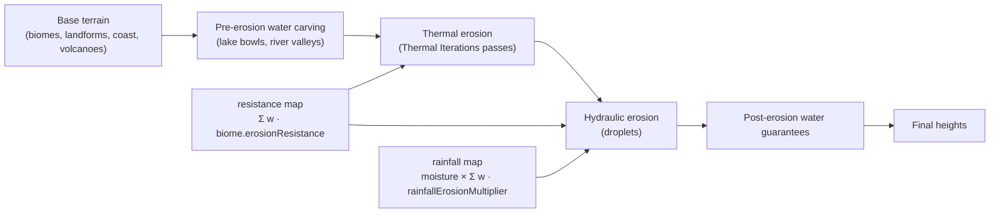
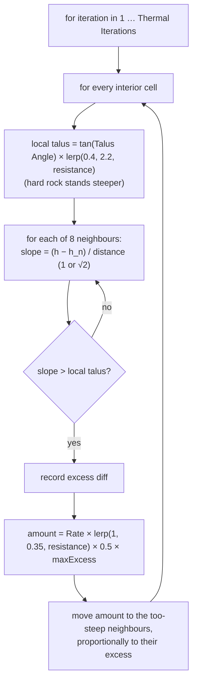
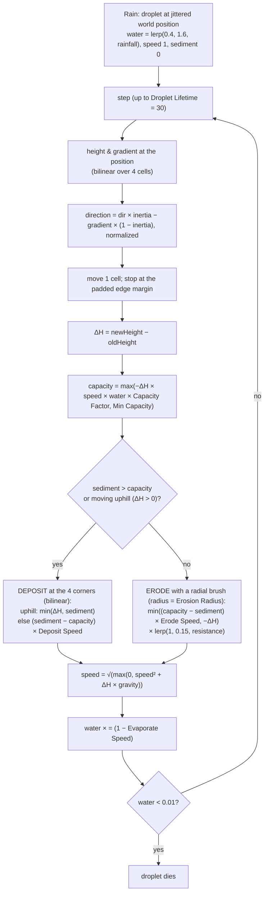
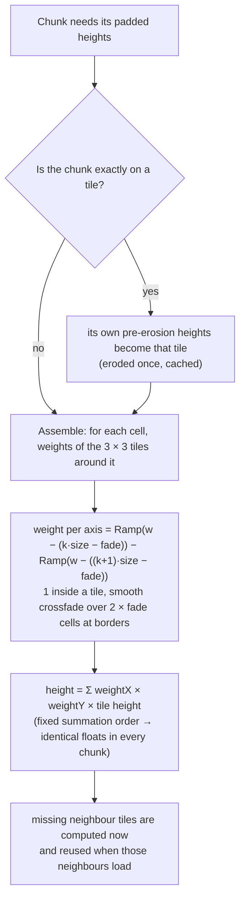

# Terrain 10 — Erosion

**Scripts:** `Terrain/ErosionGenerator.cs` (thermal + hydraulic), `Terrain/ErosionTiles.cs` (seamless tiles),
`Terrain/HeightGenerator.cs` (`BuildBaseHeights` builds the erosion maps; `Erode` runs both passes).

---

## 1. Concept: what procedural erosion is

Noise terrain looks *fresh*: every slope is equally rough, valleys are V-shaped noise dips, and nothing shows the effect
of time. In nature, two processes dominate:

- **Thermal erosion (weathering, landslides):** loose material on a slope steeper than its *angle of repose* (talus
  angle) slides down until the slope is stable. Result: scree slopes, softened ridges, cones at cliff feet.
- **Hydraulic erosion (water):** rain collects, runs downhill, picks up sediment where it flows fast, and drops it
  where it slows. Result: gullies, dendritic channels, smoothed valley floors, alluvial fans.

Both are **simulations**: they change the height map step by step, and each step depends on the previous one.

## 2. Where erosion sits in the pipeline

Both maps are built in `BuildBaseHeights` for every padded cell from the **biome blend** and the **climate**
(`ClimateGenerator.GetMoisture` + `TerrainClimate` moisture shift on a 16-unit lattice).

## 3. Thermal erosion (`ErosionGenerator.ThermalErode`)

- In-place (Gauss–Seidel style): later cells see earlier cells' updates in the same pass.
- **Resistance** (from biome `erosionResistance`): sand (0.2) slumps at ~0.4 × talus and sheds more; hard rock (0.85)
  tolerates ~2 × talus and sheds 35 %.
- Mountains therefore keep cliffs, deserts get smooth dunes.

## 4. Hydraulic erosion (`ErosionGenerator.HydraulicErode`)

### 4.1 Droplet start points — deterministic

Droplets are spawned on a **world-anchored grid** with spacing `round(√(1 / Droplet Density))` (0.12 → every 3 cells),
jittered by `HashCoord(worldX, worldY, seed)`. Two chunks covering the same world area spawn the same droplets there.

### 4.2 One droplet, step by step

Why this works:

- **Capacity** grows with speed and slope — fast water on steep ground carries more.
- **Erode** takes material only up to the height drop (never digs pits deeper than the step) and spreads it with a
  radial brush `(1 − d/r)` so channels are smooth.
- **Deposit** happens when the droplet slows (flat ground, valley floors) or goes uphill (fills small pits).
- **Evaporation** ends droplets after a while; **rainfall** from the climate gives wet regions more erosive droplets.

## 5. Seamless erosion (`ErosionTiles`)

**The problem:** erosion is a simulation; two chunks eroding their own padded areas never agree exactly along the
border — small steps appear between chunks.

**The fix:** erosion runs on fixed **world tiles** — one per chunk position, each over exactly the padded area a chunk
at that position uses. A tile's result depends only on its position, the seed and the settings, and is cached (up to
160 tiles, ~0.3 MB each; a dropped tile recomputes identically). A cell's final height is a **blend of the overlapping
tiles**:

- `fade = clamp(min(16, padding / 2), 1, tileSize / 4)` → 16 cells with the defaults.
- Weights always sum to 1; inside a tile a cell is exactly that tile's result.
- Cost: tiles of not-yet-generated neighbours near the loaded area are computed early.

`Seamless Erosion` applies when it is on, the padding is ≥ 4 and the tile size ≥ 16. With it off, each chunk erodes its
own padded area (the original behaviour; small seams possible unless padding comfortably exceeds droplet travel).

## 6. What erosion changes

| Terrain | Effect |
|---|---|
| Mountains | softened crests, scree below cliffs (thermal); gullies on flanks (hydraulic); hard rock keeps steep faces |
| Valleys | smoother floors (deposits), sharper channels |
| Rivers | river valleys are carved *before* erosion, then weathered; channels and banks are re-enforced after |
| Slopes | slopes steeper than the local talus relax; sand slopes become gentle |
| Cliffs | thermal erosion only acts above the talus angle → cliffs shrink a little but stay where resistance is high |
| Chunk seams | none with Seamless Erosion |

## 7. Configuration

| Variable | Default | Typical | Increase | Decrease | Performance |
|---|---|---|---|---|---|
| Enable Erosion | on | — | — | off: no padding, fastest | — |
| Erosion Padding | 40 | > Droplet Lifetime | safer seams | seams (inspector warns) | area ∝ (242 + 2p)² |
| Seamless Erosion | on | on | — | per-chunk erosion | early neighbour tiles |
| Thermal Iterations | 5 | 3–10 | smoother, settled slopes | rougher | linear |
| Talus Angle | 33° | 28–40° | steeper slopes allowed | more slumping | — |
| Thermal Erosion Rate | 0.5 | 0.3–0.7 | faster settling | subtle | — |
| Hydraulic Droplet Density | 0.12 | 0.05–0.3 | more channels | fewer; 0 disables | linear in droplets |
| Droplet Lifetime | 30 | 20–60 | longer channels (raise padding!) | short gullies | linear |
| Droplet Inertia | 0.05 | 0–0.3 | straighter channels | follow slope tightly | — |
| Sediment Capacity Factor | 4 | 2–8 | deeper carving | gentler | — |
| Min Sediment Capacity | 0.01 | — | erosion even on flats | — | — |
| Erode Speed / Deposit Speed | 0.3 / 0.3 | 0.1–0.5 | faster change | — | — |
| Evaporate Speed | 0.02 | 0.01–0.05 | shorter droplets | longer | — |
| Erosion Gravity | 4 | 2–8 | faster droplets, more capacity | — | — |
| Erosion Radius | 3 | 2–4 | wider, smoother channels | narrow grooves | brush cells ∝ r² |
| Biome Erosion Resistance | 0.5 | 0.15–0.9 | harder rock | softer | — |
| Biome Rainfall Erosion Multiplier | 1 | 0.3–1.6 | wetter, more erosion | arid | — |

**Example cost:** a 322 × 322 padded area with density 0.12 → ~11 000 droplets × up to 30 steps × brush of ~29 cells.
Thermal: 5 × 103 000 cells × 8 neighbours. Erosion is typically the single most expensive stage (see Generation
Stats → *Erosion*).

## 8. Debugging erosion

Enable **Visualize Erosion Debug** (TerrainGenerator): Scene-view cubes over visible chunks — red/orange where material
was removed, blue/cyan where deposited (`Min/Max Delta`, `Stride`, `Gizmo Size`, `Max Gizmos Per Chunk`). Note: the
debug capture uses the per-chunk path (it needs the pre-erosion heights), so seam behaviour can differ while it is on.

| Symptom | Cause | Fix |
|---|---|---|
| Steps between chunks | Seamless Erosion off, padding too small | enable; padding > lifetime |
| Terrain looks melted | too many droplets / high capacity / low talus | lower density or capacity; raise talus |
| No visible effect | resistance high, density 0, gizmo thresholds | enable debug view, lower Max Delta |
| Generation slow | high density, lifetime, radius | lower; check Generation Stats |
