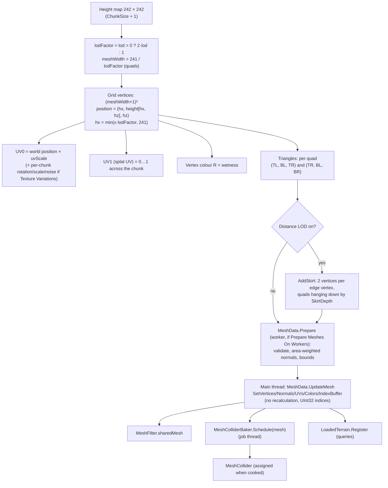
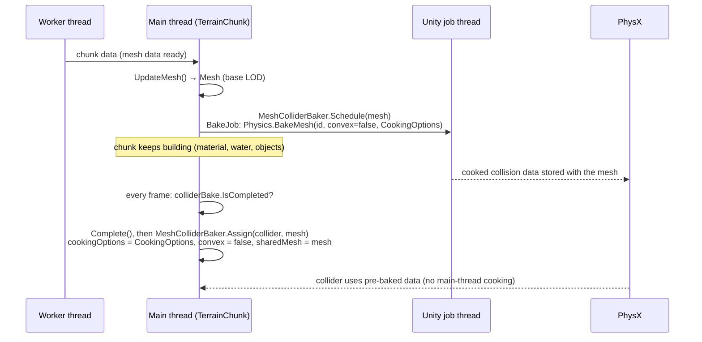

# Terrain 11 — Mesh Generation and Mesh Collider

**Scripts:** `Mesh/MeshGenerator.cs`, `Mesh/MeshData.cs`, `Mesh/MeshGenerator.Water.cs`, `Mesh/WaterMeshData.cs`,
`Mesh/MeshColliderBaker.cs`, `EndlessTerrain.TerrainChunk.cs`, `Queries/LoadedTerrain.cs`.

---

## 1. Concept: what a mesh is

A **mesh** is how a GPU draws a surface: a list of points and a list of triangles connecting them.

| Term | Meaning |
|---|---|
| **Vertex** | a point in 3D (position), plus per-point data: normal, UVs, colour |
| **Triangle** | three vertex *indices* — the smallest drawable surface |
| **Index buffer** | the list of triangle indices (`int[]`, three per triangle) |
| **Normal** | the direction the surface faces at a vertex (for lighting and slope) |
| **Tangent** | a surface direction used by normal maps (not used by the terrain shader) |
| **UV** | 2D texture coordinates at a vertex |
| **Bounds** | the axis-aligned box containing the mesh (for culling) |
| **Topology** | how vertices connect — here a regular grid of quads, each split into two triangles |
| **Resolution / vertex density** | how many vertices per world unit |

A terrain mesh is a **height field**: a regular grid in X/Z whose vertices are lifted to the height map's Y.

## 2. From height map to Unity mesh



### 2.1 Vertex positions

```
vertex(x, z) = ( hx × ScaleFactor, heightMap[hx, hz], hz × ScaleFactor )     with hx = min(x·lodFactor, 241)
```

Positions are **local to the chunk GameObject**, which sits at `(originX, 0, originZ)`. Scale Factor is fixed at 1.

At LOD 0 the grid covers cells 0…241 (one column/row overlapping the neighbour, with identical heights). At every other
LOD it covers 0…240 exactly.

### 2.2 Triangle indices

For the quad whose top-left vertex is at grid `(x, z)`:

```
topLeft     = z × (meshWidth + 1) + x
topRight    = topLeft + 1
bottomLeft  = (z + 1) × (meshWidth + 1) + x
bottomRight = bottomLeft + 1

triangles += (topLeft, bottomLeft, topRight)
triangles += (topRight, bottomLeft, bottomRight)
```

```
 TL ────── TR
  │ \       │     every quad is split along the TR–BL diagonal
  │   \  2  │     (the same diagonal is used by LoadedTerrain.TryGetHeight,
  │ 1   \   │      PlacementEnvironment and MeshGenerator.CoarseSurface,
 BL ────── BR      so queries match the rendered/collided surface exactly)
```

Index format is always **UInt32** (a LOD-0 chunk has 58 564 grid vertices plus skirt vertices — close to the 65 535
limit of 16-bit indices).

### 2.3 Normals

Computed on the worker thread in `MeshData.Prepare`, **area-weighted** exactly like Unity's `RecalculateNormals`:

```
for each triangle (a, b, c):  faceNormal = cross(b − a, c − a)     // length ∝ triangle area
                                n[a] += faceNormal; n[b] += faceNormal; n[c] += faceNormal
normalize every n (Vector3.up if degenerate)
skirt vertices copy the normal of the ground vertex above them
```

### 2.4 UVs

- **UV0** (`uvs`) — world position × `GetTextureScale` (`0.01 × 241 / ChunkSize`), so texture density is the same at
  every chunk size. With *Texture Variations* on: a per-chunk rotation (random 0–360° from the chunk offset), a per-chunk
  scale multiplier (`1 ± Texture Scale Variation Range`) and a Perlin UV offset. The **package shader ignores UV0**
  (it projects textures from world position); custom/project shaders use it.
- **UV1** (`splatUVs`) — 0…1 once across the chunk, never tiled, for sampling the chunk's splat maps. With skirts on,
  it's computed per height-map cell so every LOD samples the splat maps identically.

### 2.5 Bounds and upload

Bounds are computed from the vertices in `Prepare`; `UploadPrepared` uses `SetVertices / SetNormals / SetUVs /
SetIndexBufferData` with `DontValidateIndices | DontRecalculateBounds | DontNotifyMeshUsers`, so the main thread only
copies arrays. If `Prepare` was skipped, `UpdateMesh` validates, recalculates normals and bounds itself (slower).

## 3. Resolution trade-offs

| Resolution (vertex step) | Visual | Terrain detail | Memory per chunk (approx.) | CPU (worker) | GPU | Collider |
|---|---|---|---|---|---|---|
| 1 (LOD 0) | smoothest | every cell (erosion channels, river banks visible) | ~58 k vertices × ~56 B + 116 k triangles × 12 B ≈ 4.7 MB, plus collider data | highest | 116 k tris | expensive to cook and query |
| 4 (LOD 2, recommended) | good | 4 m features | ~3.7 k vertices + 7.2 k triangles ≈ 0.3 MB | low | 7.2 k tris | cheap |
| 12 (LOD 6) | faceted | 12 m features; rivers/banks coarse | tiny | lowest | 800 tris | cheapest but inaccurate |

Placement, water mesh, `LoadedTerrain` and the collider all use the **base LOD**, so objects and physics always match
what is rendered up close. Water rims and banks are automatically widened to at least **1.5 mesh vertices** so shores
stay closed at coarse LODs.

## 4. Chunk borders and seams

- Heights on the shared edge are identical (pure world functions) → no vertical gaps between same-LOD neighbours.
- Different LOD neighbours → **skirts** hide the crack ([02](02-World-Chunks-Streaming.md) §6).
- Normals at the very edge are computed only from the chunk's own triangles, so lighting can differ by a hair at a
  border; with world-space texturing it is rarely visible.

## 5. Mesh LOD

Built on demand in the background (`TerrainGenerator.RequestLodMesh`) from the same height map, wetness and UV
settings; kept until unload; the current mesh stays until the new one is ready. See [02](02-World-Chunks-Streaming.md).

## 6. Water mesh

Same grid, same LOD and same triangulation as the terrain, 5 submeshes (ocean, lake, pond, river, waterfall), dry corners
tucked under the shore. See [Water](09-Water.md) §7.2.

---

## 7. Mesh collider

### 7.1 What it is

A `MeshCollider` gives PhysX an exact triangle surface for the player to walk on and for raycasts. Before PhysX can use
a mesh it must **cook** it: build an acceleration structure (a BVH / midphase) plus cleaned and welded geometry. Cooking a
terrain chunk takes several milliseconds.

### 7.2 Runtime generation in this project



`CookingOptions = CookForFasterSimulation | EnableMeshCleaning | WeldColocatedVertices | UseFastMidphase` — Unity's
defaults, used for **both** baking and the collider.

### 7.3 The "missing pre-baked triangle collision" warning explained

> *Mesh 'Terrain Mesh' used by the Mesh Collider is missing pre-baked triangle collision data…*

**Meaning:** when a mesh is assigned to a `MeshCollider`, Unity looks for collision data cooked **with the collider's
exact cooking options and convex flag**. If none is found, it cooks on the main thread immediately (a hitch) and, in
recent Unity versions, logs this warning.

**Why it happened before:** the old code baked with `Physics.BakeMesh(meshId, false)` — the overload without options
cooks with its own defaults, which did not match the collider's options, so the pre-baked data was discarded.

**How the current implementation handles it:**

1. One constant set of options (`MeshColliderBaker.CookingOptions`).
2. `Physics.BakeMesh(mesh, false, CookingOptions)` on a job thread right after the mesh is created (Unity 2022.1+ has
   the overload with options; on 6000.3+ meshes are identified by `EntityId`).
3. The collider gets **the same options first**, then the mesh — only after the job has completed.
4. The mesh is never modified between baking and assigning, and never destroyed while the job runs (`Unload` completes
   the job first).

Dungeon floors use the same baker (`DungeonBuilder` bakes each floor's collider meshes in a batch).

**Build-time prebaking** (*Player Settings > Prebake Collision Meshes*) only applies to imported mesh **assets** (your
tree, rock and portal models) — keep it on for them. Runtime-generated meshes are handled by the code above.

### 7.4 When colliders are created and destroyed

| Event | Collider |
|---|---|
| Chunk data applied | bake scheduled |
| Bake completed (checked each frame in `UpdateTerrainChunk`) | assigned |
| Chunk hidden (beyond view) | stays (GameObject inactive → collider inactive) |
| Distance LOD changes | **unchanged** — always the base mesh |
| Chunk unloaded | bake completed if running, `sharedMesh = null`, mesh destroyed |

### 7.5 Performance

| Cost | Where |
|---|---|
| Cooking | job thread (Profiler: `Mesh.Bake.PhysX.CollisionData`) |
| Assigning | main thread, cheap with matching pre-baked data |
| Memory | collision data roughly the size of the mesh again |
| Simulation | triangle colliders are costlier than primitives; the base LOD decides triangle count |

Placed objects' colliders are switched off beyond **Full Object Distance** by `FarObjectSwitcher` (Rigidbodies made
kinematic meanwhile), which greatly reduces physics cost in big views.

## 8. Queries on the exact surface — `LoadedTerrain`

`LoadedTerrain.TryGetHeight(x, z, out h)` returns the height of the **collider's triangles** at any world point of a
loaded chunk (same diagonal, same base LOD). Portals, mobs (`SpawnGround`), `FlatSpots` and gameplay code use it instead
of raycasts: no physics query, works before the collider is assigned, main thread only.

## 9. Debugging

| Symptom | Cause | Fix |
|---|---|---|
| Collider warning | old `EndlessTerrain.TerrainChunk.cs` or `MeshColliderBaker.cs` | use this update's files |
| Player falls through new chunks | collider not yet assigned (bake still running) — only for a frame or two | spawn the player after the first chunk is ready |
| Faceted lighting | LOD 6 default | set Level Of Detail 2 |
| Incorrect normals at chunk borders | edge normals use only the chunk's triangles | usually invisible; lower LOD step |
| Objects float over coarse terrain | base LOD mismatch in custom code | query `LoadedTerrain`, not the height map |
| Main-thread spikes when chunks appear | Prepare Meshes On Workers off | turn it on |
