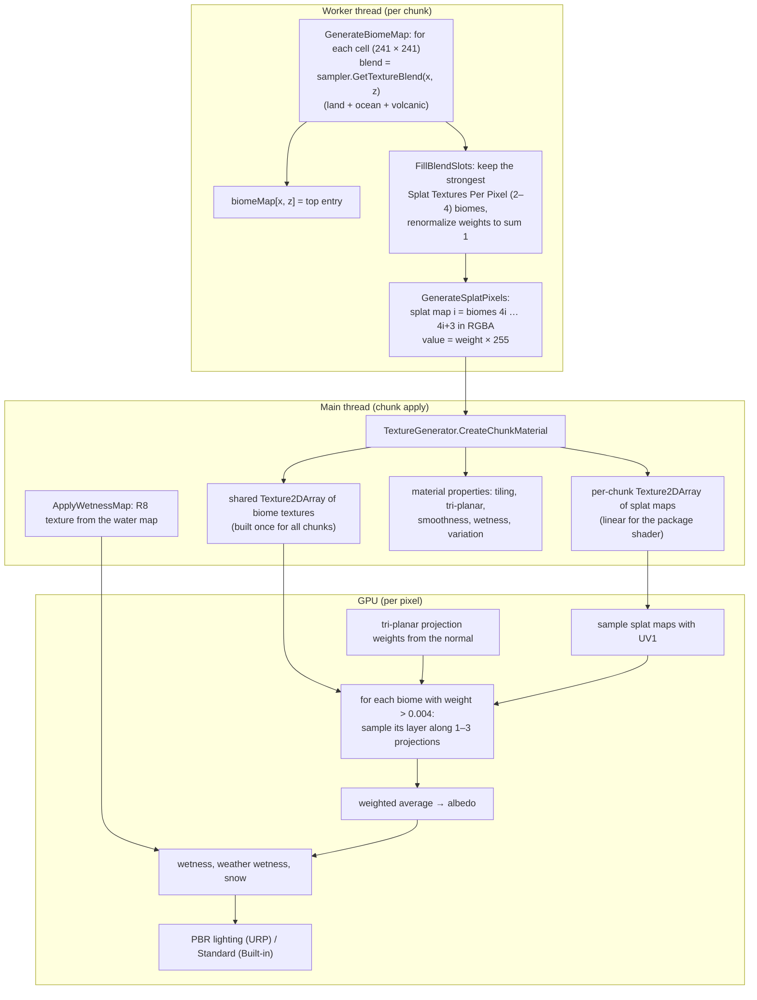
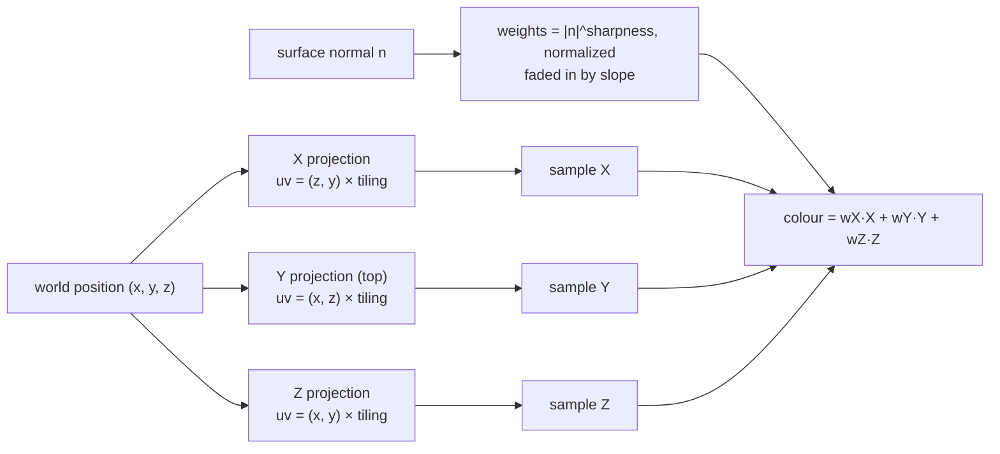
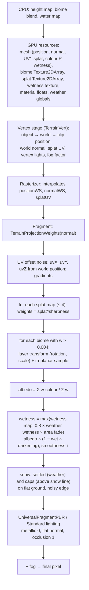

# Terrain 12 — Texturing, Tri-Planar Mapping and Terrain Shaders

**Scripts:** `Texturing/SplatMapGenerator.cs` (+`.Blended.cs`), `Texturing/SplatBlendData.cs`,
`Texturing/TextureGenerator.cs`, `Texturing/Resources/SimpleMovementsTerrain.shader` + `SimpleMovementsTerrain.hlsl`,
`TerrainGenerator.GenerateBiomeMap`, `MeshGenerator` (UVs), `EndlessTerrain.TerrainChunk.ApplyWetnessMap`,
`Weather/WeatherSystem.Effects.cs` (shader globals).

---

## Part A — Texture selection and blending

### A1. What decides a pixel's texture

Texture selection is **biome-based**: each biome has one ground texture; a pixel shows a weighted mix of the textures
of the biomes present there.

| Criterion | Status | How |
|---|---|---|
| Biome | **Implemented** | splat weights from the biome blend (up to 4 biomes per pixel) |
| Slope | **Implemented as projection**, not as texture choice | steep ground projects the *same* biome texture from the sides (tri-planar) so it doesn't stretch. There is **no automatic "rock on cliffs" texture**. |
| Height | **Partially implemented / not functional** in the streaming pipeline | *Texture Based On Voronoi Points = OFF* is meant to pick textures by height band, but chunks then get **no splat maps and no material** (the old `GenerateSplatMapBasedOnHeight` is not called). Keep it ON. |
| Moisture / wetness | **Implemented as shading** | ground near water (and after rain) is darker and glossier — the "mud" look — not a separate texture |
| Snow | **Implemented in the shader** | white overlay on flat ground: while it snows (weather) and permanently above the snow line |
| Rock / sand / grass / mud as separate materials | **Not implemented** | they are simply the biome textures you assign |

### A2. The texture pipeline



### A3. Splat maps, masks and weights

A **splat map** is a texture whose channels are *weights* instead of colours: channel R of splat map 0 = weight of
biome 0, G = biome 1, B = biome 2, A = biome 3; splat map 1 holds biomes 4–7, and so on. The biome index is its
position in `TerrainGenerator > Biomes` (resolved by name on the main thread; a later duplicate name wins).

```
biome index:     0    1    2    3  |  4    5    6    7  | ...
splat map:       0    0    0    0  |  1    1    1    1
channel:         R    G    B    A  |  R    G    B    A
```

- Resolution: one splat texel per height-map cell (`ChunkSize²`, 241 × 241), bilinear-filtered, sampled with UV1
  (0–1 across the chunk).
- **More than two textures per pixel:** up to **4** (`Splat Textures Per Pixel`). Where 3–4 biomes meet, all of them
  appear with smooth weights; with 2, a visible seam appears where a third biome enters.
- The package shader reads **at most 4 splat maps = 16 biomes**; biomes beyond the 16th are not textured by it.
- Weights come from the **same** smooth, warped biome blend as the terrain height — textures follow the ground.

### A4. Texture arrays

All biome textures live in **one `Texture2DArray`** shared by every chunk (built the first time a chunk needs it):

| Biome Texture Quality | Behaviour | Memory (1024²) |
|---|---|---|
| Automatic (default) | if all textures share size and format, copied on the GPU as imported (same compression, mips); otherwise resized uncompressed | as imported |
| Uncompressed | resized to Texture Resolution, RGBA32 | ~5.6 MB per biome (with mips) |
| Compressed | resized, DXT5 (desktop) | ~1.4 MB per biome |

`Biome Texture Resolution` 0 = automatic: `1024 × √(ChunkSize / 241)` clamped 512–2048.

Each chunk owns only its material, its splat-map array (e.g. 1–4 layers × 241² × 4 B ≈ 0.2–0.9 MB) and its wetness map
(241² × 1 B ≈ 58 KB); `TextureGenerator.ReleaseChunkMaterial` frees them on unload.

### A5. Material properties (package shader)

| Property | Source | Meaning |
|---|---|---|
| `_TextureArray`, `_SplatMaps`, `_WetnessMap` | TextureGenerator / chunk | textures |
| `_TextureArrayLength`, `_SplatMapCount`, `_BiomeCount` | counts | loop limits |
| `_TextureTiling` | `1 / Terrain Texture Size` (0 = mesh UV size ≈ 100 u at 241) | world units per texture repeat |
| `_TriplanarStrength`, `_TriplanarSlopeStart/End`, `_TriplanarSharpness` | Terrain Material | projection (Part B) |
| `_Smoothness`, `_WetnessDarkening`, `_WetnessSmoothness` | Terrain Material | gloss and wet look |
| `_TextureBlendSharpness` | Shader Enhancements (else 1) | contrast of biome transitions |
| `_UVRotationStrength`, `_UVScaleVariation` | Shader Enhancements (else 0 / 1) | per-biome-layer rotation and scale |
| `_UVNoiseStrength`, `_UVNoiseScale` | UV Noise | smooth world-space UV offset |
| `_NoiseSeedOffset` | `seed × 0.618` | different variation per world |

Not supported: **normal maps** (the shader passes a flat tangent normal), **metallic** (0), **roughness/height maps**
per biome, **occlusion maps**. Smoothness is a single scalar raised by wetness.

### A6. Texture variation and natural transitions

| Technique | Where | Effect |
|---|---|---|
| Smooth biome weights (falloff of distance gaps) | CPU | gradual transitions instead of hard lines |
| Warped biome borders | CPU | organic transition lines |
| Up to 4 biomes per pixel | CPU | clean three- and four-way junctions |
| Blend Sharpness (`w^k`, renormalized) | GPU | k > 1: the strongest biome takes more of each transition (crisper); k < 1: softer |
| World-space projection | GPU | textures continue seamlessly across chunk borders; no per-chunk tiling grid |
| Per-layer rotation and scale | GPU | each biome uses its own rotated/scaled tiling grid, so overlapping biomes don't share a repeat pattern |
| UV noise offset | GPU | slow wobble of the UVs breaks straight tiling lines |
| Tri-planar on slopes | GPU | no stretching on cliffs |
| Wetness gradient near water | CPU + GPU | darker, glossier banks fade out with distance/height |
| Snow edge noise | GPU | irregular snow lines |
| UV0 per-chunk rotation/scale (Texture Variations) | CPU (mesh) | only used by project/custom shaders (the package shader ignores UV0) |
| Texture Variations (extra textures per biome) | CPU (array) | **Partially implemented**: appended to the array, not sampled by the package shader |

---

## Part B — Tri-planar mapping

### B1. Concept

A normal mesh texture uses **UVs** stored on the vertices. On a height field the natural UV is simply the X/Z position
— a projection **from above**. That works on flat ground, but on a cliff many texels of height are squeezed onto a few
UV units: the texture **stretches** into streaks.

**Tri-planar mapping** projects the texture from three directions — along X, along Y (from above) and along Z — using
world position instead of UVs, and blends the three by how much the surface faces each axis. A vertical cliff facing
+X is textured by the X projection, which is undistorted on it.



Terms:

- **World-space projection / UV-less texturing:** texture coordinates come from the pixel's world position, not the mesh.
- **Blend weights:** from the absolute normal components; raising them to a power (**sharpness**) narrows the zones
  where two projections mix.
- **Seams:** where projections meet, the textures don't line up perfectly; a higher sharpness makes the mix zone narrow
  (less ghosting), a lower one hides the seam with a softer blend.

### B2. This project's implementation (`TerrainProjectionWeights`)

```
n = normalize(normalWS)
w = |n| ^ _TriplanarSharpness ; w /= (w.x + w.y + w.z)
slope  = degrees(acos(|n.y|))
amount = _TriplanarStrength × smoothstep(_TriplanarSlopeStart, _TriplanarSlopeEnd, slope)
w = lerp((0, 1, 0), w, amount)       // gentle ground: top projection only
w *= step(0.03, w) ; renormalize     // drop negligible projections (saves texture reads)
```

- Below **Slope Start** (25°) only the top projection is used (1 texture read per biome).
- Between Start and End the side projections fade in; above **Slope End** (45°) the full tri-planar blend applies.
- Projections with weight 0 are skipped with dynamic branches; mip levels stay correct because gradients (`ddx/ddy`)
  are taken from the unrotated projections and passed to `SampleGrad`.

| Parameter | Default | Increase | Decrease |
|---|---|---|---|
| Tri-Planar Strength | 1 | full tri-planar on steep ground | 0 = never (textures stretch on cliffs) |
| Slope Start | 25° | tri-planar only on steeper ground (cheaper) | also on gentle slopes |
| Slope End | 45° | softer fade-in | abrupt switch |
| Sharpness | 6 | crisper, narrower projection blends | blurrier, wider blends |
| Terrain Texture Size | 0 (≈100 u) | larger texture features | smaller, more repetition |

The World Preview's **Tri-Planar** mode shows in orange where the shader projects from the sides.

---

## Part C — The terrain shader (`SimpleMovements/Terrain`)

### C1. Structure

| Sub-shader | Pipeline | Passes |
|---|---|---|
| URP | `RenderPipeline = UniversalPipeline` | UniversalForward (PBR, shadows, additional lights, Forward+, fog, SSAO, instancing), ShadowCaster, DepthOnly, DepthNormals |
| Built-in | surface shader `Standard fullforwardshadows`, `addshadow` | generated by Unity |
| HDRP | **not supported** — the project's HDRP shader (`Custom/TerrainSplatMapShaderHDRP`) is used if present | — |

Both pipelines include `SimpleMovementsTerrain.hlsl`, whose `TerrainSurface()` computes albedo and smoothness
independent of the pipeline.

### C2. Shader data flow



### C3. CPU vs GPU

| Work | Where |
|---|---|
| Biome blend, splat weights, wetness, mesh, UVs | CPU worker threads |
| Texture creation and upload | CPU main thread |
| Weather state, wetness/snow accumulation, globals | CPU main thread (`WeatherSystem`) |
| Projection weights, texture sampling, blending, wetness/snow shading, lighting, fog | GPU fragment shader |
| Positions, normals, vertex lighting, fog factor | GPU vertex shader |

### C4. Water interaction, snow, snowmelt, wetness

- **Wetness near water:** per cell from the water map: `(1 − smoothstep(distance / Wetness Distance)) × (1 − smoothstep(height above water / Wetness Height))`,
  1 in water. Stored in vertex colour R and in `_WetnessMap` (sampled with the splat UV).
- **Rain wetness:** `WeatherSystem` accumulates `groundWetness` (rain +0.02/s, hail +0.01/s, drying with heat) and sets
  `_SMWeatherWetness`; the shader uses `0.8 × weatherWetness`, faded with distance from the viewer by `_SMWeatherArea`
  (the weather is the viewer's local weather, so far-off regions don't share it).
- **Snow:** `_SMWeatherSnow` (settled snow cover accumulating while it snows, melting when warm — **snowmelt** also wets
  the ground) and `_SMSnowCaps` + `_SMSnowLine` (= sea level + Snow Line Height) for permanent caps. Snow only settles on
  ground facing up (`flatness = saturate((n.y − 0.5) / 0.35)`), not on cliffs.
- **Flow direction:** only in the water shader (ripples scroll downstream).
- **Distance-based effects:** weather fade (`_SMWeatherArea`), fog; no distance-based texture swap.
- **LOD behaviour:** mipmaps via `SampleGrad`; distance-LOD meshes use the same splat UVs and world projection, so
  textures never jump when the mesh switches.

### C5. Performance

Per pixel (worst case at a four-way junction on a cliff): up to 4 splat reads + 4 biomes × 3 projections = 12 array
reads + 1 wetness read + noise. Typical flat ground inside one biome: 1–2 splat reads + 1 array read. Costs grow with
`Splat Textures Per Pixel`, low `Slope Start`, and low `Sharpness` (more pixels with 2–3 projections).

---

## Part D — How the terrain avoids looking procedural or repetitive

| Technique | Scale | System |
|---|---|---|
| Multi-scale noise (octaves, fBm) | macro → micro | height |
| Macro variation: continents, belts, climate zones, massif character fields (stature, difficulty, breadth) | km | height/biomes |
| Micro variation: rock detail, hummocks, boulders | 5–20 m | landforms |
| Domain warping (borders, ridges, coasts, massifs) | all | height/biomes |
| Colour/texture variation: per-layer rotation/scale, UV noise | texture | shader |
| Slope variation: tri-planar | texture | shader |
| Height variation: base elevations, uplift, stature | terrain | height |
| Biome variation: clustering + repeat penalty + climate | region | Voronoi |
| Object density variation: density noise, clusters, growth | objects | placement |
| Rotation variation: random yaw, tilt, terrain alignment | objects | placement |
| Scale variation: random scale range | objects | placement |
| Erosion: water channels and scree | 1–50 m | erosion |
| Coast character: beaches ↔ rocky shores ↔ cliffs | coast | ocean |
| Weather: wet ground, snow cover | runtime | weather + shader |

---

## Configuration (texturing & shader)

| Variable | Default | Increase | Decrease | Perf |
|---|---|---|---|---|
| Texture Based On Voronoi Points | on | — | **off = no terrain material in the streaming pipeline** | — |
| Use Biome Blended Texturing | on | smooth texture transitions | hard biome edges | blend computed on workers |
| Splat Textures Per Pixel | 4 | smoother 3–4-way junctions | seams at junctions | more texture reads |
| Terrain Shader | Package (Tri-Planar) | — | Project Shader / Custom Material | — |
| Terrain Texture Size | 0 (auto) | larger features | more repetition | none |
| Tri-Planar Strength / Start / End / Sharpness | 1 / 25 / 45 / 6 | see Part B | | side projections cost 2 extra reads |
| Terrain Smoothness | 0.08 | glossier dry ground | matte | — |
| Wetness Darkening / Smoothness | 0.35 / 0.55 | darker/shinier wet ground | subtle | — |
| Enable Texture Variations (master) | on | enables UV noise and variations | — | — |
| UV Noise Strength / Scale | 0.3 / 0.1 | stronger/larger UV wobble | visible tiling | GPU noise |
| Enable Shader Enhancements | off (recommended on) | per-layer rotation/scale and Blend Sharpness | — | — |
| Shader UV Rotation Strength / Scale Variation | 0.5 / 1.2 | more decorrelated layers | — | — |
| Shader Texture Blend Sharpness | 4 (recommended 1.5) | crisper transitions | softer | — |
| Biome Texture Quality / Resolution | Automatic / 0 | — | Compressed saves 4× memory | memory |

## Debugging

| Symptom | Cause | Fix |
|---|---|---|
| Pink / untextured terrain | no material: *Texture Based On Voronoi Points* off, missing shader in the build, HDRP without the project shader | turn it on; include `SimpleMovements/Terrain` (it's in a Resources folder) |
| Missing textures on some biomes | more than 16 biomes; biome texture null | ≤ 16 textured biomes; assign textures |
| Stretched textures on cliffs | Tri-Planar Strength 0 or Slope Start too high | defaults 1 / 25° |
| Blurry/ghosted cliffs | Sharpness low | raise to 6–8 |
| Visible seam where 3 biomes meet | Splat Textures Per Pixel = 2 | 3 or 4 |
| Obvious tiling | Terrain Texture Size small, UV noise off | enable variations, larger size |
| Wet ground everywhere | weather rain wetness | expected after rain; lower Wetness Darkening |
| Snow on cliffs | never (flatness mask); snow on flat mountain tops is the cap | lower Snow Line Height / disable Snow Caps |
