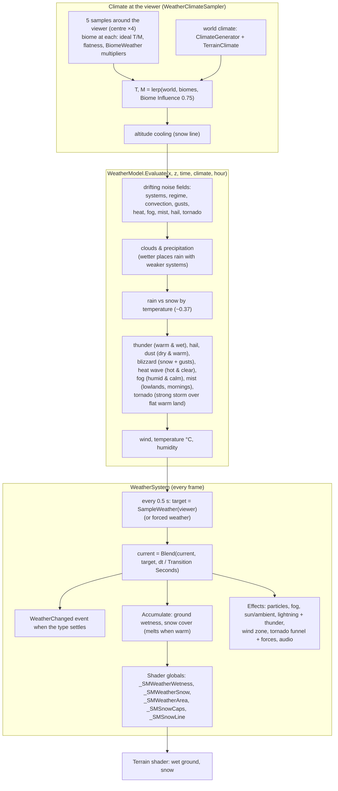

# Terrain 13 — Weather

**Scripts:** `Weather/WeatherSystem.cs` (+ `.Effects.cs`, `.Storms.cs`), `Weather/WeatherModel.cs`
(`WeatherModel`, `WeatherClimateSampler`), `Weather/WeatherTypes.cs` (`WeatherType`, `WeatherState`,
`BiomeWeather`, presets), editor `CustomEditor/TerrainGenerator/WeatherSystemEditor.cs`.

**Status:** Implemented as a **runtime layer**. It does **not** change terrain shape, erosion, water bodies, biome
layout or object placement. Its only effect on the terrain is visual (wet ground, snow) through shader globals.
It is optional: add a `WeatherSystem` component to any scene object.

---

## 1. Concept

Weather is the *short-term* state of the atmosphere (rain now, sun in ten minutes); climate is the *long-term*
average (this place is usually wet). Here:

- **Climate** (static) = the world's temperature/moisture fields + each biome's ideal climate + altitude.
- **Weather** (changes over time) = a deterministic function of **position, time and climate**:
  large **weather systems** drift over the world with the prevailing wind, growing and fading; storm cells, gusts, fog
  banks and heat build up inside them.

Same seed + same weather time → same weather, everywhere. `WeatherSystem.SampleWeather(position, time)` works for any
place and time (forecasts, NPC logic, save/load).

## 2. Weather types and state

`WeatherType`: Clear, Cloudy, Windy, Mist, Fog, Rain, Thunderstorm, Hail, Snow, Blizzard, Sandstorm, HeatWave, Tornado.

`WeatherState` holds each kind's strength (0–1): Clouds, Rain, Snow, Hail, Thunder, Dust, Fog, Mist, Heat, Tornado,
plus WindSpeed (u/s), WindDirection, Temperature (°C), Humidity, derived Visibility, and `Type` = the most dramatic kind
clearly present (a tornado over its storm, a blizzard over plain snow, …).

## 3. Weather system diagram

## 4. The model in detail (`WeatherModel.Evaluate`)

All fields are gradient noise moving along the wind: `noise((x − wind·drift) / scale)`, with
`drift = time × Drift Speed`.

| Quantity | Formula (simplified) |
|---|---|
| Systems | `0.65 · fbm(size) + 0.35 · fbm(0.7·size, rotated 35°, slower)`, contrast-stretched |
| Rain threshold | `lerp(0.8, 0.5, moisture) − 0.16·(regime − 0.5) − precipitation adjustments` |
| Clouds | `smoothstep(threshold − 0.3, threshold, systems)` |
| Precipitation | `smoothstep(threshold, threshold + 0.2, systems) × biome × global multipliers` |
| Snow share | `1 − smoothstep(0.33, 0.40, T − 0.02·night)` |
| Thunder | `precipitation × convection × warmWet × biome (+30 % afternoons)` |
| Wind (u/s) | `1.5 + 5·gusts + 7·clouds·systems + 4·altitude + 9·thunder (+14 dust, +10 blizzard, +10 tornado)` × Windiness × biome |
| Temperature (°C) | `lerp(−25, 42, T) − 4·precip + 5·heat − 4·night` |

**Day cycle** (`Time Of Day` 0–24 or −1 = off): misty mornings, stormier afternoons, colder nights.

**Biome multipliers** (`BiomeWeather`, 0–3 per kind): above 1 they also *widen* the climate window that allows the kind
(a Desert preset on a mild biome still gets sandstorms), below 1 they only scale it down. Presets: From Climate,
Temperate, Grassland, Desert, Tundra & Snow, Rainforest, Swamp & Wetland, Mountains, Coast, Always Calm.

## 5. Interactions

| With | Interaction | Direction |
|---|---|---|
| Climate | world temperature/moisture + terrain climate + altitude | climate → weather |
| Biomes | ideal climate, flatness (landform), multipliers | biome → weather |
| Terrain shader | wet ground (rain, hail, snowmelt), settled snow, permanent snow caps | weather → shader |
| Water | none (rain doesn't raise lakes or rivers) | — |
| Vegetation | the Wind Zone makes trees/wind-aware shaders sway | weather → objects |
| Snow | `snowCover += dt × (snow × 0.004 − melt × 0.004 − rain × 0.006)`, melt ∝ temperature | — |
| Snowmelt | melting snow adds to ground wetness | — |
| Erosion | **none** (erosion uses the static climate rainfall) | — |
| Physics | tornado pushes rigidbodies (swirl, pull, lift), `Tornado Force` | weather → objects |
| Dungeons | `DungeonSession` disables the WeatherSystem while inside | — |

Ground wetness per second: `+ rain × 0.02 + hail × 0.01 − (0.003 + 0.01·heat + 0.003·warm) × (1 − rain)`.

## 6. Configuration

| Variable | Default | Increase | Decrease |
|---|---|---|---|
| Terrain Generator / Viewer / Sun | auto | — | — |
| System Size | 2500 | weather covers wider areas, lasts longer | patchier |
| Drift Speed | 4 u/s | changes faster | longer spells |
| Weather Time Scale | 1 | faster weather | slower |
| Precipitation / Windiness | 1 / 1 | wetter / windier world | drier / calmer |
| Biome Influence | 0.75 | biome decides more (desert always dry) | world climate decides |
| Climate Sample Radius | 60 | smoother change at borders | sharper |
| Transition Seconds | 12 | slower transitions | abrupt |
| Allow Tornadoes | on | — | — |
| Start Time | 0 | different starting weather | — |
| Time Of Day | −1 | set from your day/night system | — |
| Effect Radius / Max Particles | 35 / 8000 | denser, wider particles | cheaper |
| Fog Effects / Max Fog Density | on / 0.03 | thicker fog | — |
| Lighting Effects, Lightning Bolts, Max Lightning / min | on, on, 8 | more flashes | — |
| Wind Zone | on | — | — |
| Ground Effects / Ground Effect Radius | on / 400 | wet/snow visible farther | local only |
| Snow Caps | on | permanent snow above the snow line | — |
| Tornado Force | 40 | stronger pushes | 0 = off |
| Materials, audio clips, volume | optional | — | — |

## 7. Performance

One weather evaluation = a handful of biome lookups + ~15 noise calls, done every 0.5 s. Effects cost is dominated by
particles (`Max Particles`) and fog. No per-chunk cost.

## 8. Debugging

The Weather System inspector shows the live state in Play mode, buttons to **force** any weather, a **1-hour
forecast** at the viewer and a **weather map** around it. The TerrainGenerator inspector's Weather section summarizes
typical weather per biome (`WeatherModel.TypicalWeather`).

| Symptom | Cause | Fix |
|---|---|---|
| Never rains | biome moisture low, Precipitation 0, biome multipliers 0 | inspector forecast; presets |
| Snow in the desert | Biome Influence low while world climate is cold | raise Biome Influence |
| Ground stays wet far away | Ground Effect Radius 0 (everywhere) | set a radius |
| No wet/snow effect | not using the package terrain shader, Ground Effects off | — |
| Weather continues in a dungeon | a custom script re-enables it | leave world systems alone while `DungeonSession.InDungeon` |
