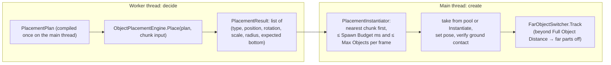
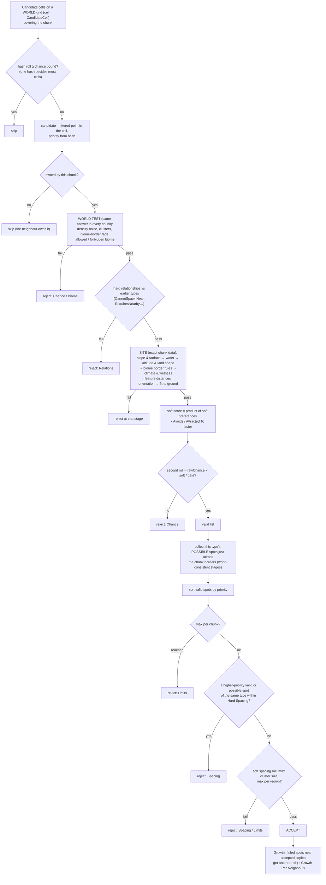
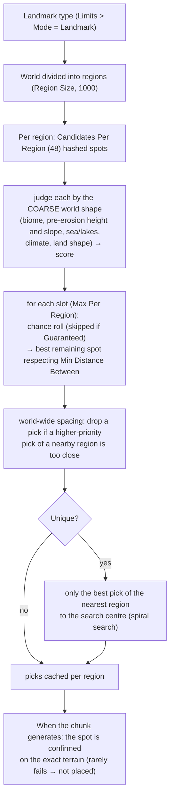

# Terrain 14 — Object Placement (Trees, Rocks, Plants, Landmarks)

**Scripts:** `Biome/BiomeObject.cs` (rules), `Placement/PlacementRules.cs` (rule groups and enums),
`Placement/PlacementPlan.cs` (compiled rules), `Placement/ObjectPlacementEngine.cs` (+ `.Site.cs`, `.Landmarks.cs`),
`Placement/PlacementEnvironment.cs`, `Placement/PlacementFields.cs`, `Placement/PlacementFeatures.cs`,
`Placement/PlacementRandom.cs`, `Placement/PrefabShapeCache.cs`, `Placement/PlacementInstantiator.cs`,
`Placement/FarObjectSwitcher.cs`, `Placement/TerrainObjectKeepFull.cs`, `Queries/LoadedTerrain.cs`, `Queries/FlatSpots.cs`.
Editor presets: `CustomEditor/TerrainGenerator/ObjectPresets.cs`.

---

## 1. Responsibility

Decide **where every object of a chunk goes** — deterministically from the seed, on a worker thread, obeying each
object's rules — then **create** them on the main thread a few per frame, pool them on unload, and switch far objects
to a cheap state.

What can be placed: anything you list as a `BiomeObject` in a biome's object list — trees, rocks, grass, bushes,
reeds, water lilies, props, ruins, resource nodes, structures. There is no separate "grass system" (no GPU instancing
of detail meshes); grass is placed like any other object. **Buildings/structures** are supported as **landmarks**
(rare, regional placement), not as a village/road generator.

## 2. Two phases

The result is cached with the chunk's data; a chunk coming back from the cache re-creates the same objects without
running placement again.

## 3. Rule groups (`BiomeObject`)

Every rule defaults to "no constraint" — an object only gets pickier for the rules you set.

| Group | Main fields | What it controls |
|---|---|---|
| Identity | `terrainObject` (prefab), `groupTag`, `placementPriority` | what; how other objects refer to it; who claims space first |
| Density | `probabilityToSpawn` (% per m²), `densityNoise` (scale, octaves, strength, coverage), `hasMaxNumberOfObjects`/`maxNumberOfThisObject` (per chunk) | how many |
| Biomes | own biome + `alsoAllowedIn`, `forbiddenIn`, `borderMode` (Anywhere / AwayFromBorders / OnlyNearBorders), `borderDistance`, `incompatibleNeighbours`, `footprintInBiome`, `biomeCenterPreference` | where by biome |
| Height | `useCustomHeightPreference` (min/optimal/max, strength), `altitude` (absolute limits, biome height band, relative altitude, height above water, terrain position Valleys/LowerSlopes/Slopes/UpperSlopes/Ridges/Flats, relief, roughness, curvature) | where by height and land shape |
| Slope | `slopeThreshold` × `slopeAvoidance`, `slope.minSlope`, preferred range, `surfaces` (Flat < 10°, Inclined < 35°, Steep < 60°, Vertical) | where by steepness |
| Water | `placement` (DryLand, Anywhere, NearWater, AwayFromWater, Shoreline, InWater), `bodies` mask, distances, depth, height in water (OnBottom/OnSurface/Submerged), depth weights, avoid fast flow | relation to water |
| Climate | moisture / temperature / ground-wetness ranges with softness | climate niche |
| Feature distances | AnyWater, Ocean, Lake, Pond, River, Cliff (> Object Cliff Angle), Custom tag; min/max; hard or soft | distance to features |
| Clustering | `isClusterable`, `clusterCount` (per chunk area), `clusterRadius`, inside/outside density, desired/max cluster size, growth radius / per neighbour | forests, rock fields, patches |
| Spacing | `minSpacing` (0 = 1.8 × size radius × max scale), soft spacing | distance between copies |
| Relationships | by `groupTag`: CannotSpawnNear, PreventsNearby, Avoids, AttractedTo, RequiresNearby (radius, strength) | interactions between object types |
| Orientation | RandomYaw, Upright, FullyRandom, AlongWaterFlow, FaceDownhill, AcrossSlope; terrain alignment, max tilt, yaw jitter, random tilt, max normal deviation | rotation |
| Scale | `scaleRange` (min, max) | size variety |
| Ground contact | anchor (BoundsBottom / Pivot / CustomHeight), footprint (Automatic / Renderers / Colliders / CustomRadius), footprint scale, sink depth, max penetration, max floating, min valid footprint, vertical offset, verify after spawn | sitting on uneven ground |
| Limits | mode Scatter / Landmark, region size, max per region, min distance between, guaranteed, unique (+ search centre/radius), candidates per region | rarity, landmarks |
| Seed | use world seed or a fixed seed, seed offset | reshuffle one object alone |

Ready-made presets (Biomes section → *Presets* menu): Plants/Grass, Bush, Grass or Flowers, Mushroom (under trees),
Cliff Plant; Trees/Forest Tree, Lone Tree, Palm (near the sea); Water/Reeds, Water Lily, Seaweed, Log Along a River;
Rocks/Small Rock, Boulder, Scree; Landmarks/On Hilltops, In Valleys, Ancient Tree (one per region), Unique.

## 4. Compiling the rules (`PlacementPlan.Build`, main thread)

- Measures each prefab once (`PrefabShapeCache`: renderer and collider bounds → footprint box, size radius).
- Resolves biome sets, footprint radius, `HardSpacing`, `CandidateCell = max(0.5, 0.7 × HardSpacing)`,
  `ChancePerSquareUnit = probabilityToSpawn / 100`, `MaxSlope = slopeThreshold × slopeAvoidance`, cluster cells.
- **Orders the types** so each is placed after the types its relationships check against (then by priority, then larger
  footprints first).
- Gives each type a stable **salt**: `StableHash(biomeName + "/" + prefabName + "#" + copy) ^ seedOffset` — reordering
  lists doesn't move objects; renaming a biome or prefab does.
- Warnings (e.g. contradictory relationships) are logged once.

## 5. The placement pipeline (per type, per chunk)

### 5.1 Why this is deterministic and seam-free

- Every random choice is `PlacementRandom.Value(seed, typeSalt, cellX, cellY, stream)` — a hash with a separate
  **stream** per decision (jitter X/Y, priority, chance, soft roll, yaw, tilt, scale, cluster centre…). No shared RNG,
  so thread timing and load order don't matter.
- A candidate belongs to exactly one chunk (by its world position).
- Across chunk borders a chunk cannot see its neighbour's exact terrain, but it knows exactly which of the neighbour's
  candidates pass the **world-consistent** stages (position, priority, density roll, biome). It treats those as
  "possibly occupied": a spot is kept only if no neighbouring spot could conflict with it. So two chunks can never both
  keep conflicting objects, and each chunk decides the same way whenever it is generated.
- **Requires Nearby** is satisfied only by objects certainly present (same chunk), so it is never broken.

### 5.2 Density, noise, clustering, Poisson-like spacing

- **Density:** `probabilityToSpawn` % per m²: 1 → ~1 object per 100 m² → ~576 per 240² chunk, before other rules.
- **Density noise:** smooth value noise (`scale` 40, `octaves`, `strength`, `coverage`) → denser and sparser patches.
- **Clusters:** about `clusterCount` cluster centres per chunk area (one per cluster cell, hashed position), radius
  `clusterRadius`; density × `insideDensity` inside, × `outsideDensity` outside.
- **Spacing:** the candidate grid (0.7 × spacing) plus hard spacing with priority gives a **Poisson-disc-like**
  distribution (random but never closer than the spacing) without iterative sampling. Soft spacing adds a random
  preference beyond the minimum.
- **Growth:** forests fill in and rock fields spread around accepted copies.

### 5.3 Site evaluation details

| Stage | Hard rule (reject) | Soft preference (multiplier) |
|---|---|---|
| Slope | slope > MaxSlope, < MinSlope, surface kind not allowed | preferred slope range with falloff |
| Water | placement mode (dry, near, away, shoreline, in water + depth + shore distance), distance limits | depth weights (shallow/medium/deep), avoid fast flow |
| Altitude | absolute limits, relative altitude in the biome band, height above water, relief/roughness/curvature limits, required terrain position | biome height band (Gaussian), custom height preference (Gaussian), terrain position fit |
| Biome borders | not allowed near incompatible neighbours / borders | fade toward borders (Border Distance, Biome Centre Preference) |
| Climate | — | moisture / temperature / ground wetness ranges (softness) |
| Features | min/max distance (hard rules) | soft distance rules |
| Orientation | tilt beyond Max Normal Deviation | — |
| Ground fit | no height satisfies max penetration and floating; too little valid footprint | — |

**Ground contact (`FitToGround`):** the footprint's centre, corners and edge midpoints are rotated and scaled like the
object; the terrain (or the water surface, for floating objects) is sampled under each; the object's **anchor** (by
default the bottom of its bounds, not its pivot) is placed so the centre touches the ground minus *Sink Depth* within
the allowed penetration/floating — otherwise the spot is too uneven and rejected. After spawning, **Verify After Spawn**
measures the real renderer bounds and corrects the height (catches prefabs whose shape changes on creation).

**Orientation:** a uniformly random rotation uses Shoemake's method; *terrain alignment* tilts the up axis toward the
ground normal (limited by Max Tilt); AlongWaterFlow uses the nearest river direction; FaceDownhill/AcrossSlope use the
slope direction.

### 5.4 The environment an object sees (`PlacementEnvironment`, `PlacementFields`)

- **Heights of the actual mesh triangles** at the chunk's base LOD (same diagonal) — objects sit on what is rendered and
  collided with.
- The chunk plus a **16-cell margin** (from the padded height generation), so objects near an edge fit ground just
  across it.
- Water type, surface, nearest water level, **exact distances** (Euclidean distance transforms) to ocean, lake, pond,
  river, shore; river direction; ground wetness; climate; relief/roughness/curvature over a radius; biome gaps.
- **Custom features:** `PlacementFeatures.AddPoint / AddSegment / AddPath(tag, …)` registers roads, paths, settlements
  your game creates; rules with Feature = Custom and that tag keep objects near or away. Register them before the
  chunks around them generate.

## 6. Landmarks (rare placement)

Landmark spots are known **before any chunk exists**: `ObjectPlacementEngine.FindLandmarkSpots(plan, min, max, list)`
(map markers, quests, the World Preview's landmark overlay).

## 7. Creating objects (`PlacementInstantiator`) and far objects

- One batch per chunk; the batch **nearest the viewer** is served first (re-evaluated every frame).
- Within `Object Spawn Budget Ms` (2) and `Max Objects Per Frame` (300), at least one object per frame.
- **Pooling** (`Pool Objects`, `Max Pooled Objects` 4000): objects of unloaded chunks are deactivated and reused for the
  same prefab. Scripts can implement `IPooledTerrainObject` (OnReused / OnPooled) to reset their state.
- Removed objects (`EndlessTerrain.RemovePlacedObject`) are skipped when the chunk regenerates.
- **Far objects** (`FarObjectSwitcher`): beyond `Full Object Distance` (150; switching back and forth has 20 % / ≥ 20 u
  hysteresis) the chosen `Far Object Parts` are switched off — colliders (Rigidbodies made kinematic), scripts (except
  `IFarTerrainObject`, which get OnFar/OnNear instead), animators, audio, optionally lights. Renderers and LOD groups
  are untouched, so objects look the same. `TerrainObjectKeepFull` on a prefab root opts out. Switching is spread over
  frames within the spawn budget, nearest chunks first. NavMesh builds temporarily re-enable colliders.

## 8. Queries after placement

| API | Use |
|---|---|
| `LoadedTerrain.TryGetChunk / TryGetHeight` | exact collider height of loaded chunks |
| `LoadedTerrain.Chunk.Objects / Placements` | created objects by placement index |
| `FlatSpots.Find(query, results)` | flat, dry, open spots (camps, buildings, portals) |
| `EndlessTerrain.RemovePlacedObject / TryGetPlacedObjectId / RemovedObjects / SetRemovedObjects` | harvesting, saving |
| `ObjectPlacementEngine.FindLandmarkSpots` | planned landmarks |

## 9. Configuration (global)

| Variable | Default | Increase | Decrease | Perf |
|---|---|---|---|---|
| Should Spawn Objects | on | — | off: no placement | — |
| Object Cliff Angle | 45° | fewer "cliffs" for Cliff rules | more | — |
| Object Spawn Budget Ms | 2 | objects appear faster | smoother frames | main thread |
| Max Objects Per Frame | 300 | — | — | main thread |
| Full Object Distance | 150 | full objects farther out | cheaper physics/scripts | big effect |
| Far Object Parts | Colliders, Scripts, Animators, Audio | more switched off | — | — |
| Pool Objects / Max Pooled | on / 4000 | fewer hitches when walking back | memory | memory ∝ pool |

## 10. Performance

- Deciding placement runs on workers; cost ∝ candidate cells × stages reached. A rule that rejects early (biome, chance)
  is cheap; ground fitting is the most expensive stage.
- Creating objects is the main-thread cost; pooling makes returning to an area cheap.
- Very dense small objects (grass) → thousands of GameObjects per chunk. Keep grass density modest or use your own
  detail/instancing system for dense ground cover.

## 11. Debugging

- `PlacementResult.Tried / Accepted / Rejected[type][stage]` counts rejections per stage (Chance, Biome, Slope, Water,
  Altitude, Climate, Feature, Relations, Spacing, Limits, Orientation, Ground).
- World Preview right-click → **Test Object Placement Here**.
- `TerrainMonitor` (optional runtime component) validates object alignment and can fix misaligned objects.

| Symptom | Cause | Fix |
|---|---|---|
| Too many objects | high probability, clusters inside density, growth | lower; set max per chunk |
| None appear | a hard rule rejects all (see rejection counts), wrong biome, slope too strict | loosen the failing stage |
| Floating / sunken objects | pivot not at the bottom and anchor = Pivot, footprint too small | anchor BoundsBottom, Verify After Spawn |
| Objects in water | water placement Anywhere | DryLand |
| Objects change after editing another object | salt comes from biome/prefab name — renaming moves them | expected |
| Hitches when chunks appear | spawn budget too high, pooling off | lower budget, pool on |
