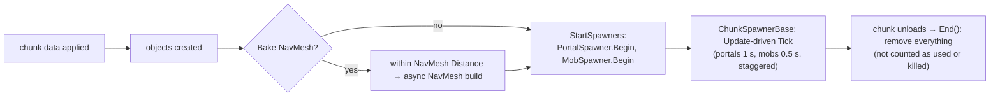
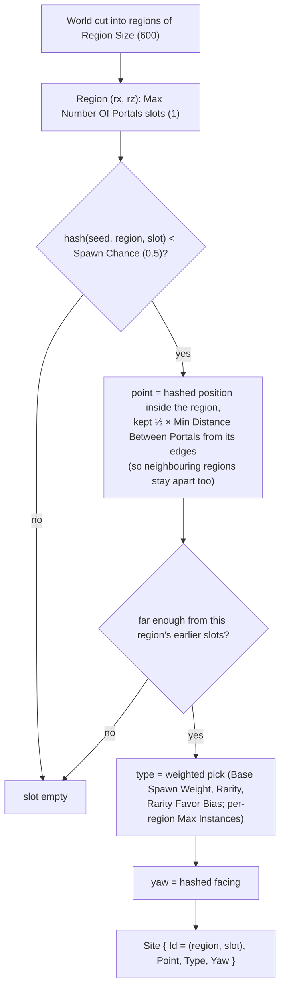
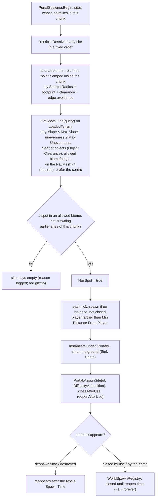
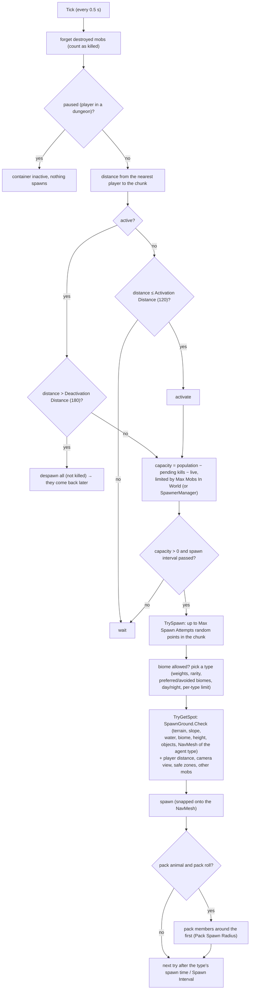

# Terrain 15 — World Portals and Mobs on the Terrain

**Scripts:** `Spawnable/ChunkSpawnerBase.cs`, `Spawnable/PortalSpawner.cs`, `Spawnable/PortalSitePlanner.cs`,
`Spawnable/PortalSettings.cs`, `Spawnable/SpawnablePortal.cs`, `Spawnable/MobSpawner.cs`, `Spawnable/MobSettings.cs`,
`Spawnable/SpawnableMob.cs`, `Spawnable/SpawnGround.cs`, `Spawnable/WorldSpawnRegistry.cs`,
`Spawnable/SpawnerManager.cs`, `Queries/FlatSpots.cs`, `Queries/LoadedTerrain.cs`, `Essentials/Portal.cs`.

This chapter covers the terrain side. What happens after the player enters a portal is in the Dungeon documentation.

---

## 1. Where spawners sit in the chunk lifecycle

Every terrain chunk carries a `PortalSpawner` and a `MobSpawner` (added by `TerrainChunk`, settings shared from
`EndlessTerrain > Portal Settings / Mob Settings`). They are **started only when the chunk is ready**: its data is
applied, its objects exist (portals avoid trees and rocks) and its NavMesh is built (mobs walk on it; portals can
require it). They are **ended first** when the chunk unloads.

`ChunkSpawnerBase` provides `Begin/End`, the staggered tick, the pause check (`WorldSpawnRegistry.Paused` while in a
dungeon), the container child (`Portals` / `Mobs`) and distance helpers.

---

## 2. Portal placement

### 2.1 Planning sites — `PortalSitePlanner` (pure function of the world seed)

Properties: no duplicates, no dependence on load order, **known before any chunk exists**
(`EndlessTerrain.FindPortalSites(min, max, list)` for map markers and quests), headless-tested for spacing and
determinism.

### 2.2 Resolving a site on the exact ground — `PortalSpawner`

- **Difficulty:** `clamp(Difficulty At Origin + km from Difficulty Origin × Difficulty Per Kilometer, 0.1, Max)`
  (1 + 0.5 per km, max 5 by default).
- **Dungeon seed:** the `Portal` builds its `DungeonRequest` from `(world seed, portal position)`
  (`DungeonRequest.FromWorldPosition`), so each portal always leads to the same dungeon (unless *Dungeon Seed* is set).
- **Closing after use** (`Close After Use`: Stays Open / After Entering / After Completing) and **Reopen After Use**
  (0 = never) are remembered per site in `WorldSpawnRegistry` across unloading and can be saved
  (`ClosedPortalSites` / `SetClosedPortalSites`).

---

## 3. Mob spawning

### 3.1 Population per chunk

`population = Max Number Of Mobs × (share of a 5 × 5 sample of the chunk that is dry, in an allowed biome and suits
at least one mob type) × per-chunk variation (Population Variation, from the seed)`. The same every visit.

### 3.2 Tick

### 3.3 Kills and respawn

A kill (the `Mob.OnMobDestroyed` event, or the object being destroyed) leaves a gap for `Respawn Delay ± variation`,
recorded per chunk in `WorldSpawnRegistry` — even while the chunk is unloaded — so clearing an area and coming back
doesn't refill it instantly. Mobs removed because the player left, or because the chunk unloaded, are **not** kills.

### 3.4 Ground checks (`SpawnGround.Check`)

Rejection reasons (shown in the SpawnerManager's F3 overlay): `NoTerrain, Slope, Water, Biome, Height, Objects,
NavMesh`. All checks read `LoadedTerrain` — the exact data the chunk's mesh and collider were built from — never
raycasts.

---

## 4. `WorldSpawnRegistry` and `SpawnerManager`

| `WorldSpawnRegistry` (static) | Purpose |
|---|---|
| `Paused` | set by `DungeonWorldPause` while in a dungeon |
| `MobCount`, `PortalCount`, `MobLimit`, `IntervalMultiplier` | world-wide counts and overrides |
| `ClosePortalSite / OpenPortalSite / IsPortalSiteClosed / ClosedPortalSites / SetClosedPortalSites`, `PortalSiteClosed` event | portal state across unloading and saves |
| `RecordKill / PendingKills / ClearMobMemory` | kill memory per chunk |
| `GetPlayers(tag, fallback)`, `DistanceToNearestPlayer` | cached player lookup (once a second per tag) |

`SpawnerManager` (optional scene component): global mob limit override, throttling when the frame rate drops below
80 % of the target, an **F3 overlay** with totals and the nearest chunks' spawner states (last rejection reason), and a
context-menu reset of kills and closed portals.

## 5. Configuration (key values)

**Portal Settings:** Prefabs (required), Region Size 600, Max Number Of Portals 1 (per region), Spawn Chance 0.5,
Min Distance Between Portals 150, Search Radius 24, Edge Avoidance 8, Footprint Radius 0 (measured), Max Slope 12°,
Max Unevenness 0.6, Object Clearance 2, Require NavMesh on, Sink Depth 0.05, height/biome restrictions, weighted
selection & rarity bias, Close After Use / Reopen After Use, difficulty scaling (origin, at origin 1, per km 0.5, max 5),
Min / Max Distance From Player 40 / 0, plus BaseSettings (Retrying Spawn Time 3, Player Tag, logging, visual debug).

**Mob Settings:** Prefabs (NavMeshAgent + `Mob`), Max Number Of Mobs 6 per chunk, Population Variation 0.3, Max Mobs In
World 60, Activation / Deactivation Distance 120 / 180 (keep Activation below NavMesh Distance), Spawn Interval 1.5,
Respawn Delay 180 ± 25 %, packs (on, 2–4, radius 12), Min Distance Between Mobs 5, biome modifiers (preferred × 2,
non-preferred × 0.5), forbidden biomes, height band, Max Spawn Attempts 12, NavMesh Sample Distance 2, Max Slope 35°,
Object Clearance 0.5, Avoid Camera View (hidden spawn distance 70), time of day, player distance 30 / 0, safe zones.

Full tables: [Configuration Reference](18-Configuration-Reference.md).

## 6. Debugging

| Symptom | Cause | Fix |
|---|---|---|
| No portals | empty Prefabs, Spawn Chance low, big Region Size, chunk has no NavMesh | *Validate Portal Setup*; test with Spawn Chance 1, Region Size 400; Visual Debug gizmos |
| Red portal gizmo | no flat, dry, open spot near the planned point | raise Search Radius or Max Slope, lower Object Clearance |
| No mobs | Bake NavMesh off, Activation > NavMesh Distance, wrong agent type, forbidden biomes | EndlessTerrain status box; F3 overlay |
| Mobs pop in front of the player | Avoid Camera View off, small Min Distance From Player | enable, raise |
| World mobs active in a dungeon | a custom script un-pauses | leave `WorldSpawnRegistry.Paused` to the session |
