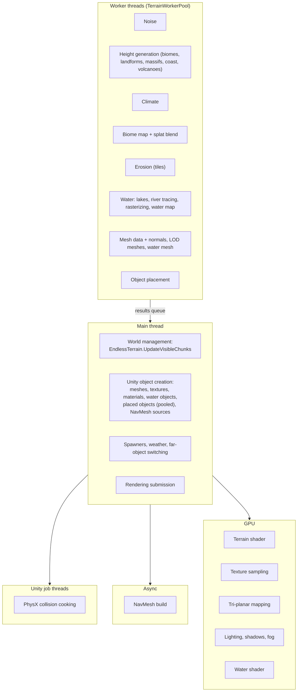

# Terrain 16 — Performance and Threading

**Scripts:** `Threading/TerrainWorkerPool.cs` (`TerrainWorkerPool`, `WorkToken`), `TerrainGenerator.Threading.cs`,
`EndlessTerrain(.TerrainChunk).cs`, `Mesh/MeshColliderBaker.cs`, `Placement/PlacementInstantiator.cs`,
`Placement/FarObjectSwitcher.cs`, `Diagnostics/GenerationStats.cs`, editor `GenerationStatsWindow.cs`.

---

## 1. Execution contexts

| Context | What it is | Used for |
|---|---|---|
| **Main thread** | Unity's thread; the only one allowed to touch GameObjects, meshes, textures, materials | applying results, creating objects, streaming decisions, spawners, weather |
| **Worker threads** (`TerrainWorkerPool`) | `Worker Threads` background `System.Threading.Thread`s (0 = cores − 1, max 8), below-normal priority | all generation math |
| **Unity Jobs** | Unity's job worker threads | collider cooking (`MeshColliderBaker.BakeJob`) |
| **Async NavMesh** | `NavMeshSurface.UpdateNavMesh` (AsyncOperation) | chunk NavMeshes |
| **`Parallel.For`/`Parallel.ForEach`** | .NET thread pool | river prefetch for large areas, World Preview |
| **GPU** | graphics card | shading, texture sampling, lighting |

**Burst:** not used. **Coroutines:** not used by the terrain pipeline (everything is `Update`-driven queues).
**async/await:** not used. **Native containers:** not used by the terrain (plain managed arrays); the collider job only
passes the mesh id.

## 2. The worker pool

- **Priority queue, re-evaluated:** every job carries `Func<float> priority` = its chunk's current distance to the viewer.
  A worker picking its next job evaluates all priorities *at that moment* (lowest first; ties in queue order), so the
  chunks nearest the player are always generated first, even after the player turns around.
- **Cancellation:** a `WorkToken` per chunk; cancelled jobs are dropped from the queue, and results of already-running
  jobs are discarded before reaching the main thread (checked twice: when queued and when run).
- **Cooperative `For`:** row loops inside a chunk (`BuildBaseHeights`, `GenerateBiomeMap`) call `pool.For(rows, body)`.
  Idle workers and workers between items join the **most urgent** open `For` — the chunk under the player gets every
  thread as soon as they can help. With nothing more urgent, each chunk runs on one thread as before.
- **Exceptions** in a job are logged; the worker continues.

## 3. The main-thread queue and budgets (how frame spikes are avoided)

| Technique | Effect |
|---|---|
| Everything heavy on workers | the main thread only uploads |
| Normals and bounds on workers (`Prepare Meshes On Workers`) | mesh upload is a memcpy |
| Per-frame budgets for applying chunks and creating objects | spreads a chunk over several frames |
| Collider cooking on job threads with matching options | no main-thread cooking |
| Async NavMesh, only within NavMesh Distance | no main-thread NavMesh build |
| Nearest-first everywhere (worker queue, object batches, far-object switching) | what matters appears first |
| Object pooling | no Instantiate/Destroy churn when walking back and forth |
| Far-object switching | fewer active colliders/scripts |
| Distance LOD, lazily built | fewer triangles far away |
| Shared biome texture array | one upload for all chunks |
| Global caches (features, Voronoi neighbourhoods, erosion tiles, massif tiles) | neighbours reuse work |
| LRU chunk data cache | returning chunks skip generation |

## 4. Cost of each stage (relative)

Estimated relative costs for an Extra Large chunk with erosion, judged from what each stage computes (confirm with the
Generation Stats window on your machine; the stage names match its rows):

| Stage | Where | Relative cost | Driven by |
|---|---|---|---|
| Voronoi points | worker (locked) | low (once per Voronoi cell) | Num Voronoi Points |
| Rivers (tracing) | worker / all cores | **high for the first chunks of a new area**, then cached | River Spacing, Max Length |
| Lakes and ponds, lake levels | worker | low–medium | Lake/Pond Spacing |
| Height map (biomes, landforms, coast) | worker (parallel rows) | medium–high | biomes per cell, landforms, padding |
| Erosion | worker | **highest** | droplets × lifetime × radius, thermal iterations, padding |
| Water carving + water map | worker | medium | rivers nearby |
| Placement fields | worker | low–medium | objects enabled |
| Biome map + splat pixels | worker (parallel rows) | medium | blend lookups |
| Terrain mesh (+ normals) | worker | low–medium | LOD |
| Water mesh | worker | low | wet cells |
| Object placement | worker | medium | object types × candidates |
| Apply: material, mesh, water | main | low (budgeted) | texture sizes |
| Collider cooked | job | medium (off main thread) | base LOD |
| Objects: creating | main | medium (budgeted) | object counts |
| NavMesh build | async | high (off main thread) | NavMesh distance, objects |

## 5. Memory

| Item | Approximate size |
|---|---|
| Height map (242²) | 234 KB |
| Water map (6 arrays of 242²) | ~1.2 MB (freed with the chunk; kept in cache) |
| Biome map (241² references) | ~460 KB |
| Splat pixels (per 4 biomes, 241² × 4 B) | ~230 KB each |
| Terrain mesh LOD 2 / LOD 0 | ~0.3 MB / ~4.7 MB (+ collider data) |
| LOD meshes | smaller, built on demand |
| Splat texture array + wetness map (GPU) | 0.25–1 MB |
| Biome texture array (shared) | per biome: 1.4 MB (DXT5) – 5.6 MB (RGBA32) at 1024² |
| Cached unloaded chunk | ~1–5 MB each (Chunk Data Cache Size, default 16) |
| Erosion tiles | ~0.3 MB each, ≤ 160 |
| Mountain massif tiles | small, ≤ 3000 |
| Object pool | like live objects, ≤ Max Pooled Objects |

**Garbage collection:** per-thread scratch arrays (`[ThreadStatic]`) in the hottest loops (biome blend, landform
height) avoid per-cell allocations; chunk arrays are allocated per chunk and released on unload; pooling avoids
GameObject churn.

## 6. Tuning table

| Goal | Change |
|---|---|
| Fewer hitches | lower Main Thread Budget (2–3 ms) and Spawn Budget, enable pooling, Prepare Meshes On Workers on |
| Faster chunk arrival | more Worker Threads, smaller Terrain Size, fewer droplets, shorter river Max Length, fewer biomes |
| Longer view | Distance LOD on, Max Chunks Per Side up, Full Object Distance modest, NavMesh Distance ≤ view |
| Less memory | smaller cache, Compressed biome textures, lower texture resolution, smaller pool |
| Less GPU | Tri-Planar Slope Start higher, Splat Textures Per Pixel 3, fewer biomes |

**Planning example** (illustrative, not a measurement): on an 8-core desktop the pool has 7 workers; with the default
budgets the main thread spends at most ~4 ms applying chunk data plus ~2 ms creating objects per frame, whatever the
generation load, so the frame rate is bounded by those budgets rather than by how many chunks are being generated.
How long one chunk takes on the workers depends mostly on erosion and river settings — measure it in
**Window > SimpleMovements > Generation Stats** (*Chunk total (worker thread)*).

## 7. Threading issues to watch for

| Rule | Why |
|---|---|
| Never call Unity APIs from worker code (asset names, `Shader.Find`, transforms) | Unity throws or crashes; `PrepareForGeneration` computes name-based maps on the main thread first |
| Pure functions only in generation | determinism across threads |
| Mutations of shared state behind locks or `ConcurrentDictionary` + `Lazy<T>(ExecutionAndPublication)` | every feature computed exactly once |
| `UpdateMinMaxHeight` is locked | many chunks write it at once (only used when textures aren't Voronoi-based) |
| Don't destroy a mesh while its bake job runs | `Unload` completes the job first |

## 8. Diagnostics

- **Generation Stats** window: per-stage timings (average, max), counters, *Copy* with PC specs and settings.
- TerrainGenerator inspector → *Performance Stats* section and *Reset To Recommended* (per-PC suggestions).
- `TerrainGenerator.PendingWorkerJobs`, `PendingMainThreadWork` for your own HUD.
- Unity Profiler: worker threads appear as "Terrain Worker N"; collider cooking as `Mesh.Bake.PhysX.CollisionData` on
  job threads.

| Symptom | Likely cause |
|---|---|
| Spikes when entering new areas | river tracing for many new springs (prefetched on all cores), object creation budget too high |
| Constant low FPS | too many live objects/colliders (Full Object Distance), GPU: many biomes per pixel on slopes |
| Chunks arrive slowly | erosion too heavy, few workers, huge rivers Max Length |
| Memory grows | large cache, pool, many LOD meshes kept |
