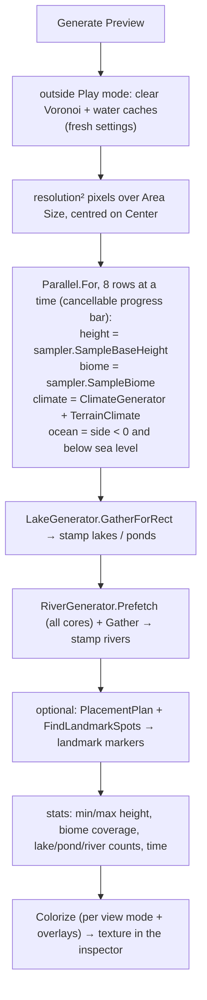

# Terrain 17 — World Preview and Editor Tools

**Scripts:** `CustomEditor/TerrainGenerator/TerrainGeneratorEditor*.cs` (≈20 partial files),
`TerrainGeneratorEditor.Preview.cs` (World Preview), `GenerationStatsWindow.cs`, `WeatherSystemEditor.cs`,
`ObjectPresets.cs`, `Procedural/World/Editor/EndlessTerrainEditor.cs`, runtime helper `TerrainMonitor.cs`.

---

## 1. The TerrainGenerator inspector

The default inspector would list ~150 fields; the custom editor groups them into foldout **sections**, each with
tooltips, **Reset To Recommended** / **Reset To Default** buttons, and greyed-out fields that currently have no effect:

World Preview · Terrain Configuration · Noise Configuration · Terrain Shape (Landforms) · Volcanoes & Calderas ·
Height Range & Texture · Texture Variations · Terrain Material (Tri-Planar Shader) · Voronoi / Biome Grid · Natural
Biome Placement (with **Border Check**) · Climate · Erosion – Thermal · Erosion – Hydraulic · Water · Weather ·
Performance Stats · Erosion Debug Visualization · Other Configuration · Biomes (biome presets, object presets, copy and
backup of biome settings) · Objects · Performance & Threading (recommended values for *this* PC).

**Validation warnings** appear at the top when settings are individually valid but known to produce artefacts:

| Warning | Why |
|---|---|
| No biomes assigned | nothing to generate |
| Erosion Padding ≤ Droplet Lifetime | droplets leave the padded area → seams |
| Climate Scale < 3 × Voronoi Scale | climate varies cell to cell → salt-and-pepper biomes |
| Blend band < 10 u, or Relief Transition Width < 0.15 with relief landforms | walls between biomes |
| Blend band > 0.6 × biome region width | every point mixes several biomes → biomes look alike |
| Border Warp Scale < Voronoi Scale | jagged, self-crossing borders |

**Border Check** samples the base terrain around a point every few units and measures how steep the ground is along
biome borders (share steeper than 40°, the worst biome pair), with a **Soften Borders** suggestion.

## 2. World Preview

### 2.1 What it represents

A top-down map of the world from the **current settings**, without entering Play mode: heights, biomes, oceans, lakes,
ponds, rivers, volcanoes, climate, slopes and landmarks. North (+Z) is up, east (+X) right.

It samples the **base terrain before erosion** (erosion only changes small-scale detail) and **before lake/river
carving** in the height channel (lakes and rivers are *stamped* on the map from their features), one sample per pixel —
so features smaller than a pixel can fall between samples.

### 2.2 How it is generated without building the world

It uses the **same** `TerrainHeightSampler`, `LakeGenerator` and `RiverGenerator` as the game, so the map shows the
features the game will build — no meshes, textures, objects or chunks are created. Changing the view mode or overlays
only re-colours the kept samples.

### 2.3 Views and colour mapping

| View | Colours |
|---|---|
| Combined | biome colours with hill shading and water |
| Height | dark = low, light = high |
| Biomes | one colour per biome |
| Water | each water body type |
| Climate | temperature (red hot / blue cold) and moisture (brighter green = wetter) |
| Temperature / Moisture | each alone |
| Slope | green flat → yellow → orange → red steep |
| Tri-Planar | orange where the shader projects from the sides (from the Terrain Material slope settings) |
| Landforms | which landform shapes the ground |

### 2.4 Settings

| Setting | Default | Meaning / effect |
|---|---|---|
| Center (world X, Z) | 0, 0 | map centre; *Use Scene View Position*, *Reset To Origin* |
| Area Size | 4000 (250–60 000) | world units shown; larger = less detail per pixel |
| Resolution | 256 (128–768) | pixels per side; time ∝ resolution² |
| Show | Combined | view mode |
| Shading, Light Angle | 1, 315° | hill shading |
| Contours, Interval | off, 25 | height contour lines |
| Chunk Grid, Biome Borders, Origin, Scene View, Landmarks | — | overlays |
| Auto Regenerate | off | regenerate after setting changes |
| Image Size | 512 | on-screen size |

Interaction: hover to read the spot under the mouse (height, biome, climate, water); double-click to centre; right-click
→ *Center Map Here*, *Zoom In Here*, *Move Scene View Here*, *Test Object Placement Here*, *Copy Position*; *Zoom In*
button.

### 2.5 Editor performance

Time grows with the square of the resolution (terrain samples) and with the area (more rivers to trace); river tracing
usually dominates, so it is prefetched over all cores. The map reports how long it took. Use 128 for quick iteration,
512–768 for final checks.

### 2.6 Using the preview to tune generation

1. **Biome layout:** Biomes view + coverage stats → adjust weights, climate niches, cluster strength, Voronoi scale.
2. **Mountains:** Landforms + Height views → belt strength/scale, foothill reach, territory size.
3. **Water:** Water view + counts → lake/river chances, spacing, Min Spring Elevation, ocean threshold.
4. **Climate:** Climate views → rain shadows behind ranges (wind angle), coastal moisture.
5. **Textures on slopes:** Tri-Planar view → slope start/end.
6. **Landmarks:** Landmarks overlay → region size, guaranteed/unique.
7. Right-click → *Move Scene View Here*, press Play to see the real chunk.

**Preview mismatch** (the map differs from the game): erosion and post-erosion guarantees are not in the map; a
feature smaller than a pixel may be missing; outside Play mode caches are cleared, inside Play mode the preview shares
the running game's caches.

## 3. Generation Stats window

**Window > SimpleMovements > Generation Stats**: while the game runs, how long each stage takes (average and worst) —
Voronoi points, lakes and ponds, river tracing, lake levels, height map, erosion, water carving, placement environment,
chunk heights total, biome map, splat maps, terrain mesh, water mesh, chunk total (worker), waiting for a worker thread,
distance-LOD mesh, object placement, apply (material, mesh, water, total), collider cooked, objects creating, NavMesh
build, request → chunk visible, request → objects created — plus counters (chunks generated/shown, objects created,
rivers traced). **Copy** produces a report with PC specs, relevant project settings and terrain settings.

## 4. Other editor tools

| Tool | Where | What |
|---|---|---|
| Biome presets | Biome entry → Presets | 15 archetypes ([Biomes](08-Biomes.md) §6) |
| Object presets | Biomes → object → Presets | 19 rule sets (grass, trees, reeds, rocks, landmarks…) |
| Copy Settings | inspector | text dump of all generator and biome settings (for sharing/diffing) |
| Biome backups | Biome → Save/Load backup | JSON under `Assets/BiomeBackups/` |
| Erosion Debug Visualization | TerrainGenerator | Scene-view cubes where erosion removed/deposited |
| Weather System inspector | WeatherSystem | live weather, force buttons, 1-hour forecast, weather map |
| EndlessTerrain inspector | EndlessTerrain | status box (viewer, portals, mobs, distances), Add Portal Prefab, recommended portal/mob settings, play-mode lists of chunks, mobs and planned portal sites |
| Tools > SimpleMovements > Dungeon > … | menu | dungeon setup, portal prefab, portal validation (Dungeon docs) |
| `TerrainMonitor` | runtime component | on-screen stats, object alignment checks/fixes, biome boundary gizmos, FPS alerts |
| `SpawnerManager` F3 overlay | runtime | spawner states and rejection reasons |
