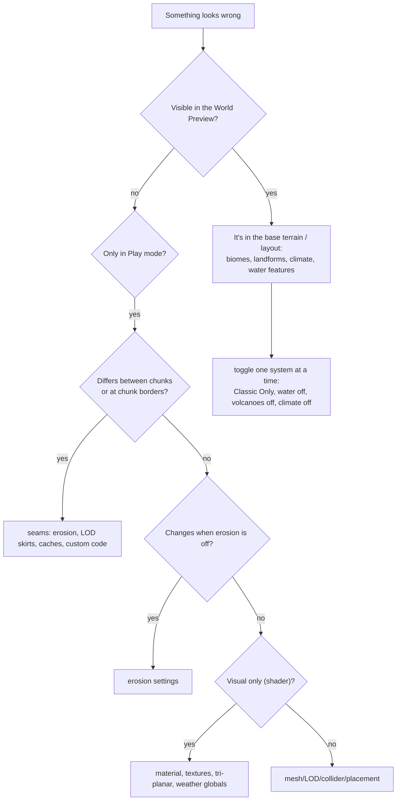

# Terrain 19 — Debugging Guide

## 1. Tools to reach for first

| Tool | Where | Shows |
|---|---|---|
| **World Preview** | TerrainGenerator inspector | heights, biomes, water, climate, slope, tri-planar, landforms — without Play mode |
| **Validation warnings / Border Check** | TerrainGenerator inspector | settings known to cause artefacts; steep biome borders |
| **Generation Stats** | Window > SimpleMovements > Generation Stats | per-stage timings, counters, copyable report |
| **Erosion Debug Visualization** | TerrainGenerator | where erosion removed/deposited material |
| **EndlessTerrain status box** | EndlessTerrain inspector | viewer, portal/mob problems, distance mismatches; live chunk/mob/portal lists |
| **SpawnerManager F3 overlay** | runtime | spawner states, last rejection reason |
| **Portal Settings / Mob Settings › Enable Visual Debug, Detailed Logging** | EndlessTerrain | spawn gizmos and logs |
| **EndlessTerrain › Enable Debugging** | EndlessTerrain | chunk creation logs |
| **TerrainMonitor** | optional component | on-screen stats, object alignment checks |
| **Unity Profiler** | Window > Analysis | "Terrain Worker N" threads, job threads, main thread |

## 2. How to isolate a problem

Toggle systems one at a time (Terrain Shape Mode = Classic Only, Enable Water off, Enable Volcanoes off, Terrain Aware
Climate off, Enable Erosion off) — each is designed so that turning it off leaves the rest generating as before.

## 3. Problem catalogue

| Problem | Symptoms | Likely causes | Variables to inspect | Debug view / isolation |
|---|---|---|---|---|
| **Terrain seams** | small steps along chunk borders | Seamless Erosion off; Erosion Padding ≤ Droplet Lifetime; stale caches after runtime changes | Seamless Erosion, Erosion Padding, Droplet Lifetime | disable erosion — if seams vanish, it's erosion; inspector warning |
| **Chunk gaps / cracks** | thin holes between chunks at different distances | skirts too shallow; custom mesh code | LOD Skirt Depth, Distance LOD | move closer: crack disappears when both chunks share a LOD |
| **Strange mountains** | cones, blobs, walls at borders | Mountains landform without enough territory; Classic mountains; belts off; front slope | biome amplitude/frequency, Voronoi Scale/Points, Belt Strength, Foothill Reach | Preview → Landforms, Height |
| **Terrain too flat** | no relief | low amplitudes; Plains/Wetland everywhere; heavy erosion; LOD 6 hides detail | amplitude, landform, erosion, LOD | Preview → Height, Slope |
| **Terrain too noisy** | spiky static | persistence ≈ 1 (default on new biomes), high frequency, many octaves | persistence, frequency, Octaves | Preview → Slope |
| **Biomes look artificial** | polka dots, straight edges, repeating pattern | Climate Scale Multiplier low; Cluster Strength 0 or ≈ 1; warp off; Order Independent off | climate multiplier, cluster, repeat penalty, warp | Preview → Biomes; warnings |
| **Rivers leaking** | water standing above a lower bank at bends/confluences | Meander Cutoffs off; Junctions off; very high Meander on steep land | Enable Meander Cutoffs, Enable River Junctions, Meander | fly along the river; Preview → Water |
| **Rivers disappearing** | river ends at a chunk edge | caches stale after changing settings at runtime; custom code editing heights | — | restart Play; `WaterGenerator.ClearCaches()` + `UnloadAllChunks()` |
| **Rivers end in small lakes** | many terminal lakes | enclosed basins (dunes, wetland), low Inland Rise | Inland Rise, landforms | expected behaviour (endorheic basins) |
| **Lakes generating incorrectly** | missing, on slopes, overlapping rivers | Max Site Slope, coast buffer, biome likelihood, lake level lowered by a river | lake settings, biome water fields | Preview → Water; lake counts |
| **Water appearing above terrain** | water surface floating over ground | custom water shader with vertex offset; material with waves too high near shore | water materials | use `SimpleMovements/Water` (waves fade at the shore) |
| **Gaps between water and shore** | visible gap at the waterline | custom LOD for water; Shore Rim Width very small (auto-raised to 1.5 vertices) | Shore Rim Width, LOD | — |
| **Texture stretching** | streaks on cliffs | Tri-Planar Strength 0; Slope Start too high; project shader without tri-planar | tri-planar settings, Terrain Shader | Preview → Tri-Planar |
| **Tri-planar artifacts** | ghosting, visible blend seams | Sharpness too low / too high; strong per-layer rotation | Sharpness, UV Rotation Strength | vary Sharpness 4–8 |
| **Shader artifacts** | pink, flickering, black | shader missing in build, HDRP, splat/texture arrays not created | Terrain Shader, render pipeline | inspector material info box |
| **Missing textures** | grey (0.5) ground, some biomes untextured | > 16 biomes; biome texture null; Texture Based On Voronoi Points off | biome list, textures | count biomes |
| **Incorrect normals** | faceted light, dark edges | LOD 6 (code default); Prepare Meshes On Workers off vs on differences | Level Of Detail | LOD 2 |
| **Mesh collider warnings** | "missing pre-baked triangle collision" | old chunk/baker files | — | use `MeshColliderBaker` (see [11](11-Mesh-and-Collider.md)) |
| **Missing collision** | falling through ground | collider not assigned yet (first frames), chunk hidden (inactive) under the player, custom scripts disabling | — | wait for `ObjectsReady`; spawn after the first chunk |
| **Performance spikes** | frame hitches when moving | budgets too high; many new rivers; pooling off; NavMesh builds | Main Thread Budget, Spawn Budget, pooling, NavMesh Distance | Generation Stats, Profiler |
| **Too many objects** | low FPS, thousands of GameObjects | high probabilities, clusters, growth, grass as objects | probability, max per chunk, Full Object Distance | `PlacementResult` counts |
| **Threading issues** | exceptions from workers, random differences | custom code calling Unity APIs on workers; shared mutable state | — | check the console for worker exceptions |
| **Incorrect deterministic generation** | world differs between runs | biome renamed; settings changed; Order Independent off; Reload Domain disabled without clearing caches (done in Awake) | biome names, seed, layout option | compare *Copy Settings* output |
| **World preview mismatch** | map differs from the game | erosion and water guarantees aren't in the preview; sub-pixel features; stale caches in Play mode | preview resolution | zoom in; compare with erosion off |
| **Portals/mobs missing** | none spawn | see [15](15-Portals-and-Mobs.md) | Portal/Mob Settings | Validate Portal Setup, F3 overlay |

## 4. Resetting state

| Situation | Do |
|---|---|
| Changed generation settings in Play mode | `terrainGenerator.RefreshGenerationCaches()`, `VoronoiBiomeGenerator.ClearCache()`, `WaterGenerator.ClearCaches()`, `endlessTerrain.UnloadAllChunks()` |
| Changed biome textures | `TextureGenerator.ReleaseSharedTextures()` then reload chunks |
| Changed object rules | `RefreshGenerationCaches()`; chunks generated afterwards use the new rules |
| Spawners state (kills, closed portals) | SpawnerManager context menu *Reset Killed Mobs And Closed Portals* |
